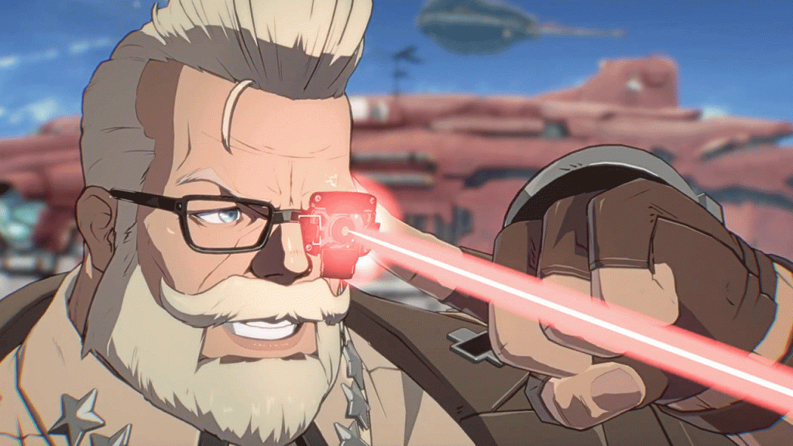

I know I said I was going to post on every game I played, but that turned out to be too much work. Some games are worth talking about but don’t operate well as whole post. So lemme hit the four games I didn’t write about

## Breath of the Wild

Hey I’m caught up. The problem with writing about this game is everything has been said and it’s very obviously good. I liked it a lot, like most people. Big shocker, BOTW is good. So I just wanna hit two points.

First, Princess Zelda is so bullyable. Like oh my god she’s so pouty. It’s amazing how you could just tease her and she’d cry, even though she’d also be into it…. and how she can withstand combat with Ganon for a century. Truly a duality of womanhood. A true queen.

Second, I was thinking about that whole, awful article about how “Zelda had to be more like Dark Souls” thing and how some people might go “See that was right!!” even though… it isn’t. It does similar things like trust the player, allow the game to be cheesed, and just giving an unusual amount of freedom and that feeling of being trusted by the Dev is something a lot of people felt with DS… But it’s not like DS and never needed to be.

As usual, people who say something should be more like Dark Souls don’t actually know what’s good and special about Dark Souls.

[splitbox side="left"]

++++
## Hardspace Shipbreaker

This game rules so hard. It honestly deserved a whole post. The mechanically fun action of chopping up ships to the brutal depictions of capitalism and the even handed treatment of unions. Like “Yeah, Unions have problems. You have to contend with some of them. But you also know how worse the alternative is. Nothing is perfect.”

Fun story, well told, neat bonuses and just good core mechanics. This game needed a ship editor or something so the community could keep it alive forever. I hope the devs come back at some point to give it an expansion. It’s definitely a concept that’d benefit from just a little bit more meat.

I guess that’s part of why I never wrote a bigger piece. It’s so solidly great, but in a way almost too simple to go into deeply. A simple, tasty treat.
[/splitbox]
[splitbox]
 
I can be ur angel :)

 
or ur debil >:)
++++
## Satisfactory

Not done yet but I wanted to talk about how Satisfactory is fundamentally opposites. Factorio is a game where eventually, macro building gets EASY. Difficulty comes from the unreliability of your input (materials) and from Alien attack. Building is easy and systems must be scalable because input and output will change constantly due to all these factors. Ignore a base for too long and something will surely go wrong. You travel to expand, but also to maintain. Factorio is about growing an unstable system fast enough that it maintains stability.

Satisfactory is different. They added blue prints recently, but even then, this seems to hold true. Outputs are CONSISTENT. You have to build with growth in mind, but future growth is predictable. Nothing breaks the machines. And nothing should break, Satisfactory is a pretty game. It wants you to explore. It wants you to be able to leave for days and come back to a working base. Bases are extremely hand built and building is hard. Modifications are painful and tedious. Fixing a problem feels like taking apart an engine. It rules. Satisfactory is about expanding a stable system and good planning. It gives you time to lounge around, look around, for fuck around with tiny problems. Every factory and machine feels deeply personal. It more has the vibe of like… modded minecraft skyblock.. In fact, I should try Satisfactory Skyblock

It’s amazing how two games so superficially similar are actually so different.
[/splitbox]
## Strive

I like it now. Goldlewis is my dad. I swing the coffin and peoples health disappear. Most previous complaints are still mostly valid but I play Goldlewis now so they’re other peoples problems. Playing a character with no legacy version to compare to was a pro move. 7.5/10.

