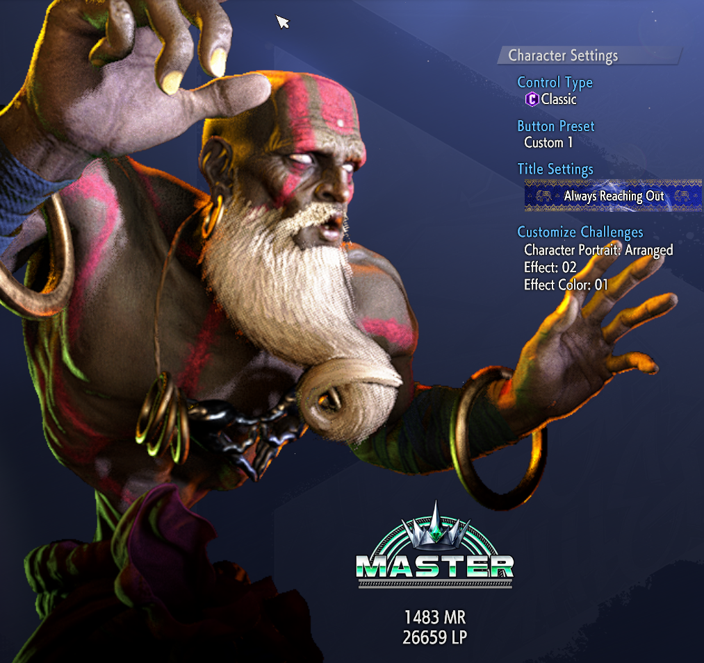

I'll be honest, this year I hadn't played much new I haven't already written about so this year is going to go a little different. I'm going to talk about a BUNCH of stuff.

# I Guess I Didn't Talk about Elden Ring

It was great? What do you want from me? What could I possibly say? Like it was a Fromsoft Souls game not named Dark Souls II of course I loved it. I guess I could say it has some of my favorite lore? I feel like it and Bloodborne do the best having their lore feel more forward and visible. Not *explicit* like most Fromsoft games, but you could get it without as much item-description-wrangling.

Besides Dark Souls 1, this might be my favorite? And honestly at this point DS1 is held up entirely by its map in my mind, where the other contenders of Elden Ring and Bloodborne play *so so well*. But yeah w/e it's all been said.

---

# Fighting games in 2023

While I didn't play a lot of new games, I played a lot of fighting games so I guess it's a good time to talk about my current relationships with them.

## Street Fighter 6
[floatbox]

*(Still with less MR than I started with 😭)*
[/floatbox]
I've put a lot of time into SF6 and have even been playing it on stream every other week, mixing it up with Rev2. While not as popular around Warmrock, I still have been putting time into it on my own. It's been my first time really putting time into a ranked mode and getting over ranked anxiety. It was nice to get into a game with a fresh mindset and no expectations about how good I *should* be.

I messed with a few characters but got immediately pulled to Dhalsim. I had developed a soft spot for him since SF4. I was playing C.Viper early on but decided I needed a "netplay" character, because trying to play Viper online seemed like a nightmare and he kinda stuck with me as a secondary for all of SF4's many versions (even as my actual 'main' changed). I never played 5 but I liked what I saw of him there and 6 seems like a combination of both versions.

I also sometimes pick mains or play alternate characters as a way to force me to play different and work on skills I don't exercise as much. Years of Sol in Rev2 left me with a lot of reason to want to *slow down* and respond.

When I finally decided to go for Master, rising in rank went pretty smooth. Depending on your experience, Master rank can be a *massive* accomplishment or the *start*. I figured I was in the latter bracket but didn't know if I'd be in for a rude awakening before or after I graduated. Diamond 5 started to get hard and actual Master rank has been a struggle but the most important thing is that I didn't get too used to winning. I was afraid once things got hard, I'd start getting anxious again but... eh, it's been smooth.

Really enjoying SF6 in general. I love how cracked the system is. I feel like playing it helps me keep my brain younger. Having a game with modern training mode features also is helping me approach fighting game problem solving in a much more modern way.

## Guilty Gear Xrd Rev 2

I've slowed down a bit here. It almost feels like I'm taking a break without really taking a break. Breaks are good though, this is a natural part of the cycle. Still my favorite Guilty Gear I think and still playing it every other week at least, but I'm rarely playing it more than that. Still, I feel like I'm bringing some better decision making back from SF6. Just trying to look at situations differently now. Hopefully at some point I'll get back to focusing on it and hop into more random lobbies and tournaments.

## Super Street Fighter 2 Turbo

As less people show up on mondays this has become the 'Weekly FT10 with CaliScrub'. My majority of time playing is just the Zangief vs Shotos matchup. Despite almost always winning the set, I find it weirdly frustrating. I constantly feel like I'm letting too much slip past me, or that my 360s are always off or that matchups that are in my favor feel often like I'm not sure what I should do. Even writing this made me watch a youtube set and hop into training mode.

Cali is better than he lets himself be and it is my job to make sure he never realizes his true potential. The Games are Good, but I am a petty bitch 😤

## Guilty Gear X2 Accent Core +R

In a weird place with this. Love this game, love how it has no buffer, love how everything is super hard and sketchy, love all that shit... except for the fact I don't really have a chance to actually PLAY that much. Combine this with playing Johnny and I feel like I'm somewhere between "derusting" and "relearning" every time I play. It's frustrating, because the lack of stable play time makes me feel like I'm always peddling in place. Not the game's fault -- merely the fault of circumstance.

## Guilty Gear Strive

I've come to terms with Strive, especially with every game having rollback now. I don't really love it, but if I can pull out Goldlewis or Johnny and do some dumb combos and have a good time. Playing with my local friends is fun and it's probably kinda helpful that I don't play Strive as much as anything else. I don't know WTF they were thinking with Wild Assault like what was their goal??? Clearly to make another resource, but it doesn't feel like it's solving any problems. It's just a system tacked on because they needed a new system and it makes an already pretty volatile game even more volatile. On the other hand, as someone who only plays maybe once a month, it's fun to be a bully with it. The last patch at least fixed Red WA, but I haven't played with it yet. All I know is that Goldie is extra stupid, so that sounds fun.

# Projects of 2023

I spent a lot of 2023 pursuing a lot of non-gaming projects!

## Site Redesign

God I fucking hate wordpress. Keeping it updated was a pain, random updates would fuck up my site, plugins were constantly breaking, and the whole thing has drifted to some dumb SEO bullshit so I wanted some flat file stuff. I ended up redoing everything in Grav, which has been super pleasant and way more approachable for me to extend and theme myself. I mean I *did* do wordpress theming, but I barely knew what I was doing. I also moved my private lore wiki over to a grav site too, eliminating the need for mysql on mny server. Wikis are nice, but when you mostly work alone, it makes things extra slow for little benefit. It's also nice because now, while the file structure is a little nutty, I can READ all my lore writing from a text browser, even if I don't have a working site up.

Another nice benefit is it's made it easy to keep a local server running that is a copy of my whole web presence. I an edit stuff locally until I'm happy and then just do an rsync. It's... been really nice!

## Brave Earth Cartography, Family Trees, and Vexillology

I spent a lot of time doing fun stuff for my own world building and reference purposes. The big one was using QGIS to remake my old map and then generate a super in detail, multi-scale map. I wrote about whole process over on cohost [here](https://cohost.org/BraveKayLoreLog/post/1304129-so-you-want-to-make) and [here](https://cohost.org/BraveKayLoreLog/post/1311211-so-you-want-to-makes). If you care about the dumb lore if an unreleased game, there is a whole blog of little details over there. If you want more maps, there is also this lovely [map of Vannaleona](https://cohost.org/BraveKayLoreLog/post/2624544-the-twin-cities-of-v), Naomi's home city. 

Also on cohost is a write-up on [Aistorian Flags](https://cohost.org/BraveKayLoreLog/post/2321282-flags-of-aistoria) and [Aistorian Heraldry](https://cohost.org/BraveKayLoreLog/post/2448227-aistorian-heraldry). There is also my [Family Tree project](https://cohost.org/BraveKayLoreLog/post/1893875-lineage-of-house-cru), which was the most hilarious hackjob I've ever done. A complete crime. Completely hacking obfuscated code of a proprietary web viewer and writing weird file format converters. The cohost post only shows so much, so here is a zoomed out tree from GRAMPS, which I use to organize all the core data.

[floatbox type="full"]

[/floatbox]

A lot of this map fun gets extra fun with the grav redesigns, allowing me to link info between all these different projects, allowing me to go from the family tree or map to a character page or whatever. All this stuff is mostly just for me and a few other people, but it's like keeping a nice scrap book. It makes it a pleasurable object to interact with.

## The Isodrome

This is gonna be its own post at some point so to give the short version... I found a jumping spider, I threw it in a box, I threw dirt in the box, and then some plants, then I tried to feed it sme roly polys, but roly polys are too brollic for most spiders to eat so then I just had a spider and a whole bunch of roly polys and wait holy shit are those centipedes?? A WORM??? Wait, where did that Harvestman come from. MULTIPLE MILLIPEDES???

So I now have a cube of nature with some outdoor plants mixed with some plants I bought. I'm surprised how much I'm enjoying the plant part of everything too my desk is covered with weird little growing projects and I know have a few actual house plants sitting around that I can take cuttings from for terrarium purposes. But a quick list.

* Flatwell the Tan Jumping Spider
* 3 Species of Isopods *(idk like 20+ at least? Maybe even 30?)*
 * Armadillidium Vulgar (The black tank like ones)
 * Armadillidium Nasatum (The flatter, greyer ones)
 * A Singular Philoscia Muscorum (The false king, small and kinda striped)
* At least 3 Species of Springtails
 * Orchesella villosa (Big hairy little buggers. Big enough to have a personality)
 * Collembola Springtails (Little white fellas)
 * Red Globular Springtails (Little useless Red Dots)
* 3 Harvestmen who run around all day like goons
* Soil Centipedes
* Snake Millipedes
* A worm???
* There was a beetle at SOME point
* There is SOME kind of tiny translucent baby spider I saw???
* Lunch, a caterpillar that ate everything and is now in a jar out on the poarch as a chrysalis, buried in sand

[floatbox type="full"]

[/floatbox]

For plants, besides for a whole bunch of clover, the biggest thing is a gigantic Peperomia Piccolo Banda that grew HUGE in like a month. Gonna try and squeeze in some lemon button ferns and some fittonia eventually. Got a few string of turtles strands in there but they haven't rooted yet.

I have a thread on twitter you can check out if you want, and I also post a lot of stuff on tumblr too. At some point I'll make a blogpost detailing the critters and plants I have, but until then... I've really enjoyed my weird box full of dirt.

## 90s-2000s All Japan/NOAH Exploration

Been working through the old catalog of All Japan and Noah wrestling matches. I remember watching old Misawa vs Kawada matches in the 2000s and just *not getting it*. My tastes were bad then though. I was too fixated on cool moves and not how god damn hard these moves were hitting, let alone the emotional connections. Working through Joseph Montecillo's [Walking the Kings Road](https://www.youtube.com/playlist?list=PL5rIvqco0YWrJ5Q02m3csJ7kjB0f_IcEV) series was a great way to get context for what me and my friend were watching. Also jumped ahead to watch some of Kenta Kobashi's legendary run in NOAH. It was even fun to see a lot of the gaijin wrestle. God, Doctor Death fucking ruled. Stan Hansen was all he cracked up to be. I even ended up loving a lot of the old guard like Jumbo*(the tiredest dad)* and Tenryu*(the perfect perm)*.

## Brave Earth Prologue

It's painfully close to done. I got over a lot of burn out and stagnation at the end of last year and I'm making the final push. Expect more detailed news soon *(hopefully)*.