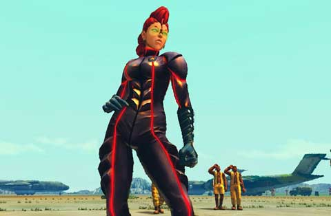
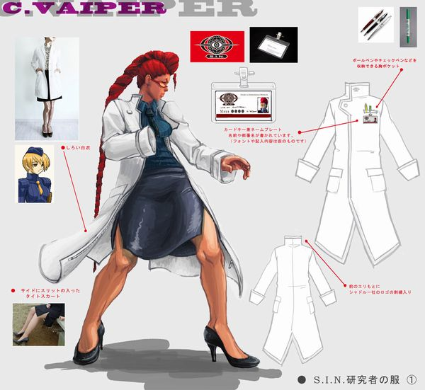
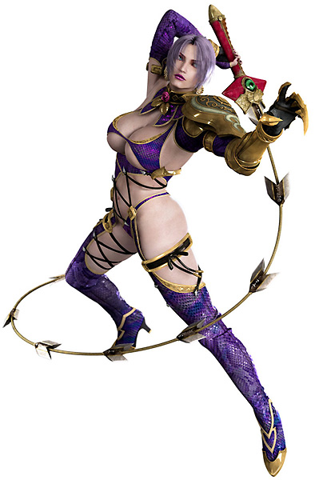

[center]
_This is an extremely dumb post, and one written during an extremely dumb time. But it's a fun post that people still reference from time to time, so I have to keep it. That said, I've removed the end section which is me getting all "Internet Debate Bro" on people from Eventhubs._ 

_You can probably go dig it up elsewhere if you want, but I'd rather not keep up stuff that's just me arguing with people, especially over something as dumb as C.Viper's breasts._

_That said, I was **right**, and I was right to say it!!!_
[/center]

Crimson Viper’s character design was goofy when I first saw it. She definitely wasn’t one of the new Street Fighter 4 characters I liked. Over time though, her design grew on me. She’s not a great example of character design, but she’s pretty cool! She looks like Angelina Jolie, has a cool suit, some crazy hair and kicks fire! Also hey cleavage, right? I love cleavage. While I never buy games due to sex appeal, I can certainly appreciate it as an admittedly perverted, red blooded male!

**Only her knockers are a fucking travesty upon God**

This might seem like a silly thing to write about and I assure you, _IT IS_, but it’s also a fun little topic over a pet peeve of mine. I also think theres a little glean here about design — and a bit on anatomy! Also again, as a man, I can’t resist a good excuse to talk about breasts. So anyways, let me begin with the story of C. Viper’s breasts — or sorta just C. Viper in general. Viper was designed to be sexy. She was designed to be a sexy female to appeal to the American male and as a powerful rival to Chun-li. The SNK inspired design, the Jolie-face, and the boob window, all chosen to appeal to Americans. The problem is, the character was not well received. Response was mixed. Maybe it was her goofy hair, or how out of place she feels in a Street Fighter game filled with semi plausible Martial Artists…. or maybe it was her… Boobs? Apparently they thought that, because Capcom of Japan immediately axed her bust size.

Lets go over this again. To try and make the character more likeable, they SHRUNK her bust size. Now lets be clear here, I’m not saying every female character has big breasts — obviously not. I mean, I love big boobs and draw them more than I probably should, but the sizing of breasts can change many things about a character. You can look at Cammy and her frame and her breast size and see the opposite side of things (big boobs would make her look dumb). But with C. Viper….

*   The change was made for a nonsensical reason: Maybe American audiences were scared of big boobs on a woman who was supposed to be a MILF?
*   The change conflicts with the character’s visual design: The whole big cleavage and tie look calls for bigger breasts. If you don’ want to do big breasts, _don’t use that outfit_
*   The change was HORRIBLY and ABYSMALLY modeled.

[floatbox type="full"]

[/floatbox] 
[center]_A little goofy in the modeling department, but they seem to mesh well with her visual design_  [/center]

So lets take a look at Viper’s original set. Viper, like all of the SF4 original cast, suffers from design inexperience in her model. Most of the original cast has little modeling quirks. For a lot of the guys, it’s okay. Ryu looks ape-ish (he’s sorta supposed to though I guess), Guile looks like he kinda has down syndrome, and Blanka is just 100% awful. Chun-Li looks mostly good, but has giant hands and a super generic face. Viper still has a share of problems. Her boobs are a bit awkward. They’re not too big really, but they’re a little nonsensical and how they eat her tie kinda looks weird. She has has some awkward bits with her hips and exposed midriff. Her hips just don’t taper off right or something, I can’t exactly say. This is pretty consistent with the read of the SF4 modeling issues. When the console characters came out — or the Super characters, it was much easier to see they got their modeling skills on track, but anyways…

So the logic was that Viper didn’t come off as a believable fighter in the Street Fighter universe. That is pretty true. The idea was then to reduce her bust (which honestly wasn’t that big as far as games go), to something more “reasonable” to make her more plausible. Personally I’d have just had them tighten up her model in general, but what do they do instead?

  
[floatbox type="full"]

[/floatbox]
[center]_My friend Kenny calls them the ‘hamburgers’. Awkward in every conceivable way and totally at odds with either of her first two outfits._  [/center]

Well, here we have C. Vipers SF4 hack-job breast reduction. She could practically sue for malpractice. First, they start at her COLLAR BONE. This is an artifact of her bigger breasts. Even in that case, the model was anatomically wrong as her top wouldn’t have had those results on her cleavage, but they were plausible. Now? They just look wrong. And they taper down in an awkward, goofy way. They look like hamburger buns. Combine that with her poorly placed tie and she looks like she has a mutant uni-boob. Everything is wrong. They start to high, they aren’t shaped right, they’re too close together and look ugly (If you’re going to model breasts wrong, at least make it the sexy kind of wrong). Clearly the reduction was done by lassoing her chest and squishing them back. A real hack job.

What gets me even more so is the whole idea **clashes with her design**. Shrinking her breasts isn’t going to make her into a plausible SF style fighter. It might do it a LITTLE BIT (and let me be clear when I say a LITTLE BIT), but at the cost of damaging the design strengths of the character. If you are unwilling to change the whole design, it is better to embrace it’s uniqueness and strengths, rather than cutting corners and making a character lame. Now, the reduction didn’t destroy C. Viper, but I notice it every time I play. It as a desperate gesture that was only a net loss. In a way, making her breasts bigger would have been a better response. If she’s going to be embraced as an out of place character, you might as well roll with it I suppose… and actually I think we can see now that it would have been a good idea.

[center] [/center]
[floatbox type="full"]

[/floatbox]
[center]_They’re a bit on the big side, but if you’re dressing like that, they’re supposed to be._  [/center]

MVC3 fixes a ton of modeling issues on Viper. Her hips and midriff are actually kinda sexy now! But her BREASTS. They’re a bit on the sillier side, size wise, but we’re not talking SC4 Ivy here. I think the important thing is it LOOKS right. The design is MEANT to have big obnoxious knockers. They also gave her real cleavage. The breasts are properly spaced apart and gives room for the whole tie motif to work. They have some actual weight to them, too. In action, they don’t even look that huge either (you tend to exaggerate parts of models to look good in motion and from a distance)! Viper looks great in Marvel vs Capcom 3. Everyone else seemed to know what Viper’s boobs were supposed to be like outside of the SF4 team. Even the ending animation realizes it, even though it’s….. sorta on the extreme side.

If they wanted to dodge the whole big boob thing, they could have. Actually having anatomically correct smaller boobs would have been FAR less glaring. If you also look at her last two alternative costumes, she looks great. They de-emphasis her chest. They don’t demand big cleavage anymore. Both the combat suit and the scientist suit look great and are stylish. They mesh with the character and don’t require huge boobs. Huge boobs aren’t always great! In fact, even if you do them right, they can look kinda gross, like SC4 Ivy. They’re modeled right and hang right and have the right weight to them, but they’re so large and implausible that they look awkward… to my goofy tastes, awkwardly HOT, but something that is something better reserved for pornographic material and not a fighting game where you want a character to be taken seriously.

So I dunno what the final moral is here, but it’s not entirely about boobs I guess. Just kinda embrace the elements that define your character and don’t make half assed compromises? That and just have nice boobs. They won’t make me buy your game, but I’ll appreciate it. :3

[floatbox type="full"]

[/floatbox]
[center]_Both of Viper’s newer outfits look great without looking boobly. Conversely, Ivy looks like a washed up porn star in her 30s. Which happens to be a thing I’m into, but really shouldn’t be in a game. They’re also at least anatomically correct, if implausibly sized._  [/center]