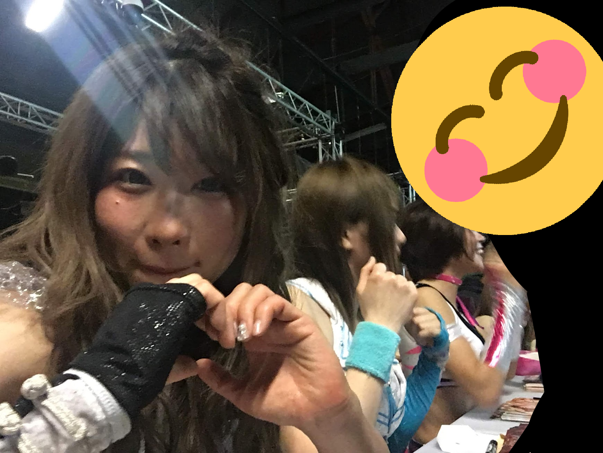

I've been putting a lot of my wrestling feelings on my [side blog](https://kayinworks.neocities.org/wrestle/) these days, but I cannot justify it here. I'm not going to explain everything I should. I'm not going to give all the context this all needs. I just need to get this out.

On April 27, at *All Star Grand Queendom 2025*, my favorite wrestle wrestler in the world, **Tam Nakano**, lost her career-vs-career against [tool tip="🪨"]**Saya Kamitani**[/tool], in what was the conclusion of an emotional and [tool tip="I cannot write well enough to do these matches justice and I'm not going to try"]dramatic trilogy of matches[/tool]. A beautiful finish where a woman destroys her career, in an attempt to reach out and have a connection with someone one last time. 

*It works.*

This being wrestling, no one is *forced* into retirement for storyline reasons. There are always *actual* reasons behind the scenes. Some don't even abide by their retirements. Tam, who hung around *Atsushi Onita*, is not coming from a place where retirement is sacred. Yet this had a sense of dramatic finality to it. I have to accept that, perhaps maybe, I have seen the final Tam Nakano match I will ever see.

I mean that literally, too. Unless I look to dig up footage of her year in [tool tip="... Which I might"]*Actwres Girl’z*[/tool], I've been following her journey down the so called *Tam Road* from the start. I remember being fond of her as the injured flunky in Oedo Tai, and the absolute drama she brought to the *Queen's Quest vs Oedo Tai gauntlet match*. By the rules of the match, by being the last person pinned, she was kicked out the unit.

While the match was great, what followed was better. There was lasting hurt, between her and the pack of [tool tip="Hana and Natsu did SUCH a good job with this story too"]loveable dirtbags[/tool] she was friends with. Whenever she had to wrestle with her former cohort, their past connections oozed through every interaction. Frustration, regret, anger. Tam brought emotion out of everyone she interacted with in a way I wasn't used to coming mostly from WWE and New Japan. While Stardom at that time was mostly catering to... old japanese men with disposable income, Tam's stories felt like they were *for women*. Complex relationships, hate and love intertwined. Messy. [Wet](/wet-emotions-and-the-dry-desert-of-us-television-wrestling).

I remember arguing about how great Tam seemed early on with my Eternal Stardom Buddy, Shamayel, who is always slower to warm up to new wrestlers than I am. Who also bullied me into spending my free Meet and Greet on [tool tip="It was going to be her or Jungle Kyona, tbh"]Tam[/tool] when we went to *Stardom American Dream In The Big Apple* in 2019. Tam wasn't my favorite wrestler then, not by a long shot, but she was one of the ones I liked and seeing her relatively short line made me feel bad. She was one of my *Underdog Faves*.

.. But It was Tam's messy, *tsundere* relationship with **Arisa Hoshiki** during the Tag League, literally the month after that show, where both finally won [tool tip="Who loves Tsuns AND brats now"]Shamayel[/tool] over.

Even then, as Arisa became Shamayel's favorite wrestler, Tam, for both of us, was more of a *secondary fave*. But with her series with **Giulia**, their *Hair vs Hair* match, and her White Belt run after that, Tam suddenly felt *real*. She putting on great, emotional, hard hitting matches *regularly*.

In June of 2022, Shamayel asked me who my top 3 favorite active wrestlers were.

*"... Omega, Danielson... 3... 3... ZSJ? Syuri maybe? am I missing anyone...? Oh, **Tam**."*

... then that sinking feeling, thinking about how her work made me feel, thinking about the storylines she was in, everything. Tam was my **#1**, and it was suddenly 2 and 3 I was unsure of. It's not that she was the *best* in-ring wrestler, or had the highest workrate, or hit the hardest... but every hit was overflowing with emotion, and *story* oozed out of every exchange. Shamayel put it clearly, saying "Tam told the best stories."

Telling stories is the core of pro wrestling. So Tam must be, within the scope of my knowledge, the Best Wrestler in the World.

I started casually saying it half jokingly, always to the pleasant surprise of people popping up and agreeing. Tam isn't as popular in the US in my experience. I feel there is a little too much *John Cena* in her in the eyes of as lot of people. Perhaps a little *too* idol. But among the *women* I talked to, it was hard to find someone who watched who didn't love her. I started jokingly saying she was the "Femme equivalent of Jon Moxley". Not in the sense that she was a female version of Jon Moxley, but in the sense that if Moxley embodied the idea of masculine violence and complexity, Tam embodied the feminine version of violence and all the complexity that comes with that.

Also, both turned out to be two of the [tool tip="The death riders aren't even that bad you're all just babies"]most reliable wrestlers[/tool] for their respective companies.

After realizing she was my favorite, she goes on to almost immediately have an incredible cagematch with fellow former Actwres girl, [tool tip="Who on paper you could argue is better than Tam at Tam stuff, even if she doesn't find the same success or has the same IT factor"]Natsupoi[/tool]. That cage match was my 2022 Match of the Year. Okada vs Ospreay? [tool tip="lol"]Cody Rhodes vs Seth Rollins?[/tool] Briscoes vs FTR? Great matches, but those aren't the matches I show my friends. Those aren't matches I've thought about since I saw them. I still, years later, think about that cage match and the story it told, before, during, and after it. *"Let's enjoy our time alone in this steel cage hell. matter how much you scream or cry, I won't let you go."*

Whenever it seemed like Tam hit her peak, she kept climbing. The Tam Road kept going, until it crashed to a stop. I don't want to recount the whole feud with Saya, and Saya's own beautiful hang-ups and failings, or the powerplays over **Kurara**, Tam's [tool tip="Kurara, blink twice if you need us to call the cops"]'protege'[/tool]. It's everything I could want from a Tam feud, with old relationships, vulnerabilities on each side, and impulsive, self destructive decision making.

Oh and crying. Always crying. Wrestling has to be wet, after all.

Once the career vs career match was announced, I knew how it was going to go. I was in denial, of course. Surely *something* would happen. But I knew, down deep. Only Tam could retire. Saya still had future ahead of her.

In a way, I had been emotionally preparing for that moment for the last year or so. The 3 years she's been my #1 uncontested favorite have felt too short. I'm not ready to let go yet. Part of me still holds out hope that she's going to go get a surgery, take some time off, and then weasel her way back in. Take a year, take two, whatever. I'm not ready to be without Tam. Saya, in their final match, looked as miserable as I am writing this. She didn't want to do it. As they sat there, hugging each other, sobbing on the ramp, I started to sob a little too.

I don't know how history will look back on Tam's career. Maybe I'm too bias. Maybe she was just *pretty good*, and had a good run, but that's that. But I feel like I've watched one of the greatest wrestlers of my lifetime retire, to what feels relatively little fanfare on the english speaking side of things. Sometimes it takes time to realize what we've lost. Or maybe I'm just not looking in the right places. But I know I'm not *alone*, I'm never going to shut up about her.

I believe in Tam.

[center]

*(do not perceive me)*
[/center]

# The part where I vent about Wrestling

This part isn't going to be as kind. I need to VENT. So if you just cared about Tam, you can stop here.

This is a rough period for me. [**Mina Shirakawa**](/cohost/stardom-mina) leaving for America, one of the greatest of all time **Meiko Satomura** retiring right after Tam. **Mayu Iwatani** leaving Stardom for [tool tip="Marigold"]god only knows where[/tool].

Next to that, is WWE buying AAA in Mexico. Non-US wrestling constantly feels like it's under attack, constantly fighting attrition, both from talent pouching and general turnover. It frustrates me, because the more time goes on, the more I find I *hate* Televised wrestling. I hate what the format does to shows, I hate how matches get structured around commercials. I hate how people have to fight to even have a chance to wrestler. I hate how WWE has programmed people think it's only supposed to be one *one specific way*. I hate how the economics make it that many of these wrestlers would be foolish to *not* take their chances over seas.

Watching wrestling from other countries saved my love of wrestling. Yeah, I watch AEW, I love the PPVs, but the shows constantly wear on me. It is held up purely by the talent of the wrestlers. I'll still get to see Mina, but in what form? Even if they treat her well, what is *well* but American wrestling standards?

I saw someone accusing Dave Meltzer of bias recently. *Why did all these Japanese Women get five star matches, but not these old NXT or modern WWE matches? Are these women somehow just THAT MUCH BETTER?*

Now of course Dave is bias -- we all are, but thinking about this bugged me. Ignoring the fact the ratings are one person's opinion and don't matter... Why *wouldn't* the women in Japan have more five star matches? They have a culture around shows where wrestlers get to *actually wrestle* multiple times a week, against strong, experienced opponents, in matches that have *time* and *substance* to them. They have a culture that fosters excellence. It would be an injustice if they weren't better. Why wouldn't a show of all women, where they're not competing for time with the men, NOT produce better results?

It took YEARS for WWE to get enough talented women together and give them enough time to produce stars. They can get someone like **Tiffany Stratton** up to a real Wrestlemania title match level in about [tool tip="Still no Utami, but that's fine"]3 years[/tool]. For everything else wrong with WWE, they should be proud of that. AEW still struggles with this. **Anna Jay** in AEW has been [tool tip="tbf she got a bit better after going to the 5 Star"]*about exactly as good as she's always been*[/tool] for YEARS now, not because she's inherently *mid*, but because *HOW IS SHE SUPPOSED TO IMPROVE?* She never wrestles. **Julia Hart** took as many outside bookings as she could to make up the difference.

I had someone else argue with me when I said I didn't want to see Mayu getting signed by AEW that "At least AEW respects their Joshi Wrestlers". Meanwhile, **Yuka Sakazaki** has wrestled something like 4 matches this year. Sure she was injured last year, but she's been good to go for months. I don't think this is a lack of *respect*, but it is the *reality* of TV Wrestling.

People don't realize *wrestling doesn't have to be like this*. We're used to our favorites being treated like garbage. People get upset that **Joe Hendry** got squashed at wrestlemania and everyone else lashes back. 

*"He should be happy. He got a Wrestlemania Moment™!"*

We're so brainwashed to accept this shit. WWE has branded their Wrestlemania Participation Trophy so hard, people are happy just to *be there*. In the context of WWE, Hendry *should* be happy, and certainly is... but what a sad way to have to live as an artist. Even if the wrestler doesn't feel disrespected, *I* feel disrespected. I feel punished for caring about someone. This type of thing has frustrated me ever since I started watching WWE in the 90s.

I don't think most wresting fans realize *quite how good* the multi-tag format you see outside the states is, especially on a week by week basis. Sure, AEW has tag and trios *bangers*, but not trios that help further the stories of everyone involved, mutliple times a show, constantly. In Japan and Mexico see almost everyone on every show. Everyone gets to wrestle, multiple times a week, working their own little story beats. Beat up? They can take it easy and do a spot or too. Need experience? On the other side of the ring is 1-3 other women with tons of experience, ready to *make* you learn. How did Mariah May seemingly get so good out of nowhere?

*She had 100 matches in Stardom in like 8 months.*

I think she had more matches in that period than Anna Jay has had in her whole career. You get better at things by doing them, and as a fan, you get to see your favorites *constantly*. When Mina goes to AEW, I won't be seeing her every 2-3 times a week. Or even likely once a week. She's put in the time, I'm sure the slowed down pace will be appreciated by her, but when she does wrestle, the matches will be worse. Not because of the pace or physicality, but because of the format. Because of the opponents. Because of the rigid style we use to tell stories over here.

Once in a blue moon, when the stars are aligned, at a PPV or bigger show, she will get a chance to deliver. People will say it's great, but I'll have seen her do better. Whenever I watch an Io Shirai match in WWE, I'll see that they respect her, and she's still incredible, but that I've also seen her have funner matches in front of 100 people in *Shin-Kiba 1st Ring*. The large venues feel worse. Less intimate, more snarky fans. The television format yanks the fun out of everything, and if its a PPV it'll get time, but it will ultimately follow the formula of every other WWE match has followed for 25+ years. 

*Welcome to the Big Leagues*, they say, as you sign up to make nothing but Marvel movies for the rest of your life. You can be satisfied with that career, I'm sure, but as a fan it's crushing. The United States feels like a black hole that consumes all, homogenizing everything across the world to be more palatable to us.

There was something revealing to me about watching **Kenny Omega** vs **Will Ospreay** at Forbidden Door. A *great* match, but in my mind, worse than their match in Japan. Not because Japan is inherently better or any nonsense like that, but because US wrestling culture is too poisoned by decades of WWE domination. [tool tip="This is not WHY the match is worse, but it's a great proxy"]*I don't need to see Ospreay floss is ass with a flag*[/tool]. The problem isn't that he decided to do it, it's that he knew, in that moment, that *this* was the best thing to do in America. He did it because he was a great wrestler with great instincts, wrestling for the *worst* fans. He knows his audience. WWE on the other hand, while under new, better management, is the most dry it's ever been. It's not offensively *Vince* anymore, but now it's criminally unseasoned. I can't believe Eyepatch Wolf managed to make like 4 hours of video about a guy's story who hasn't had character development in years. But remember, they're about *Telling Stories*, apparently.

I exist in that space, resentfully. I am bias, *obviously*. US wrestling is *fine*. It's fiiine, just not my preference. The problem isn't that the US has this wrestling culture, the problem is that it tries to consume all the other ones. That's where all the resentment comes from. Because if the time comes where WWE conquers wrestling around the world, I'm not going to give in and watch WWE, I'm going to *stop watching wrestling*.

Stardom is the wrestling that makes me the happiest. I get bored of New Japan, I get mad at AEW, but Stardom makes me happy. It's so important to have a chance to pick what you ACTUALLY like. I don't even feel strongly that Stardom is the best women's wrestling. You can pick something else! **TJPW** is pretty great, I love the talent in **Senjou**, every story line in **Oz Academy** seems to whip ass. Actwres still has fans. Hell, go dig up old Gaea matches. Or not even women's wrestling. Do what I did and go watch some 90s **All Japan**. Find what you like!

If you play nothing but AAA Games, you never get to see all the beautiful *other* was games can be. This is the same thing with wrestling. I'm begging you, *try* other stuff, with more than a half hearted effort. Don't watch *that one good match everyone is talking about on reddit*, watch *whole shows of other promotions* and *find what you like*. *Follow a storyline*. Find a show you love, and find someone you love as much as I love Tam.