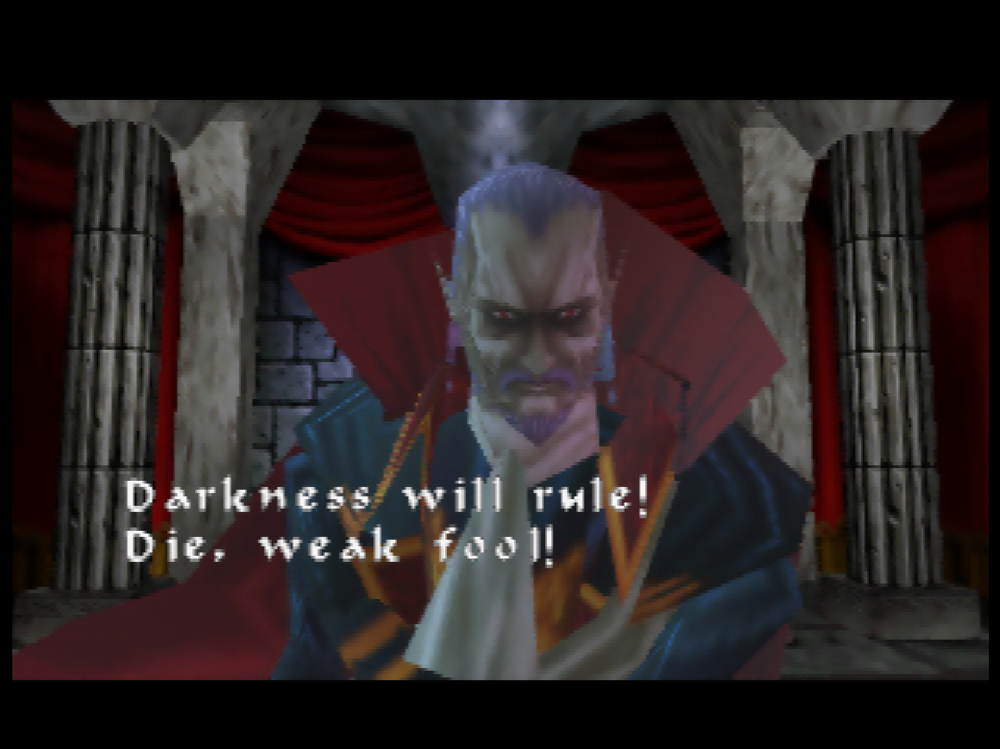

At what point is a game unjustly maligned? When is a *Flawed Gem* merely a stone? When we say a game was brave and experimental... was it? Or was it a predictable failure of the times it was made? Does a failed product need to be *secretly kinda good*, or *important*, or *influential* to deserve respect?

No. And while I am unsure exactly how I fall on Castlevania 64 and it's strange seque-xpansion, I walk away *respecting* these games. I find myself dwelling on how people try to rehabilitate flawed titles like these. Because does a game need to be good to be enjoyed? Does it have to be good to appreciate the high level of skill that made into making it? Does a game have to be good to be under appreciated?

===

*No.*

[midheader image="cv64mid.png" text="Castlevania 64"/]

Castlevania 64 is a *miserable* game to play. Not in a "turned the limitations into a feature" way like Metroid II. Not even in a "the combat is crummy, but you can work around it and that's not the point of the game anyways" way like King's Field. Unfortunately, combat in this game is both bad *and* a central focus. As is platforming, complete with a poorly controllable, sometimes downright *ungovernable* camera.

Reinhardt moves like a bus. You can lock on, but rotating fast enough to actually use that lock is a challenge. Enemies in the abysmal first area, the Forest of Silence, spawn constantly. It feels like you're playing *Spartan-X/Kung Fu*, walking a few steps, whipping a few foes, trying to turn to get the ones behind you, walking a little farther, hear a skeleton spawn, turn and whip again.

Your reward for trying to explore and puzzle solve in this samey brown space is awful, high stakes platforming. With temperamental jumping physics. On blocks that look like they were taken from a developer test level.

Castlevania 64 does not put its best foot forward. This is not so much a factor of developer skill, but industry knowledge. Even in 1999 we were still trying to figure out these *3d games*, especially these types of console action games. Most games of this era with camera control were slow and lower stakes. To make navigating these 3d worlds tolerable, a lot of these games needed to be *about* movement. Action games had a different issue. Virtually all successful action games of this period were some kind of shooter. An FPS like Goldeneye ties your camera to your movement, a game like Metal Gear Solid locks things into a virtual 2d playspace. A game like Omega Boost uses rail-shooter like controls and homing weapon lock-on systems to lesson the *controller load* on the game. Melee games? Early 3d fixed camera beat-em-ups, or slow, more adventurous games like Zelda, which also have less of an emphasis on platforming style movement. Even much later, genre defining games like Devil May Cry, which finally began cracking the code, did so with limited camera movement. There is a reason this era is dominated by [tool tip="For real, look at the top 100 selling games from this era"]Collectathons, Racing games, and FPSs[/tool].

To make intense action work, often something has to be taken away. Even in 2d, the intense, high stakes action of a game like Contra is made manageable by removing the player's ability to control the height of their jumps. This is something most players don't even realize. Players can't manage *everything*, you design around what you want your players to focus. *We can't expect you to feather the jump button while shooting at the same time!*

Castlevania 64 has big ambitions, so it tries to offload a lot. Reinhardt's whip as a massive range to it, while Carrie's projectiles home-in belligerently. The Lock-on button, while fussy, is trying to move your focus onto movement and timing rather than *aiming*. Even the multi modal camera, while a failure, was an attempt to solve a difficult problem that we struggle with even decades later.

Games do not progress forward by bad designers making bad decisions, waiting until a good designer shows us how things are done. We need *good* designers to try and fail too. Like a scientific paper that fails to prove its premise, this failure is *important*. You can't *know* if you can make a fully 3d castlevania without compromise until you try and make one.

These were risks that made sense for the times and it is important to contextualize these failures in their era. While the game was seen as having problems in it's day, the game was still *largely well received*. Reviewers liked it. My friends at the time had a more... luke warm response, but nothing approaching hate. The abysmal reputation this game has came after a few years time, as games continued to [tool tip="Devil May Cry comes only 2 years after this"]evolve at the breakneck pace[/tool]. A curious, if flawed attempt at 3d action that became a *miserable, backward* experience only a few years later.

It's hard to imagine design moving that fast when in 2024, when we've been making the same genre of AAA games for over 10 years. I could write a whole essay how this pace damaged the brains of those who lived though it, numbing our abilities to *reassess* what is old, outside the lens of nostalgia. So what does Castlevania 64 do that is worth reassessing?

It's hard to understate how much damage the Forest of Silence did to me. Where many games try to start on their best foot, Castlevania 64 starts by highlighting all of it's flaws, a painful preview of what *this* game could not succeed at being. I almost quit the game right here when it turned out [tool tip="The game defaulting to NOT making a save file is such an insane decision through a modern lens, but it makes sense in the era of memory cards"]I didn't make a save file properly[/tool] and had to replay most of the first level again. *This game is even worse than people say it is!!* Your failures rarely felt like your own. Even the cool giant skeleton boss struggles with the systems of the game. You can't tell if you're not hitting him because of a failure of the lock-on system or some invulnerability. The fundamental, reliable feed back that made the old Castlevanias work was missing.

Switching to Carrie helped a lot. While she didn't make combat *good*, she helped to minimize one of the worst parts of the game. Getting out of the Forest and to the Castle Walls was a relief. A slower paced stage, with platforming that, while still questionable, was kinda the *right fit* for the game and it's physics. Still the same respawning skeletons and dubious lock-ons, and bizarrely implemented Medusa heads, but a step up enough to get a little farther...

## The Castle Villa

The Villa is what changed my perception of this game and what it could be. Combat and platforming were de-emphasized, a small nuisance to keep you on your toes as you explore. The Villa is about *vibes*. Peaceful yet eerie music plays, giving relaxing you while giving a slight hint that things are *unwell*. A gentle storm blows by, lighting gently flashing silently in the distance like a hot summer day.

[floatbox type="full"]
 

 
[/floatbox]

... It's melancholy. You explore listlessly. You find a few NPCs to talk to. The little fighting you do is against frail [tool tip="Clearly a CV style movie reference to Young Sherlock and the first ever CGI character"]Stained Glass Knights[/tool] and ineffective Ghosts. You encounter a well dressed man, a demon, who wishes not to fight, but do business, selling you goods as he sits, legs politely, legs casually crossed with comfortable sophistication. He's ready to aid you. [tool tip="Spend 30,000 and he'll lay claim to your soul"]He knows what the contract says[/tool]...

[center][/center]

This is one of the few places you use the day/night cycle. Its overall inclusion feels half baked, but in this moment, in this *thin slice* of video game, we see the vision. A living world, moody interiors, solving puzzles in a haunted house. NPCs with routines. Vincent, the Vampire Hunter, sleeps during the night and walks around during the day. Rosa shows up at dawn to water her *white* flowers. You can use the mirrors about the rooms to identify vampires. You can visit the hedge maze (and, you know, get chased by a guy with a chainsaw). In this small section of game there is so much *atmosphere*, so much *intrigue*, a deep wanting for something *larger*. It feels bigger than it actually it. It feels like the team had 3 different ideas of what Castlevania 64 should be. This is the vision of Castlevania 64 that *lost*, but this small shard of it still remains, a beautiful, fleeting moment. This is what won me over. It was walking in to the Villa when I thought, for a moment, that maybe, just maybe, this game was actually great.

... And then it was gone.

## Teased Highs and Crushing Lows

[splitbox side="right"]

++++

The game never reaches this high point again, though I did not know it as I played through the game blind. I went into every stage with a little hope that we'd see more of the *other* Castlevania 64 that I just saw. 

You get a bit of it in the Castle Center, a sprawling map that represents actually being *in* Castlevania. You explore rooms, finding Pre World War I technology in development. You find Lizard-Men cloning chambers. You find crude electric engines, radio equipment, and scale a scale model of a zeppelin. It feels like Dracula is preparing for war. You realize the era this game is in. It is, for its faults, immersive. You look at all these devices with deep curiosity, knowing some of them will be important at *some point*. Despite not being the Villa, the game is *succeeding*. Hell, you find an ASTROLAB!
[/splitbox]

... And then you pick up the Magic Nitro.

This is easily the lowest point of the game. You carry a volatile explosive, that will explode if you jump, fall, or get hit, through this whole sprawling level, taking roundabout paths to avoid obstacles. You spend minutes in slow moving gears to avoid climbing a waist high wall. You do all this and find the detonator and go to set it off, only to realize... you did it too soon. It can't blow up the magic shield on the wall. I thought this WAS to destroy the magic shield!

You have to go, blow up another wall, find [tool tip="It's the Astrolab, so at least that's cool"]another secret[/tool], and then do this long, arduous path all over again. It is miserable. It is boring. It is *frustrating*. It sucks. Most flaws in this game are explainable. Making games is hard! But this... this is a place where they fucked up royally and the game suffers massively for it. Many players have quit on this exact spot, deciding that Castlevania 64 wasn't worth the effort. They didn't miss out on much after this point.

Your reward for this is fighting a behemoth, whose [tool tip="A clean Rondo of Blood reference"]body crumbles and melts as you harm it[/tool], who would be a cool set piece if he wasn't designed to be almost impossible to dodge. A high point gets ruined by a boss you have to beat using stage collision exploits. What should have been the stage that made the game becomes one of its biggest flaws.

From here, things get more even. The "Towers" are mostly *okay* stages, but they are about platforming and combat. There is *some* atmosphere to be had. The Tower of Science had a pretty cool vibe! The tower of Sorcery... sucks. But it sucks in the way late 90s platformers suck. Reinhardt's stages focus more of combat with few, larger enemies. That's the type of combat that works the best with the systems of this game. These stages *function*, but they feel like filler.

## Time

[splitbox side="right"]

++++

Then it's time for the Clock Tower. You enter the Clock Room, go and fight your character specific boss, and then brave the clock tower. The Clock Tower feels like it *had* to be included. Aesthetically [tool tip="The Clock Room is bitchin' though"]it doesn't really fit[/tool], and the dicey platforming is mostly just asking players too much of the limited control they've been given. Like the other towers, it's not *terrible*, and a [tool tip="I like the Dragon Skeleton Head Room"]few rooms[/tool] even begin to feel like they might have a sense for what future platforming challenges in the genre might look like.

You reach the Castle Keep, one of the saddest renditions of it in any game. Still, it has some majesty. It's just you vs Dracula... well, unless you bought too much from the shop. If you did, Renon will show up in one of the 'sub-keeps' to lay the terms of the contract that you didn't read. He now has claim to your soul and is ready to fight for it. If you didn't, he politely says farewell. [tool tip="The Zeppelin imagery clearly indicates WW1, but Castlevania 64 takes place right before the Crimean War. that said the Crimean War was the first 'modern war' of that era, going from 1986 to the end of WW2"]World War I is coming after all[/tool], and the death of millions is a time of great business for a Demon.

You continue further, another sub-keep to pass through... unless you took too long to get here. Then Vincent shows up as a vampire. You took so long that the old hunter beat you here, only to be defeated and turned. You put the old man down.
[/splitbox]

Now, on to the proper Keep. You fight an... honestly pretty decent 3d rendition of the classic Castlevania Dracula fight, a boss fight more functional and varied than most you've fought throughout the game. Dracula is dead, The Keep is collapsing, and it's time to escape!
[splitbox side="left"]

++++

I don't want to get into all the plot details(though some of it in this, and Legacy of Darkness, seem fun for Castlevania lore nerds), but it turns out the mysterious child thats been floating around is the *real* Dracula. Only you wouldn't know it unless you beat the game fast enough to keep Vincent alive. The old man throws holy water at a child because he's a *professional* and he knows something is up!

This is the greatest use of the Time mechanic in the game. It makes *sense*, in a fun, immersive way. The time mechanics are generally underutilized, but this usage is beautiful.

The last boss is fine, a weird centipede desert Dracula. It does its job. The games ending cinematics fairly in depths. Slow by modern standards, but they have some of that *mood* and attention to detail the best parts of this game have. The people who made this game cared deeply about it.

Time has not been kind to this game. Both because of the era it was released in, the **Pain Band**, but also because of us. It is an easy game to hate, especially if you only played the first stage. If that isn't enough, Magic Nitro might be what breaks your spirit. It's easy to magnify these issues in our head as time goes on. It's harder to stop and look at this game and what it tried to accomplish.[/splitbox]

This game was made by talented professionals with opinionated, forward thinking ideas. This was a KCEK's first 3d game and the fact they managed what they did is a miracle. They couldn't quite bring their vision to fruition, but they still managed a good critical response, and... [tool tip="Source: Some guy on Reddit with numbers I can't find anywhere"]possibly decent sales?[/tool] This is a game that succeeded in its time. Like Vincent, it was time that killed it.

We don't, in 2024, need to say it is a good game... but it was a good effort. I respect Castlevania 64.

[midheader image="lodmid.png" text="Legacy of Darkness"/]

Legacy of Darkness is an updated and remixed version of Castlevania 64, adding in material and characters cut from the original development. It comes off feeling like an expansion pack, down to including slightly revamped versions of Carrie's and Reinhardt's quests. There are arguments on whether or not this is a *straight upgrade* to 64, or more of a side-grade. Conventional advice is "Just play Legacy of Darkness" but many of the people who've played both prefer Reinhardt's and Carrie's original stages in 64. Both need to still do the awful Magic Nitro segment that mostly seems unchanged, unfortunately...

[splitbox side="right"]

Please, it's begging you

Tower of Art

Tower of Execution
++++

I didn't have it in me to play everything, but I figured I'd owe it to the game to at least try Cornell's story. A benefit to this is the fact his versions of the "towers" are what replace Carrie and Reinhardt's so I could see all the redone content.

Cornell is pretty cool. He looks like Yoshiaki Kawajiri character. He does Hokuto Shinkin in his opening cutscene. He's a complete wolf-whore of a man, in his slutty plunge shirt, and his tiny little waist cincher. Waist training is how one controls the manbeast inside us, after all...

Cornell is, compared to the others, overpowered, but in a way that benefits the game. He's so strong that I never even realized you could transform into a werewolf and still breezed through the game. The combat in the game isn't great, so being able to air slash your way through everything just *helps* with the pace. No longer is the first stage the dreadful Forest of Silence, but instead a ship that you freely explore. It's low stakes platforming, the type that makes early 3d platformers fun. It lets you enjoy *being somewhere*, with sprinkles of action. A serpent pierces the ship's hull and it begins to sink, forcing you to escape.  You jump off and [tool tip="Another Rondo callback"]fight it on a bridge[/tool]. The game feels like it should be made up of stages like this. Moody open action areas, mixed with in-between segments like the Villa. The Forest of Silence is overhauled. It's not a great stage, but a fine one now. The respawning skeletons have been removed, allowing you to clear out areas and breath a little. The stupid platforming is a bit more reasonable, and looks a bit more integrated into the stage.

The game starts throwing more time puzzles at you, but these are mostly a matter of opening special doors. As Cornell has no time limit on his route, using the magic cards that change the time of day becomes of no consequence. It *fixes* the mechanic in only the driest sense. One later stage sees you burning through dozens of these cards... while inside, separate from any actual day and night cycle. It's a completely abstracted lock and key "puzzle", without any actual puzzling. The area, the Tower of Art, is at least one of the somewhat immersive areas of Cornell's quest. He has no [tool tip="Which at least means 'no Magic Nitro'"]Castle Center equivalent[/tool]. His renditions of stages are much cleaner, much more focused on action and platforming. They improve the weakest parts of the game, while doing nothing for the game's strongest aspects. The majority of Cornell's story mode feels like disconnected stages. One of them is like a strange Egyptian tomb for some reason? The game is *more technically competent*, but less inspired, focusing less on experimental ideas and more on making sure the content was decent. 
[/splitbox]

They had to give up on their other visions. This isn't a bad choice. It's the most realistic one they could have made at the time.

The game ends with a horrible final boss where each attempt you desperately try and figure out what the hell the game wants from you. The camera is fixed, your range of motion is small, and ~~Not~~ Dracula's attacks are so powerful that you'll die quickly.

The boss is, in actuality, quite easy once you know what it wants, but to figure it out you have to go through his first phase *over* and *over* again. Oh well, [at least he looks cool as all hell](https://youtu.be/GgqY8ODLrE4). There are some fun story beats and details, but they're all back-loaded. Still, they work, and certain reveals and twists felt appropriate, clever, and well earned for a game of this era.

I didn't have it in me to try Henry's story mode. Most people seem to hate it, but the free exploration aspect to save children seems interesting! The fact it plays into Cornell's story mode(Henry is a child he saved in the VIlla) and actually uses the time system in a meaningful way(You have a real, hard, time limit that is clearly presented to you) is all pretty neat. Even the aesthetic of 'armored knight with handguns' is cool, creative, and fitting of the era the game is set in.

Legacy of Darkness shows that most of the gameplay ideas of Castlevania 64 *could* work. It's not excellent, but by focusing on a few solid goals, it ends up [tool tip="It still has Magic Nitro"]mostly[/tool] a competent game. It feels weird, mourning a game being *competent*, but playing Castlevania 64, it was clear all the different ways that game could have turned out. A glimpse into dozens of alternative futures. But no, Legacy of Darkness is the timeline ended up with. It's fine, worthy of a playthrough by the curious.

It's weird, a few people told me to skip Castlevania 64, but by playing it first I feel like I appreciate both games more for what they are. Most of the important elements of Castlevania 64's identity are in Legacy of Darkness, but I don't know if I would have felt the same way about these things if I had to play through Cornell and Henry first. It was important to play through the original content first, to see the unsure, unfocused initial attempt. Playing 64 let me play through Cornell's story and feel what was improved, and what was let go of.

Castlevania 64 is a malformed attempt to try and imagine a new kind of future for Castlevania. Legacy of Darkness is a game about having reasonable expectations and a clear vision.

[center][/center]