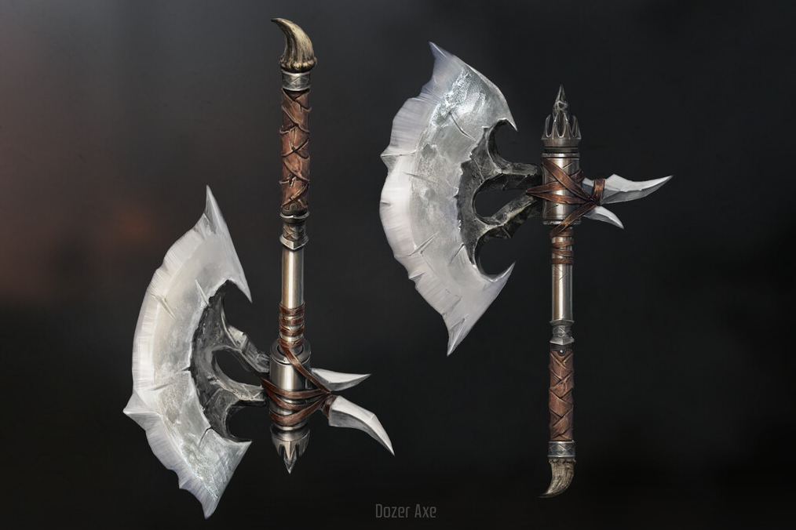

My friend Mirai has been doing her first play through of Demon's Souls and, bless my heart, she's been playing on the PS3. Mirai and I talk a lot about art stuff, so I couldn't help but to throw random screenshots from the Remake at her so we could have a giggle. Surely this wouldn't devolve into hours of screenshot comparing, and grumbling, and... [tool tip="It always ends up as an article, I swear to fucking god Mirai"]*well*[/tool].

... I thought I was over this, but here I am, accidentally scratching open old wounds.

To be clear up front, I hate the art direction of Demon's Souls Remake. I mean *hate* hate it. If you like it, that's cool, no shade, we all have our own priorities. We care about different things, and tolerate different things differently and it's fine IT'S FINE *YOU'RE FINE*~

I think it's deeply important for a remake to have it's own identity. I think it's impossible to make a perfect remake without having your own opinion. Even if you slavishly upscaled everything exactly to match the original designs, changing the fidelity of the content changes the *context*. You get the repeating grass field in the ps3 [tool tip="Don't ask Neolucky, the BEP cutscene artist about Bluepoint's SoTC remake, she might be a bigger hater than me"]Shadow of the Colossus[/tool] remaster. Stuff just doesn't work the same way [tool tip="so stop upscaling and smoothing out vagrant story you fucking animals oh my fucking god"]when you scale it up[/tool].

You gotta make decisions and they *made* decisions, as they should have! But I swear to god, somehow, as far as *my* tastes are concerned, and despite all odds... 

*Every single one of them was bad*.

That sounds like an unfair statement. [tool tip="Some of them are at least mid"]It kinda *is* an unfair statement[/tool]. Some less invested people look at me crazy when I say it! Bluepoint has tons of *technically great* artists! These designs aren't poorly executed or awkwardly designed. Everything is high fidelity, perfectly color graded, well performing, and well optimized... but there's a problem.

Years ago I wrote an article, **"Design Literalism vs Lateralism"**(which, while no longer on this site, is available [*here*](https://tumblr.kayin.moe/post/144945767324/design-literalism-vs-lateralism)). It's rough, even by the standards of most of my writing, but I think the concept holds up. **From Software** excels at this *"Lateral design"*, doing things just a little weird, a little different, seemingly picking the literal options that people shy away from, but going lateral where people like to play it straight. For those of us obsessed with From's designs and art, this is one of the biggest appeals, and one of the things about them that is the most difficult to imitate.

The problem is... Whenever confronted with a situation that forced them to make an artistic choice, **Bluepoint** would choose the most *standard* option. Make the most *expected* decision... Almost as if they saw From stray from the formula, and assumed they made a mistake.

> What, you had some fat evil men and forgot their BOILS? Amateurs.

> What, why would this demon look so goofy and unnatural? Amateurs!

> What, is this, a child's scribble? Don't you know a 3/4ths pose is more dynamic?
> 
> **AMATEURS!**

I could keep going, weapon and armor designs, to environmental design choices, weird details that make no sense... 

Why does Vanguard have shackles and chains on him? Was he captured? No that's... just what you do? Why does he have holes in his wings? To look more gross, obviously! That's just *what you do*! It looks *cool*, right?!

You could do this with so many design decisions in the Demon's Souls Remake, but I want to focus on *one*.

[[midheader image="flamelurkerconcept.jpg" text="We're going to talk about why Bluepoint's Flamelurker sucks shit"/]](flamelurkerconcept.jpg)

Click that [link](flamelurkerconcept.jpg) and give it a good look. Look at the inspirations, look at *everything*. Now, to be fair, I hold no individual artist responsible for *anything*. I don't know what their briefs looked like, what their art directors said, or how much time they were given. Most of the concept art is very well *executed*. These are talented artists. I know *factually* that there were people on that team who fought for details they thought were important. [tool tip="At least one person on that team thinks Blizzard and WoW are the peak of Fantasy Art and that person needs to be ashamed of themselves. But I don't know who it is, so the whole team gets off scott free... this time."]I hold no one person to blame.[/tool]

This isn't even his [tool tip="If you wanna see it, there is a video lower down in the article"]final design[/tool]. This design was in the first trailer, where fan outrage made them change the head. All that aside, seeing what was originally intended*(even though they claim it was a "placeholder", despite concept art)* gives insight to how they think because... this could be a fire demon from *anything*. 

Fire demon? You gotta do LAVA, right? and BIG, BIG demon horns. Why would the original design have small, goofy horns??? Gotta be built like an ape, like hellboy! Gotta look BIG and MONSTEROUS! How else are we supposed to know it's POWERFUL? And the Arena? Gotta make it look like some Diablo hell shit! Also the mouth of the temple? It should be a BIG DRAGON HEAD cause it leads the DRAGON GOD and that would be EPIC!!
[floatbox type="full"]

[/floatbox]

None of this is *bad* but it feels like *every other game*, resembling the well executed but utterly forgettable work you see all over *Artstation*. *Art that gets you hired*. When your director asks you for a *fire demon*, you know what he's thinking. Do you *really* want to to give him something weird or goofy looking? Even if you had a great idea, do you really want to bother when you know your Director won't go for it? Even if the Director likes it, the Executive Producer will send it back for revisions. Why are you making yourself more work? 

So you do what's tried and true. You can look at the references to the left of the concept art and see that is well worn ground. So... what did he look like on the PS3?

[floatbox type="full"]

[/floatbox]

Flamelurker isn't lava. Flamelurker isn't fire. *Flamelurker is **on** fire*.

Your typical fire demon seeps lava like a monster drools. The lava is a natural part of itself. It, often, *is* the lava... but with the original flamelurker, all aspects of his design point to *distress*. Skin melting, not like rock, but like *flesh*. Clothes? Armor? Skin maybe? All peeled back painfully, flaying out, like [birch logs curling in a fire](fire.jpg). His soul is so hot it is used by the Blacksmith Ed to *forge weapons*. He looks blown out on screen compared to the PS5 version. Lava *isn't* that hot. You don't forge with lava unless you've seen too much bad fantasy. Lava melts, but fire burns. Wood burns. *Flesh* burns and carbonizes. These are the hottest flames. This is a fire *disruptive* to the being wielding it, destroying him from the inside.

Add to that all the potential lore... Flamelurker as the Legendary Big M, the man who killed dragons with his bare hands. Is this him, becoming like a dragon, like his likely descendants Ed and Baldwin, getting burned up alive by his obsession as is the usual metaphor in Souls game? Or did he die fighting the Dragon God? Is this burning his soul suffering and living on?

... Or is he just *Lava Man Big, Very Hot*? Just being strong and scary and [posturing like a gorilla](https://www.youtube.com/watch?v=-7g91MiAMtw) instead of being both [uncannily monstrous and yet uncomfortably *human*](https://www.youtube.com/watch?v=j3Z79JZpS-g)? Fighting in a demonic hell temple, or in a temple of an old, fallen civilization... a mausoleum containing a great hero, used to symbolically seal away a god that didn't actually exist until the Fog brought it forth from legend?

Everything about the PS5 flamelurker, and his environment, and animations are so well executed... but they don't *build* to anything. They don't inspire any thought. While maybe not *literal*, as my old article would say, they are *direct*. The *statistical average* of a fire demon, in a *statistically average* arena, all executed with incredible skill. *Is that not the true dream of videogames?* To fight the most technically well executed big lava dude?

For me, as someone who doesn't care much about fidelity, designs like this leave me feeling nothing. This design does nothing to excite the imagination, or inspire curiosity. Even without all the possible lore, without all the deep readings... PS5 Flamelurker is an enemy I've seen in a million other games. He's probably a character in *at least* 3 different MOBAs. Even if the same design doesn't *quite* exist, it's existence is practically *implied*, an aspect of the ur-flame demon that exists at the center of the zeitgeist. Familiar and boring.

The original, at his worst, even if ALL the things I said about his design were bullshit and happenstance, he's still... a weird dude with a goofy face and a giant round dome of a head that makes me feel uncomfortable. Maybe I am a little nuts, but I *value that more*. "What the fuck is up with *HIM?*" is a at least a thought I can dwell upon, where the Remake's design, if in any other game, would flow past me as soon as I looked away. Rote to the point of inspiring incuriosity. At best it is a pretty image to distract me for as long as I choose to look at the screen. Modern media rarely tries to intrigue you with depth, but instead by keeping up the pace. Aggressive animations, colorful, complicated, dynamic arenas, bright particles and lights. *Please don't look away, we've worked very had on this*.

A child who is used to screaming for attention doesn't understand the power of marinating in silence.

This isn't exactly Bluepoint's fault, because they're not exceptional in this regard. Heck, if they're exceptional at anything it's genuinely at the technical ends of art. But they are the unfortunate technical team that's being given Art Games to remake. They represent the whole industry, they represent movie VFXs, and even the future of AI.

## Cogs in the Machine

Mirai and I end up talking about AI art a lot and a point she made, as professional CG artist herself was... the industry already treats talent like AI. The pipeline strips out creativity. Everyone is given a task so small that they can't really have much expression. The spots where you can add your personal touch are almost invisible.

You don't make the whole 3d set, you either make one or two assets for a set. They have to match, so don't be ambitious. When you're assembling a 3d scene, you're working from the props made by other artists. You may rig a model exceptionally well, but you're working with the animators so you can't be too ambitious or experimental. The animators? They're cleaning up mocap data. The more the work is spread, the more consistent the output becomes. Then when it comes back, you get notes, and the process moves again, like tweaking a prompt or re-generating with a different seed. The bigger a production, the less influential one person becomes.

You still needed a concept artist, but that time is passing. A person in this context often becomes not so much a contributing artist but a machine that turns time and money into random pictures. Or... at least that seems to be how it feels to the people in charge. They don't want the most *creative, interesting, or unique* version of something, they want the boring thing they see in their head done well. They want an *exceptional* version of the average. You can look at that flamelurker reference sheet. It had no hope of being an interesting design, because the only reference it pulled was from art that already existed and a few pictures of lava. Things get made a certain way, so artists who want to get into the field copy those things, feeding those images to producers, who then expect things that look like that, creating a *pretty* but *numbing* feedback loop.

This is what AI does. It can't be creative, because it *can't* think laterally. It can't even *think*. It can just analyze a prompt and predict the average. *"Trending on Artstation"* is a common AI prompt for a reason.

To go back to my old article... An AI will give you ~~McCree~~Cassidy from Overwatch, but it won't give you [tool tip="Well, it'll give you Bayonetta because it's trained on a million pictures of Bayonetta because Bayonetta is so fucking cool"]Bayonetta[/tool]. It can't give you Bayonetta because it doesn't know how to make a Witch without making a Witch. It won't give you Johnny from Guilty Gear because even though he is in no way an outrageous, or complicated design, you can't say 'make me an air pirate katana dude' because it doesn't know how and is *fundamentally incapable of* finding the design between the prompt. You'll get a... steam punk samurai with a cog for an eye patch. 

You can maybe sit there and come up the design and all the little details in your head, trying to generate it by banging on Stable Diffusion for days... but ultimately if you want something like Bayonetta, you gotta pay someone like Mari Shimazaki. Either way, the creative thinking is coming from a human.

At the same time though, while AI is bad at these things, *the systems in place right now are also bad at these things*. Maybe not *as* bad, but often close. Young artists training for decades to be the mechanical turks of executives who have *"the vision"*. Of course they'll be replaced, they're practically *designed* to be replaced. Commodified assets whose real value is only known by those closest to them. 

But these cogs are still human, and despite the restrictions in front of them, they still try to bring their passion to the things they work on. Losing them is not just a matter of lost jobs and wages, but that little bit of extra care, the safety valve for rich men and their unearned creative confidence. Human cogs can push back when they feel something is wrong with the machine. Because as utterly *basic* as Bluepoint's corporate tastes are, without real people around, there would have been no one to say no to this [tool tip="The one that ended up in the remake looks great and is proof at least one person on the team ACTUALLY loved Demon's Souls"]horrible Dozer Axe design[/tool].

[floatbox type="full"]

[/floatbox]