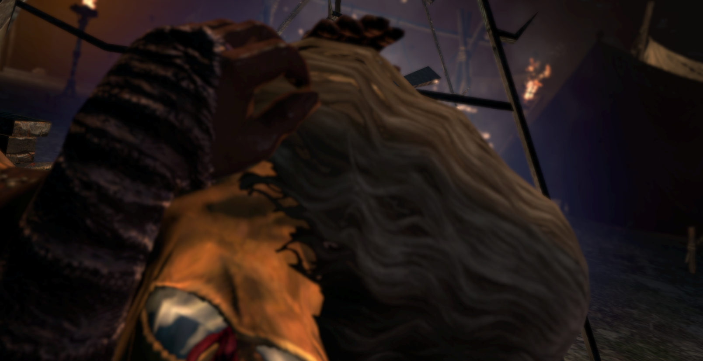

Dragon’s Dogma the type of narrow, niche fanbase that made me know I’d love it whenever I got around to playing it and even though I knew this would happen, I wasn’t ready for quite how much I’d love it.

Dragon’s Dogma is a weird game. It feels like someone played a game of telephone, describing the conventions and goals of the big western RPG genre to the designer of Devil May Cry, who then declared “I got it” and made a game. The reality isn’t quite as funny. Hideaki Itsuno had a lot of the core ideas for this game all the way back in the year 2000 and he clearly was a fan of the western games he was inspired by. But instead we get back funhouse mirror reflection of the genre, seen through the eyes of someone with a very different value system.

In many ways this is similar to Demon’s Souls, a reflection of western fantasies and RPGs with an entirely different value system. But in the decade since, Miyazaki’s vision has permeated the culture of the game, and besides coming from the same place, often aping the same references (down to Berserk), these two games could not be so similarly different. Dragon’s Dogma still feels almost like outsider art, a beautiful jewel that nothing else is quite like.

I could go on about the combat, how the game has some of the best feeling and satisfying variants of the Stinger attack I’ve ever felt, talk about how the classes are WEIRD, or other things but one of the most defining features of Dragon’s Dogma, that permeates its whole design is that the game wants to make the player Choose.
[splitbox side="right"]

++++

Now, it’s easy to look at other games, the morality systems of a Bioware game or whatever, good and evil routes and go “These games make you choose!”, and they technically do, but the point of the game is not to choose. The point of the game is to play a role, and the choices are what makes that possible. The choices are a means to the end. In Dragon’s Dogma, the choice is the goal — or perhaps, you could say, expression is the goal, but Choice fits the theme of the game all to well.

The thing that makes Dragon’s Dogmas choices so wonderful is they are complicated, obfuscated, and with unclear inputs and outputs. The game wants you to sweat your decisions, but it makes it very clear. Choosing is better than not choosing at all.

From character select this happens. So many of the choices you make in the character editor affects things. Long legs? You walk faster. Big? You can carry more. Light? You use less stamina while moving. Gender not only influences gear, but how some enemies react to you (but, blissfully, not who you can romance, which is…. everyone??). All these have an affect, but never an affect that is so strong you’ll regret it, or one that will keep you out of important content. Your pawn and its design matters to. You share them with the internet and how they look AND their stats matter. Program your pawn with a fancy TACTICS GRID? No no no, you sit down and talk to them. Your pawn gives you abstract questions, and you chose the answer. The game throws systems, items, loot and everything at you, forcing you to figure out what to experiment with, what to keep, what to do. What do all these stats and icons mean??? Wait I got only a few places I can mark with crystals to be fast-travelable? I gotta choose that too???
[/splitbox]
It all matters but it doesn’t matter. This isn’t Dark Souls you aren’t going to be punitively punished. You’re not going to be tricked into making choices you didn’t even realize you were making. In fact the game goes out of its way to make SURE you know what you’re deciding.

The “moral” choices in these games feel more real and nuanced than other games. There are rarely right answers. Characters understand. Do you give the hot merchant girl who seems a little shady a bunch of money? Sure, but it doesn’t hugely matters. She appreciates it, but the choice doesn’t come back to haunt you. Do you evict the family for the rich merchant? They’re understanding that you’re just the one breaking the news and SURE you can buy the house but the game doesn’t present it as the obviously good answer. It’s just something that can come up. What’s your reward? Appreciation. When the merchant goes to trial, is he guilty? I mean… he probably is for SOMETHING, but it’s unclear. You can find evidence for and against, you can forge evidence for and against. Hell, you can just FORGE items, even important plot items. Which merchant do you give the gold idol to? Do you help Mercedes during her duel? Is either choice right? Who is your beloved? Do you get a ton of special dialog with your loved one? No, they just go into your house. But you have the freedom to chose. Even how you give gifts and respond to pawns you hired fits this type of player expression.

The important part is that the choices matter enough for you to see results but not so much as to make you worry about gaming the system, or hunting for a best ending, or whatever. But making a decision is hard, and you have to make them.

Thematically, this plays through the whole games. Pawns are devoid of will, and is your will, your ability to chose that gives you command over them. The dragon exists to find someone to make an Arisen, someone with the willpower to choose. The present them with difficult choices and challenge them. They need someone with the strength to inflict their will upon the world. Grigori fights you with every ounce of his strength, but that wonderfully, beautifully written dragon wants you to kill him. He wants someone who can take what is theirs.

All this to find someone who can replace the “Seneschal” of the world, to slay the previous god and replace them, to refresh the willpower of the universe. Every step, you are given permission to stop. Grigori understands sacrificing your beloved for peace. Not embarking to find the Seneschal is a valid place to stop playing the game. The game even tells you, as you fight god, that the peaceful life is an underrated one.

… And once your god, you chose when to die. This is a game, fundamentally, about having the willpower to Choose.

## Odds and Ends

I killed a Dragon and now Naomi’s underwear are magic, 10/10 game

Alright, this will be less focused but just to get some stuff out.

This makes sense, coming from the designer of Devil May Cry. The DMC games are filled with choice. It’s not about being OPTIMAL. you CAN be optimal, but the games are about style, about being cool, about expressing yourself. This leads into combat that feels like a toned down DMC. Stingers, double jumps, crazy infinite arrow blasts. The game doesn’t try and constrain you with offensive resources, it wants you to express yourself. I expressed my self by being a Mystic Knight, third strike parrying everything, and by oppressing all those who would oppose me, with my friend the orb. Now I’m doing NG+ as a solo assassin which is just FULL of options.

Visually, the game is dated but beautiful. You see the rough edges, but the lighting is unusually naturalistic. It just… feels like being in the woods, a lot of the time and it makes things just feel so real and immersive, even with some of the age. The game didn’t need to have a day night cycle. The game looks beautiful during mid day and it could be kept like that but… traveling at night is another choice, and one the game encourages despite it’s drawbacks.

The story of the game is wonderful. While being low in dialog and character building it still manages to stitch together an amazing cosmology. The cycle of godhood is so creative and the Pawns are just wonderfully weird. Grigori might be my favorite dragon ever? The voice actor does a hell of a job. I love shit like the Duke’s whole mini arc

I also love how wildly bisexual this game is. Like the Duke’s Wife assumed my girl was ready to hook up with her at a moments notice (and she was right). It’s definitely more of a female leaning slant but the game still gives you the freedom to… romance whoever.

The armor in this game is funny. Want DS style armor? Covered. Wanna be Red Sonia? Covered. Less options for boy sluts, which is unfortunate, but the swinging pendulum of armor has me loving silly hot fantasy armor again.

I cheated a bunch by the end of the game. Rift crystals were too rare because online isn’t THAT active anymore. Also I’d dupe items I had cause forging stuff, while affordable, was just annoyingly time consuming. I in theory like that inconvenience tradeoff, but after the 20th forgery I was like ‘alright alright enough of his’.

I played on the PC version so no Berserk armor, but I love how this game takes a totally different set of Berserk influences than DS. Very Golden Age-y, while also being its own thing. Especially stuff like “Hey we made Mercedes cause we clearly love Caska but she’s not Caska, and the weird Witch Pawn isn’t Schierke… even if she lives in a tree house guarded by a golem”. All the influences are obvious enough to be appreciated, but unique enough to not be rip-offs.

Anyways, Madeleine is my wife. Dirtbag girls forever, see you in Dragon’s Dogma 2.

