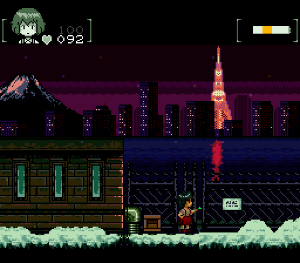

Going to try and keep this one as a reasonable, [tool tip="Spoilers, I failed"]to the point Game Journal[/tool], but I'm glad I could play both these games after finishing that tome of a [Metroid Dread review](../metroid-dread-how-metroid-lost-its-way/). At the end of this I'll have my "Dread Review Debriefing", but before that, let me talk about some things I *actually enjoyed*.

## Metroid II gets better with age, and better when you come to it as a willing participant

My palette cleanser after Dread was Metroid II. I ended up using so many Metroid II examples that it felt appropriate to give it a quick play through. This time I played with the [EJRTQ Colorization](https://www.romhacking.net/hacks/4388/), which I quite liked. I kinda wished I played with [Azurelore Korrigan's color Patch](https://aderack.com/m2/)(you should read this page and other things she wrote, even if you're not planning on using it) as she's maybe Metroid II's #1 defender, but the patch I had did the job fine. Metroid 2 doesn't *need* color, but I've played it monochrome enough to justify a little experimentation. I felt like it actually added to the game and it made it clear that the world wasn't *actually* just the same grey tiles, over and over again? I think a case could be made that being less confused is actually a downgrade, but I think I was confused enough!! 😭 

...Aesthetically though there *is something* about the pure monochrome look. Probably the best way to do a first play through.

So to go over my notes...

* My bullshit tolerance is so much higher now, playing through this game was pleasant and relaxing.
* The majority of the world is ambivalent to you. The spiderball and how tedious it is to use makes sense. *Of course* you gotta climb the cliff wall awkwardly, why would a cave be where you'd want a cave to be? Do you think a human designed this cave?
 * (a really really GOOD designer designed this cave, actually 😏)

* The Chozo ruins feel ANCIENT. Eroded to shit. Trashed. They feel empty yet hostile, like a temple full of traps. It *rules*.
 * The deep black backgrounds tied with the cramped screen adds to this. I feel like a true modern take on Metroid 2 would have to be based a lot on *light*.

* You get lots of power-ups at once. A chozo ruin is loot central. Feels on brand for ancient ruins.
 * Each ruin has 2 or 3 major power-ups and countless other missile/energy tank pickups. So density is very high.
 * I love how there are appropriate rooms for things. The powerful stuff is locked behind red doors. Stuff like missiles and E-tanks are often in special ordinance rooms with simpler locks (breakable blocks). They're put away in like boxes made of game tiles, it's great.
 * The fact the boxes are big and mostly empty or with one missile upgrade left makes it feel like these ruins were already looted.

* ALL power-ups are close to chozo ruins. There is never anything in the main tunnel system. Why would there be?
 * Only one beam at a time is cool. Enough repeats exist to experiment and it *feels* right for their to be multiples of these weapons laying around.
 * The excitement of finding chozo buildings and the risks of exploring them makes for a nice mix of emotions.

* Combat sucks. Metroids are tanky. This is a game on a crazy low refresh rate screen, it's more about managing energy and missiles than tactics. Not that tactics don't help.
 * Accepting the limitations of the hardware and adapting to them is what this game does best.

* Less 'maps don't line up' stuff then I thought I remembered. I still hate the one bit in Area 3, but it's not really a problem.
 * There are valid arguments for this, but I feel like it's not done enough to be truly a big part of the design.
 * I think the... none-major area maps overlapping is fine and cool? Cave systems aren't 2d and it doesn't matter that much?

* The acid is a shitty progress conceit but it works and makes the game actually playable so whatever.
 * You could do non-linear Metroid II but what's the point? Either you're lost forever or you already know the game and the progression is simple. No reason to do it out of order
 * Forcing a linear descent aids the feeling of isolation. Going forward feels easy, but going backward feels impossible.
 * At a certain point it just starts feeling like a one way trip.

Most importantly with this game, the *vibes are amazing*. People hate on the music in this game, but the main corridor tracks are bops. The "area" songs are ambient, and the chozo temple tracks are downright alien and hostile. As you go deeper, the world gets more alien. Weirder tiles, weirder enemies...

After you kill the last omega metroids, you are left with nothing. You walk, in silence, no combat, no enemies, toward the queen for like five minutes. It's incredible, as long as you are willing to engage with it. As long as you think of the horror of being down in this planet, alone, committing what turns out to be an ill considered atrocity. You enter a big huge room that feels like some giant room out of Blame!, leaving you groping around to find walls, let alone the ceiling. You find the ice beam, the shredded chozo statue. The metroid reveal is tense, but a moment of triumph. You are unstoppable. You walk into the room before the queen and...

*Dread.*

More dread than anything in Dread. It's like walking to an execution. The droning, deep music, the hostile, unlined spikes. The cracks in the floor saying this is going to be a one way trip. The room lets you run. You can roll away and flee. There is no pragmatic purpose for this. Better to just die and walk back... but just having the option makes it feel real. *You should be afraid for your life. Running is an option*.

It's another tanky boss. She's not great. But she doesn't have to be. The moment is great. The moment AFTER is great. The return to the ship is great. The end of this game masterfully raises and lowers the tension over and over, leaving you exhausted yet satisfied by the end. Seeing the stars in the sky feels like breathing fresh air on a cold winters night, escaping a loud, hot, claustrophobic party. You can *exist* again. The ending stretch of Metroid 2 has some of the best "inhales" and "exhales" in gaming history.

I'm still a Super Metroid fan to the bone, but Metroid 2, after all these years, is my clear #2 in the series. I don't think anything else that has come out has been even close.

## Super Junkoid

[center][/center]
> Trapped in a twisted dream where she is revered as a goddess, Junko must face the horrifying serpent that worships her

*This will contain spoilers. If you're like me sometimes you need a few spoilers to get you interested in something that's no big deal... but since I'm not talking about decades old games at this point, I feel like a warning is appropriate.*

Super Junkoid feels like a special game. Mirai had been recommending me [this romhack for awhile](https://metroidconstruction.com/hack.php?id=750&noprocess) now. It exists in this strange in between of a full conversion, and *very distinctly* being Super Metroid. 

The game is a dream, but does not use it's dream gimmick lightly. Everything feels surreal. You wake up in a bed in the middle of a snowy field. Doors are replaced by giant bird heads, a possible motif taken from the dreamworld of Mario 2. The first area drifts... snowy fields, crateria like caves, underground service tunnels, to blood.... fleshinesss. The bottom of the first area, The Outskirts, feels almost vaginal, like a creeping post puberty menstrual nightmare.

... And you have to go down in it. Junkoid, like many Metroidvanias we've talked about, use one way trips to funnel you where you need to go. Junkoid makes it naturalistic. Do you dive too deep in the blood, getting stuck? Do you fail one of your jumps in the service tunnels? Do you clear the surface before being forced underground, where you are faced with a sheer drop? Either way you're going down, deeper in deeper. You get bodged down by the blood. Super Metroid water physics feel oppressive and claustrophobic. Like a nightmare, you move slowly, your body betraying you. You flash with pain periodically, as if you're drowning, but you take no damage. Like in a dream, you can't drown, but you can be in distress. The sound is *distressing*, even when you realize it has no mechanical meaning.

There is no way back. You could never get back. So deeper, and deeper until... finally, air. Finally... [tool tip="I wish I wrote down all the actual item names"]high jump boots[/tool]?

This feels very much like how I was talking about Metroid II, but in a very non-linear way. Super Junkoid is designed to force you to dive deeply into new area, get stuck, find the solution, and then spend your time combing your way back up out of where you are, exploring as you go. If I was to compare, most of the game feels like post Varia suit Norfair in Super Metroid. You have a lot of options and getting around is a little confusing, but things tend to circle back on themselves. Getting lost is fine, because there is a lot to discover. You learn to turn into a rat. An exploding rat. A *fast* rat.

The [tool tip="A theme, for today"]vibe is incredible[/tool]... Dark and ominous, yet soft. This isn't a hard game and like many dreams, the real enemy is just the overwhelming sense of dread. Often, it used remix of Super Metroid tracks. Junkoid, the NES version of the same story, uses all original music, but Super Junkoid feels darker, key shifted down. The item pickup sound, a riff on the original metroid Item Pickup, feels like you are making a dark bargain. The surface is pleasant. Mountain scapes, city skylines in the back. Even an ice palace, a high fantasy, pleasant dream.

The deeper you go, the more nightmarish things get. Eventually you enter the mouth of a horrific worm like creature with a distressingly monstrous face. Not a Snake... more like a worm. The False Idol. It's insides are hostile to life. Fleshy, squeezing, digestive. The walls shoot at you to kill you and the acid burns. It is a multi headed hydra connecting and consuming parts of your deep self conscious. Perhaps it's part of you? Your Id? your conception of The Snake?

You kill it.

You kill the re-skinned spore-spawn deep in its guts it dies. The *world dies*. A part of it, anyways. There is no more acid, there is no more life. The walls do not shoot at you. The faces that emerge, linking parts of your mind begin to rot. Only the spikes, the dying bones and teeth lining parts of the False Idol's insides offer you any resistance.

You can go deeper.

You enter the Purple, the deep part of your mind that connects everything else. Elevators break the logic of the world, leading conveniently to other parts of the world. This is a junction point. The Purple is hot and sweltering. Mechanical. Here, embryonic Junkos are generated and dies, a factory for your identity and your sense of self. You go deeper, walking along the mechanical pipes... a big room, some blocks to shine spark through, some floating platforms... a strangely evocative floating pile of pipes... Crateria... the surface? ... This is Super Metroid?

The beginning of Super Metroid, represented in a completely different, inappropriate tile set. But you know what it is. You know because *you're playing a Super Metroid rom hack*.

You're dreaming about Super Metroid. Or, more specifically, Junko is using the dream like structure of Super Metroid as the frame work for confronting The Snake. It's a brilliant moment, relying on your familiarly with the source material. Eventually you'll figure it out, the gimmick goes on long enough to get the attention of anyone who'd be playing a Super Metroid romhack... but I realized it from the first room. I too have Super Metroid, lodged deeply in the back of my subconscious. The rough edges, and crudely re-skinned bosses become recontextualized. Junko's weird wand beams, her goofily remixed abilities, all that get recontextualized. Super Metroid is not just the base for this game, Super Metroid is a part of Super Junkoid.

I have to stop myself there because there would be just too much to babble on, but to bullet point some last notes.

* The structure of this game allows for a lot of genuine exploration while keeping the current problem space manageable.
* The game inspires trust. It establishes its design language. Yes, this is the type of hole that a rat can fit in if there is a secret here. Yes, that's the type of tube that breaks when you shoot it. No I will not randomly require you to do something obtuse to mix it up [tool tip="I want to be clear, this isn't better because it's less random, it's better because of conviction. If you want random wall bombing and secrets, do it with conviction"]because I regret making solutions too obvious.[/tool]
* The game uses its music excellently. It knows when to change it, when to cut it, and when to bring it back to control the mood.
* Loved the background details. At first it was noticing the weird bird doors off in the distance. They exist, in whatever dream universe this is, even beyond Junko's reach.
 * You also see far off save points.
 * and a lot of other weird map structure stuff that's nice.

* The map station, a giant mining mole who clearly is giving you notes, appears near the end of areas. Finding the mole always felt like a section wrapup. The mole labels where all the items are, so there is no blind bombing and shooting.
 * I found most items before the mole, so the mole just helped find the few things I missed, which seems like a good balance. No blind flailing.
 * Even with a clear design language, finding items is still a puzzle. It's not about finding the room and doing the thing, it's about figuring out what room even leads to the item. Understanding the map is critical.

* It's confident. It knows this can be engaging. Super Junkoid doesn't second guess itself. It's basically the opposite of Dread. Vibes and confidence.
* It controls like Super Metroid, but in a more relaxed way. Wall Jumping is easier, space jumping is easier, you start with springball *because of course a rat can jump*.
* Having the rat as your speed booster is great, it stops it from becoming a thing that just randomly happens.
* Shinespark is its own power up. No running required, just a super dash with ammo. No dumb shinespark puzzles.
 * I totally got [bluesuit](https://metroid.fandom.com/wiki/Blue_Suit_glitch) killing Not-Draygon with one of the dashes, but the game took it away from me. ☹️

* For downsides of this game, it doesn't end particularly well. The last area is the least interesting, and the last boss, the Snake reskinned from Mother Brain's final from is... fine? This is a Super Metroid romhack though, and these are the limitations. There are a few good payoffs though, but I feel like the final act struggled to conform to what requirements the end of Super Metroid forced upon it.
 * The less scripted nature of Junkoid, the original NES version, seems to be able to handle this more gracefully. You don't need to explain a giant baby Metroid cutscene, because there aren't any cutscenes.
 * It's not like it fumbles the end, there just isn't much else you could do?

This last bit is a small negative when dealing with one of the best romhacks I've ever played. Shadow Tower Abyss ends *much much* worse and is still one of my favorite games. This ending is more "If you go in with lowered expectations you'll probably actually come out pleasantly surprised.

I gotta say it. Super Junkoid is better than Metroid Dread. ~~Speaking of which...~~

## ADDENDUM: Junkoid
[splitbox side="right"]

++++

This section has been added a few days after the original post because decided to play through the [NES Junkoid](https://metroidconstruction.com/hack.php?id=689&noprocess), as inspired now by [Sylvie](https://sylvie.itch.io/), who also wrote this great [co-host post about it](https://cohost.org/sylvie/post/6144514-stories-narratives)(By all means, [follow me on cohost](https://cohost.org/Kayin) while you're at it).

I kinda wish I played this first. It's impossible to untangle by view of Junkoid from the lens I views Super Junkoid with. It's tricky because Junkoid is a much less *ambitious* game, but is just as much of a clever one. The narrative is just a repetition -- there is no Metroid to Super Metroid here, no returning to the story from a different lens. Junkoid is just a different telling of the same story. A different game, perhaps, that Junko fell asleep while playing.

Junkoid cannot match the rich, murky vibe of Super Junkoid. Instead, it is a crisp, clean experience. Simple and evocative, pulling a few tricks Super Junkoid couldn't while not overextending anywhere. The Purple -- here called The Labyrinth -- is even more memorable. You literally submerge yourself into a sea of purple. You lose your clothes. [tool tip="Well okay it's THERE but it's blank"]You lose your HUD[/tool]. You are naked, physically and mentally. Super Junkoid can sprawl, but Junkoid hits with precision. Free from the cumbersomely cinematic design of Super Metroid's bosses, mechanics can be repurposed, encounters changed. It is both more obviously Metroid, yet *less*. 

There are so many little touches. You get a map for the first area. You can get around there fine, but you'll be blind everywhere else. The sub-areas are relatively small, but it's still so easy to miss that map. By giving you the map at the start, you feel more lost than you would if you never had one at all. 

The game has many lovely structural shortcuts. I particularly love The Heart, and it's floors, the different ways the main tower makes it easier to go down as you find more items. The whole area feels like having to take the stairs down in a skyscraper because the elevator isn't working.
[/splitbox]

I love how wet this game feels. Visually and emotionally. The original Metroid is a visually *dry game*. A land without water, bushes looking parched and brown. A land of cold metal and brick. Norfair looks like it's made of volcanic glass. Junkoid is made of blood and tears. Super Junkoid wears these themes heavily. The atmosphere is thick. Junkoid, by contrast, is almost light about it. More distant, but in a way that better highlights the absurdity. In Super Junkoid you are deep in the dream with Junko. in Junkoid? You, like the snake, are watching her. When you enter The Purple, she even tries to hide from your eyes.

Like Super Junkoid, there is a consistent design language. You have a rapport with the developer and they are not inclined to betray your trust. Both games award attentiveness. Secrets aren't hard if you're using your eyes. It's so easy to coast through games that don't require you to be *present*. Junkoid is easy, but it won't let you sleep at the wheel. You have to be engaged.

It's fun, weird and breezy. While it doesn't hit the highs for me that Super Junkoid did, it stands on it's own merits and has it's own strengths. It even ends better. How Sheol feels. How the Snake feels. How the Zebetites are repurposed, used over an entire area. The whole final act just plays out nicer here, even if Super Junkoid's [tool tip="Junko is going to the one place that hasn't been corrupted capitalism. SPAAAAAACE"]very final moments[/tool] win out. It's not a contest though. While both are takes on the same story, by the same creator, both have different goals and approaches. Both are filled with unique things to love. If you had to play one I'd say play Super Junkoid, but if you have time you'll probably enjoy playing both. Junkoid isn't that long. You might even end up loving it more.

Okay NOW to talk about the Metroid Dread stuff...

### No one stoned me to death for criticizing Dread

Feel free to skip the rest of this.

The reception for the Dread review was *super nice*, but the thing that got me the most was is how many people who *liked Dread* who also liked the review. Not that I changed anyone's mind(I maybe solidified some percolating negative opinions, but I didn't make anyone pull a 180), but I think it helped some fans understand some *papercuts* they had with the game. Critical flaws for me were minor sore spots for them and while I they didn't feel what I felt as intensely, they still felt *something*. A lot of my interactions went like...

[center] 
(this was technically a different thread talking about Samus Returns but we'll get to thats)
[/center]

I was... really really happy with peoples willingness to engage me on this topic, or politely argue against me. I made a lot of effort to not sound *judgemental* in my review, but my opinion was definitely sometimes rather intense, and I'm glad people were able to tell that I mostly just... was really passionate?

The map and EMMIs were a common source of agreement(even fans felt constricted by the map at times). The point about counters was hit or miss. While many people argued for the counters and boss design, there is definitely a growing resentment for that style of content. There is also an increased amount of criticism toward the Dark Souls induced "Dodge/roll" type of call-response combat design. While I don't hate that style of design(I'm a massive Fromsoft fan, so obviously I don't mind it), I do feel it's overused as some sort of "Secret sauce" for "hardcore combat", even though massive i-frames is perhaps the most EZ Mode type of defensive option a game can have. Sometimes a big cool EZ Mode dodge move is cool but it's use seems to have more to do with the *optics* of difficulty than anything else.

There was talk about the fact *Metroid is different now*. Metroid is an Action Platform Semi Horror game and it's been that longer than Metroid has been anything else and you can't expect everything to be Super Metroid. I actually agree with this, but I don't think this is a reason to settle for less. The review pointed out many of the issues with the combat. My map analysis didn't go "This should be Super Metroid", it gave the example of many different types of maps and then analyzed Dread's on its own terms. Dread's map sucks not because it isn't Super Metroid, but because it *isn't anything*. Even if you go "It's INTENTIONALLY a confusing patched together mess of content"... to what end? How does that fit into what the game is trying to accomplish?

It doesn't. It's simply a winding queue for their content train. The only defense for the map comes down to "but the content is *good* so it's fine".

... And I think that's fair, but it doesn't make the map *not suck*. It just means the map doesn't *need* to be good. I think you can argue while there would be no downsides, in a vacuum, for a better map, perhaps they made the best cost/benefit analysis for their game and goals. A better map isn't *free*, right? Maybe... but if the world isn't important anymore in a Metroid game, well... at least for me, the series is cooked. But we can agree to disagree on that.

Oddly most of the pushback I got came from an odd place.

### Samus Returns looks embarrassing and I will not play it, but Mirai did so I kinda got revenge for being made to play Dread

I was playing Metroid 2 while Mirai was playing through Samus Returns, causing me to start comparing rooms and vibes... 

[center][/center]

We come back to the big [tool tip="Okay it's not THAT big the Blame! room is like the size of jupiter or something. But it FEELS massive for a GB Game."]*Blame!* room[/tool]. This hit way more nerves than any of the Dread tweets. While most people agreed that this was... frankly, indefensible, I saw a lot of people *try*. 

I'm told Samus Returns fans are a bit prickly due to some people preferring AM2R, a fan game that *also* butchers the vibe of Metroid 2, but to a *much* lesser extent. I guess this is understandable. Dread has nothing to be compared to.

For AM2R, It at least *[tool tip="They don't understand what's cool about Metroid 2 but the misguided souls at least thing it's worth trying to 'save'... in big air quotes"]tries* to respect Metroid 2[/tool], where Samus Returns seems to *resent* Metroid 2. Possibly true, because [tool tip="Because it's a studio of people with bad taste"]Mercury Steam wanted to remake Fusion[/tool]. Some of it seemed to be general Nintendo defensiveness. Maybe it was the fact this wasn't connected to a well reasoned article. This is just me *taking a shot*.

Part of this is people expecting games to be universally beloved. I don't think I need to tell anyone reading my writing that *every game has haters*, often *justified haters*. I've heard Super Metroid criticisms I can't hand wave and aren't just people whining about a floaty jump(not every platformer has to feel the same). This stuff is misguided and kinda funny but not a big deal. The stuff that got me was people proudly saying shit like "They added gameplay and you're *mad*?" "Oh you want games to be worse and more boring?" "I don't like the game or the atmosphere so I fail to see the issue".

I tried to be patient in my threads. I want to sorta try and avoid the old school forum argument BS. I want to kinda help people through this stuff so they can think about games better and engage with them in more ways.

... But if that's your opinion **then you fucking suck**. *You're slime*. [tool tip="Worms are actually pretty cool and this is deeply unfair to worms. When I see a worm I'm at least like 'Cool! A worm!', which is something I've never said when getting tweeted at by sentient toilet scum"]You're a fucking worm, rolling around blind in the dirt, eating shit.[/tool] Just thoughtlessly devouring and defecating as you go. You have nothing interesting to say, and nothing thoughtful to contribute, because you can't stop stuffing your mouth full of crap.

I don't care if you like the game. I don't care if you don't care about the change. I don't care if you don't even get what the big deal is. *We're cool*. I'll walk you through it. You can even disagree after I'm done. 

No, It's the entitled people who are *proudly incuriousness* that gets me hot. Without even the self awareness to realize *that they have nothing to add*. They can't help but to speak. There can't be a problem here *because I like it*, and clearly this stranger I'm talking to will be forced to reckon with that! Nothing matters, *as long as the content is for me*.

Okay had to get that out I'm sorry 😭 Most of you are cool so imma talk to all you now.

"Okay but what *is* the big deal? Sure, the vibe is in shambles and that's a shame, but this is a different game, right? Different goals? This isn't what's going to make or break that. Having the big open room isn't going to unshamble the vibes, right?"

And yeah, this is true. Again, no issue liking the game. It's about liking what it offers, not about what it *doesn't* offer. But lets look at this differently. You're making a new Metroid 2. You *don't really give* a shit original. You want to make an action game with a beach biome and palm trees. *why is the still room there?*

Like if you don't think the room adds anything good, or isn't compatible with your game... why is it there? You could make a room that better matches your vision. The remake already lacks the famous Decapitated Chozo Statue room that comes next. You can change the design. No, including the room and "jazzing it up" implies a fundamental misunderstanding of the room. They didn't even realize that doing this would be embarrassing. They were just like "Eh there was a bunch of empty rooms, who cares?" They did not need to invite comparison.

I think it's appropriate to ask too, even if you enjoy Samus Returns... why are we remaking Metroid 2 with no respect given toward it? Do we just want everything to conform? Do we need every Metroid game to have a "Traditionally Good" rendition? If we are doing that, what advantage is there for the franchise to not at least *try* and engage with the strengths of the original. I don't love AM2R, but they *try*. This could be a new game. *I* don't like action star Samus Metroid games, but I'm me. People can do whatever.

This is a spicer, opinionated take, but I have no respect for a developer who can't let something breath. Mercury Steam never trusts themselves to have the player's attention. They have to GO GO GO GO none stop, no matter what the source material calls for. They can't even let the Baby Metroid sequence be a quiet moments. It needs puzzles. It can't be a gentle moment either, it needs a boss fight.

And they do this despite the fact that they can't make the [build up to the Queen Metroid even a 1/10th as cool](https://x.com/KayinNasaki/status/1794246371656302758) as ancient, primitive monochrome portable video game. It's fine if you don't care. [tool tip="People continue to confuse Good with Smooth, be it framerate or gameplay"]Maybe the gameplay is great.[/tool] Personally? I don't care about the work of a developer who doesn't realize that there is music between the notes.

I come off of Metroid II and Super Junkoid, only to see people comment that Metroidvanias should focus more about being action games. That getting lost is frustrating. That backtracking is boring. I don't *like* these opinions, but they're fine. We all have our tastes, but still...

Why do you care, then? Why care about this genre? Are you said about missing out on the lady with the cool arm cannon? Do we need to conform every genre to whatever AA and AAA design patterns are in vogue? Is there not content enough already to satiate you?