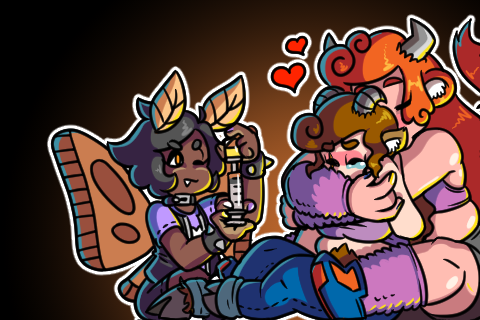
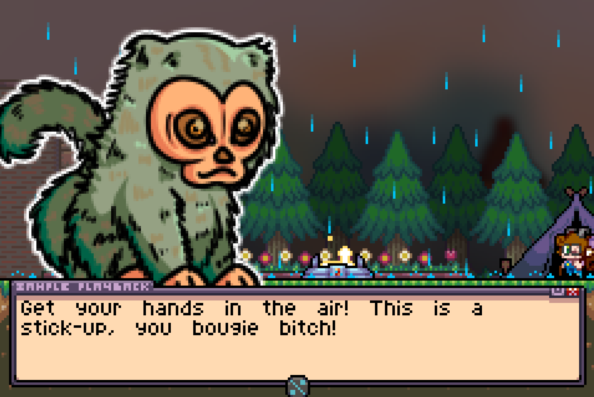

It feels slightly challenging talking about a game from someone you've worked with. Doric, creator of **[Dungeon Gals](https://store.steampowered.com/app/2864880/Dungeon_Gals/)**, was also the FM Synth wielding musician for **[Moonlight Duelists](/moonlight-duelists)**. She did an incredible job for me, which might make me a *bit biased*, but I would argue if she can make incredible things for *me*, she can surely make incredible things out of the feelings in her heart for herself.

[splitbox side="right"]

<small>Wendy Harrison *(she/her)*</small>

<small>Rosa Chambers *(it/its)*</small>

<small>Isabelle Alasdair *(she/her)*</small>

++++

Dungeon Gals is a Polycule Puzzler Platformer, of the intensely sapphic and queer variety. A bunch of comparisons get made to **Lost Vikings** and while I'm sure the *'control three different characters with different abilities to solve puzzles'* aspect had some influence, Dungeon Gals lacks the same asynchronous gameplay. You control one *Gal* at a time, with a higher emphasis on platforming. As you can only change gals at certain locations, puzzles emerge both from exploration, figuring out the *order of operations*, and scattering of **La-Mulana**-esque riddles.

But more important than any of that, Dungeon Gals is *really fucking gay*.

Queer furry values and identities ooze from every surface of this game. The three gals, *Wendy, Izzy, and Rosa*, are a lesbian polycule of adventurous *problem solvers* and *monster exterminators*, hired on the cheap to help solve a town's local monster problem. Also they can't stop kissing each other.

Sure, Wendy is a one eyed Goat girl who can use an amulet to *fires magic* and *operate magical devices*, but more importantly she's trans. Not *oh that's a nice footnote* levels of trans, but *you have cutscenes about her forgetting her HRT injections* that also serve as mechanical foreshadowing. None of this feels forced. Doric *fucking knows ball*. Rosa, the *it/its* pronoun, [tool tip="If you're like 'how can you be non-binary, non she/her character be a gal still???' like that's fair, but I hate to tell you that it's a skill issue"]non-binary[/tool], sword wielding Moth girl runs into its ex-girlfriend, a doll, who speaks with all the object/neutral language you would expect from a doll and who you would assume had some influence on Rosa's identity. Isabelle, or *Izzy*, a giant cow girl, [tool tip="I mean for once this possible cis character's identity isn't explicitly stated, unlike everyone else"]*might*[/tool] be cis, but her experience with womanhood is influenced by her large body that doesn't neatly intersect with societal gender expectations. Izzy doesn't let that stop her. These are all characters who have had to think about and tackle their own identities and it shows in their mannerisms, behaviors, and appearance.
[/splitbox]

Dungeon Gals isn't particularly hard, but it's easy to read that and assume that means the puzzles are *weak*. Instead, like a well made Kids show, it focuses on a *target* difficulty level and executes around that as excellently as possible. I can be awfully snoody about level design, but Doric gets it, making spaces that are fit for living and also gameplay. The puzzles, while not generally brain twisting, are satisfying to solve and then execute. There is almost *comfort food* aspect to the whole experience. The writing, and the music, and the gameplay all coming together in a way that is fun, and brisk, and memorable. The hardest puzzles are often the *reading comprehension* ones, that require you to pay attention to books and the environment. They seem to take from La-Mulana and you get the sense that if Doric wanted to she could decide to make a game for only *Puzzle Demons*. Instead, she made something charming and approachable.

[center]
 <small>I wasn't kidding about HRT shots</small>
[/center]

It feels like apologetics when I temper the expectations of my puzzle-freak friends on the game's puzzle aspect. *"Oh this isn't some CRAZY puzzle game, but it's still good! and it's so gay! I'm not just saying that because my friend made it!"*

Because I'm not. Dungeon Gals is a very holistic game and the careful balance of all its elements are important to the experience. It's not just one of it's component parts, it's all of them. You can't just ignore the gay stuff for the puzzles and no matter [tool tip="I know how you gay bitches are!"]how gay you are[/tool], *you still have to read a book sometimes*.

[splitbox side="left"]

++++
 

- One thing I can't get over is how *dense* the game is. The game isn't that long *(though it's still about 10 hours)*, but the amount of art and one-off graphics, or little bits of text are wonderful
  - I LOVE WASTE. Waste is how you show love! Screw being efficient, draw portraits of every random NPC BECAUSE YOU LOVE THEM!!
- The reward for so much is just *more writing*. You find little one use campsites you can use to heal up once, but the *real* reason you use them is because you get a cutscene.
  - You get to see the polycule pile in action. You see the girls joke with each other, you hear hormone talk, you hear them talk about their insecurities.
  - It's so genuine and sweet and I didn't realize you could 'save' them for when you need them because they let you heal. Because why would I wait? I wanna see my girls be cute with each other!
  - Some of the conversations are genuinely very heavy. This is a queer game, by a queer creator. While this is a very *warm* and caring game, trauma is an almost inescapable part of the queer experience.
- Clearing a level is just an excuse to run through the town and talk to everyone again. From what I saw, basically *every* villager gets new dialog after each temple is cleared. There is 'talk to everyone to find out what to do next' stuff going on, it's pretty much exclusively for the pleasure of doing so.
  - Some of it is just funny. Doric knows how to be serious, how to be mushy and loving, and how to drop all pretenses to drop a hilarious, tone breaking line by a criminal monkey or horrible worm man.

[/splitbox]

The art, music and writing are all just excellent and in tune with each other. As Doric basically *did everything*, there is a natural harmony that arises between all the elements. There is just a natural care about the world and the characters in it that can only come from someone who loves all of it. As for the more gameplay oriented things...

- Each of the girls feels great and unique. They all have abilities that feel a little bit like cheating and they usually have some weird movement tech you can exploit.
  - Generally just some good, satisfying platforming!
  - You generally don't have to, but each stage has bonus collectibles you can find that are completely optional. This is where all the toughest puzzles are. You can get through the whole game pretty easily, but sometimes to get *everything* you either have to really pay attention to the layout of the stage, or you *gotta read*.
  - The rewards for these? Reading item descriptions in a museum, you guessed it! ... And extra health, sometimes.
- The bosses are pretty fun but the food system in the game basically trivializes combat if you don't want to engage with it. Healing is so cheap you'd have to go out of your way to go broke.
  - Some people might complain about that, but it's FINE this is again, at least in my mind, a very 'comfort food' game. There are some things where you HAVE to engage, but you don't have to *stress* about it.
  - The game rewards you with story content for finishing with lots of money so there is at least some incentive to not just spend everything.
- I also learned through this game that moths are pollinators.
  - *... You get **pollinated**.* 😳
  - Honestly there are a lot of weird mechanics like that which only show up a little bit or for a one time puzzle
  - Mechanical waste is just as cool as artistic waste. 😌

This is a homecooked meal of a game, made with good ingredients, with a recipe that has been refined over years of trial and error. I think that's the thing that ultimately strikes me most. This game is *loved*, and that love is the ingredient that makes a bunch of great elements more than just great. This honestly isn't a game for everyone. This isn't a game for the *gameplay purists*, even though everything feels mechanically sound. But if you love 16-bit platformers and go *"Hell yeah!"* when I say the game talks about progesterone, like... I don't know how you could have anything but an extremely nice, touching time with this game? If you're looking at it like "Oh I might like this", I can basically almost assure you that you *will* like it, because working within it goals and scope, I'm not sure how it could be any better?

[center]

[/center]