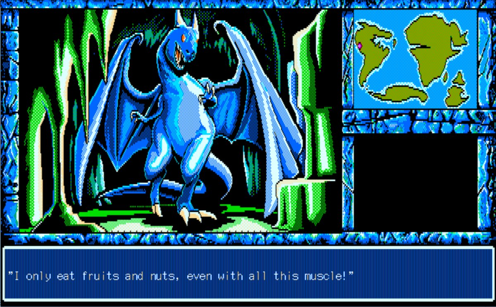

[splitbox side="right"]

++++

 
**E.V.O: Search for Eden** (Known in Japan as _46 Okunen Monogatari: Harukanaru Eden e_) was a strange game. A lot of us have very fond memories of it, but it’s also kinda… bad. Just… shallow and really grindy. But by god was there some weird, quirky goodness to it. The game was charming in a way that made it easy (or… easier) to overcome its faults. I’d jokingly call it “One of my favorite games that isn’t actually any good”. But all the elements of Search for Eden came together to be greater than the sum of its parts. The Evolution (even though there wasn’t really any REAL decisions), the weird quirky writing, the strange alternative history aliens and bird men or whatever… the weird way it’d be sincerely sad or dark. It was one of those things where just… as an experience, it was really compelling. Even if grinding for EVO points was kinda boring…

For the last few years I’d been vaguely aware of  **46 Okunen Monogatari: THE Shinka Ron**, a PC98 game that was the predecessor to E.V.O: Search For Eden. But it was in Japanese and was a turned based RPG (which I have a hard time stomaching now) and was on a tricky to emulate platform. But as time went on, more and more weird screenshots would come out from it and I’d wonder “What is the deal with this game???”
[/splitbox]
Fortunately the fine folks at [https://46okumen.com/](https://46okumen.com/) made a beautiful translation.  Localized as **E.V.O: The Theory of Evolution**, the game is an expert translation that contains all the joy and weirdness of the SNES game. In fact, it’s… even more **Search for Eden** than **Search for Eden**. This is a strange game, taking the alternative history and weird tangents of Search for Eden to another level. it seems improbable to say, but I feel like we got the much more… normal game of the two.

[floatbox type="full"]

[/floatbox]

[splitbox side="left"]

++++

 
The RPG nature works to this game’s favor. The writing and weird scenarios was a strength of **Search for Eden**. The RPG combat is… basic. Basic to both be a flaw and s strength. It’s pretty brain dead but, with text speed set to 0, grinding and fighting become… brisk.  There aren’t really any boss fights either. There are no random encounters either. Enemies wander the world map and often disappear from areas after awhile. There isn’t a lot of friction to exploration and backtracking.  All experience gained can be spent immediately on either Attack, Endurance, Vitality or wisdom.

The incredible part of the design  is… it’s hard to do this wrong? In almost every game there seems to be ‘the suckers strategy’. “Oh never put points into wisdom!” or whatever. But everything is good, it’s just a matter of priority. Would the foes coming up be better with more strength or more health? Even wisdom which might be the least useful influences the power of your healing abilities which can be incredibly good. So while the game pushes you to be an all arounder, it allows you to influence yourself by which way you move on the evolution chart. When a stat is raised to its limit, you evolve and the limit goes up. So maybe you want to level up all your attributes, but you always max out attack, pushing you toward more damaging evolutions. Or more defensive or whatever. And they all seem viable. There are certainly better evolutions but the game is never so demanding that it matters. Instead it’s fine to mess around.  Infact if you evolve off the chart (see the evolution chart picture) you can get odd “bad” endings.

[/splitbox]
[splitbox side="right"]

++++

The story is surreal. The translated manual includes timelines talking about Interplanetary wars with the Devil, the death of “The Fifth Planet”, Martian coups by Anti Devil Factions… all this while The Earth is still developing oxygen. Oh, also The Devil is hot and does the anime noble lady laugh. Seriously. The second sun, Nemesis, messes with evolution, Lunarians found and sink Atlantas. You can skip mammals and evolve into POWERFUL LIZARD MEN until becoming a gnome. It’s a weird, brisk experience that only gets tedious when you aren’t sure what the game wants from you… which almost always involves ‘talking to an NPC’. “But I wanna push this boulder” yeah okay you gotta talk to the NPC that will give you the idea.

It’s a wild game that goes farther and deeper than anything in **Search for Eden**, overlapping with sci-fi and fantasy elements as if they were just… normal. It’s funny when it needs to be funny, sad when it needs to be sad, creative in ways you won’t expect and… oddly affecting, emotionally, even when you barely have spent time with the characters in the game. Is it a shallow gameplay experience? Yes. But I hate jRPGs and I loved the hell out of this game so if you’re tempted… try it. I feel like you’ll know pretty quicky if it’s a game you’d like. For me though, this is the exactly the type of charming, obscure game I live to find, even if it’s a genre I don’t really care for. Just be sure to set Text Speed to 0.
[/splitbox]
[floatbox type="full"]

[/floatbox]