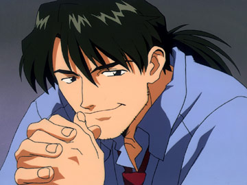
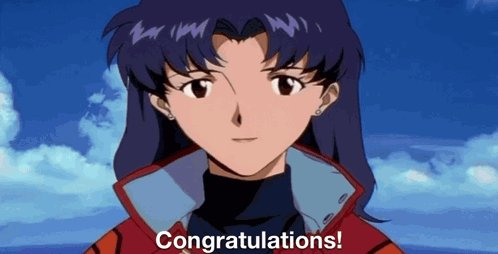
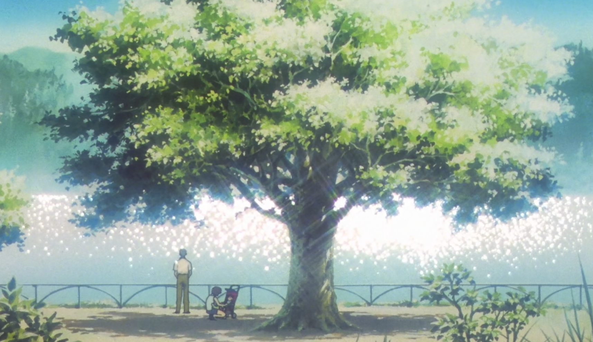

As far as media goes, I don't generally talk about anything other than games on here. I might drop the occasional [wrestling post](/believe-in-tam), but I usually keep those posts [hidden in the secret vault](https://kayinworks.neocities.org/wrestle/). I have a [letterboxd](https://letterboxd.com/kayinn/) and occasionally talk about shows and movies I watch over on [bluesky](https://bsky.app/profile/kayin.moe) but for my *blog*... I don't feel like I have the expertise to stray too far out of my lane. While I can claim a unique perspective for games, with other kinds of art I feel like I am talking over those who are [tool tip="See, I can talk about wrestling because the people who know more about wrestling than me know so much less about everything else in the god damned world that their opinions don't count for much"]more articulate and better informed[/tool]. 

So I'm not here to say anything new about **Neon Genesis Evangelion**. If you want to learn about it, you can just go dig through the incredible [evageeks wiki](https://wiki.evageeks.org/). In fact, I'm going to assume you already watched and know all about Eva. What I'm here for is to talk about *myself*, how Eva almost got me committed as a teen, two dead grandmothers, and the experience of forcing the show and its incredible movie on my poor Mother and Sister.

===

I was exposed to Evangelion about as early as you reasonably could in the US. While there were certainly *tape traders*, importing raw Japanese home recordings of original broadcasts, I began watching in the middle of ADV's official VHS release run. The ADV run was between 96' and 98'. This was relatively quick by the [tool tip="Dragon Ball Z was 7, and Sailor Moon? A brisk 3, at least!"]standards of North American anime at a time[/tool]. *Only* a two year delay! 

These were where $20-$40 tapes, containing only two episodes each. At best, each episode cost more than going to the movies. An entire series in the 90s would cost several hundred dollars to watch -- sometimes upwards of $500! I was about 13 when I started. Being about Shinji's age was very appropriate, but *in general*, I'd say 13 year olds tend *not* to have half a grand laying around.

Fortunately, I got my anime hookup from the strangest place. A Jehovah's Witness in my school, whose brother seemed to buy *literally everything*. I don't know if their parents knew what they were watching or if they just assumed it was all just *cartoons*, but I watched anything they were willing to lend me. I got exposed to massive amounts of [tool tip="shit like Shadow Skill and Iczer-One"]*really mediocre* anime at a young age. I watched *great stuff*. I watched stuff no one our age really should have had access to. He lent me a copy of god damned **Urotsukidoji** which I started watching in a van with my *grandma* in it. So uh... thanks for lending me all those tapes, Jerome.

Being of the target age for Eva, it's amazing how much of the series *vibe* I ignored. While things in the later half of the series clearly felt *wrong*, the first half isn't particularly cheery either. Young me was in it for the power fantasy. I could ignore all the depression, all the sense of isolation, and all the angst to focus on the robots, the humor, and the *sexualization*. I cringe now, remembering how excited 13 year old me was during the episode previews at the ran at end of each tape, where Misato would promise "even more *fan service!*" 

Like Shinji, I too was not ready to view the women in Evangelion outside the awkward lens of pubescent desire.

# Introjection

I'd get frustrated every time there was a tape that was "mostly talking episodes", or didn't have a *cool fight*. Given the other shows I was watching at the time, I had no reason to view anime as anything other than an *indulgence medium*. High octane wish-fulfillment, through hyper-violence, hyper-sex, hyper-action, and even sometimes hyper-comedy. Nothing had trained me to expect anything deeper. Anime for me at that point was mostly embodied by the works of *Yoshiaki Kawajiri*, with graphic works like **Demon City Shinjuku** and **Ninja Scroll**. [tool tip="For awhile I thought that was 'the anime style' before realizing 5 different things I liked were made by one dude"]"Before even knowing who he was[/tool], one of my 9 years old memories was seeing bits of the Kawajiri segment from **Neo Tokyo**, [The Running Man](https://archive.org/details/neo-tokyo-dub_202302) *(starts at 11:42)* on MTV's [tool tip="Also that episode of Aeon Flux where the girl gets her legs amputated while trying to cross a border didn't help either"]**Liquid Television**[/tool]. I had no idea what I was looking at *(I honestly was wondering if it was some F-Zero anime)* but some of the sequences from that are still burned into my brain. 

[center][/center]

This was consistent with the marketing push for anime at the time. While I had seen anime before hand, unknowing -- from **Voltron**, to **Sailor Moon**, to the repackaged **Macross**, which was converted into a strange chimera, marketed here as **Robotech** -- it wasn't labeled as *anime*. It was scrubbed of its original context in an attempt to make it indistinguishable from the shows around it.

I was initially exposed to the *concept* of anime from the *Sci-Fi Channel*'s **Saturday Morning Anime**, catching the very end of **Casshan: Robot Hunter**, featuring a fight scene that at the time seemed so visceral that I actually *called my friend* to try and get him to turn it on to. Imagine this, before cell phones.

*"Yes, Mrs. Fracassini, can I speak to your son please?? I have to make sure he sees the coolest and most violent robot fight ever!"*

The set of movies they played were virtually all from the OVA boom of the 80s, all clearly *for Adults*. The marketing pushes by companies like *Manga Entertainment* and *US Manga Corps* followed this trend. Mature, adult videos cut into high paced trailers, overlaid with songs like [KMFDM's Ultra blasting over them](https://www.youtube.com/watch?v=mT2FN6eEm84). Tastes were so dire at the time that they tried to push the barely coherent [**M.D Geist**](https://www.youtube.com/watch?v=7bTAPFWMKz8) as one of the *most high caliber animes ever to exist*. Any attempt to push anything subtle would be almost wasteful in an era where subtitles were rare, and English anime voice actors were still finding their feet. This didn't represent all the anime available over here at the time, but it represented the vanguard pushed forward by marketing.

I wasn't the target market for this. I wasn't old enough and didn't have the purchasing power. But what is more desirable than what's being sold to the cool kids you want to grow up to be? The new chemicals pumping into my young brain already made high energy sex and violence the most appealing things possible. Packaging it as *mature* made it the coolest thing ever.

But the confusion of puberty also brought confusion and anxiety. Even something as mundane as **Tenchi Muyo!** had a strong draw for me. A young boy, surrounded by beautiful women who *liked him*, who could in the right moments be a hero, was comforting. Puberty is the age of fear. The time in your life where you desire people the most, yet are the most afraid of others. The period where you want to grow into your new reality, but have no idea what you want to be. 

[center][/center]

# The Hedgehog's Dilemma

The part of my young heart that found Tenchi comforting was the exact part of me most primed to be hurt by Evangelion. It teased all the same dynamics, but in a more mature way. A young, relucent boy, surrounded by beautiful women, ready to be the center of attention, ready to become a hero. Of course it'd be bumpy at first, right? But as things progressed, the characters would get closer, and he would get stronger. *Shinji would become the hero*.

Of course, that didn't happen. Instead of growing, new wounds formed. Instead of healing, characters drifted farther apart. Every attempt to reconcile became another scar the characters would carry with them. The show's only two *vaguely* healthy relationships both end in death. Shinji would have short bursts of heroism, but that heroism would only give him farther to fall, hurting him and causing him to become small and weak once again.

The show teased me. It teased me with the fantasy and comfort my young mind desperately wanted. When it would give me the hyper-stimulus I desired, it would also punish me for it. The middle of Evangelion is a well known tone shift, to the fan named *"Descent Arc"*. It's not completely out of left field, but episodes 16 through 19 -- the battles with the angels Leliel, Bardiel, and Zeruel -- gave a young me all the action I could want at a price I desperately didn't want to pay.

[splitbox side="right"]

<small>*Leliel*</small>

<small>*Bardiel*</small>

<small>*Zeruel*</small>

++++

My favorite episode might be 16, *Splitting of the Breast*. The sheer abstractness of it, the claustrophobia and loneliness of it, the intense visuals at the end, where Unit-01 rips free of Leliel's shadow. Even at a young age I appreciated it, even though it was, in actuality, mostly one of those loathed *"talking episodes"*. The episode just winds itself up like a spring until it starts buckling in on itself, and all tension is suddenly released. In my older age I appreciate a lot of the introspection, but as a kid I think the appeal was the intensity mixed with the lack of guilt. Another tease, at what I hoped the show could be.

So naturally it was perfect for the next bit of action to be Shinji, trapped once again. This time by the edict of his father, being forced to watch Unit-01 crush his friend Toji. I feel like the show, at that point, was asking young me, [tool tip="I remember exactly where I was when I watched this episode. I was on a trip to my rich aunt's mansion(Married a very cool heart surgeon). I was in their basement, with a giant projector TV. I watched that episode, got traumatized, then logged onto AOL to eRP with a Misato roleplayer before accidentally almost burning the house down because I put some post cards on top of a lamp to try and dim it. A formative day"]*"Is this what you really want?"*[/tool]

The battle with Zeruel is tragedy after tragedy. While the big setpiece of a berserk Unit-01 devouring Zeruel is the standout moment, the scene I think a lot about is Rei, in a one-armed Unit-00, attempting to suicide bomb the angel with an N2 mine. There is a bleak hopeless to the whole affair, with the one ray of hope being Kaji basically telling Shinji *"If you do the right thing, if you take action, you can make a difference."*

While the episode ends with so many questions and possibilities, hinting at an awakened Unit-01 with no power limits... For the most part, with one tragic exception, Shinji and Unit-01 don't really get to do anything anymore. Three of the most intense sequences in the series, with seven more episodes left to ride in their wake. You are left to look at the emotional damage done to the characters and ask yourself *"Was this worth it?"*
[/splitbox]

There is this song that shows up frequently in the first half of the series. [Misato's Theme](https://www.youtube.com/watch?v=2y0ckB_2EaA), which would play in her apartment whenever *hijinks* happened. I find those scenes [tool tip="Killing the part of you that cringes is hard sometimes"]hard to watch now[/tool], but as a young teen they were some of my favorites. I needed the comfort and levity. At some point, in the depressive haze that chokes the show's final stretch, I realized I hadn't heard that track in a long time. I'm not sure exactly what the last episode with it is, but at that point, even after all that action young me deeply craved... I felt a hole in me where that piece of music used to go. The awkward silence in Misato's apartment represented the damaged relationships between each of the characters that lived in it. That silly song came to symbolize a loss of innocence to me.

The remaining three angels all serve to individually ruin each of the three children in turn. The fiery heart of Asuka quenched, the progress and humanity growing in Rei seemingly reset. Even the adults fare little better. Seeing Misato grieving, sobbing over her answering machine, locking herself in her room for days. Sure, she had important work she had to do, but she also surely, in that moment, needed to be alone. Even the stoic and calculated Ritsuko, perhaps the character [tool tip="It matches the show's use of duality, but it doesn't feel earned to be honest"]done dirtiest by the show[/tool], reduced to a husk by the same man who seduced and then discarded her mother. Only Kaworu seemed like he had it together, at least he could keep his head held high.

*Until he couldn't.*

[center][/center]

# The Ends of Evangelion

The final ADV VHS release was on VHS in July of 1998. I don't remember exactly when I got my hands on it, probably not until we returned to school that September, but that would have made me almost exactly 15 when the series finished. 15 is a perfect age to confidently know absolutely nothing. Trying to process the [tool tip="An aside: STOP TRYING TO SHOEHORN THE TV ENDING IN WITH END OF EVA. They do not thematically or tonally go together! You can TECHNICALLY do it, you can pretend the TV ending is some unseen part of the instrumentality sequence, but for WHAT? So everyone can say Congratulations before Shinji chokes Asuka on the beach? People don't want EoE to invalidate the beautiful TV ending, but forcing it into the EoE box does more damage to it then letting it stand alone as its own beautiful piece of art"]last two TV episodes[/tool] left me annoyed and frustrated. 

Part of that is fair, I think. There is a false narrative around them that claims *"People rejected this perfectly fine, happy ending and got rightfully punished for it"* and while these two episodes are beautiful, they made for a problematic ending to the series in isolation.

They feel like exactly what they are, a [tool tip="It's so funny that while being influenced by Ideon, Eva goes through the same ending troubles as Ideon"]compromise, to compensate for production issues[/tool]. To make matters worse, these production issues don't just apply to the final two episodes, but the four episodes prior. So much context and so many character motivations were left on the drawing board, not to be seen until the release of **Death and Rebirth** and the subsequent *Directors Cut* episodes that came out a few years later. Watching it at the time of release helped make the TV ending feel like a rug pull. While there is still beauty and thematic closure to it, young me was *not having it*.

Though even then, with all the frustration and disappointment, that is *actually* the last time you get to hear Misato's theme. I got what was missing once again, finally at the end. Even 15 year old me couldn't resist being moved by visions of all these characters I loved, living a happier life.

**End of Evangelion** was released a whole year prior to me finishing the series. I don't remember if I was aware of it before I watched the TV ending, but it didn't take long for it to be on my radar. Blurry screen-caps, found in magazines or downloaded off of AOL, of the Mass Production Eva's fighting Unit-02. But this was the time where it could take years for a theatrical release to come to home video, and even longer for foreign releases to get a translation. Frustrated with the last two episodes, I had no idea how long I would have to wait to finally get the ending of Evangelion I thought I wanted.

## Second Impact

It's the year 2000. It's been two years since I've watched anything Eva related. I'm almost 17. Almost, but not quite a young adult. More together as a human being, but still not *together*. Two years as a teenager might as well be an eternity, especially in the 90s. From the time I started watching Evangelion til this point, we had gone from the SNES to the PS2. We had gone from 56k, to cable internet. Online anime piracy was starting to get a foothold, but was mostly still limited to people in college, with University internet (*"T1 and T3" connections used to be all the rage*). The problem wasn't having the bandwidth to download things. New codecs *divx* were being released, that could finally strike a decent (for the time) balance between size and quality. The problem was finding stuff to begin with. **Kazaa** and its *Fastrack protocol* cousins were a year or so away still. You'd either need to be on the right news groups or use programs Direct Connect. DC often required a large stash of anime already shared to get you into the hot servers. The amount of Gigabytes of media you shared was used in the same way "ratio" is used now on torrent sites. Meaningfully using Direct Connect was a few years away from me. Back then, I was watching the blurriest, over-compressed episodes of *The Buu Saga* in *real media* format. Each episode was something like 30 megabytes, if you wanted to imagine how ugly it was. I was downloading these off an unprotected [tool tip="Formerly the gold standard for uploading and downloading files directly from a server. It still exists and is useful as the SFTP protocol, but... most people I know just use SCP these days if they have to do server file management"]*FTP* server[/tool] a friend told me about, who would usually hook me up with any other servers they found out about.

*"Hey, over on this server someone just uploaded a fansubbed version of End of Eva"*

Completely cold. No warning. At this point Eva was mostly out of my mind. Nothing made me think End of Eva would be available any time soon and if you asked me before this about Eva I would probably say that I was *fucking over it*. Yet right there, with the finale in front of me, I dropped everything. I had to get up early tomorrow to go to a christening, but I looked at the clock and figured *It's fine*. A few hours to download, then an hour or so to watch, and I'll still get a good 6 hours of sleep.

The file download was slow. 6 hours became 5, became 4. I go to open the video. Wait, what the hell is a [tool tip="Yes, for awhile they were actually .divx videos"]*divx file*[/tool]??? The format had been around for less than a year, and it was the first time I ever saw it. I hunt around for a video player that can open it. The video is unwatchably stuttery. 3 hours. I spend another hour and a half hunting different programs and players, until I found one optimized enough to play the video on what was likely a 300mhz pentium II my [tool tip="The same one I called to watch Casshan!"]friend gave me.[/tool]

If I knew what a hassle this was all going to be, I would have waited til I got home the next day... but in my stubbornness, I kept pushing. By the time all was said and done I could either sleep for an hour or two, or I could watch the god damned movie. As a teenager who thought themselves above the concept of sleep, I watched the god damned movie.

It's hard to avoid seeming overdramatic about this, talking about End of Eva in 2026. There is so much stuff online now. Amazing, abstract stories, for all ages. So many pieces of media to train you how to *process art*. As a child of the 80s and 90s, I had nothing. The most horrifying, strange movie I ever saw at that age might have been **Pee-wee's Big Adventure**. I'm not going to say it was impossible to be a teenager in the early 2000s with media literacy, but I will say *none of my friends had it*. All this, while reading an early, hard to parse fan sub. An already dramatic, *chuuni* 17 year old, watching this movie with no sleep, with no guidance, and not enough artistic experience.

Almost immediately, I see Asuka, naked, in the most exploitative, yet least sexy way possible. I felt guilty, but Shinji had less self control and dignity in that moment than I did. As Shinji stared at his cum splattered hand, I could feel nothing but shock and disgust. End of Eva is mean. Its violence is mean. Brutal, human-on-human cruelty. Misato and Asuka show their strength, only for me to have to watch each die, one after the another. Ritsuko, trying to regain her dignity, dies too, betrayed by the simulacrum of her own mother. Their deaths seem cruel. Everything feels cruel.

Finally Shinji gets into Unit-01. Finally he can step up and *fix things*. Yet his face is blank. He disassociates, until he finally sees what happened to Asuka. Then he screams. He felt exactly how I felt. Why should I have expected any different?

Like returning to that dark middle portion of the series, I got the action I wanted, but at a cost I didn't want to pay. From there it got worse. I couldn't at the time, piece together what or why things were going on, but I was destroyed by every surreal visual. Any time I thought I was getting bored by some abstract segment I wasn't ready for, some new absurd thing happened that I could barely process.

Then when finally it felt like their might be a final bit of reprieve, some final closure...

[center][/center]

## I Feel Sick

That original translation of the line was ambiguous and confusing. Being mostly familiar with the dub at the time, I wasn't even 100% sure who said it, let alone what to make of it. I was tired and overstimulated. In less than an hour, my fidgety, ADHD riddles ass would have to sit down in a church and *behave*, still processing what I just saw.

I felt sick. Almost nauseous. My chuuni nature was causing thoughts to spiral. Every time I walked somewhere I felt like I was out of place. No one told young me that all of Eva's Christian symbolism was simply stylistic. I was tripping out in the middle of this old church, thinking about crucified robots and giant disembodied heads, hoping no one noticed. It was all one big, weird blur to me. Yet despite this, as we were leaving, I remember thinking to myself  *"Ah... No one noticed. Dodged that bullet. I almost made a scene."

Over a decade later, I'm talking to my mother. I forget what even brought it up, but I tell her the story about watching End of Eva on no sleep, and how weirded out I was at the church. 

*"Luckily no one noticed."*

My mom nervously laughs. *"... Oh that's what happened? People were really worried about you. We thought you were having a psychotic break or were on drugs or something... I mean, I figured you were alright, but people were telling us we should do something..."*

Finding out, all those years later, that members of my family were saying they should take me to a mental health hospital, *all because of End of Eva* is, in retrospect, absolutely hilarious. Thankfully my mom pushed back and my dad put his foot down. *"How about we wait to see? If this is still a problem later, we'll deal with it then. Maybe they just didn't get any sleep."*

This might all seem like a crazy overreaction and... it is, both on the part of younger me and on the part of the adults that knew me. My mom swore up and down that I wouldn't have been on any drugs, only for people to call her naive. But she was right to, I was boring! I didn't even *try* weed until I was well into my 30s! Still, we were still in the shadow of the DARE era. Sensationalizing the supposed debauchery of teenagers was a core part of almost every news show. While part of me thinks some of them should have known better and given me a little grace, what they did instead graced me with an incredibly funny story.

... Still, it's unnerving. While I was fine, I do worry that if they *did* try to take me somewhere I might have *freaked the fuck out*. I'm a special-ed kid. I've been surrounded by kids who have been to those kinds of places and knew what they did to people back then. I could have, in my young foolishness, validated their worries *really fast*.

But it didn't happen, so instead I went home and passed out, ending my first full experience with Neon Genesis Evangelion. Over the years after that, my opinion of it, like many of my generation, would ebb and flow. "Oh it's great" "Oh it's all bullshit" "Eva fucking sucks" "Eh Eva is actually alright". We were all young, and it wasn't like we could hop on netflix for a quick re-watch. Most of us were just tossing increasingly old memories around in our head, with no one around to guide us.

# You Can (not) Rewatch

The years pass. The internet got faster, hard drives got bigger, and torrents started making downloading anime increasingly easy. Rewatching End of Eva almost becomes a meme, a mean thing you subject your friends to blind, yet the series itself took me longer for me to loop back to.

The big motivator for my first rewatch was The **Rebuild of Evangelion**. Rebuild itself further embraces the repetitive, looping pattern of the show. A repeat of the past, yet in a world that already bears the scars of the future. My initial read on the first two movies was positive. *"Oh, this is just a better version of the start of the series, basically speeding you to the good parts"*.

But your memories lie to you unless you go out of your way to renew them. Rewatching the original series showed how much soul had to be cut away to fit a movie format. I'm probably about 30, more than twice the age I was from when I started. Watching the show with adults who haven't seen it, who can watch it with mature, thoughtful eyes. It hit different. All those slow, still shots, though minutes "wasted" listening to cicadas, all that atmosphere just had to be abandoned by the Rebuild movies.

Not that I hated the Rebuild movies. They're fun. They're also Hideaki Anno giving his staff *work to do*. They also get better as they go on, diverging from the source material. The third movie was correct, *You cannot redo*. You just have to try something different. The Rebuild movies as a collection feel like they lack a cohesive vision or consistent purpose. [tool tip="To be fair, there are many fans who are just as invested in analyzing the Rebuild movies, who clearly see value in them and their themes. Still, I don't think one could reasonably argue that they are as cohesive as package as the actual series."]How could there be?[/tool] They were made, stop and go, over the course of 15 years, pausing whenever Anno didn't know what to do next. They are movies made by what might as well be four different people, in four different contexts. 

Still, we get a chance to learn about each of those four versions of Anno. The fourth movie, the best and most meaningful of the bunch, shows a healed man, who desperately wants you to touch grass. That alone makes them worthy of existence. 

[center][/center]

But their real value to me was making me re-evaluate the original series.

It wasn't until that rewatch that those cyclic, dualistic themes stood out to me. Clearly seeing how the characters mirror both their parents and their peers. One of the great gifts of the Rebuild movie was seeing young Gendo. Seeing how he was just like Shinji, drowning out the world in the same way with his walkman. You don't need that scene to understand who Gendo was, but seeing it makes it clear. Misato dies like her father, and in doing so, can finally understand him. Even Shinji and Asuka mirror each other, as different as they're designed to be. Asuka may come in with more fire and confidence, but in the end she is just as ground down. She doesn't *become* insecure, she always was. Another child, abandoned by a parent, used up until they are forced to run away.

Evangelion is always looping and folding in on itself. In its themes, in its discourse, and even in its later commercial releases. Every repetition is a chance to do things a little better, be it as a character or as a viewer. Even the nature of Evangelion itself, as a work, is a repetition of the works that came decades before it. *Hideaki Anno*, repeating ideas and themes he saw in *Ultraman*, or [tool tip="Even in the 90s, I was familiar with the name 'Kill Em All' Tomino"]*Space Runaway Ideon*[/tool]. Evangelion has an undeserved reputation for 'being the robot show about emotions', as if that was a new concept. It wasn't, but it hit at a point where that kind of thing was sorely under-represented. It found an opening to repeat the past, only for so many animes that came after it to repeat the same cycle due to its influence.

[center][/center]

The influence of Neon Genesis Evangelion is undeniable, as are the things that influenced it. As the years have gone on, I can see more clearly how it has warped my taste and influenced the things I want to create. I'm not a very *nostalgic* person. I've emotionally culled far more of the media of my youth than I've kept. Of all those piles of anime I watched, besides Eva, the stuff that has survived in my heart is like... [tool tip="And even then, it's mostly because Sailor Moon S, which I didn't see until MUCH later. Also Pretty Guardian Sailor Moon is better anyways"]Sailor Moon[/tool] and [tool tip="Which might be the one with the most nostalgia bias for me"]Macross[/tool]. Evangelion, for me, has consistently survived the knife I take to my heart to carve out space for the future. It has enough depth to [tool tip="We grow and change, from wanting Misato to wanting to be Misato"]change as we do[/tool].

# Anywhere Can Be Paradise as Long As I Have the Will to Live

I lost both of my grandmothers this year. My Grandma Carol, who lived with us, took a bad fall. Mixed with a number of other health issues, she soon ended up in hospice care, which we administered ourselves. We took care of her to the end, during a harrowing two weeks. Within the same month, my grandma Bobo (on my father's side), also passed. She had been deep in a mercifully pleasant haze of dementia for almost 10 years. Being somewhat expected, it was less harrowing, but she is no less missed. In fact, she had already been missed, long before she truly went.

It was a lot of mortality to come to grips with in such a short time. A lot of time was spent talking to my mom, who took the death of her mother as hard... as you would expect, really. There was some peace to it, though. Well before the end, her and her mother finally said things to each other that needed to be said for decades. From there, talks drifted to being about moments shared, movies watched together, and the songs we so closely associate with a passed loved one that hearing them immediately bring forth tears.

I don't get to share much with my family. My tastes tend to be too specific and too weird. Games? Right out. Blessedly, me and my sister Maggie have some overlap in shows and movies, but it's mostly me watching the things she recommends. I don't get to share the things from my heart, that I love. While it makes me sad, I don't really get upset about it. There isn't much to be gained by getting my family to sit through **Tetsuo: The Iron Man**.

Yet still there is the desire to share *something*. It's already hard to share my own work. My mom, of all people, was ready to play [**Moonlight Duelists**](/moonlight-duelists) until Grandma Carol died. When time comes for one of us to go, how much of myself will be shared with them? How will this incomplete shell I expose to them be remembered? How can I live on in their hearts if I am opaque?

My mother and I had joked for years about watching Evangelion because of the incident at the church, but never with any seriousness. If anything it was more said as a humorous threat. I had some slight consideration from my sister, she was at least vaguely intrigued about it being [tool tip="Unfortunately the One Hour Photo scene story is at this point considered apocryphal"] Robin William's favorite anime[/tool], but while she has a taste rich, weird taste for shows and movies, her anime taste doesn't go far past Studio Ghibli. 

While grieving, we talked about how loved ones still live in your heart, that the version of them you keep inside yourself keeps living. Eva was my first exposure to this idea and mortality was thick in the air. Should I let large parts of myself be left incomplete inside others because I lack the will to inconvenience them?

## As long the Earth, Sun, and Moon exist, Everything will be Alright

I didn't even really ask. I told them *"We're doing this"*, and they were good enough sports to just go along with it. My mom started optimistic and I wasn't initially too worried about her. A child is allowed to torture their parents with their interests a little, even when said child is in their 40s. Still, she was excited to learn about a series that seemed to hold a lot of cultural importance in Japan. In her mind, it was like she was going to see a foreign version of **Star Wars**.

My sister was the scarier one. She was the linchpin. When stuff gets done around here, it's because she's into it. But she was the most open minded, and really good at *hammering through* stuff fast.

The initial plan was for subtitles. I made it clear the dub was an option, but as a *subtitle snob* I definitely had a preference. I also heard mixed things about the Netflix dub, and the ADV dub has [tool tip="Which range from characterization, to editorial changes, to inconsistent quality and performances. There is a lot of nice things to say about it too, especially given when it was released, but it's still rough to go back to, if only for technical reasons"]*problems*[/tool]. My mom, having just watched the Italian drama **My Brilliant Friend** with my sister, was feeling pretty confident in being able to [tool tip="My sister would be fine either way. Her only issue with subtitles that she's a big cinematography enjoyer and finds it clutters up the screen."]handle subs.[/tool] 

The first session seemed to go well at first. Mom was paying attention, asking questions, following along. It seemed tough, but she was hanging in there and -- oh well okay 2 episodes in and she fell asleep. That's the challenge of starting at 9pm, I guess.

Second session and... passed out after 2 episodes, again. It's getting harder. Maggie seems interested, but for my mother it was becoming torture. The long shots, the slow pacing, the flat inflections. Without any experience to draw from, she asks if Japanese just sound like this. *"No, everyone is just really dry"*, I try to explain. She assumes then that she doesn't have enough experience with Japan to parse their emotional performances. *"No, that's intentional. Everyone is just emotionally stunted."*

We switch to the Netflix dub. The performances are even drier than the Japanese. Now she can listen while playing Bubble Witch. We slowly and painfully creep through the first half the series. She follows it. She tries to engage, but she's mostly being dragged, kicking and screaming. For Maggie, it goes better.

*"... Maybe this kid really is a little bitch,"* she says idly to herself. I laugh. She has no idea the history of what [tool tip="'Is Shinji a little bitch', the greatest thread in the history of anime, locked by a moderator after 12,239 pages of heated debate"]she's re-litigating[/tool]. As always, Eva repeats itself.

*"Mom, what was the last thing you remember before you fell asleep last week?"*

*"I don't know, whatever, like... something bad happened! SOMETHING BAD IS ALWAYS HAPPENING."*

My sister rolls her eyes. *"Please, bitch, you watched Breaking Bad."* At least someone is on my side. Until I compare a young her to Asuka. 

*"How could you say that??? I was nothing like her! Is that how you saw me?!"*

*"Yeah, she was basically like that,"* My mom mutters, [tool tip="My mom watched Everything Everywhere All at Once and was like 'Isn't that just how everyone feels?' She still denies having ADHD"]staring at her phone screen as she listens to the show while playing Bubble Witch.[/tool]

Like [tool tip="Especially problems involving my mom"]so many problems[/tool], the ultimate solution to all of this was *weed*. We started sending her out to smoke before each session. 2 episodes a week, turned into 6. She was still in deep over her head, suffocating herself out of love and obligation to her child, but she was *watching*. Just in time for the *deep end of Eva*, where everything suddenly turns dark.

Watching with my sister was fun. It was great to watch someone whose media literacy isn't fried on games and anime. While she wasn't always paying full attention, she still could pick up on stuff faster than most. The quiet, slowly paced brooding stuff and human trauma all seemed to appeal to her, but... not so much the robots. That was the hard part for her.

Like sure, we watched **Pacific Rim** together, but that wasn't for the Robots either. That was because *Charlie Hunnam* can *get it*. Turns out, according to her, Kaji can *get it* too. I was worried that his 90s womanizer persona would come off too abrasive, but the man is just charming. Sure, he's a man of his time, but he's fundamentally good natured and principled.

[floatbox]
 
<small>(okay it's still kinda a mullet)</small>
[/floatbox]

*"Wait, that's the hair cut you wanted as a teen!"* my mom yells. A memory emerges, from decades ago, when thought she was protecting a teenage me from getting a mullet. Now she saw the inspiration. She could see the vision. She could see how the show imprinted on me in even small ways.

As the show gets darker, my sister got more invested, while my mom grows more distressed. The weed stops working as well, but things were moving fast and we were near the end. *"It's kinda messed up for Misato to assume Shinji is afraid of women,"* my sister opines, before Kaworu shows up and makes Shinji immediately be comfortable with male intimacy. My mother becomes increasingly baffled by the prominent use of classical music.

Then the TV ending... happened. My mother fell somewhere between completely baffled and *"that's... nice?"*. My sister wasn't having it. *"This is a little on the nose,"* she says, moments before everyone shows up clapping. Too cozy, too nice, no real resolution. 

*"I would have been pissed too,"* my sister said, in a moment of understanding between her and teenage me. Even with her more developed tastes, the feel-good ending simply felt unsatisfying.

## Congratulations
[floatbox]
 
[/floatbox]
The purpose of all of this was for End of Eva. To give context to what my mother was going to see. It wasn't going to help, but she needed to know she wasn't missing anything. She needed to know her confusion, like mine, was genuine.

My mother is practically family to a lot of my friends. A second mother to some. She has known some of my friends for *multiple decades*. When I told her I was inviting people to come watch, she wondered why. 

*"What, to watch me not understand what's going on?"*

Yes, that's exactly why. I messaged a friend who used to live with us, who hadn't been over in years, if he wanted to come by to watch End of Eva with my mom. The response was an immediate yes. Maggie was almost offended. [tool tip="Asuka behavior"]*"Oh they're coming for her, even though I'm the one who actually paid attention?"*[/tool].

In the end we had about a dozen people we needed to cram out on our little patio theatre. We loaded up as best we could, waiting for my mom to finally come in. This is typical. She often needs to be *wrangled*, or else she'll become distracted by one unfinished task or another. When finally she came in everyone, unprompted and unplanned, began to clap.

[center]
 
<small>She was too high to deal with this shit</small>
[/center]

My mother needed a Congratulations. Getting through 26 episodes of Evangelion somehow took us something like 2 and a half months. That might *sound* reasonable, but if it was me and my sister, it probably would have taken at most two weeks. Around 2 episodes a week was as much as she could process until the weed got factored in.

Yet seeing all these people come out to be with her as she watched End of Evangelion was a reminder of why she wanted to do this to begin this. Not even just to understand my Church story, but to understand why this show took hold on so many people. She could sit down, and try and see what held sway over the hearts of all my friends. I sat with her, dead center, like I was holding her hostage, making sure she watched every frame.

Then Shinji proceeds to jerk off to the sight of Asuka's comatose body. *3 minutes and 30 seconds* in, and Shinji has already debased himself almost irreparably. A minute and a half of which was simply sponsor credits. My friend April, sitting next to the speakers, squirmed. *"... I'm not comfortable with how good the sound system is out here,"* she says, as Shinji's ragged pants filled the room. It's weird to be like *I can't wait to watch the movie where the protagonist jerks off into his hand within the first 3 minutes with my Mom*, but the dawning horror and gasp of disgust was as funny as I could have hoped.

The complete bleak tone seemed to grab my sister. Even the violence, which itself doesn't appeal to her, stood out in it's intentionality. Like a younger me, she seemed taken back by how *mean* it all was.

[center] <small>A famous and bleak set of shots from *The Ideon: Be Invoked*, a clear inspiration for some parts of Eva, which also portrays violence as a harrowing tragedy</small>[/center]

Atop that, the movie is just gorgeous. While the series is beautiful in its minimalism, the movie gets to be cinema. Even for me, who has seen this movie a dozen times, seeing it on a nice big projector with immersive sound was a wonderful experience that I'm glad I insisted on.

At some point, while we're in Shinji's mind, my sister wonders outloud *"Wait is this some incel shit?"*

And yes, it is. But once Asuka begins berating Shinji for being like this, she realizes the movie is bringing that entitled incel shit *to task*.

*"I know all about your little jerk off fantasies..."* Asuka says, while my mom gasps. *"I thought he did it on accident!"* she cries, as if Shinji exploded in his hand at the mere sight of Asuka's boob. Everyone breaks out laughing. Mothers are often too kind to young boys... 

As the cast of the show begins exploding into tang, my mom vaguely recognizes a song that played on Thanksgiving one year. My friend Alex (the one who lived with us), had hijacked the bluetooth speakers to secretly play *Komm, süsser Tod* to my extended family. She had no idea then why we were laughing at what seemed like an innocent pop song. 

When finally we get to the end with Shinji sobbing pathetically over a disassociating Asuka, my sister quietly muttered to herself. *"Call him a little bitch..!"*

*"Disgusting..."*

Maggie visibly fist pumped. She had gotten the dark, depressing, confusing ending the series promised. My mom for her part *understood*, saying that *yeah*, she would have been fucked up too.

At this point, my mom was toast but my sister spent the next two hours in the kitchen just talking with everyone about characters and themes as we ate the [tool tip="Thank you, Niko!"]home made snacks[/tool] my friends brought.

As frustrating as getting through the series was, the movie night went better than I could have expected, making everything that led up to it worth the struggle.

I feel like End of Eva brought the series together for my sister. It's not going to be one of her new favorite things, but I at least think she gets why it's cool. She's been having fun bring it up to the people in her life who are fans of anime, just to see their reaction. Now [tool tip="I'm sorry Stevie, the most interesting thing about AoT is it's own self admitted narrative fumbles. Isayama's failings becoming almost a part of the story's meta-narrative is an interesting lens to look at the series with, but I don't think Maggie is gonna fuck with a story that fumbles its proto-antagonist so bad it has to rewrite the ending three times`"]my cousin is trying to get her to watch **Attack on Titan**[/tool], a plan which has no hope and will never succeed. Part of me wants her to read something like **Oyasumi Punpun**, or maybe even [tool tip="Girls love Berserk. Purer than anyone else! The hard part is convincing them that it's something they might like"]**Berserk**[/tool] that would be more aligned with her tastes. Frankly I'm already struggling, trying to get *anyone* in family family to watch [**Revolutionary Girl Utena**](https://www.youtube.com/watch?v=6TQFlVcPyUA&list=PLrrh84y760v-hDEulas0Tp_wiQy0FcjLl). *So many of y'all are bi, just watch the god damned gender anime already!!*

Still, nothing else could hold the sway over me that Evangelion had, so if I was to selfishly subject a piece of art on my family, I was glad I manged to make it this.

[center]
 <small>Got her...</small>
[/center]

# Take Care of Yourself

It's hard to decide how to end a piece like this. While watching End of Eva with my family felt like a conclusion, it too was just the continuation of an ongoing relationship. As I started writing this, my former [tool tip="Stop lets playing I Wanna be the Guy"]nemesis[/tool] turned friend and **Street Fighter 6** buddy, [Slowbeef](https://bsky.app/profile/effinslowbeef.com) began posting [videos about his experience watching Evangelion](https://www.youtube.com/watch?v=FgjnCFvuLU8&list=PLEkJOww_Lz6w&index=28) for the first time. Beef was going in, shockingly unspoiled and in a situation much like the one my sister was put in. A niece, trying to get her father to watch an anime that was deeply important to her. Slowbeef planned to watch it with his brother, but when his brother pulled out he began watching it on his own.

Watching Slowbeef go from *"I feel like I'm not going to like this show"*, to pulling [tool tip="If you don't watch anything else, his final End of Eva video is worth it just ot hear him talk about what happens to Gendo"]intense personal meaning[/tool] out of it by the end was beautiful to watch. Every day around 9 or 10am I would refresh youtube, waiting for his next video to pop up, where dozens of us would be in the comments, wanting to talk about things while also trying desperately not to ruin his pure experience. We'd talk amongst ourselves deep in comment chains, hoping he didn't dig too deeply into spoiler talk. All of us were so excited to both share something with love with someone else, as well as finding others to talk to. At the end, I finally asked him if I could tell him one important detail he missed.

"*THE EVAS ARE LITERALLY MOMS*"

*"**Oh**. That does seem obvious now that you say it"*

Now he's already looking for an excuse to rewatch Evangelion. Even as I think my relationship with Eva is about to end, something new pops up, sooner than I could have possibly expected. Hearing Slowbeef's interpretations on various scenes deepened my love for it. Those interpretations aren't *strictly* in line with the currently agreed on *canon interpretation*, but who cares? Art is between the creator and the viewer. It brings more to the table than any [tool tip="... Even though I love those super analytical forum posts"]super analytical forum post[/tool].

I decry nostalgia a lot, but that doesn't mean I'm not affected by things from my youth. This show hit me at my most impressionable. It has influenced my tastes, both in what I consume and make. I can't be nostalgic for something that's never left me. How can it when it rewired my young brain so much? It still lives there, rewiring me still, year after year. I have plenty of memories from before Evangelion, but almost no memories that still feel like *me*. It's been with me ever since I've had an old enough mind to not feel like a child. It is, without reservation, my favorite Anime, my favorite show, my favorite piece of non-videogame media, period. I wouldn't have been so sure of this even ten years ago and It might be another ten years before I watch Eva again. But it will happen. 

Someone will pop into my life, or a relative will hit the right age, or maybe something else will trigger. At some point, a different, older me will rewatch the same show an derive new meaning. If art is the intersection between creator and viewer, as long as I continue to grow, the art I love can grow with me.

[center]

[/center]