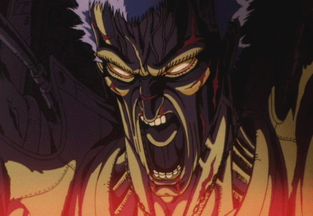

As far as media goes, I don't generally talk about anything other than games on here. I might drop the occasional [wrestling post](/believe-in-tam), but I usually keep those posts [hidden in the secret vault](https://kayinworks.neocities.org/wrestle/). I have a [letterboxd](https://letterboxd.com/kayinn/) and occasionally talk about shows and movies I watch over on [bluesky](https://bsky.app/profile/kayin.moe) but for my *blog*... I don't feel like I have the expertise to stray too far out of my lane. While I have a unique view and perspective for games, for other stuff I feel like I am talking over those who are [tool tip="See, I can talk about wrestling because the people who know more about wrestling than me know so much less about everything else in the god damned world that their opinions don't count for much"]more articulate and better informed[/tool]. 

so I'm not here to say anything new about **Neon Genesis Evangelion**. If you want to learn about it, just go dig through the incredible [evageeks wiki](https://wiki.evageeks.org/). In fact, I'm going to assume you already know about Eva. What I'm here for is to talk about myself, how Eva almost got teenage me committed, two dead grandmothers, and the experience of forcing the show and its incredible movie on my poor Mother and Sister.

===

I was exposed to Evangelion about as early as you possibly could in the US. While there were certainly *tape traders*, importing raw japanese home recordings of the original broadcast, I began watching in the middle of ADV's official VHS release run. The ADV run was between 96' and 98'. This was incredibly timely by the [tool tip="Dragon Ball Z was 7, and Sailor Moon? A brisk 3, at least!"]standards of North American anime at a time[/tool]. *Only* a two year delay! 

These were where $20-$40 tapes, with only two episodes each. At best, each episode cost more than going to the movies. An entire anime in the 90s would cost several hundred dollars to watch -- sometimes closer to half a grand! I was about 13 when I started. Being about Shinji's age was very appropriate, but *in general*, I'd say 13 year olds tend *not* to have half a grand laying around.

Fortunately, I got my anime hookup from the strangest place. A Jehova's Witness in my school, whose brother seemed to buy *literally everything*. I don't know if their parents knew what they were watching or if they just assumed it was all just *cartoons*, but I watched anything they were willing to lend me. I got exposed to massive amounts of [tool tip="shit like Shadow Skill and Iczer-One"]*really mediocre* anime at a young age. I watched *great stuff*. I watched stuff no one our age really should have had. He lent me a copy of god damned **Urotsukidoji** which I started watching in a van with my *grandma* in it. So uh... thanks for lending me all those tapes, Jerome.

Being of the target age for Eva, it's amazing how much of the series *vibe* I ignored. While things in the later half of the series clearly felt *wrong*, the first half isn't particularly cheery either. I could ignore all the depression, all the sense of isolation, and all the angst to focus on the robots, the humor, and *fan service*. I cringe now, remembering how excited I was during the episode preview at the end of each tape, where Misato would promise "even more fan service!" 

Like Shinji, I too was not ready to view the women in Evangelion outide the awkward lens of pubescent desire.

# Puberty processed through Anime and Evangelion

I'd get frustrated every time there was a tape that was "mostly talking episodes", or didn't have a cool fight. Given the other stuff I was watching at the time, I had no reason to view anime as anything other than an *indulgence medium*. High octane wish-fufillment, through hyper-violence, hyper-sex, hyper-action, and even sometimes hyper-comedy. Nothing had trained me to expect anything deeper. Anime for me at that point was mostly embodied by the works of *Yoshiaki Kawajiri*, with graphic works like **Demon City Shinjuku** and **Ninja Scroll**. [tool tip="For awhile I thought that was 'the anime style' before realizing 5 different things I liked were made by one dude"]"Before even knowing who he was[/tool], one of my 9 years old memories was seeing bits of the Kawajiri's segment from **Neo Tokyo**, [The Running Man](https://archive.org/details/neo-tokyo-dub_202302) *(starts at 11:42)* on MTV's [tool tip="Also that episode of Aeon Flux where the girl gets her legs amputated while trying to cross a border didn't help either"]**Liquid Television**[/tool]. I had no idea what I was looking at *(I honestly was wondering if it was some F-Zero anime)* but some of the sequences from that are still burned into my brain. 

[center][/center]

This was consistent with the marketing push for anime at the time. While I had seen anime before hand, unknowing -- from **Voltron**, to **Sailor Moon**, to the repackaged **Macross**, which was converted into a strange chimera, marketed here as **Robotech** -- it wasn't labeled as *anime*. I was initially exposed to it from the *Sci-Fi Channel*'s **Saturday Morning Anime**, followed by the marketing pushes by companies like *Manga Entertainment* and *US Manga Corps*. Mature, adult videos cut into trainers, with songs like [KMFDM's Ultra blasting over them](https://www.youtube.com/watch?v=mT2FN6eEm84). Tastes were so dire at the time that they tried to push the barely coherent [**M.D Geist**](https://www.youtube.com/watch?v=7bTAPFWMKz8) as one of the *most high caliber animes ever to exist*. Any attempt to push anything subtle would be almost wasteful in an era where subtitles were rare, and english anime voice actors were still finding their feet. Not that other stuff didn't exist over here, but this was the vanguard.

Unfortunately my experience there is limited because I was very much *not* in the know. I was young, and fueled by new chemicals in my young brain that made high energy sex and violence the most appealing things possible. But those weren't the only desires. The confusion of puberty also brought confusion and anxiety. Even something as mundane as **Tenchi Muyo!** had a strong draw for me. A young boy, surrounded by beautiful women who liked him, who could in the right moments be a hero, was comfrting. Puberty is the age of fear. The time you desire people the most, yet are the most afraid of others. The period where you want to to grow into your new reality, but have no idea what you want to do. 

[center][/center]

# The Hedgehog's Dilemma

The part of my young heart that found Tenchi comforting was the exact part of me most primed to be hurt by Evangelion. It teased all the same dynamics, but in a more mature way. A young, reluctent boy, surrounded by beautiful women, ready to the center of attention, to become a hero. Of course it'd be bumpy at first, right? But as things progressed, the characters would get closer, and he would get stronger.

That of course didn't happen. While there was teases of healing, as things progressed, the characters drifted farther apart. Every attempt to recouncil became another wound the characters would carry with them. Both of the shows two vaguely health relationships both end in death. Shinji would have short bursts of heroism, but that heroism would only hurt him in the end, causing him to become small and weak once again.

The show teased me. It teased me with the fantasy and comfort my young mind desperately wanted. When it would give me the hyper-stimulus I desired, it would also punish me for it. The middle of Evangelion is a well known tone shift. It's not completely out of left field, but episodes 16 through 19 -- the battles with the angels Leliel, Bardiel, and Zeruel -- gave a young me all the action I could want and then punished me for it.

[splitbox side="right"]

<small>*Leliel*</small>

<small>*Bardiel*</small>

<small>*Zeruel*</small>

++++

My favorite episode might be 16, *Splitting of the Breast*. The sheer abstractness of it, the claustrophobia and loneliness of it, the intense visuals at the end of Eva Unit 01 ripping free from Leliel's shadow. Even at a young age I appreciated it, even though it was, in actuality, mostly a *"talking episode"*. The episode just winds itself up like a spring until it starts buckling in on itself. In my older age I appreciate a lot of the introspection, but as a Kid I think the appeal was the intensity mixed with the lack of guilt. "Oh wow, THIS is what this show could be!"

So perfect for the next bit of action to be Shinji, trapped once again, but this time by the edict of his father, being forced to watch Unit-1 crush his friend Toji. I feel like the show, at that point, was asking young me, *"Is this what you really want?"*

The battle with Zeruel is tragedy after tragedy. While the big setpiece of a berserk Unit-01 devouring Zeruel is the standout moment, the scene I think a lot about if Rei, in a one-armed Unit-00 attempting to suicide bomb the angel with an N2 mine. There is a bleak hopeless to the whole affair, with the one ray of hope being Kaji basically telling Shinji "If you do the right thing, if you take action, you can make a difference."

While the episode ends with so many questions and possibilities, hinting at an awakened Unit-01 without no power limits... For the most part, with one tragic exception, Shinji doesn't really get to take action ever again. Three of the most intense sequences in the series, with 7 more episodes to tell on the wreckage left in their wake. You are left to look at the emotional damage done to the characters and ask yourself *"Was this worth it?"*
[/splitbox]

There is this song that shows up frequently in the first half the series. [Misato's Theme](https://www.youtube.com/watch?v=2y0ckB_2EaA), which would play in her apartment as *hijinks* happened. I find those scenes [tool tip="Killing the part of you that cringes is hard sometimes"]hard to watch now[/tool], but as a young teen they were some of my favorites. Sometime in the depressive haze that chokes the shows final stretch I realized I hadn't heard that track in a long time. I'm not sure exactly what the last episode with it is, but at that point, even after all that action young me deeply craved... I felt a hole in me where that song used to go. The silence in Misato's apartment represented the damage that existed between each of the characters. That silly song came to symbolize a loss of innocence to me.

The remaining three angels all serve to individually ruin each of the three children in turn. The fiery heart of Asuka quenched, the progress and humanity growing in Rei seemingly reset. Even the adults fair little better. Seeing Misato grieving, sobbing over her answering machine, locking herself in her room for days. Sure, she had important work she had to do, but she also surely in that moment, need to be alone. Even the stoic and calcuated Ritsuko, perhaps the character [tool tip="It matches the show's use of duality, but it doesn't feel earned to be honest"]done dirtiest by the show[/tool], reduced to a husk by the same man who seduced and then discarded her mother. Only Kawaru seemed like he had it together, let he could keep his head held high.

*Until he couldn't.*

[center][/center]

# The Ends of Evangelion

The final ADV VHS release was on VHS in July of 1998. I don't remember exactly when I got my hands on it, probably not until we returned to school that September, but that would have made me almost exactly 15 when the series finished. 15 is a perfect age to confidently know absolutely nothing and trying to process the last to TV episodes left me annoyed and frustrated. Part of that I think is fair. The false narrative is "People rejected this perfectly fine, happy ending and got rightfully punished". These two episodes are beautiful, but make a poor ending to the series in isolation, being a bit too abrupt and too materially seperated from the main series. They feel like exactly what they are, a compromise, to compensate for production issues. To make matters worse, these production issues don't just apply to the final two episodes, but the four episodes prior. So much context and so many character motivations were left on the drawing board, not to be seen until the release of **Death and Rebirth** and the subsequent *Directors Cut* episodes that came out a few years later. This helped make the TV ending feel like a rug pull and while there is still beauty and thematic closure to it, young me was *not having it*.

Though even then, with all the frustration and disappoint, that is actually the last time you get to hear Misato's theme. I got the thing I missed again, finally at the end. Even 15 year old me couldn't resist being moved by visions of all these characters I loved having a happier life.

End of Evangelion was released a whole year prior to me finishing the series. I don't remember if I was aware of what I was getting into with the teleivison ending before I watched it, but it wasn't long before End of Eva was on my radar. Blurry screencaps, found in magazines or downloaded off of AOL, of the Mass Production Eva's fighting Unit-02. But this was the time where it could take years for a theaterical release to come to home video, and even longer for foreign releases to get a translation. Frustrated with the ending, I had no idea how long I would have to wait to finally get the ending of Evangelion I thought I wanted.

## May 21st 2000

It's been two year. I'm almost 17. Almost, but not quite a young adult. More together as a human being, but still not *togehter*. Two years as a teenager might as well be an eternity, especially in the 90s. From the time I started watching Evangelion till now, we had gone from the SNES to to the PS2. We had gone from 56k, to cable internet. Online anime piracy was starting to get a foothold, but was mostly still limited to people in college, with University internet (*"T1 and T3" connnections used to be all the rage*). The problem wasn't having the bandwidth to download things. New codecs *divx* were being released, that could finally strike a decent (for the time) balance between size and quality. The problem was finding stuff to begin with. **Kazaa** and its *Fastrack protocol* cousins were a year or so away still. You'd either need to be on the right news groups or use programs Direct Connect. DC often required a large stash of anime already shared to get you into the hot servers. The amount of Gigabytes of media you shared was used in the same way "ratio" is used now on torrent sites. Meaningfully using Direct Connect was a few years away from me. Back then, I was watching the blurriest, overcompressed episodes of *The Buu Saga* in *real media* format. Each episode was something like 30 megabytes, if you wanted to imagine how ugly it was. I was downloading these off an unprotected [tool tip="Formerly the gold standard for uploading and downloading files directly from a server. It still exists and is useful as the SFTP protocol, but... most people I know just use SCP these days if they have to do server file management"]*FTP* server[/tool] a friend told me about, who would usually hook me up with any servers they found.

*"Hey, over on this server someone just uploaded a fansubbed version of End of Eva"*

Completely cold. No warning. At this point Eva was mostly out of my mind. Nothing happened recently that made me expect it could happen and if you asked me before hand what I thought about Eva I would probably say that I was *fucking over it*. Yet right there, with the final in front of me, I dropped everything. I had to get up early tomorrow to go to a christening, but I looked at the clock and figured *I was fine*. A few hours to download, then an hour or so to watch it, and I'll still get about 6 hours.

The file download was slow. 6 hours became 5, became 4. I go to run the file. Wait, what the hell is a [tool tip="Yes, for awhile they were actually .divx videos"]*divx file*[/tool]??? The format had been around for less than a year, and it was the first time I ever saw it. I hunt around for a videoplayer that can play it. The video is unwatchably stuttery. 3 hours. I spend another hour and a half hunting different programs and players, finding one that can run things on what was likely a 300mhz pentium II my friend gave me.

If I knew what a hassle this was all going to be, I would have waited til I got home the next day... but in my stubborness, I kept pushing it. By the time all was said and done I could either sleep for an hour or two, or I could watch the god damned movie. As a teenager who thought themselves above the concept of sleep, I watched the god damned movie.

It's hard to avoid seemingly overdramatic talking about End of Eva in 2026. There is so much stuff online now. Amazing, abstract stories, for all ages. So many pieces of media to train you how to process things. For a child of the 80s and 90s, I had nothing. The most horrifying, strange movie I ever saw at that age might have been **Pee-wee's Big Adventure**. I'm not going to say it was impossible to be a teenager in the late 2000s with media literacy, but I will say *none of my friends had it*. All this, while reading early fan subs. An already dramatic, kinda chuuni 17 year old, watching this with no sleep, with no guidance and not enough artistic experience.

In less than two minutes, I see a character I was attracted to, naked, in the most exploitative, least sexy way. I felt guilty. After Shinji jerked off into his hand, I could feel nothing but shock and disgust. End of Eva is mean. It's violence is mean. Brutal, upsetting murder, human on human violence. Misato and Asuka show themselves to be true badasses, yet I have to watch each die, one after another. Ritsuko, trying to regain her dignity, dies, betrayed by the simulacrum of her own mother. Their deaths seam cruel. Everything feels cruel.

Finally Shinji gets into Unit-01. Finally he can step up, and fix things. Yet his face is blank, until he sees what happened to Asuka. Then he screams. He felt exactly how I felt. Why should I have expected any different?

Like returning to that dark middle portion of the series, I got the action I wanted, but at a cost I didn't want to pay. From there it got worse. I couldn't at the time, piece together what or why things were going on, but I was destroyed by every surreal visual. Any time I thought I was getting bored by some abstract segment I wasn't ready for, some new absurd thing happened that I could barely process.

Then when finally it felt might be a final bit of reprieve, some final closure...

[center][/center]

## I Feel Sick

That original translation of the line was so ambigious and confusing. Being mostly familar with the dub at the time, I wasn't even 100% sure who said it, let alone what to make of it. I was tired and overstimulated. In less than an hour my fidgety, ADHD riddles ass would have to sit down in a church and *behave*, while still trying to process what I just saw.

I felt sick. Almost nausious. My chuuni nature was causing thoughts to spiral. Every time I walked somewhere I felt like I was out of place. No one told young me that all of Eva's Christian symbolism was for-funsies, bullshit, so I was tripping out in the middle of this old church, hoping no one noticed. It was all a weird blur. Despite all that, I remember thinking to myself as I got in my family's van *"Ah... No one noticed. Dodged that bullet. I almost made a scene."

Over a decade later, I'm talking to my mom. I forget what even brought it up, but I mentioned End of Eva and tell the story of watching it, and how weirded out I was at the church. "Luckily no one noticed."

My mom nervously laughs. "... Oh that's what happened? People were really worried about you. We thought you were having a psychotic break or were on drugs or something... I mean, I figured you were alright, but people were telling us we should do something..."

Finding out, all those years later, that members of my family were saying they should take me to a mental health hospital, *all because of End of Eva* is, in retrospect, absolutely hilarious. Thankfully my mom pushed back and my dad put his foot down. *"If it's a problem later, we'll deal with it then. Maybe they just didn't get any sleep."*

This might all seem like an crazy overreaction and... it is, both on the part of younger me and on the part of the adults that knew me. My mom swore up and down that I wouldn't have been on any drugs, only for people to call her naive. But she was right to, I was boring! I didn't even *try* weed until I was well into my 30s! Still, we were still in the shadow of the DARE era. Sensationalizing the supposed debauchery of teenagers was all the rage back then. While part of me thinks some of them should have known better and given me a little grace, they *did* instead grace me with an incredible story.

... Still a little scary though. While I was fine, I do worry that if they tried to bring me somewhere, I might have freaked the fuck out. I'm a special-ed kid. I've been surrounded by people who have been to those kinds of places and knew what they did to peopel back then. I could have, in my young foolishness, validated their worries *really fast*.

Still, it didn't happen, so I went home and passed out, ending my first full experience with Neon Genesis Evangelion. Over the years after that, my opinion of it, like many of my generation, would ebb and flow. "Oh it's great" "Oh it's all bullshit" "Eva fucking sucks" "Eh Eva is actually alright". We were all young, and it wasn't like we could hop on netflix for a quick re-watch. Most of us were just tossing increasingly old memories around in our head, with no one around to guide us.

# You Can (not) Rewatch

The years past. Internet got faster, hard drives got bigger, torrents started making downloading series increasingly easy. Rewatching End of Eva almost becomes a meme, a mean thing you subject your friends to blind. In the 2010s I end up rewatching the series at least twice, with two different groups of people. I'm in my 30s now, more than twice the age I was from when I started. Watching the show with adults who haven't seen it, who can watch it with mature, thoughtful eyes. There are so many more resources, so much more written on Eva and its themes, and just... general analysis. Things like the [Classified Information](https://wiki.evageeks.org/Classified_Information_(Translation)) files got translated, which while not *at all* necessary, do show the show to have a plan, with a coherent plot. 

Every time I rewatched it, free from the context of *being a god damned stupid teenager*, the more I love it. At this point, I have no more patience for the people who reflexively yell out *"Eva sucks!"* It feels like a blind echo, reverbating forward in time from the early 2000s. Meritless words, repeated as a meme. Not that people can't like, or criticize Eva, but there is a tone that you see on the internet, from people in or pushing into their 40s, that screams "You haven't seriously though about this in like 25 years." You know they're not here to have a serious discussion.

Evangelion loops in upon itself. In it's themes, in its discourse, and even in its later commercial releases. Every repetition is a chance to do things a little better, be it as a character or as a viewer. Even the nature of Evangelion itself, as a work, is a repetition of the works that came decades before it. *Hideki Anno*, repeating ideas and themes he saw in *Ultraman*, or [tool tip="Even in the 90s, I was familar with the name 'Kill Em All' Tomino"]*Space Runaway Ideon*[/tool]. Evangelion has an undeserved reputation for 'being the robot show about emotions', as if that was a new concept. It wasn't, but it hit at a point where that kind of thing was sorely under-represented. It found an opening to repeat the past, only for so many animes that came after it to do the same due to its influence.

[center][/center]

The influence of Neon Genesis Evangelion is undeniable, as were the things that influenced it. As the years have gone on, I can see more clearly how it has warped my taste and influenced the things I want to create. I'm not a very *nostalgic* person. I've culled far more of the media of my youth than I've kept. Of all those piles of anime I watched, besides Eva, the stuff that has survived in my heart is like... [tool tip="And even then, it's mostly because Sailor Moon S, which I didn't see until MUCH later. Also Pretty Guardian Sailor Moon is better anyways"]Sailor Moon[/tool] and [tool="Which might be the one with the most nostaglia bias for me"]Macross[/tool]. Evangelion, for me, has consistently survived the knife I take to my heart to carve out space for the future. It has enough depth to [tool tip="We grow and change, from wanting Misato to wanting to be Misato"]change as we do[/tool].

One of the motivaters for my first rewatch was The Rebuild of Evangelion. Rebuild itself feeds into the looping themes of Evangelion. A repeat of the past, yet bearing all the scars across the world from the future. My initial read on the first two movies was positive. *"Oh, this is just a better version of the start of the series, which speeds you up to the good parts"*.

But your memories lie to you unless you go out of your way to renew them. Rewatching the original series and then rewatching the first two Rebuilds again showed how much soul was cut away to fit the format. I don't *hate* the Rebuild movies. They're fun. They're Hideaki Anno giving his staff *work*. They get better as they go on and diverge from the source material. The third movie was correct, *You cannot redo*. You just have to try something different. The Rebuild movies as a collection, feel like they lack a cohesive theme or plan. They don't come together well as complete works. But individually, each feels like a little thin-slice of what Anno was feeling a any give time. The fourth movie, the best and most meaningful of the bunch, shows a healed man, who deseperately wants you to touch grass. That alone makes them worthy of existing, but their real value for me was making me reconsider the opinions on the original series that I long took for granted.

[center][/center]

# SOME KIND OF TITLE

I lost both of my grandmothers this year. My Grandma Carol, who lived with us, took a bad fall. Mixed with a number of other health issues, she soon ended up in hospice care in our house. We took care of her to the end, during a harrowing two weeks. Within the same month, my grandma Bobo, on my father's side, also passed. She had been deep in a mercifully pleasent haze of dementia for almost 10 years. Being somewhat expected, it was less harrowing, but she is no less missed. In fact, she had already been missed for so many years leading up to it.

It was a lot of mortality to come to grips with in such a longshort time. A lot of time was spent talking to my mother, who took the loss of her mother Carol hardest of all. 

**Move rebuild part to the top of the chapter, note no download pressure on the rebuilds ot keep them in check