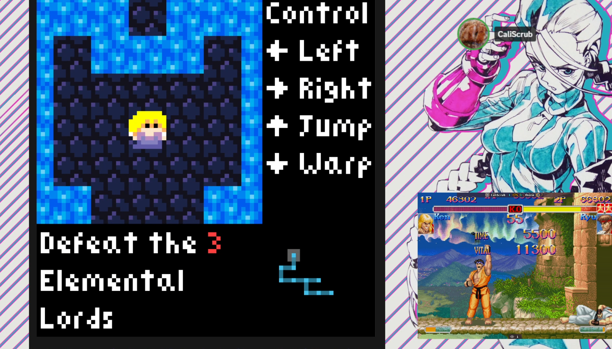

[Sylvie's](https://sylvie.itch.io/) games have become appointment playtime for me. Few games make me feel antsy to get to them these days. Fromsoft and Kojima games are some of the only games where I have at least *some* amount of [tool tip="if 'urgency' means 'I'll get to it in a year'"]urgency[/tool] to get to. Sylvie cuts in line. This isn't a fair comparison, as those other games cost *money*, and often more distressingly, *time*, but even all things being equal, I feel a drive to play her games on par with some of most exciting games I can think of.

I was so excited to see the release of [_**Funeral Song for the Elemental Lords**_](https://sylvie.itch.io/funeral-song-for-the-elemental-lords), that despite it coming out 6 minutes before our [Monday Super Turbo stream](https://www.twitch.tv/videos/2217202507), I was determined to play it. I rushed through me and CaliScrub's weekly [tool tip="okay it's like 2 FT5s with two different characters but like whatever, it's Ken and Ryu vs Gief"]FT10[/tool], going [tool tip="but it was close"]10-4[/tool] in the hopes of playing the game sooner. Once we were done, I shrank down ST into the corner of the screen and got to work.

===

[floatbox type="full"]

<small>*There is a proud tradition of disrespecting the sanctity of ST Night*</small>
[/floatbox]
## A Long Winded Setup and a Small Plea

With the possible exception of [Sylvie RPG](https://sylvie.itch.io/sylvie-rpg)*(it has an anime intro)*, it's usually hard to be sure when Sylvie is going to **go hard**. The experimental nature of something like [Sylvie Lime](https://sylvie.itch.io/sylvie-lime) may initially feel more like a [Sylvie Tower](https://sylvie.itch.io/her-little-sylvietower) or a [Puzzle Ecstasy](https://sylvie.itch.io/puzzle-ecstasy). All fine games, but operating at different scales and all proudly wearing the same kind of crude playfulness like a badge of honor.

If you reasonably assume that a game about *turning to a fucking lime* can only be whimsical, short little joke game, well... *Sylvie is going to make a fool out of you*.

Even knowing this, even knowing Sylvie has been working on this game for a while, even *knowing* she said the game was 4-7 hours... I loaded up [tool tip="I am going to keep using this full ass name"]*Funeral Song for the Elemental Lords*[/tool] and thought, for a moment, that maybe Sylvie was taking it easy after *Sylvie RPG*. A foolish, fleeting thought. Nebulous concepts like *"Polish"* and *"Game Feel"* more and more come off as stylistic choices in her work. She invoking older design patterns with complete love and sincerity, before dissecting, exploring, and re-imagining them. Sylvie cooks with offals, scraps most of us discard because they *seem* gross, because we lack the skill and imagination to make something delicious with them. She uses every part of the buffalo.

! *Before I talk about the game, I want to urge you, if Sylvie's games are at all interesting to you, to actually stop reading play it. I'm not usually a **spoilers!!!** person, and I'm not going to sit here and tell you that you'll ruin the experience for yourself. I think you'll enjoy yourself either way.    Instead I ask for more selfish reasons. I want your fresh impressions. This isn't a new Fromsoft game, or a Death Stranding or even a big Indie Game where there will be thousands of people with unique opinions no matter what I do or say. Every fresh mind taking in these games and forming their own independent conclusions is a gift.*

## Finally Talking about the Actual Game

You start the game by picking one of what seems like an excessive number of save slots. You arrive in the world defenseless, with just a flimsy little [tool tip="There are two types of Sylvie Jumps. 1-tile jumps and the most fucked up powerful jump you have ever seen"]1-tile high jump[/tool] to explore with. This type of jump is practically a **SylvieStaple**™️ at this point, but what stood out more was a lack of... anything. No real mechanics, no ways to interact with things. Just some simple, obnoxious enemies scattered around a map littered with generous checkpoints. If not for the catchy, [tool tip="Who would EVER steal music for their game???"]lifted **DJ MAX**[/tool] music, it would feel [tool tip="The music goes away at one point for dramatic reasons and GOD does the emptiness hit hard"]oddly empty[/tool]. Once you find an Elemental Lord, you are given a... rather simple boss fight. A little dude running and hopping periodically. Your only combat mechanic is holding a sword in front of you that always hits. There is a charm to the simplicity, but when taken as a whole there is a sense that things *are missing*, that something isn't right.

My first elemental lord was the Lord of Fire, and my reward for beating him was a rapid fire projectile so fast that it pushed you backward. The type of thing you use to do glitchy weird jumps. The type of thing that's **SylvieCore**™️! You find keys that you must transport around the map in complete darkness. You're completely blind, besides enemies, ladders and spikes. Doing anything in this state *seems* impossible, as if it was encouraging you to just go kill another elemental lord. The Lords are relatively close together and not terribly hard to find. 

You kill another. Same mechanic, same simplicity. This time it was the Elemental Lord of Wind. I got the power to do a [tool tip="I am Rashid of the Turbulent Wind!"]little double jump with a tornado[/tool]! Combining this and the fire, awkwardly contorting my hands to switch between horizontal and vertical movement abilities really made the game feel like it was coming together. But just one more Lord. Maybe after defeating him, there will be *even more* Lords in a different area? Maybe when I get all 3 powers I can finally do something with those keys? There has to be more, right?

You kill the 3rd Elemental Lord and don't even get a new ability. Instead, the Executioner awakens. A count down timer begins. The world is ending. Wait, why are their faeries? I race to the top of the world and escape.

Something doesn't feel right. Sylvie has died. You have completed the False Ending. This vessel couldn't bear anymore...

[floatbox type="full"]

[/floatbox]
[floatbox type="full"]
<small>*(this game has some of the text boxes of all time)*</small>
[/floatbox]

## Starting a New File and Aria

Technically you don't have to do this, your current save file leaves you with 1 Lord remaining, but I wanted to see what the 3rd ability was. I got it first. *Heart*. You could see faeries again, and they could act as little pseudo platforms. You also could rain hearts, which would transform enemies into harmless, ridable kittens. This was one of the weaker movement abilities [tool tip="It's extremely powerful in some places though"]*overall*[/tool] but in a way that forces you to approach the world differently. Each special ability contextualizes the space you're playing in. Getting around the whole world generally requires a second skill, combining the two in different ways to clear the same obstacles. Realizing that, I saw the pattern I was going to see play out for the rest of the game. I was going to explore this world with every combination of two abilities.

If figuring this out was too obtuse for you, one can enter the cave you begin the game by. There you see Aria, Sylvie's partner in game making, giant and chained. She plainly states that you don't need her help to clear the game, and you don't, but if you're lost or tired of combing the map for secrets, she'll give you hints and tell you where to look. She shows the ever increasing trend in Sylvie's games to be *obtuse* but approachable. She wants to give you the chance to explore to your hearts content, while giving you options when things get too tedious. She wants you to see her *secret worlds*.

This isn't any kind of new idea, but the *balance* and amount of detailed bits of advice Aria has is wonderful. She's just out of the way enough that you won't be overly tempted, but not so inconvenient that you'll avoid it if you're not enjoying yourself. Her advice helps you know where to go, but you still need to *do it*, and something about it coming from an NPC makes it feel more *okay* than asking for help in the comments of the *itch.io* page or going to a cheats menu.

Eventually you manage to brute force one of those keys into one of the locked doors on the edge of the map, exploring new areas. You find one of the elemental lords in a new spot... though this one doesn't fight back? It begs you to stop yourself. It begs you to have some control.

You press **CTRL** and put away your sword.

[floatbox type="full"]

[/floatbox]

## It is Easier to Destroy Yourself than to Care for Yourself

The True Elemental Lords, the protectors of Sylvie's Body, the protectors of *our* bodies, are in shambles. Run down, tired, neglected. Passion, Motivation, and Love, warped into false, maladapted idols. *Demons*. The surviving True Lord cries for relief. It asks to drink your blood. Improving yourself takes sacrifice.

It implores you to go destroy the demon version of itself. You return to the center of the map to fight it again, but this time, upon your sword making contact, the little hopping Lord transforms into something greater. The Wind Demon.

These bosses, designed by Aria, are simple, yet brutally difficult. The Wind Demon's form is merely a reaper, bobbing up and down along the screen, blowing leaves at you while you try and fight against the gale to hit it. The movement, wind, and chaos of the leaves leading into something with emergent depth.

You defeat it. The game corrupts. Your *file* is corrupt.

[floatbox type="full"]

[/floatbox]

You start a new game. You start with the power of the wind. The Lord is whole and with you again, always.

Your save files aren't so much save files but their own little play spaces in a larger save. I found myself switching between save files to try things or because I realized I could beat a boss quicker on this one, or complete something easier in another file. The Meta Progress carries over. All things are one small part of the whole and it's important to tend to different parts of yourself rather than to hyper-fixate on one.

The game opens up emotionally, similarly to *Sylvie Lime*, but in a way that's even more personal. Less of a *narrative* and more like *poetry*. I didn't expect this game to hit so hard, but Sylvie describes, in brutal simplicity, a lot of things many of us feel and live through, as we put off out well being. As eating bad, sleeping bad, and putting off responsibilities.

*These are problems for Future me.*

But *Funeral Song for the Elemental Lords* makes you clean up your kittens before bed. Literally. There is a sophisticated metaphor being crafted here, very open to interpretation. You take keys that plunge you into darkness, the thoughts that cause you to spiral you into misery and you force your way through until you unlock deeper understandings of yourself. You find the damaged parts of yourself in need of tender care. You realize what a husk you've been for so long and get slapped in the face by crushing reality. "Why *do* I feel so empty?"

It's time to rebuild.

I don't know 100% what to make of the *Executioner* without another play through. I personally interpreted the False Elemental Lords as maladaptive but I'm not sure that's supported in the text. I don't think understanding the intent 100% is necessary though, as the important thing is that you should love and care for yourself a little more because you know how bad, unmotivated, and loveless you feel when you don't. This is a game the makes you literally invincible because you got some sleep. Rewarded you because you kept track of and remembered your body.

## Closing Thoughts

I'm not going to go into the rest of the game. This doesn't need a blow by blow, but it's beautiful how all the possibilities begin blossoming as you get deeper into the game. I come to expect this from bigger Sylvie games, yet still always feel surprised. There is something to how Sylvie (or perhaps, Aria?) manage tone in these games. Keeping things light and fluffy allows the *blunt realness* to hit extra hard. This tone shift even reflects in gameplay on multiple occasions. Lifting the *DJ Max* music isn't just a funny little bit, it gives access to some *emotional bangers* that they were able to strategically employ.

I haven't even gotten into all the fun, extra whimsical stuff. Why I hate pigs. Anti-Fish. There is just so much in a game purposefully designed to feel like it's initially so little. Even getting the True Ending, there is stuff in the game that I haven't gotten, a Chest I haven't open, costumes I haven't found. What constitutes a costume anyways? Well, a witch eating your eyeball counts as a costume. A flower in your hair maybe? Is eating a fish a costume? Sylvie games contain many mysteries.

[center]
🠈 🠉 🠊 🠉 🠈 🠉 🠊 🠋 🠈 🠋 🠊 🠋 🠈
[/center]