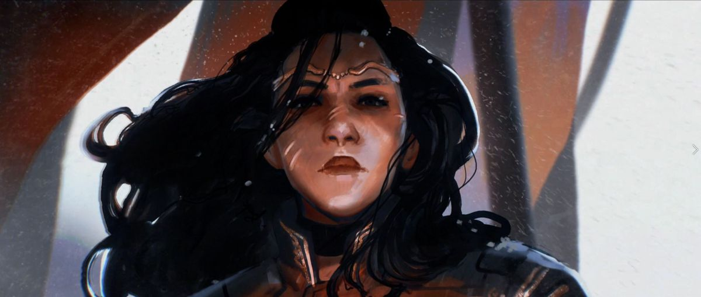

Before I get started, lemme say that I have a very deep and personal relation with Battletech. From Mechwarrior 2, to painting figures and playing the table-top, to running campaigns over Megamek. Battletech, and it’s awkward, chunky aesthetic and it’s weird neo feudalism will always deeply appeal to me.

I love Battletech and the 2018 Battletech PC game does a lot to remind me why I love it. It also kinda blows.

## Maybe Stylish is Good Enough
[splitbox]

++++

Battletech is a cool and stylish game. The great art, presenting Ken Burns style documentary cutscenes, mixed with a great soundtrack and overall just great presentation goes a long way. How space travel feels, how jumpships pop in and out of existance with a gently popping, eerily silent fireworks… so many things feel extremely right.

It’s also fun to see a story presenting in the earlier years of the Inner Spear. The Star League is gone, but the Clan’s aren’t hear yet and the Inner Sphere is still sliding into technological ruin. It’s also charming for a story to happen basically in the middle of nowhere, out in the Periphery.

I’m not going to get into the story. It’s not essential, but at the same time it was good enough for me to finish the Campaign. I liked the characters. I liked the tension. I loved how diverse the representation was (which also totally fits the setting). It was sufficient and then some, but without crossing the threshold into being interesting in its own right, but it helped elevate the whole package. I felt like I was taking a part in the Battletech universe, and that in and of itself is worth a lot. But even during my campaign playthrough, even while getting wrapped up in the Arano Restoration, I kept thinking… this game is kinda BS?
[/splitbox]
[splitbox side="left" top=110]

++++
## Battletech was Never Actually About the Gameplay
Lets be real. Tabletop Advanced Battletech has never particularly great game. Most tabletop war games aren’t. These games exist as whole hobbies. Minis, painting, lore, scenario re-enactment, PnP RPG add-ons for long term campaigns and enough balance to keep it reasonable. The games are not designed for competitive depth, they’re designed to be representative of a fiction in a fun way. By the standards of a lot of Table Top games, Battletech is actually pretty elegant!

But this put the developers of the 2018 Battletech game in a rough spot. How do you take Battletech and make it conducive to a long campaign with lasting consequences, but in a way that fits a modern tastes?

The rules end up like an impression of the classic table top rules and that is probably a good thing. Players like me who hadn’t played in years would have a hard time remembering what was actually different, while allowing them to tailor things for a digital experience. That said, there was only so much they could do without changing the feel of Battletech and some of the decisions they made were questionable.
[/splitbox]
Battletech has always made it hard to avoid damage. These are big armored tanks that take a lot of damage. Big clusters of missiles are going to slam into you, ignoring LOS and you’re gonna like it, because you’re gonna do it to the other person more! But it gets awkward when you’re trying to play an X-Commy style game of risk management and gets triple fucky when you get to the terrible missions the game has. Every mission has you send in 4 mechs to slug it out with 8-12 enemy mechs. It becomes a game of outcheesing the rather dumb AI, cutting down their firepower as fast as possible. What damage mitigation you do have is powerful (Bulwark gives huge damage reductions) but requires you to basically live in the trees. Mission are designed as if you’re not supposed to kill everyone, but clump enemies so close together and make your escape zone so out of the way that killing everything is usually the safe option.

It honestly feels very immersion breaking for me to just watch waves of mechs crash against me. These valuable, expensive machines that have operated for centuries, just throwing themselves away. In a game that should possibly closer to WW2 fighter pilot kill counts, you have slaughter, and with that slaughter, less changes to play safe. The game asks you to endure, but with no fun ways to endure. And if things go wrong? You can quit the mission at any time, cutting any tension but accepting your loses. It feels hollow. The asymmetry that makes a game like X-Com work is lost here. The only asymmetry is that the AI is dumb, but more numerous, but his equipment, in all its terror, is the same.

Some rule changes make this work. Maps, movement distances and ranges are shorter than in Table Top. This makes things more visibly manageable, but makes making use of terrain harder. Instead of trying to break LoS or use a hill to expose less of you, you’re standing on ‘cover squares’. Instead of scouting and attacking from a distance with long range units, you move in and brawl with your heaviest units. Missions never give you tonnage restrictions or BV value restrictions. You have no reason to take anything lighter than a heavy. Need a fast mobile scout? Use a Grasshopper. Especially in a game where getting hit and critted isn’t a question of if but when.

Repetitive missions with grindy objectives and little room for tactical maneuvering leads to a very dry, monotonous game that is either cruelly hard, or severely easy depending on how cheesy you’re being. I don’t think there is a single thing Battletech does better than any other game in this genre.

… Except for being Battletech.

## It’s Kinda Unfair How Cool Battletech is
I should hate this game. I don’t even like Turn Based Strategy games that much. But it’s Battletech and it’s a strong Battletech story, oozing Battletech vibes and I can stomp around in a Marauder, blowing heads off with AC/5s to maximize salvage. Cheesing enemies is fun enough to survive the campaign and it wasn’t until Career where I was finally like “you know what, fuck this game?”

But you know what, that took like 80 hours so you know what? This game is pretty cool I guess, even if I wish the gameplay had just a little bit more going for it.

Battletech as a franchise is just that cool I guess.
