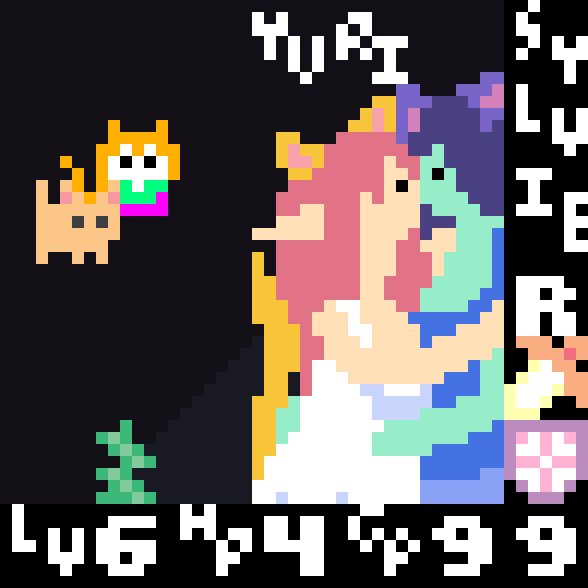

*I think I'm gonna save the "Game Journal" moniker for more informal posts where I don't have a real thesis and I'm not proof reeding like crazy. Me just trying to jot down my thoughts. You know, like a **journal**.*

!!! **Future me:** I failed and wrote too seriously. Next time will be different, [tool tip="It won't"]I swear.[/tool]

# Mega Man Legends

[splitbox side="right"]

No one needed to make any of this
++++    

Missed this during its era. It was a bit too... modestly successful for me, a kid who could only afford a handful of games. Also it's past Mega Man X, and why would you wanna play the dumb, dorky *blue* Mega Man when you could play as the cool, super hip X? IDK, kids are stupid. It'd been on my radar for years due to the art style, but [tool tip="Thanks, Big Iron!"]some conversations[/tool] during a Guilty Gear [stream](https://twitch.tv/kayinnasaki) made me dive into it this weekend.

This game has everything going against it. All the little *bits* are off. Controls are flakey, Dialog is painfully, gameplay is sporadically paced... Stuff like turning with the shoulders, dodgy aiming, pre-Ocarina of Time dungeons that feel more like Wizardy maps... and don't know, it fucking rules? The definition of a *6.5/10 10/10* game.
[/splitbox]

===

Kattelox Island feels like a *place*. It's small, but strikes a balance... You wish there was more, but the amount you get is *just right* to make you get *intimate* with every area. The ruins of the game interconnect with the world above and each other. *Oh it's a hole in the wall* and now you're in a sewer and now you're... in the city? Does this has ANY use? Not really. The world isn't connected in some *Metroidvania progression* way, it connected *like ruins*. They connect because *why wouldn't they?* The only thing that betrays this is the small scale of the dungeons. They're over right when you think think they're getting started. There isn't quite enough to find to sell the premise of being a *Digger*. You can feel the lack of scale while playing. Looking at [some maps](https://www.legends-station.com/?id=mml1-map-ruins&noprocess) of the ruin system really puts the size in perspective. I think that's reasonable given the scope of the game and its era, but it was still a thought that was constantly on my mind.

If the Underworld under delivers, then the Overworld over delivers. It's downright gloriously *wasteful* at times, filled with locations that never get used but exist purely for the joy of existing. Shops you will never be able to buy things in, filled with lovingly made pixel-art textures, filled with NPCs who never have anything important to say. Yet despite the painfully slow dialog windows, you talk to them anyways because there is a *joy* to exploring the city and being a part of the community. The limited nature of the dungeons work due to how the overword segments, like a stew, extend the few scraps of meat you have into a hardy, rich meal. The game's slow start established very early that walking about and socializing in the town is as much of the *real game* as exploring ruins. Buying a medical machine to fix an injured girl's legs is honestly more engaging than most of the game's bosses. Where I felt like I was always running out of dungeon to explore, I still feel like I only scratched the surface of the quests and sideplots that happen in the city. Apparently there is a whole MORALITY SYSTEM where you become DARK MEGA MAN if you DO CRIMES? And the only consequence is that people start shit-talking you? 

There is also a complicated and deep subweapon system you barely have to interact with and where it's easy to miss most of it. It's there, though and it gives you more things to sink time into if you choose to engage with it. For all this game's faults, it always seems willing to meet you at the exact amount of engagement you want to have.

I'm sad to hear the general consensus on Legends 2 is "It plays much better, but it loses the magic of Legends 1" because that is a trade I would never make. Please, make the game play even worse and give me *more* magic. Instead, you get the "more" Kattelox begged for, and somehow, for most, it ends up feeling like less. Maybe I'll have my own opinion of that at some point.

# Sylvie Lime and Sylvie RPG

So [Sylvie](https://sylvie.itch.io/) has been one of my [tool tip="Also Sylvie will probably end up reading this SO SYLVIE I HOPE MY DESCRIPTION OF YOUR WORK COMES OFF AS FAIR!!! AAAAAAAAAAAAAA"]favorite indie devs for awhile[/tool]. Her games almost feel like outsider art, only she's not an outsider to *games*, but the current zeitgeist and canon. In fact, she probably is more of an *insider* to games and the *older zeitgeist* than any of us. Who else would decide to learn Tower of Druaga in the 2020s?

She values the bits of games a lot of us are quick to discard as *jank* and makes whole games around them. It's easy to assume her work is unskilled and amateurish when you load one up and get hit with some weird, clunky platformer physics. **That's not how we make games now!** 

... But you give it some time and realize *oh god she knew exactly what she was doing*. All those clunky bits are now critical mechanics that the games start using in such brutally clever ways.

There is a *wit* to Sylvie's designs that I cannot overstate, but you have to go into her games with an open mind. *She knows how to fucking cook*.

[Sylvie Lime](https://sylvie.itch.io/sylvie-lime) and [Sylvie RPG](https://sylvie.itch.io/sylvie-rpg) stand out to me as her two "big" games and I realized I'd be doing a disservice to myself if I didn't put both games in my game journal.

### Sylvie Lime

Sylvie Lime is the definition of a game for sickos. A game that uses your keyboard, in *alphabetical order*, as a way to use special items. Not like you get Q W and E items, you get fucking *A B C*. Half the buttons turn you into a Lime. A *Sylvie Lime*. A powerful and dreadful ability... 

Items have bizarre behaviors, like houses you can throw infinite of, where the only way to remove one is to hit it with *another* house. This turns out to be a checkpoint system with hilarious amounts of versatility, allowing you to destroy houses to reverse through your list of possible checkpoints. Accessing the options requires finding a *locket*. You find the *god damned hammer from fucking Milon's Secret Castle*, who plays that game and goes "Yeah, I wanna do that!"?

[splitbox side="left"]

++++

Well, Sylvie does.

I don't want to get too far into spoilers, but the game becomes *about game design*, about characters who made the game, about the dialog on design decisions between them. You get to ask characters about items and hear the discourse that went into their design. This discourse wasn't *real*, but was perhaps arguments [tool tip="🔥🤘Fuck Coyote Time🤘🔥"]Sylvie had with herself[/tool]. This internal commentary gives a beautiful view into how Sylvie thinks about games. *Also it's gay*.
[/splitbox]

### Sylvie RPG

Somehow the game inspired by Tower of Druaga and Ys is the most approachable of Sylvie's work. A tribute to Bump Combat and Obtuse Secrets, Sylvie RPG is 49x49 [tool tip="(okay you can pause, shut up)"]zero button[/tool] micro RPG with tremendous game feel and genuinely new ideas for the genres she's drawing inspiration from. It brilliantly fits within its limitations in ways that only serve to make the game *incredibly charming*.

The game is rich with secrets, with holes opening on every screen to the *underworld*... but only if you satisfy some arbitrary requirement. Kill enemies fast enough, circle a boulder, stand on a square. Hint spots on the floor disappear when a room is no longer available, and by telling you what *not* to do, sometimes you can infer what you *should* do. The level design tries to lead you along. You only need to find a few of these rooms, which makes the exploration feel even more fun.

A lot of this game is *grinding*, but in a fun and interactive way, combining your skills with numerous secrets to find ways to generate(or save) *lots* of money. You end up wondering if there are better ways, and you explore more to find them. The secrets don't tend to give you *treasure*, but they *enable you*. Swap your money and health. Feed swords to bunnies for profit. Have a pet cat. [tool tip="The fruit will teach you how to edit your password, it is very wise"]Play Fruit like a keyboard[/tool]. Weigh yourself. Find a secret transport between two areas! Exploring massively increases the possibility space of *what you can do*, which turns out to be so much more fun than just finding trinkets. Each secret room is like a new ability and you won't stop wondering what types of girls you might find hiding in the ground!

This is probably the gentlest, most polished intro into Sylvie games that you can get. I recommend Sylvie Lime to the *real sickos*, but Sylvie RPG is worth a try by anyone! It's just a cute, innocent little web game!
[center]
 
(this too is gay)
[/center]