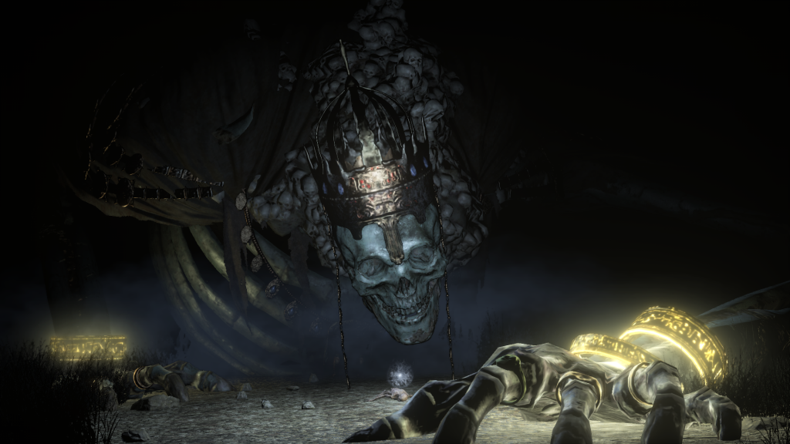

2019 was a weird year for me where I felt like I played nothing while I played what seems like far more games than usual. It felt like year spent ‘catching up’, where the scope of what I played didn’t become clear until I started putting it all down on paper. Either way here is my barely proof read yearly ramblings.

Death Stranding
---------------
[floatbox]

[/floatbox]

A 2019 game in 2019? I have my friend, April, to thank for this who lent me her PS4 for almost a year at this point to play through several games. She bought Death Stranding not to play herself, but so I could play it in front of her and talk about it. I did that and kept on playing, well after the story had resolved itself.

I have an unabashed love for Hideo Kojima. He is a man who simultaneously gets too much and too little credit for what he does. Kojima is brilliant, but his weird, flawed brilliance is not something exclusive to him. Many in the games industry could be just as amazing and weird if fate had given them a chance. He is as much a product of luck and opportunity as he is a result of his own skill and drive. Indie games have shown us that there potentially many many more “Hideo Kojimas” out there, but we might never see one come to the same level of prominence. The current AAA system is simply just not conducive to it. We are lucky to have even one person like Hideo Kojima.

Some people mistakenly say “Kojima should just make movies”. While I can understand how people come say this, if one really thinks about it, the opposite should become true. Kojima should NEVER make movies. The weakest parts of most Kojima games are the parts that are the most rooted in cinema. He may be able to invoke powers of cinema on a superficial level, but his limitations become obvious whenever does more than that.

Kojima communicates best through game design. The gameplay of his best games not only is fun and rewarding, but feeds perfectly into the mood and the theme of what he’s doing. This is where Death Stranding is at it’s best. Kojima can write a whole cutscene where your magical president moms dies of cancer crying on you in the oval office with minimal emotional impact. But carrying the awkward, ungainly corpse of your mother to an incinerator over lonely terrain? That communicates things cinema can’t — ESPECIALLY not Kojima’s cinemas. The whole theme of interconnectedness and how it works with both the core gameplay and the asynchronous multiplayer just feels perfect. Everything operates on a thematic level and on a gameplay one.

I’m not going to write a whole review on Death Stranding in an end of year summery. I could go on about the weird hype cycle somehow managing to delivery on it’s maddening promises. I could talk about how fucky Mads Mikkelsen is. I could talk about HOW COMPLETELY AND DISTRESSINGLY BACKLOADED THE STORY IS AND OH GOD WHY ARE THESE CUTSCENES TOO LONG but I’m going to talk about mountains.

In most games, it doesn’t feel like much of an accomplishment to scale a mountain. At best, it feels hard yet intended and at worst it feels like you’re making a mockery out of the game’s slope systems. Only two games I’ve played really made me feel like I had a relationship with the mountains. One would be Getting Over it with Bennett Foddy and the other would be Death Stranding. Getting Over it was a very intimate relationship with one extremely hard climbing route, but Death Stranding was a game where I could wander into a mountain range, feel like I was totally lost in a hostile environment that didn’t want me there and wasn’t designed for me despite the fact I was supposed to be there and it was designed for me. Death Stranding doesn’t pull any big tricks or mechanics to make this happen. There are many small gameplay systems that contribute to the experience, but I feel the important big choice was simply being okay with making the player miserable.

Death Stranding is a AAA game that was okay with me feeling ways that most AAA games try and polish over. For that, I loved it.

[floatbox type="full"]

[/floatbox]

Bloodborne
----------

The original reason I was lent that ps4! A big discussion before Bloodborne came out was always “Dark Souls or Demon’s Souls”? Obviously Dark Souls was the more ambitious and successful of the two, but many of us had a soft spot for the tone of Demon’s Souls. Demon’s Souls had an oppressive feeling Dark Souls rarely did that was intoxicating. While I always had to prefer Dark Souls over Demon’s Souls due to my love of maps and world design, the miserable world of Boletaria always haunted me.

Then Bloodborne happened. While by the time of it’s release, it was no longer secretly Demon’s Souls 2, it carried that spirit, complete with an incredible level of polish. It exceeds the mood of Demon’s Souls while also representing the peak of Souls combat. Is it’s world design less ambitious than Dark Souls? Yes. Is a lot of Bloodborne kinda samey? Yes. Are the samey parts still EXTREMELY GOOD? Yes!

Bloodborne saw Souls games the way I saw souls games. Bloodthirsty greed and aggressive offense. Sure, in Dark Souls I’d always have a shield equipped — a useful tool for dealing with suddenly extremely dicey situations. But it was almost always the grass crest shield and it was mostly just fueling my offense. So when Bloodborne took away the shield and was like “This game doesn’t need that”, I believed them and was rewarded for it. Maybe following this logic, Sekiro will hit hard with me too. Maybe we’ll see this year…

As for now, Bloodborne is easily the souls game I love to actually play the most.

[floatbox type="full"]

[/floatbox]

Dark Souls 3
------------

Dark Souls 3 is a strange game for me. No part of it lights my soul ablaze. None of its world fills me with deep curiosity and wonder. I have no lingering questions. Not because those questions don’t exist, but because the game fails at making me care about their answers. It, more than any other Souls game besides maybe DS2 feels like a game that is just ‘content stitched together’.

But boy is it good content! Dark Souls 3 probably has the best average standard of quality throughout all its areas and bosses out of all the souls game. I feel like it might have this position by quite a large lead. The game is huge and every part of it is good to great (… besides Ashes of Ariandel which sucks outside of one bossfight).

Despite not being entranced by the world, maybe that’s fine? Because there is one feeling Dark Souls 3 does convey. This world is dead. The answer to whatever questions are meaningless because this world is meaningless and may soon be dust. A minor touch that resonated with me was the hollowed enemies. In most souls game they are chaotic and violent and eager to fight. They can think of nothing else. In Dark Souls 3, many have decayed to the point where they must be roused awake by a bell to regain that spark to fight. You fight a Demon Fire Sage who has burnt out, his body reduced to brittle ash. As he fights, he falls apart. Even powerful demons have ran out of time. At the end of the Ringed City you see the fate of the world. Sand. Then you fight some corny ass last boss who looks like he fell into the wrong game, but that vision of the future is still powerful.

Dark Souls 3 never managed the sublime cohesion of the games that come before it in the series, yet still I walk away from it feeling it’s extremely good.

[floatbox type="full"]

[/floatbox]

Celeste
-------

Don’t ask me to make more I Wanna be the Guy games. Between something like Celeste and the trolly creations of people in Mario Maker 2, I simply have nothing to offer. I first played Celeste on the Pico-8 and loved it then. A simple, challenging and cute little game. It’s incredible to see how much further it could be fleshed out.

As I write this, I’m not yet ‘done’ with Celeste. I got some B-Sides, C-Sides and the back half of Chapter 9 to go. But I have beat the ‘main’ game and for a lot of people, that alone is enough. It’s hard to even describe what’s nice about Celeste. It manages to make this type of challenging platforming game feel fresh. It manages to characterize its characters so well in so little time. It manages to build its mood and earn emotionally uplifting moments with grace. It doesn’t do a lot while doing a whole lot at the same time.

It’s so hard to write about a great game that succeeds simply by doing everything simply and extremely well. Celeste just oozes craft and I’m glad I managed to fit it into the end of 2019.

[floatbox type="full"]

[/floatbox]

Grand Theft Auto Revisited _(1 through San Andres)_
---------------------------------------------------
[floatbox]

[/floatbox]
So one day I’m randoming through my roms and I hit the GBA version of GTA2. It’s kinda nauseating and hard to play. I quit out and think that’ll be the end of it but then I get curious… how were the PC versions of these games?

Well, apparently you can download them for free so I played them! The original GTA 1 and 2 are such weird games. Clearly the developers were hitting on something but they didn’t quite ‘get it’ yet. They’re half way between what GTA 1 will become and some weird (and overly long) score attack game. They don’t really _work_. They require tons of precision in a game that seems to already require a ton of luck. But what else would you expect from a UK developed game made in this period? They didn’t know fun was legal yet.

Not the best games to play as a gamer, but interesting to check out as designers. You could see the DNA of games to come, including even Hotline Miami (where the phone gimmick is 100% based off of GTA1 and 2).

So now I was curious… how well did GTA3 hold up?

GTA3 was extremely interesting. A fantastically designed map that felt extremely complicated despite it’s super small size. Driving felt nice and good, missions were starting to click but god, sometimes it forgot that it’s okay to have fun. As a general rule in GTA3, any timer or time limit is anywhere for 10-20 seconds stricter than they have any right to be. The game demands a lot from the player in situations with massive civilian car RNG. But when it works, it’s fun! It’s also incredible how sociopathic the game is. I don’t mean in how violent you are — it’s a god damned GTA game — but in how the story is so neutral to all your betrayals. The game doesn’t even wink when a woman who’s brother you killed tortures the wrong man for it. It’s just presented completely dryly and… oddly that feels appropriate?

Also as a minor point, flying the ‘unflyable’ Dodo is shockingly close to flying a plane with poor lift. I found it pretty easy once I learned to get stabilized! Definitely a lot of fun clearing missions in ways you’re not supposed to.

[floatbox]

[/floatbox]

And from there it was Vice City and everything started to click. The map became colorful and memorable. The radio became ridiculously good. Missions… mostly weren’t completely horrible. Hell, sometimes they were really good! Characters were now characters and Tony, while a sociopath, was a very human sociopath. Lance betraying you actually manages to hurt a little! Just a massive step up.

But also the plane sucked and flew all arcadey which made exactly one person sad and that person was me. But at least the Sparrow was awesome.

Now San Andreas I had never played and was really excited to finally play it. It both exceeded my expectations while also in a lot of ways, disappointing me. From a gameplay perspective it was largely all good. Gunfights finally felt right, variety of vehicles was super fun. The map was almost comedically huge while still diverse and interesting. The plot and characters were many MANY times better… but yet I feel like they left a lot on the table. CJ was the most relatable protagonist to date by a LOT. The Grove Street gang members felt so close and personal. The whole start of the game feels like a story out of some indie comic book that’d get adapted to an HBO show. Exaggerated and comedic, but gritty. Actions had weight. For a short bit, killing people actually felt a little heavy!

… But then the game kinda goes off the rails and you’re plowing up bodies in a farm combine, brutally murdering people to steal a rap rhymes book for someone who totally doesn’t deserve it and just… being a GTA protagonist again. The game knew they shouldn’t do Kill Frenzies anymore (which weren’t even that fun in practice anyways) and they knew they were making something more serious, but it feels like sometime early on, the serious people got voted out of power and irreverent “comedy” returned. It felt like they were on the edge of being something special in the plot department, only to end up… decent, despite all odds. It feels funny to be disappointed by the plot of a GTA game but those early grove street missions set a tone the game never found ever again. That said, running over people in a Combine is a pretty good time.

OH ALSO THE PLANES ARE AWESOME like whoever made the plane physics cared about how planes handled and made every plane behave in a way that somewhat mirrored its real world counterparts. As a plane nerd I was very impressed.

Over all take away from the series? Surprisingly still a lot of fun but Rockstar really needed someone to hit them with a ruler every time they set the timer for a mission too low. Oh and also every racing mission ever totally sucks. But hey, still a lot to love.

[floatbox type="full"]

[/floatbox]

Devil May Cry _(finally)_
-------------------------

I had never actually ever played much of any Devil May Cry game. I’ve played and loved games influenced by them but DMC fell within the ps2 generation which is a generation I largely missed. I tried playing DMC3 at some point on PC but the first time through it bounced off me at some point. The timing wasn’t right yet. I even owned 4 through a bundle or something.

I’m not going to go over these like I did for GTA as the evolution was a lot smoother. DMC1 showed its Resident Evil roots even harder than expected, DMC3 was rough in a lot of ways that mostly had to do with the era it came out in, but was gloriously slick where it was important and DMC4 was just a killer fucking game. It’s Devil May Cry, what is there even to say? It’s as good as I hoped!

Maybe for next year I’ll get to talk about DMC5. If not… hey, the fact that everyone hates DMC2 seems like a great reason to play it!

[floatbox type="full"]

[/floatbox]

Jurassic Park: Trespasser
-------------------------

I unironically love this game. Like it is totally busted to shit and borderline unplayable but the sheer ambition was ridiculous. It really felt like I was exploring this long forgotten island. The physics are horrible. Interacting with physical keypads and buttons in the world is horrible. Having to rotate your gun manually to see down the sights is horrible. The way background entities get rendered as billboards only to pop back into 30 when you get close is horrible. The dinosaur animation and AI? Horrible horrible horrible and I LOVE it. The sense of place is great. The environmental story telling is surprisingly strong. Sometimes the dumb physics stuff actually works and sometimes a puzzle is actually interesting! And atop all that, when the game fails brutally, it fails hilariously. This is definitely a must play game for people interested in weird quirky games and gaming history.
[floatbox type="full"]

[/floatbox]

LIGHTNING ROUND
---------------

### Minoria

Basically Momodora but 3d! Extremely good! Looks slick as hell. Bombservice basically just makes these sorta ‘capsule metroidvanias’ and I love them. I told Rdein to make the second sword do something cool and then the game was cooler. Now only if he listened to me when I told him to make the nuns kiss. Please enjoy my fanfiction, coming soon to AO3

[floatbox type="full"]

[/floatbox]

### Dicey Dungeon

By the time I got to play the full version this year it stopped being fun. The game works great as an engine to enjoy broken nonsense the mechanics don’t make the game stand up well to intense difficulty. One of those games where you fail and are just like “what could I have even done differently?”

Still could recommend it, just know the game gets tedious after a certain point.

### DS1 Again + Randomizer

Replayed Dark Souls 1! Gosh this game was jankier than I remember. Mostly the hitboxes. The hitboxes are TERRIBLE and nothing has any range. Stuff was sometimes hard for weird reasons I didn’t remember. Would get mad at Ornstein all the time because his collision box was bigger than his hurt box. That said, still the GOAT, still probably “Game of the Decade”, but I do appreciate all the nice changes made to its sequels. Also the “HD Remaster” looks like ass and I only played it because the PTD edition had horrible audio desync bugs for me.

Randomizer was fun though! The completely wacked out enemy placements turns things into a weird puzzle. Even stuff like leveling up becomes a chance for clever and fun “cheese”. Gotta try fog gate randomizer next!

### Jalopy

I ALMOST REALLY LOVE THIS GAME. The game about driving forever and fixing your car as it breaks down and smuggling cigarettes past customs and weird Uncles. Very tactile but never quite creates the relationship with your car I hoped for. From all I read the developer was frustrated as well with their inability to really make this great concept totally come together. Still can lead to some great moments though.

[floatbox type="full"]

[/floatbox]

### Final Fantasy 4

I replayed Final Fantasy 4 for reasons that are completely beyond me. Some thoughts: Oh god I hate random battles. Oh god the japanese version makes so much more sense, not only on a re translation front but also mechanically and oh god what a good soundtrack. Still not a fan of jRPGs anymore but it was… shockingly short?