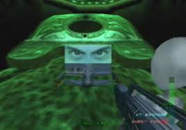
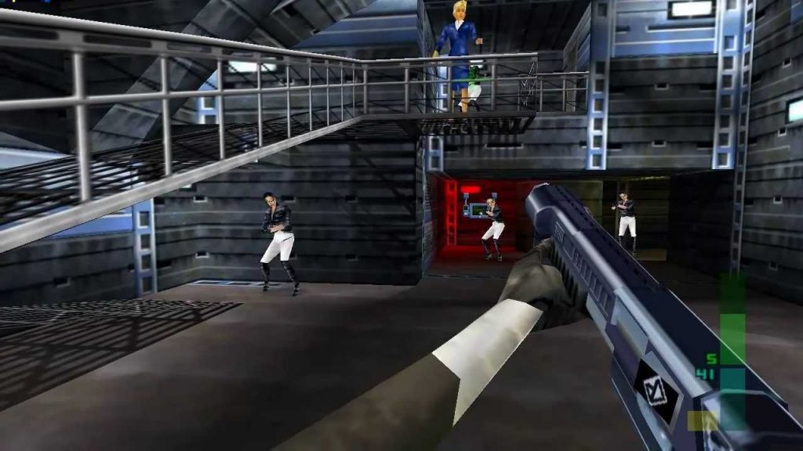

I love hating on **Rare**. I love hating on pre-2000s UK games. I love hating on basically every euro-*whatever* genre you can think of. Half of this is joking. It was a very different gaming culture over there, with different [tool tip="Though can we trust the social pressures that makes Dizzy the Egg make sense?"]social pressures[/tool] due to a focus on cheap PC gaming. [tool tip="I'll take an c64 or amiga euro-platformer over any DOS platformer, even Dizzy the Egg, don't @ me"]Half of this isn't even fair[/tool]!

... But I still *hate* Rare, and I hate **Donkey Kong Country** and I like to pretend the UK didn't produce a single good videogame until **Blast Corps**.

Unfortunately *they made that one*. They also made a few other games after that, and while I can accuse **Banjo-Kazooie** of *colonizing* 3d platformers, forcing its disgustingly european focus *collectibles* on a genre better inherited by [tool tip="Tony Hawk games, which themselves are Vert colonizing Street Skating???"]*Tony Hawk*[/tool]... I also have to admit that Goldeneye and Perfect Dark are *pretty good*.

# Goldeneye 007

Goldeneye is a strange game. Not so much at the time, but in the lineage of FPSs. It makes me think of **Command & Conquer**. Where **Warcraft** and **Starcraft** mentally dominated peoples minds as to what an RTS should be, C&C was a different, alien world of alternative core assumptions, playing at a pace and in a style that almost feels like it comes from another dimension. C&C has this weird *arcadiness* to it, the same type of arcadiness mobile phone games inherited.

Goldeneye feels like this, but for console FPSs. The big, core question we must ask in the 90s is 'can you play a console FPS like a *normal* FPS?' To that question, Goldeneye answers somewhere between 'No' and 'We're not Sure'.

Goldeneye is, factually, an FPS... but it doesn't play like one. You can, by backporting years of console FPS experience to it, play it like one, but that's not the natural state the game was designed to support. It makes sense when you realize how early it came out in the life of the N64. This game began development not knowing if the controller was even up to the task. They didn't know if players could be that coordinated! Goldeneye was designed in a way that, if need would require it, Rare could convert it to a *rail shooter*.

[floatbox type="full"]
[center]

[center]
[/floatbox]
[floatbox type="full"]
<small>Practically the same image</small>
[/floatbox]

I was not surprised when I read Goldeneye took a lot of inspiration from Virtua Cop. They both have similarly paced action. Enemies pop up with a similar beat, with unique animations, and responding to locational damage in a [tool tip="Well, Virtua Cop's is just aesthetic, where GE turns it into a real gameplay feature"]similar way[/tool]. In the long hallways of Goldeneye, one is often using the *Aim Mode* to shoot, like a controller controlled Lightgun game. Several stages end up feeling like a rail shooter that you can control.

But with Goldeneye, those locational hit reactions are key! The game isn't designed to be played at a fast pace, so wounding an enemy buys you time. Often a spray of gunfire ends with a few limping enemies, followed by a few well placed head-shots, much like the end of a *John Wick* action scene. While Doom is also an influence, this isn't Doom. You aren't flooded with enemies charging at you, spamming their attack. Enemies are slow. They signal their intent. Their random dodges and rolls give the illusion of much more sophisticated AI. A hallway of enemies looks dynamic, with each enemy using cover and taking a different firing position. In terms of hit-detection and reactiveness, there is nothing from that era even remotely close. Even all these decades later, the intricate and varied death animations look worlds better than the rag-dolls that came in the generations after.

It's not perfect. Unless you're playing like a *speedrunning psycho*, whether or not you get hit feels more random than anything else, which is brutal in a game of long missions and no healing. A randomly thrown grenade at the wrong time can end your run without you even noticing it was thrown. Enemy respawns work *kinda stupidly*, encouraging you to simply run through most levels before a *ball of soviet death* corners you.

The mission design has not aged well. It's hard to look at the game in the context of its time and call it *bad*, but it highlights problems that would have to be solved in later eras. It's almost shocking how little direction you have in a game like this. 

*"Disable this thing, using this item."*

*"What thing where?? what does it look like??"*

*"I don't know, **you're** the Secret Agent not me, figure it out"*

Which... Fair. And honestly, rather liberating compared to most modern games. This is a freedom modern games *over correct* against. You almost see a bit of the arising *Immsim* genre here, though **System Shock** well predates Goldeneye. the problem is the freedom is *kinda fake*. Instead of being free to pursue and achieve your objectives as you wish, you're often trying to figure out the riddle of what the game actually wants out of you. Often you will fail missions entirely for placing a usable item on the wrong *doo-hickey*. You could take your time to figure things out, or look for the targets you missed, but the ever growing ball of enemy soldiers following you will only get bigger. You are solving [tool tip="this isn't real don't listen to me"]*euro-puzzles*[/tool] on the clock! The Freedom is *technically* there, but it's not *practically there* in a lot of missions.

The various gadgets and gimmicks in the game feel like a formality. Put the door decoder on the locked door, put bombs on the fuel tanks. You were passing them anyways, they're not even out of the way! This isn't *bad*, but virtually all of the special items in the game are mechanically flat. They're like keys, but you already start with them. The trick is simply remembering to go into your menu to use them.

Stealth also feels like a half baked system. The game only care about *you* making noise, not your enemies. Counter-intuitively, the easiest way to be stealthy is to just run in and slap people to death, getting so close the enemies can't hit you because their guns literally clip through your model. It doesn't matter how many bullets they spray into the wall behind you. Sometimes the stealth works, at least for small parts of a mission. The Frigate, a *great* stage, is perhaps the best one for secret agenty stealthy play. Most levels are kind of stinkers, especially as you come to the end of the game.

The game was clearly designed for you to move up the difficulties, dealing with each new objective one at a time. I, in my own hubris, replayed most of the game on 00 Agent, so I am partially to blame here. Eventually the difficulty got too silly and I moved down to just Secret Agent. Despite some *bad* missions, this was a cart I got a lot of value out of. Clearing all those missions on every difficulty took *forever*, but almost every kid I knew who hosted Goldeneye sessions *did it*, if only for the unlocks. If anything, all that forced failure helps with practice and repetition. There is no wonder a huge speedrunning scene sprung up around Goldeneye, as the game slowly seems to train you to learn it and route every mission.

Goldeneye is one of those cool games where it's flaws just become part of its character. Improving any of the things I criticized wouldn't have meaningfully meant anything in the era it was released. It was already too far ahead of its time.

## Playing Goldeneye in 2026

There are some official remasters and re-releases, but *to hell with that*. I emulated it, and played it with a ps4 controller. I tried using my n64 controller at first, but I wanted to cry. I'm not a console FPS person, so I didn't have the muscle memory to fall back on to trivialize the game. While Goldeneye isn't designed to be played like a *true FPS*, you sure can still do it. For a taste of that I occasionally played missions I already beat on controller in a hacked version of Project 64 called [**1964 GEPD**](https://github.com/Graslu/1964GEPD) which adds mouse support. It felt like cheating, even though I know there are people out there who have the same level of skill on a controller.

For Goldeneye I tried to keep it accurate and crunchy. Low framerate, low resolution *(Okay, I gave it a bump to a spectacular, high res 640*480)*, low controller skill. I was the ideal stand-in for someone learning to play a console FPS for the first time.

# Perfect Dark

Perfect Dark isn't as *cool* as Goldeneye, but it, for my own taste at least, is a *better game*. What makes it less cool is it is more unabashedly an *FPS*. Coming out years later, it *knows* players have experience now. It *knows* they have hundreds, if not thousands of hours playing Goldeneye multiplayer. It even gives up and just puts a crosshair [tool tip="... in Goldeneye I cheated and used my mouse cursor. I am shameful"]right in the middle of the screen[/tool]!

... *I* do not have this type of console FPS experience anymore, so for this one I went for mouse and keyboard *(I'll talk about that more at the end)*. It felt less cheaty than in goldeneye... though it was still cheaty. The game just demands that much more from you. It's a trade off though. Longer levels, tricker objectives, harder hitting enemies, but also less random respawns and clearer mission instructions. You can take levels at a reasonable pace most of the time and while sometimes the game will nonsensically spawn enemies in behind you, it will at least do it *consistently* so you can plan for it. The harder difficulties also feel stupider, but that is again *kinda my own fault*. You get put in situations, late into missions, where enemies just seem to do *absurd* amounts of damage very quickly. while Perfect Dark enemies can be sluggish like Goldeneye ones, some seem to really have a terrifying quickdraw.

A funny aspect of the game is all the voices. This is largely cool, but it affects how killing enemies feels. In Goldeneye you'd kill a bunch of stoney faced, stoic russian soldiers who would fade from the ground after a few seconds. Meanwhile in Perfect Dark, in the first level you slaughter over 40 hapless security guards as they beg for their life, their useless dumbass bodies strewn across hallways marred permanently with blood and bullet holes. It feels *meaner*, even though that surely wasn't the intention. We just had a different relationship with violence in the 90s and 2000s.

[splitbox side="right"]
[center]
 
<small>I can be ur angel...</small>

 
<small>or ur devil...</small>
[/center]
++++

All this voicing plays into them trying to introduce a whole slew of characters for you to care about. They clearly had a *brand*, and wanted to establish it. Sadly, no one but *Elvis*, the stupid American loving Alien, is given enough time on screen. You rescue a self-aware AI in the first set of missions (*murdering hundreds in the process*), Dr. Caroll. It's goofy 'eyes and eyebrow on a floating laptop' design is cute, but he's almost immediately kidnapped. When you find him again, he is EVIL. You immediately re-program him to be good... Then he sacrifices himself. An entire character arc in two interactions. There is a clear friend-rival you see... once, and then once again in the background of a mission.

The two human villains get a little bit more screen time, but in both cases they're too half-baked to care about. The coolest thing about *Cassandra De Vries* is that she's tall as fuck and dies for spite. Trent is just a *guy who is there*. You don't even get the [tool tip="... Well, there is that bonus mission"]pleasure of killing him[/tool].

[/splitbox]

The setting is pretty cool until aliens show up. Elvis is such a product of his time, when everyone was still obsessed with *greys*. Heck, the game is a lot of obsessions from that era. Aliens, Area 51, and the weird obsession people have with Airforce One.

As for the other aliens, the Skedar are the most useless warrior race ever, mostly being a bunch of ugly chumps with bad weaponry. They'll just throw their tiny children at you to slowly plink off with a shotgun. The game never does anything to convince you they're a real threat. The story, all and all, has no bones. Neither did Goldeneye, really. Goldeneye just had the advantage of being based on a movie.

The mission structure comes tantalizingly close to something good here. You are given the *practical* ability to do things in different orders, and even use different solutions. The game sometimes even gives you choices that can carry over to the following mission. Other times the facsimile of spy-craft falls apart and the mission carry-overs make no sense.

One mission, involving infiltrating Airforce One, requires you to find a suitcase to hide your gear in, before putting it through security and making a mad dash through the metal detector to disable the security scanner in another room on the other side. The *premise* here is good, but you can simply... walk down to escalator the wrong way to skip the metal detector. No one cares, and you can clear out that side of the stage, before you go back to *pantomime* spy-craft. Once you're onto the next mission and go to retrieve your gear from the cargo bay, you... end up with a completely different set of equipment! I was thinking "All that tranq gear would be useful right now", only to be given something else entirely. Paper-cuts in the scheme of things. Problems ahead of their time, but ones I couldn't *not* be bothered by playing in 2026. 

[floatbox type="left"]

[/floatbox]

On the good end, your gadgets *actually do things*. Items like IR Scanners, X-ray Vision, and the Cam Drone can be used for things outside their stated use. You still have a lot of [tool tip="I got stuck for like 5 minutes trying to figure out how to reprogram Dr. Carroll and I kept checking my quick menu for an item I could use, but I had to go to the ACTUAL MENU because it wouldn't show up on the quick menu!!"]'keys you already have'[/tool], and 'throwable that will immediately fail the mission if you misplace them, but mostly *it works*. Even some of these 'keys' get other uses, like having non-essential computer terminals to cause chaos in one mission. The weapons and their secondary functions also greatly improve the gameplay. Everything ends up having wildly different gamefeel while nothing feeling like *that god damned klobb*. I'm not even sure Perfect Dark's actual klobb feels as bad as the Goldeneye klobb. Even the half-baked immersive stuff is more charming than not. The fact you can walk around the Carrington Institute is wonderful to me. It's pointless, sure, but it's the exact type of pointless *I fuck with*. None of the game's flaws come from laziness. They are the flaws of unrestrained ambition.

Where most of Goldeneye's missions are... flawed at best, Perfect Dark only really stumbles at the end. The last mission and boss somehow make Goldeneye's Cradle seem fun *(We *love* shitty puzzle bosses at the end of long but easy stages)*. But even then, at worse the missions feel *long in the tooth* with a pain point or two, rather than *miserable*. The bar of quality is just way way higher.

All this doesn't even get to all the different modes, or highly customizable multiplayer, or challenges and *co-op* and heck, *anti-op*. You look at the over the top credits of this game and you can tell they were just mad with power. This is a game made by insane people, high on their own supply. The results at the time were incredible, and hold up even now.

... But still, it's not as cool as Goldeneye. *It's just hard to compete with that Virtua Cop swag*.

## Playing Perfect Dark in 2026

The remaster of this got rid of Cassandra's giant hair, which is an immediate 0 out of 10. With emulation you can brute force the framebuffer effect problem, or you can fuss with settings to fix it. I couldn't be bothered. I played on a [decomp based source port](https://github.com/fgsfdsfgs/perfect_dark) and had no major issues with it. Some forks of it even support netplay! I do lament that *ChocolateDoom* style settings aren't standard in these types of projects. There is no way to crush the game into hideous hell. So I was less of a purist than usual. I even, for a bit, [tool tip="It was disgusting"]played at 120 fps[/tool] because I just rarely play a game so un-demanding that I can do that. Would I recommend that? No. But if you're someone who rescales your N64 games to begin with, this source port is probably the best option. It even made controller feel better, which... depending on your taste, may be good or bad.

All that said I spent enough time in the *chunky fuzzy zone* with it to know what I was missing out on, visually. Shows that for all my talk, even I make compromises sometimes if it means I'll actually get through the game.

# Some Final Thoughts

While these are some of Rare's best games, some that *US/Euro game design* from the 90s and 2000s comes through. I say that like it's a dirty word, like The US and Europe *sucked* compared to Japan... but no. Every platform and region had it's own forces that lead a certain flavor to their work. If you talk about 80s and 90s platformers, Japan dominates. Talk about RPGs and you see a strong cultural exchange from every region. With FPSs... There is something that the western developers *got* that Japan never did and that genre largely *won* in the years to follow.

It does make me think though, about the design philosophy we see going from something like **Duke Nukem 3d**, to Perfect Dark. That if you strives to recreate reality, *interesting things* will fall out. If you go through the song and dance of airport security in Perfect Dark, surely that will be good? Each individual thing on its own many or many not be good, but taken as a whole it mostly all comes out as a big win, even if it feels like some decisions were made without thinking about the consequences.

In modern games, enemies throw grenades to force you to move and not turtle. In Goldeneye and Perfect Dark, they throw grenades because *military enemies should throw grenades*, and will do so [tool tip="There might be a chance every time you break line of sight? Or it might just be random, I couldn't ever be 100% sure"]somewhat randomly[/tool], seemingly regardless of the situation. In Perfect Dark, they even *cook* the grenades, basically throwing a miniature rocket right at you, only [calling "grenade!" long after you're already dead](https://bsky.app/profile/kayin.moe/post/3mg5mgzfs4s2k). This serves no gameplay purpose. It's entirely on vibes, like they want to *show* that the enemies can do the same thing you can do. The grenades might go too far, but is it better to go too far than not far enough? The random deaths this caused me were never *that* distressing.

Conversely though I think of Kojima. **Metal Gear Solid** comes out only a year after Goldeneye, but it's philosophy is apparent even back with **Metal Gear 2**, in 1990. If the US/UK were obsessed with recreating reality, you see Japan, particularly Kojima, focusing on *turning reality into gameplay*. They were thinking not just about mimicking reality, but what feelings and actions that mimicry should induce in the player. By *Splinter Cell* I feel like you can say we're all on the same page, but what about before that? Regions have trends, but they're not monolithic. If I'm going to think about gamified stealth, I think I finally need to go and fill in a gaping hole in my gaming knowledge. I think I finally need to go play **Thief**.