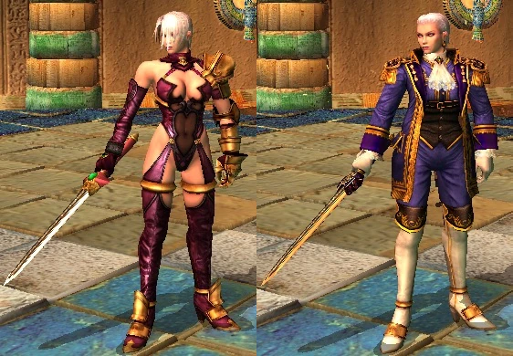
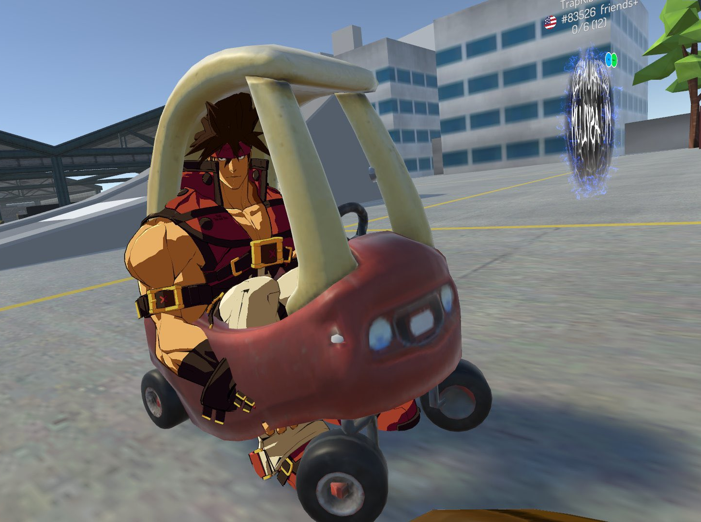
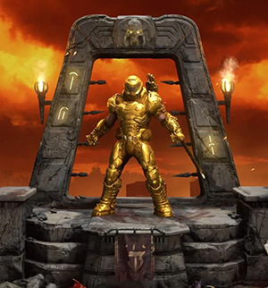

<blockquote class="twitter-tweet">
I hate this fucking game <a href="https://t.co/mlXPNMMOia">pic.twitter.com/mlXPNMMOia</a>
&mdash; Grongo Art (@GrongoA) <a href="https://twitter.com/GrongoA/status/1731187893262246050?ref_src=twsrc%5Etfw">December 3, 2023</a></blockquote>  </script>

I think about this video a lot. It probably pops into my mind at least once a week. It's hilarious, but also dystopian. Hell, it's hilarious *because* it's dystopian. Seeing this weird game that is *technically kinda actually really cool* have so little identity of its own, instead being some viscous **Ready Player One** gruel of pop culture. Endless slop to help the Battle Passes go down easier. But this video, or any other random video of Naruto knocking off Jack Skellington, is... almost beautiful, like a dying star, sucking everything in with it's massive gravitational pull.

## Guest Character’s Aren’t *Bad* but I Will Resist Them With Every Fiber of My Being

In my usual fashion I was popping off on twitter about how I'm honestly glad **Street Fighter** and **Guilty Gear** don't really do guest characters *(I guess SFV had Akira but there is a weird DNA link there)*. Had some fun discussing edge cases or how things have changed but I didn't really *argue* too much with anyone, even though some people *really* disagreed. Like I'd get some QRTs calling me a stuffy nerd and well, *I'm a stuffy nerd* and this is the lowest stakes thing to talk about.

... I did read a lot of those replies though, and people venting in their own little threads and one bit just made me sad. Someone was venting about SF6 dumping all it's guest stuff into Battle Hub avatar gear. Overcharging for things. Not making actual costumes. 

*"Why even bother to collaborate to begin with?"*

The word collaboration has stuck out to me since I've started playing SF6. *"This month, we're collaborating with -X-!"* ** ARE YOU?** Are you *really?* Is *any* meaningful collaborating happening or is licenses and contracts being exchanged with a few notes? Because I'm pretty sure it's the latter for SF6 and a lot of other things. Why are their no quality costumes, or guest characters or whatever? Because the purpose isn't to *collaborate*, the purpose is to *extract money* with an *intellectual property*. If people will pay $15 for a Ninja Turtle, why do something as intensive as making a full Fighting Game character? Hell, you could do a character costume, but if the costume is Battle Hub only, you don't have to go through as many development channels. You don't have to argue with the Battle Director about if a costume *reads clearly*. You can already be a literal burrito there. No one will say no. It's the smoothest Content Pipeline they got. A lot of people assumed I hate Guest Characters *because* I'm a stuffy nerd. Sure, that's half of it, but the other half is all *THIS*. 

*This is the ultimate result of Guest Characters. This is the unavoidable end state.*
[floatbox]

Alt costumes are cool sometimes
[/floatbox]
People would assume the same when I'd complain about DLC costumes. It's not that they can't be good. They **HAVE** been *very* good. **Soul Calibur** and **Tekken** had great 'Player 2' costumes for YEARS that were great expressions of other facets of characters. The current spread of SF6 costumes are pretty strong. But give it a few years. It's not that their can only be one canonical design, but when you are rewarded for putting out trash *you will put out more trash*. Not meaningful collaborations, but brands teaming with brands to *extract value*.

I kept joking on twitter that Akatsuki is the only good Guest Character. That's *not true*, but I think what's important is how clearly French Bread wanted to pay respect to Subtle Style and Blitzkampf. No one was getting that big Doujin Fighter paycheck. They are *actually collaborating*, as *peers*. Akuma in Tekken was a clear collaboration and a homage to the Cross-Over fighter that will never come to be *(Cross Over fighters, unlike Guest Fighters, are cool, for the record. Every character is a First Class Citizen)*. Even Baiken in Samsho seemed like an attempt to help an industry colleague. There are actually a lot of *reasonable* guest characters. There are currently, despite MK's attempts, probably *actually* more good ones than bad ones.

... It's not really about *Guest Characters*. It's about the Rot.

## Shadows of the Metaverse

I think a lot about **Second Life**, and everything that has tried to be Second Life since. Second Life is a strange game. Like Ready Player One we are left in the shadow of Snow Crash's metaverse. Second Life was a pretty capitalistic game. A game of shops and landlords and real money, even in the mid 2000s. Despite it's capitalistic roots, Second Life believed its value was in that of creativity. You could just MAKE things right there in the world. Want a cube? Here, have a cube. Move terrain, upload textures and animations, whatever. The game even had a UBI. While the income wasn't enough to afford housing *(what else is new?)* it allowed you enough money to upload textures and *make* things. All building and scripting *(at least for the era I played in)* was done in game. You didn't need external tools or 3d programs. Just a 2d texture editor. You could use paint. The game let you *code* like *real ass code* that you could run in world *for free*.

Turned out most people weren't interested in any of this. They wanted to have affairs in beautiful houses on the water and go to BDSM raves. Which, you know, *also cool*, but their priorities missed the mark of their audience. But in a way that was creatively liberating for weird freaks, furries and code perverts who ended up often being the true backbone of SL. Every attempted successor tried to fix this miss in priorities. These aren't games about creativity, they're about buying things. We'll have a whole confusing tool chain for content creators. This isn't about *impulsive expressiveness* and *exploration* this is about *hustle*. If you want to hustle, you'll *read documentation*.

They all pretty much failed though.
[floatbox]

VR is pretty great
[/floatbox]
The true successor in the end was **VR Chat**. Not a one-to-one return to form, but perhaps better for it. There was something intrinsically Punk about Second Life. The fact that, despite it's capitalistic leanings, you could eat dirt, squat in a strangers house and build crazy public works in dark alleys. How you lived was meaningfully expressive. VR Chat celebrates creativity even more openly (*but with less dirt eating*). When you look at VR Chat you can see scenes unfold just like that Fortnite clip. It *hits different*. It isn't some emergent dark comedy shining through corporate slop, but genuine funny, expressive, *personal* chaos. It's sincere.

Punk won in Virtual Worlds space, but the monetization, the rot, just moved on.

Was the problem in Counter Strike that players couldn't express themselves? Were visual customizations in Call of Duty an obvious evolution of the game's identity? Were these things added out of a game design need or a *financial* one? I love the goofy SF6 World Tour avatars, but were they about expressing yourself or to be a vector for battle passes? I don't think any of these are strictly 'monetization', but they all seem motivated, or at least justified by it. This is *The Rot*, the force that brings the worst out of things, the perverse incentives that make systems and content *insincere*. Hating Guest Characters and cosmetics isn't about hating fun and whimsy, it's about trying to maintain a firebreak between sincere art and the corrupting forces of *brand monetization*.

... No, that's giving us too much credit. We can't stop it. We're just retching at the smell, the acrid taste of decay. It is a reminder of what is likely *inevitable*. While a few large games resist this force now, will they in 10 years? The market has been trained to want all their favorite culture and art pureed in a blender and fed to them through a straw. Some are so young they've never known a world that was any other way. For many, a fortnite clip and a VR Chat clip are *basically the same*. Even those aware of these horrible dark patterns often end up embracing the chaos rather than be miserable about what they can't change. What else can you do?
[floatbox]

[/floatbox]
*"Fine, fuck it, add John Cena to Street Fighter 6."*

This is gaming's final form. **Doom Eternal** loads up with *your* Doom Slayer in a little shrine, so you can think that customization is *important*. It has to be important so you can pay little micro transactions to a corporation for the right to *express yourself*. All in an unwanted multiplayer mode that no one wanted or asked for. 3rd person cutscenes in *Doom*? Of course, if we don't show you how you look, you won't pay to look different. Does this make sense? Does this fit the vibe? The player base? Doesn't matter. This is the carcinization of AAA games, the evolution into the inevitable Monetization Crab.

I don't hate Guest Characters and Costumes. I miss sincerity.

