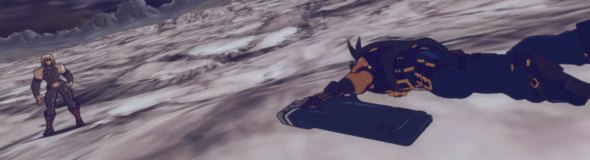

Long nights were spent in the X2 days, wondering when a TRUE Guilty Gear sequel would come out to move the story forward. Even during it’s time though, Overture looked… not terribly promising. As a Guilty Gear fan I still wanted to play it. For years, I wanted to try and enjoy it, jank and all. So here we are, well over 10 years later and _gosh I didn’t miss much_. But I’m glad I played it _now_ because it is a game that is more interesting as a relic than as a thing to actually play.
[splitbox]

++++
## Oddly Ahead and Behind the Times

Guilty Gear 2: Overture is a Online Character Action RTS MOBA released in _2007_. That is 2 years before League of Legend, back when MOBAs were that “Weird WC3 Custom Map Thing”. Back _before_ _MOBA was an acryomn that meant anything_.

So before the whole genre was even spreading and spawning clones, Arc System Works was trying to forward a half-born genre about 2 or 3 generations before it even fully came to maturity. All this from a company with all of one 3d game under their belt and whose 3d pipeline was completely unsuited for Overture _(Battle Fantasia, for the record, laid a lot of the groundwork for many of the artistic techniques that would be brought to maturity in Guilty Gear Xrd)_. This is a ridiculous amount of ambition and I will never blame a company for trying to reach for the stars.  
  
Every word in that description matters too. It is a character action game with cancels, combos, and air juggles. It’s a MOBA with towers, lanes, creeps, and hero fights. It’s an RTS. Perhaps not in the Starcraft sense, but in the sense that overture is the bastard child birthed of DOTA, Devil May Cry and _fucking Herzog Zwei_. You summon units, assign their rally points, pick them up and transfer them, call in backup, summon temporary allies. The systems are rich and intimidatingly dense.

… Sadly I will not be reviewing this part of the game terribly much. As a MOBA hater, the idea of playing this with another human, let alone playing it enough to have _real opinions_ is terrifying. What I know is the online is solid, depth exists, that even people who like it admit it’s a mess but it appeals to a certain, small audience a lot.
[/splitbox]
## Guilty Gear 2: Overture is a Game that is Good at Nothing

Guilty Gear 2: Overture is an ambitious game. It is a clever game. An original game.  
  
_But it’s not a good game._  
  
Overture does not look good, even by games of its era. Even by the scope of its gameplay. It’s combat is rough and rude, even compared to its contemporaries. It’s story is incoherent. Even it’s music lags behind games in it’s own series, dragged forward by only by a few exceptionally high points. There is really no single thing about Overture that is good. The assemblage is _interesting_, but execution only reaches about mediocrity for fleeting seconds.

I have no proof for this, but I feel like the single player campaign for Overture was developed linearly. The game puts it’s worse foot forward and steadily improves. An initial training area that looks like it’s from an old MMO, unclear tutorial instructions detailing mechanics that will take forever to put together. Voice acting that isn’t _technically bad_, but is so out of tune with the characters and the script as to be painful. I was for real baffled that Sin wasn’t actually supposed to be a pissed off angry man when Xrd came out because until now, I had only been exposed to the Overture dub.  
  
When asked to perform to move by the game, you get to immediately feel how clunky and awkward the game is. Attacks feel soft and unresponsive. Inputs for directional attacks feel alien to anyone used to other character action games. Jump canceling into a weird Guilty Gear style 2d air combo jarring and unreliable… and with all of this, the tutorial feels like it takes twice as long as it needs to, simply because it constantly has to cut back to cutscenes.

It gets worse before it gets better.

I’m not going to recap the story, which is better done by [checking here](https://guilty-gear.fandom.com/wiki/Guilty_Gear_2:_Overture#Story), but it’s thin, made up of grandiose smoke and mirrors, supported jargon and layers of mcguffin. A lot of video game stories do this and using these tools to stitch together a coherent story. Overture lacks this. Things happen for reasons that feel like they will become clear later, but they never do. Why are you fighting with crazy ghost army magic, what the heck is “the cube for” and why does anyone want it? What does Valentine and “mother” actually want to do? WHERE THE HECK DID IZUNA COME FROM LIKE HE JUST COMES IN ON STAGE 2 LIKE YO I GUESS WE’RE WORKING TOGETHER NOW LIKE IT AIN’T NOTHIN’ like this game is a confusing mess.  

Like not just the story, the whole game, because as soon as Izuna comes to help you out and pulls out that Ghost/Servant stuff and you’re fighting with armies, you’re just FLOODED with mechanics, items, things to micromanage. It’s potentially interesting but completely overwhelming. Also the game needs to teach you how to drift. Not the Strive “RC Drift” type thing _(though as a side note, Roman Cancels in Overture are called “Modern Cancels” which is almost charmingly… confident?)_. Like you gotta Tokyo Drift. Oh god it feels bad it feels so bad. The mechanic, which allows you to do sharp turns on this crazy mega dash the game lets you do, is TECHICALLY FUNCTIONAL and is something you could definitely get good at to be a skill differentiator in online matches, but it feels so bad, so unresponsive, and a slightly mistimed input either has you do something else completely, or has you smashing into a wall and sitting through a long recovery animation. It’s a mechanic I can imagine people who’ve mastered it liking, but is so miserable feeling early as to be seen as nothing but a failure.

Despite all this, you start to see a lot of the artistic creativity of the game. Valentine’s army of EGL gasmask troops, Sol’s weird mech army, fueled by a giant muscle bound bara man bound to gears, powering two giant lighters. They were clearly trying, and invested in what they were making.

The missions continue to get worse though. As you understand the mechanics more, the game begins to cheat, or change rules on the fly. Oh, you lose when you masterghost is destroyed, but Dr. Paradigm simply getting knocked out ends the missions? You tactically capture ghosts, only for those sensible moves to betray you when random enemies teleport in? Not only does the game not actually teach you how to play it’s multiplayer, it actively makes the experience miserable. Eventually the game realizes this isn’t what the campaign should be and it slowly transforms into a… very small scale and awkward Musou game. Sure, there is pain along the way, like an ill conceived ‘stealth item finding’ mission, but you also just get to _simply fuck up a lotta dudes_ as Ky The plot, while never sensical or clear, leads to fun moments like Valentine’s weird fake ghost troops contemplating their existence and assured death, or finally getting to confront and fight That Man. Sin and Ky even get to have a heart to heart until you go together into a giant brawl where it’s impossible to see who anyone is and kinda sucks. It sucks, but it _sucks in a cool way_.

The seemingly linear development means by the end of the game, the devs have kinda figured out what they’re doing. It’s clunky, but pretty fun. The last mission opens with ASW finally [understanding their 3d presentation](https://www.youtube.com/watch?v=hG_nNqZierI). The shots are weird and gorgeous, the writing is delightfully grandiose and nonsensical and the music _fucking whips_. Is it a good game _now_? Absolutely not, but at this point, Overture is a fun and stylish bad game. Little about the final fight with Valentine makes sense, but it’s _cool_ and since Guilty Gear is supposed to be _cool_, this is a win.

Let it be said that after this point, ASW never struggles with 3d presentation ever again. Well, mostly.  

Some of Xrd’s Early IKs were… not the best.

So I can’t recommend Overture like I can a lot of weird, quirky games. It’s not as lot of fun and of the whole package, only 4 missions really seem to really click. But I won’t stop you. Honestly, even though I didn’t play it, playing the Multiplayer might be the most interesting thing to try out. Still, despite all it’s failings, it’s fucked up to think ASW tried to do something this nutty and _almost_ succeeded. I respect it.