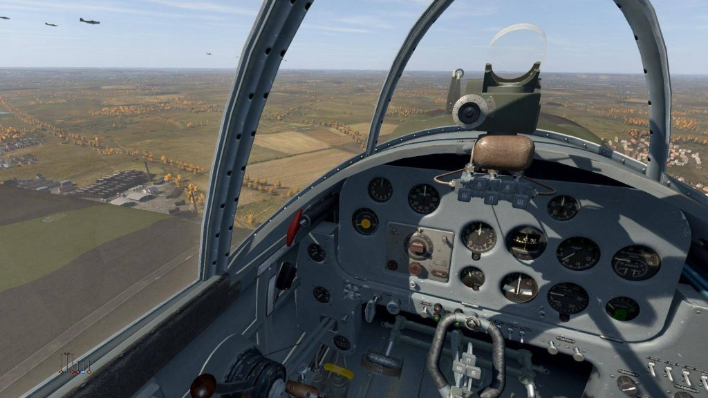
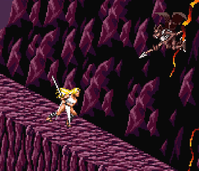

… And as usual, most of them aren’t from 2018.

Anyways, Brave Earth still isn’t out but instead of me being depressed about that, lets talk about games I played this year in no particular order!

### Hollow Knight
[floatbox]

[/floatbox]

I played this so early in the year I almost forgot about it. I remember looking at a map of this game and going “Eh. This doesn’t seem like the type of Metroidvania I like”. When I finally played it, my first hour or so of “confirmed” this to me, but I was compelled to keep going. “This game is too much the original Metroid it’s too easy to get lost and lose all direction”.

… But that was the idea. And as getting lost led me to new and exciting places and as the game continued to feel really nonlinear the quality of the world design became more and more apparent. Things I thought were flaws were intentional and intentional things I thought weren’t to my taste I ended up falling in love with. It’s one of the few games that people compare to Dark Souls where I’m like… yes. Yes this is exactly it. A beautiful and lonely world with great NPCs and fun gameplay that might occasionally cross the line into ‘actually unfair’ but in ways that are forgivable. Absolutely loved this game and I wish it was fresher in my memory.

### Iconoclasts
[floatbox]

[/floatbox]

I was waiting for this game for years and years and years and years. Where I expected a fun puzzly metroidvania I really instead got more of a Cave Story-esque journey with punchy gameplay. The world is connected only enough to make it feel like one big cohesive space. Earlier screenshots of the game contained a mini map in the HUD that was removed because, well… the game just isn’t actually about that. Areas are “stages” that are just in or slightly off the path you want to go. It’s a big map not because you’re supposed to explore it but because it makes the world feel realer. And within this world is an amazing story with amazing characters, looking cutesy and light while being a depressing, cynical story about peoples inabilities to change, to heartbreaking consequences. All told by someone who can execute art, writing and doing his own music perfectly.

Sometimes you want your soul touching indie games to play like a Treasure game in between cutscenes and this game fits that bill.

**Wonderboy in Monster World**

As a side note to Iconoclasts, I played this as Konjak listed it as one of his influences of the game. Wonderboy is a strange game. I don’t think there is a single excellent thing the Wonderboy games do. Yet somehow they are oddly compelling. They feel like an action RPG demake back when the action RPG genre was in full swing. Simple grind and update mechanics, formulaic progression through cute, tropey environments, adorable art style… and yet it works. It’s like some kind of comfort food. You can feel it’s world structure in Iconoclasts too. Wonderboy gives you little reason to backtrack but the fact you walk everywhere makes the world feel whole.

#### EVO: The Theory of Evolution
[floatbox]

[/floatbox]
If I were to pick a game of this year I would want to scream to the heavens about the most, it would be this. While not the best game — it is a very very flawed, old game — it was the most shocking and enjoyable find for me. This lovingly fan-translated PC-98 game is the turn based RPG prequel to the SNES’s EVO: Search for Eden. You can scroll down one post and read my whole review of this game but most importantly I was just SHOCKED at the sheer amount of quirkiness and charm this strange, surreal game had. It has that intangible ‘special’ factor that makes it important despite it’s flaws. So yeah go read that post and then download the game god dammit.

**EVO: Search for Eden**

Another side note game, I replayed The Search for Eden after The Theory of Evolution. What was once an amazingly quirky game felt simple and watered down compared to its PC-98 parent. The gameplay manages to feel slower than the turn based RPG it was based on and while more visually appealing, The Theory of Evolutions quadrant evolution system was more interesting and had more diverse choices. The only bad thing about The Theory of Evolution is it made me like Search for Eden a lot less. The Theory of Evolution has all of its strengths and more tolerable flaws.

#### Deltarune

I almost forgot about this because it hit so fast. As just a demo it's hard to read into things too much, What is flaw, and what is intentional? The core chunk of the demo plays its story beats as an uncanny valley clone of Undertale in a way that we all know has to be intentional. It’s weirdly uncomfortable, offputting and curious. While the bits we’ve gotten to play have their great moments already (who doesn’t love Susie) the demo, by necessity is nothing but promises, building up to something that seems challenging to deliver upon. Looking back in the future I feel like this first release will either be completely vindicated or seen as warning sign for all the problems we’ll see in the finished game. Considering Toby said he built Undertale purposefully to make this game, I’m leaning toward the former.

#### Dark Arms: Beast Buster 1999

This year I found some good NGPC games! Dark Arms: Beast Buster 1999 is probably one of my favorite game names I’ve ever seen. The game itself is interesting. A zelda-with-guns pokemon crossover thing where you capture enemy souls, eggs and seeds and combine them to make new guns to level up and evolve. The game is sadly a little scant and repetitive and doesn’t have the longevity the designers wished it did, but it’s still an exceptionally charming game that is still fun to play.

It feels like the type of game where in a better world there would be a Dark Arms 2 which would be a classic and there would be forum posts asking “Hey is Dark Arms 1 worth playing?” “Its worth checking out but feels really dated and shallow by comparison” and then Dark Arms 3 would come out and everyone would hate it because it changed a bunch of stuff and removed a bunch of features from Dark Arms 2 and — well… yeah that sadly didn’t happen. The publisher never went inn this direction ever again and mostly made fighting games afterward. This would be a good game for some indie dev to shamelessly lift from to make something new and more refined.

[floatbox type="full"]

[/floatbox]

#### Faselei!

The second good NGPC game I played this year is a weird Turn Based Strategy/Mech Customization game that is anime as hell. It also hits that “Final Fantasy Tactics” tone. It’s much goofier and does less of a a good job of it, but it gets some of that Gundamy ‘War is Hell’ stuff going on and executes it well in a few areas. This is another game that seems like it was a sequel away from being really great. The weapon variety does a lot but also leaves a lot on the table (there is no splash weapons). The combat, which involves selecting up to 8 moves in advance and predicting movements doesn’t have the enemy AI to make it as rewarding as it could be. But the game scales up well, limiting access to the “command chips” and amount of actions you can make until you are ready to zip around the map and blast things to hell. I still haven’t finished it but it is more a testament to the game. I’m still grinding end game content because the basic grind in this game is actually fun. Sadly it lacks the diversity to truly shine but it’s SO CLOSE.

[floatbox type="full"]

[/floatbox]

#### Kerbal Space Program

Kerbal Space Program was both a joy and a frustration. I now look at the janky car wreck that is modded minecraft and go “wow, this shit is rock solid”. Like Minecraft, KSP suffers from the problem that well… there actually isn’t a whole lot -to do-. You can do cool stuff just to do them, but like with modded minecraft, having an incentive to build is fun! But oh my god the physics of this game make things so rough. Any mod that does anything interesting is a disaster. Vehicles on loading the game abhor the ground. Space stations decide ‘yes now it is time to shake apart (modded or unmodded)’ and the whole thing is just frustrating for the wrong reasons. I wanna be frustrated by my landers tipping over on the moon because I designed them bad and I suck at landing, not because the physics engine decides it wants to do whatever it wants.

I put a lot of time into KSP this year and enjoyed a lot of it, but eventually I realized I was spending more time trying to ‘fix’ quirks of the game then actually play it. Losing should be fun but it just isn’t in this. Though that said I did enjoy building and flying planes in it quite a bit!

#### IL2 Strumovik: Great Battles series

So after KSP I did a short stint in SimplePlanes which made me go ‘lemme get my IR headtracker gear set up again’. When Simple Planes didn’t support it I was like ‘hm, maybe I should install IL2: 1946’ and a few days later I kept just eye-ing IL2: Battle of Stalingrad, the first game in the newer IL2 Great Battles series. Now I got a new joystick and throttle and rudder pedals (after building a set out of an old joystick and wood which worked pretty well) and I’m flying around with no hud and learning real flight principles. This is hardly my first deep dive into hardcore flight sims (I did own 1946 and had a headtracker already)

While simulations aren’t very gamey, air combat has a lot of gamifying factors. The nature of ‘energy advantage’ and balancing things like radiator drag vs coolant concerns and other mechanisms are very gamey. A lot of fighting game-esque management of information happens in air combat. When I made my post about “Cleaning up your mental stack” someone came in like “Hey do you know about the OODA Loop??” which is fighter pilot terminology for what is basically the same thing. Flying a plane in combat has almost the same APM process as playing Starcraft, deciding between macro and micro decisions and always having infinite ways to optimize is you have the spare knowledge and attention. While not being inherently gamey, it appeals to the gamey side of my brain.

I won’t go into too much other detail. it’s a WW2 airplane sim focused on the eastern front and which is noted for unflinching realism and attention to detail. It doesn’t really have a lot of competitors. But whats important is that flying is hard and as such is -rewarding-.
[floatbox type="full"]

[/floatbox]

#### LIGHTNING ROUND
[floatbox]

[/floatbox]
**Factorio:** Jumped to this a bit once I got off the Minecraft train. Factorio gets the process side of Minecraft even better than modded minecraft by like a lot and it’s a lot of fun. My only problem with it compared to Modded Minecraft is it’s really narrow. Like Modded Minecraft gives you the space for BIG COOL PROJECTS but factorio really doesn’t. Part of the “problem” (for me, it’s not a design flaw) is that when you grow in Factorio the design is… very integrated. Everything is already connected. Modded minecraft often develops as a bunch of separate systems and ends with more and more interconnectivity and automation. Modded Minecraft you're adding functionality and in factorio you're adding efficiency. High end late game in some play styles seems to get more into ‘interconnected microservices’ territory but I’ve yet to pull that off.

**Dicey Dungeons:** What a fun little game! A spiked shield where even dice do damage and odd dice shield me? Big swords benefiting for big dice and daggers benefiting from lots of little dice? A cute little dice based roguelike that gets a lot of gamefeel out of spending dice. One of the games that softened me on my dislike of turnbased games lately.

**Super Metroid x LTTP Randomizer:** What a perfect combination of madness, finding flippers in Super Metroid and the morphball on Death Mountain. A very confusing, brain bendy randomizer that fits right into my core skills.

**Dahna: Megami Tanjō:** This game owns hard. Like it’s not the best game in the world — it’s a little janky at times — but it’s also just awesome. Your some cool blonde warrior woman whose helped by mythical monsters to fight a sorceress. The game starts with you just riding on a giant ogre and stomping on shit before you just run around wheeling around this giant big ol’ sword like a badass, blood everywhere. It has such an awesome early 80s anime vibe. One of the things I like about it that I respect a lot in games is the game is constantly different. Things happen because the designers wanted to do them. Things are reused in ways that make sense in story. Bosses you injured earlier on reappear with those injuries still in place. It’s not just platformer beat’em up formula, which makes it feel oddly special.

 

**Final Fantasy IV:** Pushing my newfound tolerance for turn based games again, I went back to a classic. I don’t know why, I just had a growing urge to. Also it’s relatively short. It was interesting to play this and think about how much of the world interaction stuff and cutscenes and all that were cutting edge at the time. It’s the JRPG stuff we all took for granted at the time. I also played the japanese version (translated, obviously) so I got to experience slightly more complicated mechanics which made the game feel a lot less primitive than the US “Easy Type” would have led me to believe.

**Robotrek:** This was a mixed bag! Robotrek was a game I loved as a kid. Building robots is fun! Sadly the game is super shallow despite its attempts not to be. But… it’s also a strange, quirky game with a surreal sense of humor. It was tedious until I found the tricks to cheesing it. Parts of it that seemed good in my memory were worse and parts I didn’t care about as a kid held up better. It’s a weird, gaming game (I mean.. it’s a Quintet game so no surprise) that probably could have been great with a little bit more thought and time on the mechanics side of things.

[floatbox type="full"]

[/floatbox]