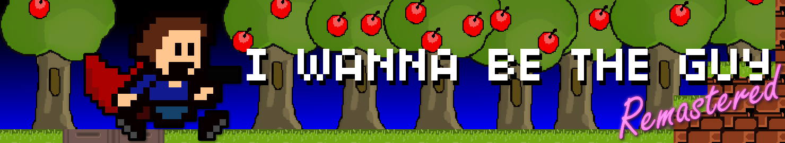

Let me start off by saying thank you to Natsu, Renko, Floogle, and Renex. This is not my project. I gave my feedback and helped where I could, but these four, plus numerous testers, including speedrunners such as [Wolsk](https://www.twitch.tv/wolsk) and [Tesivonius](https://www.twitch.tv/tesivonius). So with that I’d like to present **I Wanna be the Guy: Remastered**.

<iframe loading="lazy" style="border: 2px solid white;" src="https://itch.io/embed/871394?linkback=true&amp;border_width=0&amp;bg_color=444477&amp;fg_color=eeeeee&amp;link_color=951010&amp;border_color=363636" width="554" height="169"></iframe>

### So what’s different?

The team has rebuilt IWBTG from the ground up in game maker, moving the game to Yuuutu fangame physics, remastering all the audio, fixing frame pacing issues, controller support, reasonable sound settings and putting an end to needless crashes. The game also includes other more editorial improvements like enemy death animations, but these can be modified in a series of dipswitches available in the game’s options menu, which contains both accuracy options (We reworded the Zelda sword joke but the option, for the sake of preservation, is there if you want to restore the original dialogue).

So for new players, or players looking to relive past memories, there are almost no drawbacks to this version. All changes will feel either positive or will be invisible. Fangame fans will notice the new physics, but see that only as a plus. Some people like long term speed runners or super-fans of the original game might walk away with a few complaints, but even those players have viewed this version as a massive net positive. As much as possible was copied from original MMF2 source code. The game also includes some added content and secrets, possibly with more coming in the future! All changes come with my very vocal endorsement. No change is anything I wouldn’t have considered in an update of my own.  
  
There are two types of preservation. One is raw preservation. That the games code is available and accessible and playable. That won’t change any time soon and the original version won’t go anywhere. But there is a second type of preservation, involving access and approachability. This version of IWBTG succeeds on those merits. It is as accurate as it can be to tell 99% of the audience what they need to know about IWBTG and its history while being a much smoother experience, user friendly experience. I’m glad IWBTG is at the point where the game design is the only user hostile aspect of it.

Also thank you for the team. Originally this project was intended for the fangame community as an attempt to rehabilitate the game’s image. Sadly, the weird, buggy, janky nature of IWBTG sets it apart from other fangames, leaving it oddly divorced from the genre it inspired. The team did a wonderful job making the game feel like a modern fangame and allowing it’s place in history to be appreciated. It is a rough, crude game, but I feel it is an important one.  
  
So please, play this remake. I endorse it so much that It’s now listed on the IWBTG download page as an “official” version.