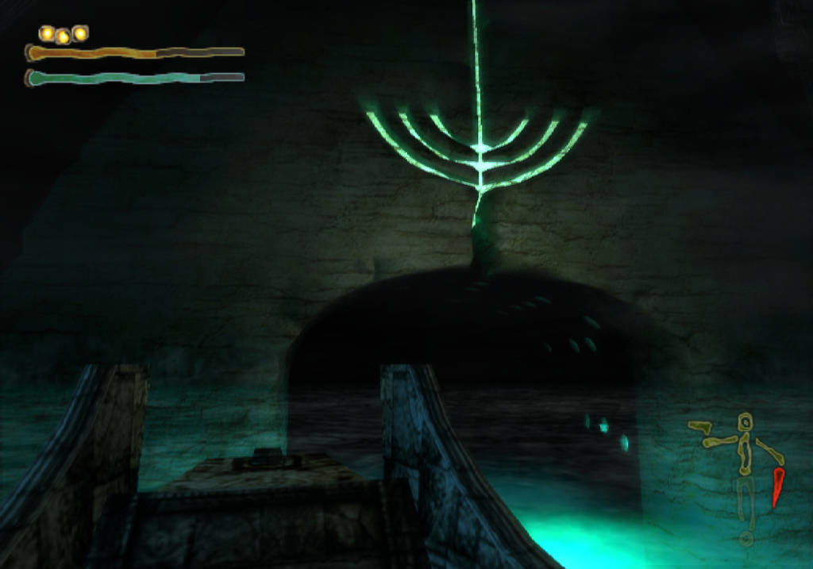
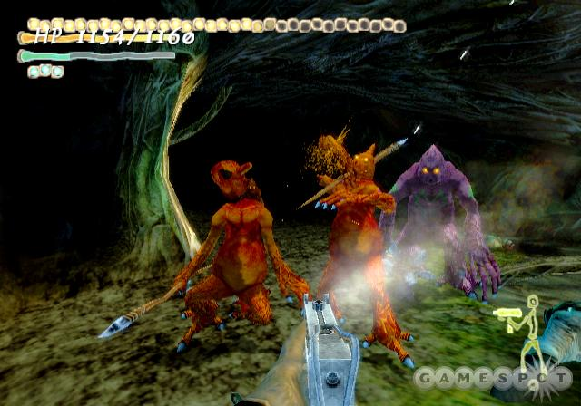
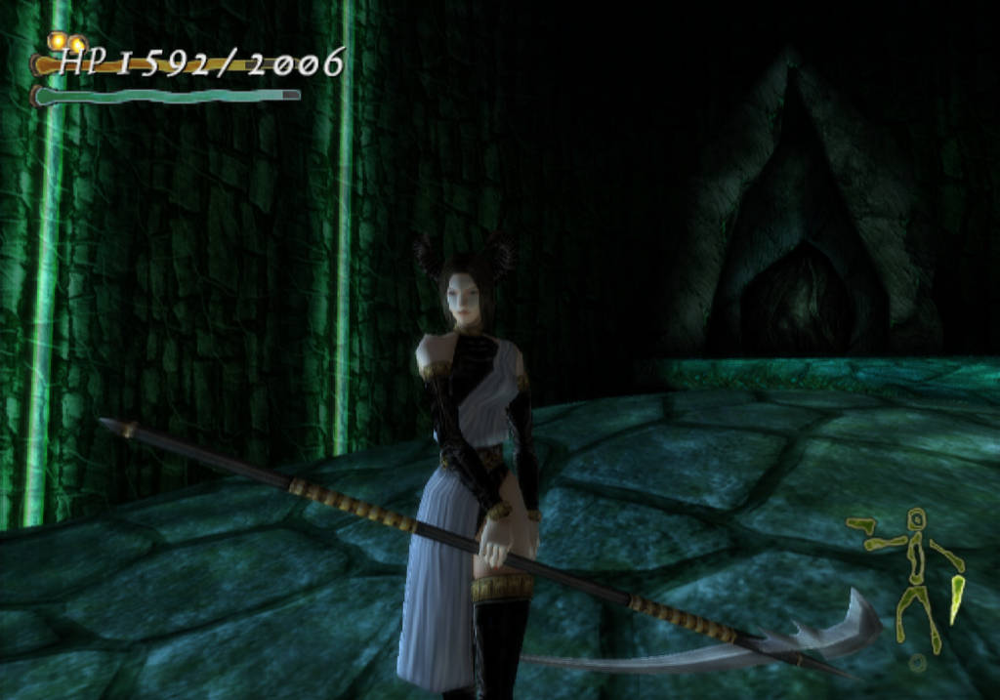
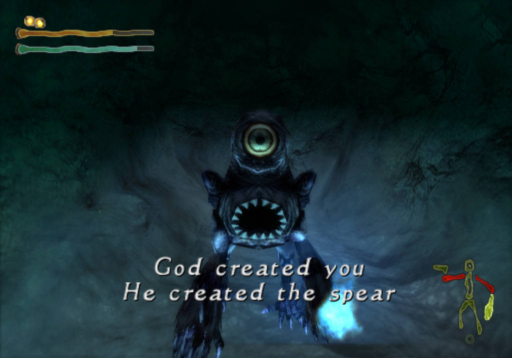
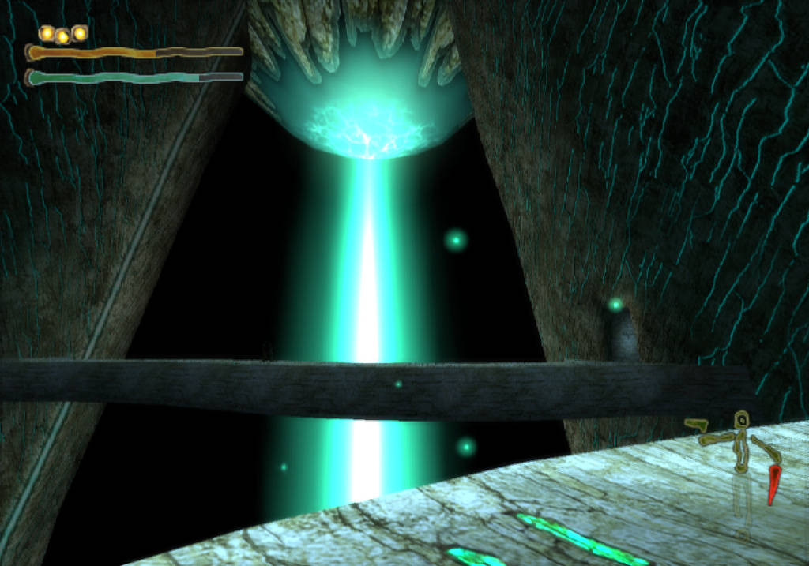

### King’s Field: The Ancient City

[splitbox side="right"]

++++

This is probably the most fondly enjoyed and remembered of the old King’s Field games… and in a lot of ways it is *probably* the best one, but there was something lost in transition, going from the PS1 to the PS22. The PS1 King’s Field had a strong, weird aesthetic. Even if that aesthetic was driven by their sheer ugliness and and console quirks, they had a **look**. Shadow Tower had a great aesthetic, *period*.  KF:TAC has no aesthetic. It’s honestly amazing to compare the visuals of this game to Demon’s Souls, just to see what a big difference a little bit of ‘aesthetic’ can make. The game, if not for its internal consistency, would be almost ‘asset store’ levels of generic. I would say monster design was never From’s strength in the early days *(even with the iconic Head Eaters)*, but Shadow Tower as filled to the brim with the type of unique and interesting enemies that’d you’d see in later From games. Instead KF:TAC are is loaded with ‘elemental xenomorphs’, probably a low point in design for these games. Something about those designs and starting in an area filled with lava  felt like they were trying and be cool and aggressive and have more flavor, but it totally fell flat for me. Some enemies are kinda neat, some areas look alright, but nothing in the game *wows* me. Only one point in the game was I ever like *THIS LOOKS SCARY I DON’T WANT TO GO THIS WAY*. The game was a consistent, flat tone most of the way through and made it abundantly clear to me how important those ‘wow’ moments are.

So why do people like this game? Well, the consistent, flat tone is pretty good! The game looks generic, but the details are there. Care for the world is there. The map for the world is *great*. This is definitely a game where I did not need a map to get around most of the time, and when I did, the maps provided were… awfully flavorful and cool. You had what you needed to get around as required and basic navigation is simple. The “Central Tower” made for a great way to unify the map and the ways you slowly make your way down the tower felt less… contrived than Shadow Tower? Like all good Fromsoftware worlds, it felt like a place, not a level of a video game. Then you have all your interesting details. Zombie like enemies that release dark bugs as you kill them that scurry around the floor to hide… Heavily implied cannibalism… all sorts of warnings for traps with corpses and stuff. The type of stuff you’d expect out of a From game.
[/splitbox]

[splitbox side="left"]

++++

Combat is much better too. Enemies almost always flinch from attacks and the hitbox on your swings is huge. Larger weapons seem to have more range. Usually if you feel like you’re going to hit something, you actually do and the game gives you more than enough feedback to tell the difference. The old ‘circle and attack from behind’ strategy is not as braindead as it once was and not for any one reason. Enemies are designed with behaviors that let them move around quickly, or attack all around themselves. Sometimes you’re trying to find an in so you can do the old ‘circle and stab’ strategy, other times you’re moving in and out and actively dodging attacks *(something that works far more reliably in this game than previous games)*, and other times you’re scrambling around. Having to do all this is probably part of the reason you’re walk speed and turn speed are a little weak compared to other games. Combat in KFTAC seemed the first step in Fromsoftware figuring out a combat system with actual game feel and it helps the game A LOT.

The game has some annoying bits. It has the KFTAC teleportation system, but now you can only teleport on certain spots and they’re often decoupled from save points or even warp ports and it’s like…. I GUESS this could be interesting but usually it’s just annoying? You have a blacksmith that repairs equipment for free but with a REAL TIME wait like come on wtf, game. Also upgrades! Lets wait 2 minutes and use a rare rock to raise an attack stat by -1-. This game might have the most irritating ‘start’ of a King’s Field game, and no i don’t mean MINOR-SPOILERS which no, I did not MINOR-SPOILERS. The mine cave and the poison and the limited healing that early in the game. It’s not hard, it’s just… not fun. Also I never got to play around with sword magic because it all required you to get to ‘level 3 experience’ with a weapon which… doesn’t seem like something that’d happen in regular gameplay? Seems like a bummer to me.
[/splitbox]

So would I recommend this game? It ranks somewhat over King’s Field 3 for me, but it’s probably one of the most accessible, tolerable King’s Field games. It’s a King’s Field game I could recommend to people who aren’t *complete* sickos. It’s a game that pulls back from the excess and high fantasy of King’s Field 3 and creates something more intimate like King’s Field 2, just without the same charm. And, let me be real, as much as I love King’s Field 2, KFTAC is going to be a more enjoyable game to far more people.

### Shadow Tower: Abyss
[splitbox side="right"]

++++

The fact this game was never released in the US despite the localization almost being complete has to be one of the biggest crimes ever committed by SCOA. Man, the American side of Sony was such a pack of assholes during the PS2 era. When I started doing these playthroughs, the Shadow Tower games were the games I was least excited about. Now they’re my favorites. THIS GAME IS AWESOME and bless whoever made this horridly translated fan patch with weapons like “high swords” and “low swords”. It’s so awkward at times that it kinda rolls around into being cool, adding to the weird tone of the game.

I feel like there is a very visible story told by From’s first person RPGs about their development. KF2 tried to give KF1 a more tangible world. KF3, after the success of KF2 aimed for grandeur and lost some of it’s intangible ‘special’ quality. Shadow Tower was practically a ‘study’ game to do the opposite of King’s Field 3 — do a lot with a little. King’s Field: The Ancient City executed on all of these lessons but became aesthetically lost in this new PS2 era… Shadow Tower: Abyss is the game that both is From discovering how to execute an aesthetic on higher fidelity systems as well as being the game where they finally refine their combat past ‘acceptable’ to actively fun.
[/splitbox]

While maintaining the same survival-horror systems of the original, visually, Shadow Tower: Abyss is far different beast. Trading the bleak aesthetic of a proto-Demon’s Souls for a weird, alien… almost a primal, tribalist feel? The game has weird but awesome sound design — a strange blend of naturalistic and technological sounds put together in off-putting ways. A lot of enemies can be really easy to ID due to very distinctive sound design. The worst thing I can say about the aesthetic of Abyss is that it feels distinctly ‘early 2000s’. It’s the only one of the Fromsoft first person RPGs to have a "popular" aesthetic. But it is still awesome, weird, and constantly had me going “What the fuck is THIS place?!”. The monsters were strange and worrying — maybe not as strange as some of Shadow Tower’s weirdest, but Abyss is pretty weird. There is also the sheer *anachronism* of the game. The game takes place long after the original Shadow Tower, as you and a bunch of researchers go down it to explore and find the spear that grants wishes and turned the last protagonist into a king. Somehow you all end up at the bottom, but unlike the first game, have to work your way back up to escape. And you have **GUNS**. Guns with *very* limited ammo. By the midpoint of the game I am finding myself walking around in ancient magical armor, with a WW1 gasmask on my head, and when I see an enemy in the distance, I trade my double handed axe for a sniper rifle. It’s bizarre to open a treasure chest and see a revolver laying there as an object of reverence to whoever found it and put it there. You feel like Lord Humungus from Mad Max. An ancient demon wants to fight you, so you decide now is the time to spend some of your precious shotgun ammo, killing him in a way that, to him, would seem no different from being blasted by a magician. All the old Fromsoft games have this sense of nebulous time, but this one embraces it. You find an ancient tribal warrior who was killing bugs for probably thousands of years along with other researchers or my fav demon lady from the first game.

[splitbox side="left"]

++++

Combat is great. It is extremely rare for enemies to not flinch when hit, and when they don’t it’s a *big deal*. When you hit things hard, they don’t *flinch*, they **REEL**. Limbs fly off. Chopping and shooting off limbs becomes part of the strategy. “Hey if I chop off this guy’s weapon arm, his other attacks are easier to deal with”. It also just *feels* GREAT. In the middle of a battle with an ancient knight, things were going against me and my equipment was breaking so I pulled out my shotgun and shot him, blowing off both his arms in a Monty Python-esque fashion. I blew up another giant demon with a PANZERFAUST. The intense resource management makes these moments fun and satisfying in a way that never gets old. Also unlike KF:TAC you move and turn FAST, and can use the analog sticks, moving around like a traditional console FPS. Enemies are more deadly to compensate, leading the most varied and fun combat I’ve experienced in this group of games.

It’s hard for me to even think of things to say… It’s… Shadow Tower but weird and great? It’s hard to even think of how to sell this weird gem. This is the type of game where if it sounds VAGUELY interesting I’d say ‘just play it’.

But I guess I can at least talk about its problems and disappointments. Healing and repairing is a bit more of a pain early on. Topping off equipment is wasteful — everything has a base repair cost no matter how damaged it is (unless it’s broke, then it’s even more). You have encumbrance in the game for your whole inventory. You can store items at shop crystals to elevate this but I felt it did nothing but make the game less enjoyable. I never felt like I was making interesting decisions on what weapons to take with me and on the rare chance I wanted to use an odd weapon for a specific situation, it seems like it would have been better if I had it in my inventory rather than have it unused in a box somewhere. The shops/healing places are more boring — just glowing crystals connected to menus, lacking the weird personality of their Shadow Tower predecessors. No weird naga-witch selling you swords. There are also way more cunes which is… fine, I guess? But it felt weird to max out my cunes at one point. I guess it was necessary with the need to buy ammo, but there was a charm to a currency where there was only 100 in the whole world back in Shadow Tower. The game gets a little monotonous with it’s gimmick levels. By the late game I was praying for an area where I just kicked the shit out of a lot of tough stuff but it never quite came. In fact, the end part of the game is the biggest letdown. It reminds me of playing through Demon’s Souls and finishing my playthrough on Stormking before killing True Allant. It just felt like there was no release. Just ‘hey the game is over’. At least in DeS you can save the last Boletaria stage as ‘the end’ but Abyss has nothing like that. The ending felt disappointed both gameplay wise and thematically. If I were to guess, there probably was going to be more to the boss and maybe more to the last area. The last thing you fight is basically an armored copy of Rurufon and her AI and it’s… not much.
[/splitbox]

I also didn’t feel like I had a sense of the tower in Abyss as I did in Shadow Tower. The maps themselves are WAY better but Shadow Tower felt interconnected. Abyss has a hubworld that you travel up and down by way of elevator which is…. really lame? The hub area looks cool, it never changes in a way that made me feel like I was making any progress. It didn’t change in Shadow Tower either but at least in that, I was literally moving down it. Abyss is a game in dire need of a good final act, something all the King’s Field games and Shadow Tower managed to do better. Not GREAT, but much better. But none of these flaws really deeply effect the joy of the game while you’re in the middle of an area, playing it. But keep in mind, when it’s time to end the game, the game wraps up fast.

A good point is that New Game+, which Shadow Tower also had, seems to be improved. Unlike Shadow Tower which was more “go back to the top so you can finish killing and finding everything”,  starts the game over, sans some of the stuff you already found, but giving you more potions and ammo and new weapons. I don’t know if it ever gets harder like a Souls NG+, but I guess I’ll see, as I’m curious if the game is different in other ways the second time through (and I feel like such a beast by the end of the game that a second pass through the game doesn’t seem very time consuming). Either way I highly recommend checking out this game. The translation works fine if you can run burnt or HDLoader games on your PS2 and it emulates pretty well (Some texture flickers with hardware acceleration but I found it to usually be tolerable). I know there will never be a Shadow Tower 3 by name, but I aware the soulslike (even if they claim they’re done) that captures a similarly weird, alien look.

In closing, my tierlist, worst the best:

_**KF3 -> KFTAC -> Shadow Tower =/-> KF2 -> Shadow Tower Abyss**_ 