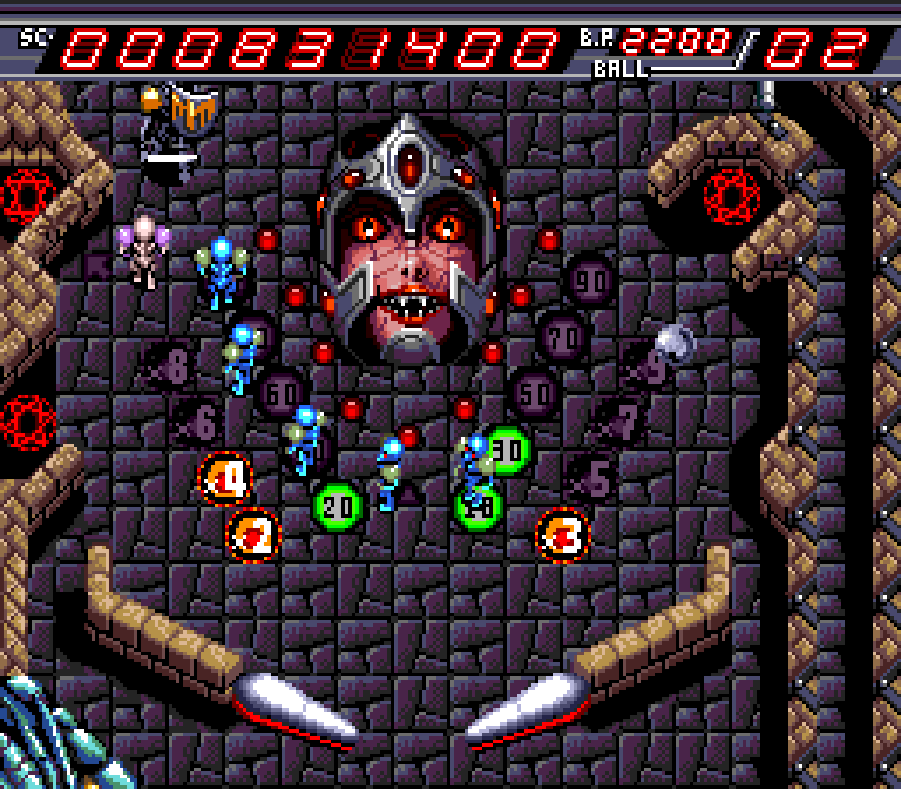
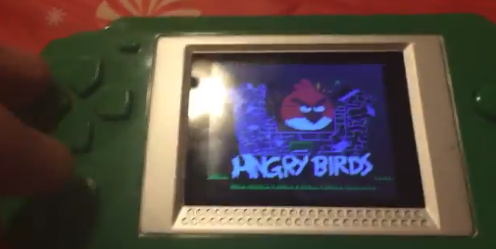

This was a weird year in gaming for me. I played all of one game released in 2017. The bulk of the year was covered by weird hacks and modded minecraft, as well as the usual slurry of bad games. I don’t want to frame this as ‘best of list’ because while I like… most of these games, it’s honestly more ‘games I remember playing that I have some thoughts about. Anyways

### Stardew Valley
[floatbox type="right"]

[/floatbox]
What a lovely game. Due to a lot of Zachtronics stuff and modded Minecraft I got a little bit of a taste for a slower experiences again. The farming was alright, but the characters were super lovely. The game had very simple but effective writing that had me change my choice for Farmer Naomi’s wife multiple times. Even the characters on the bottom of my list were great. The only issue I had was… and honestly I didn’t notice it much because I wasn’t going for that content… that the guys were lame. Shane had a great arc that got me to befriend him, but the rest? eh. Also that super simple fishing game was so fun.

Biggest issue with the game was the lack of an end game. I feel like randomized goals in the style of the carepackages would have been lovely. But on well, you can’t play every game forever.

### Momodora: Reverie Under The Moonlight

I played this on my flight to Japan since I was going to meat Rdein and the game was on my list for awhile. The level design of it had this lovely Demon’s Souls meets Knytt Story feel to it. The map they made for the game was lovely and the world felt tangible and sensible. It had a very Japanese-esque style without being generic anime. It had lovely but simple combat. Just one of those games that’s just… simply solid and good? Just a game with a lot of soul.

### Getting Over it with Bennett Foddy

Foddy is a cool guy I’ve gotten to hang with a few times. Just… smart and funny and of course he makes real assholish games. But I found Getting Over It to be the least frustrating. It, more so than QWOP or GIRP became zen like to me. I just let go of any stress immediately. Progress didn’t mean anything until the job was done. I didn’t get mad or frustrated once. It was all zen. And Foddy talking philosophically about the nature of art and hard games was wonderful and a lot of it really resonated with me. A pleasant experience for a masochist.

Also this is the only game I played this year that game out in 2017. Yikes!

### Metroid Rogue Dawn
[floatbox]

[/floatbox]
What a flawed but lovely game. This is a game I wish I could get a physical copy of (it’s just a little too expensive). This romhack has a lot of rough edges but truly creates an alien planet. It also looks unlike any NES game. It’s gorgeous and just feels…. uncannily out of place, graphics from another time… Because, well, they are. I played this at the beginning of the year so a lot of details are lost on me but it was rad!

### Super Metroid Rotated 90 Degrees

It’s what it says on the tin. Some parts of the game are tweaked to make it reasonable but for the most part it’s for crazy bomb jumping and walljumping nuts like me. It’s great to have something familiar yet different, where you can use your knowledge to help you, but it doesn’t ever quite help enough. Which also plays into…

### A Link to the Past Randomizer

I played a Super Metroid Randomizer and some DS Vania randomizers bu the ATTP randomizer takes the cake. These are addictive.  In Super Metroid, finding a stash of items meant either, depending on difficulty settings, finding a stack of nothing or find a ton of great stuff, ATTP has enough diversity in its chest drops to make every chest feel like the pull of a slot machine. Every little trick gets you a little bit further and nets you a few more pull of the slots.

I even did entrance randomizer once because I hate myself. It was… something to be making diagrams in photoshop to figure out what goes where.

### Sylvan Tale
[floatbox]

[/floatbox]
A weird Game Gear Secret of Mana/Zelda clone thing? Certainly the only Game Gear game I have ever beat. Never released in America and oddly charming and good. If this was a GBC game released by Nintendo, it’d be one of those games people say is overrated. It hasn’t aged excellently but in its time it was surely wonderful. The game has a neat, curious world with a strange cosmology that, while nothing shocking, is just… nicely thoughtful. It has simple but memorable plot moments. It just plays -nicely-. Not excellently, but definitely nicely. Also you change forms and shit and its kinda annoying but it’s one of those weird gems that Sega fanboys would likely clutch close to their heart if it got a US release. But sadly, despite being a SEGA game, it did not.

### I replayed Circle of the Moon and Harmony of Despair thinking Circle was the “okay one” and Boy was I wrong!

I didn’t remember either of these games being great. In fact, I remembered Harmony of Despair being downright awful and ugly and Circle of the Moon being… odd but playable…

Oh my god Circle of the Moon sucks. I know there was some article claiming it was secretly The Best Portable Castlevania, but it is just… awful. Bland in looks, bland in level design, tedious to transverse. The DSS system is garbage, saved only by the fact that you can use a glitch to use any card combination. Finding them in the wild? Fuck that. You move weird. You jump weird. You’re like a slug who can somehow jump 100 feet in the air. There are no items to pick up besides Health and MP ups so there is no real discovery — just tedious cleanup work to maximize your stats. The only things that don’t suck about this game: The monster choices are odd and there are a lot of them. A lot of classic enemies are replaced by oddbalsl like… archer wolves? Sure, okay, that’s better than just another skeleton. And some of the bosses are okay? Sometimes? Maybe? Even if Dracula sucks horridly.

Harmony of Despair by contrast was much better than I remember. And by much better it was “Okay”. I won’t be itching to replay it any time soon and it was a number of steps below Aria of Sorrow but it was.. fine? A little bloated and with a few advancement triggers that defy reasonable design but… it’s fine and… looked much better than I remember? Likely because GBA emulators are better about colors/backlight compensation so the game looked much less overblown than I remember. Hell at its best, it looks better than Aria, though Aria is just more consistent. Also it has a weirdass soundtrack. At first I hated it, but over time it oddly grew on me. The sample choices are weird but I guess kinda match the “Dissonance”? But the important is the soundtrack leverages these grainy, awful sounds in awesome ways. It reminds me of the horrible Demon’s Souls trumpets. They’re so bad. But so good. God I love them. Anyways here have my favorite HoD track.

### Devil’s Crash
[floatbox]

[/floatbox]
There is something captivating about this stupid pinball game. Naxat has a skill for making games just… feel nice. And they never got to stretch that muscle much but this pinball game from the guys who made Rekka is awesome. It just feels cool, has a lot of energy, lots of little subboards to find. It’s impossible to really explain. Just try it. I don’t know if, as a kid, I’d be down with paying full price for a single board pinball game but hey it somehow works.

Also known as Dragon’s Fury in the US, where it is on the Genesis rather than the PC Engine. Both versions are good. I feel like I slightly prefer the PCE version, but the Genesis version looks and arguably sounds better (which goes against my usual Anti-FM Synth bias). Also the main song is awesome.

### Golden Axe Warrior

I can’t believe there is a Golden Axe game that is a flat up clone of Zelda 1. Like almost nothing tried to clone Zelda 1. It’s like a weird look into an alternative history. It’s not particularly -good- but it’s educational. Never beat it because my save corrupted but w/e.

### This Fucking Thing

[center][/center]

My uncle got me this weird crappy handheld thing for Christmas loaded with old NES games that is various minor tweaks of Super Mario Bros, Adventure Island and Contra, a few other random old shitty games and a TON of AWFUL chinese games made in the 2000s. They’re awful and awesome. I just load it up sometimes and pick a random game and groan at how bad it is… but a good groan. An oddly… exciting groan.

### Modded Minecraft

I played a ton of modded minecraft this year. Too much, really. But the engineering you can do in modded minecraft is just wonderful. It’s weird because no other modded game I can think of regularly assembles mods under ‘mod packs’ (without it being a huge community drama thing). So you get these weird custom play experiences made up of multiple peoples work. The integration a lot of time doesn’t make sense but all things considered it works really well. Modded minecraft, with all its pipes and machines isn’t even the same game. It feels like a sandbox Zachtronics game or something.

https://www.youtube.com/user/kayinnasaki/videos I’ve been uploading base tours and stuff so if you wanna get an idea of what I like doing, that’d work. But yeah, it’s oddly infection. Sometimes I worry it’s slowed down BEP but then when I cut myself off I just refresh reddit for 4 hours, which honestly is a huge downgrade. JUST GOTTA WORK ON MOTIVATION, SEE YA ALL NEXT YEAR.