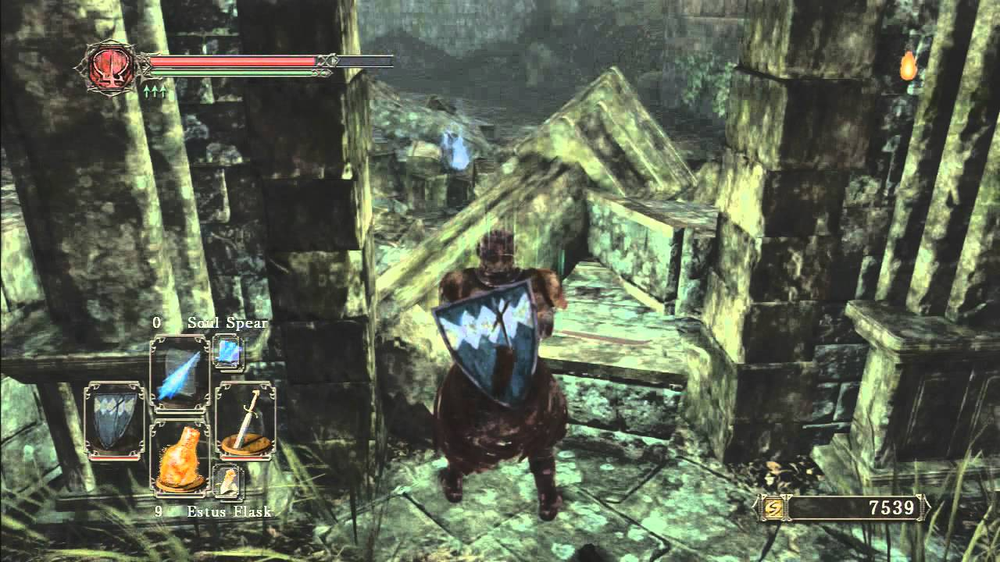

This kills me. This is right by the Shrine of Winter in Dark Souls 2. This tiny bit of rubble — one that would take two big steps to clear — is responsible for half of your epic journey. You spend hours tracking down powerful souls and risking your life, rather than just finding a stool.

I call this mechanical irony. Mechanical irony is when the limitations in control we have over our character become all too real. “If only I could climb over that” or “if only I could jump off this ladder” or “if only I could step over this gap”. or whatever. When the sensible, real life to a video game problem becomes obvious, it becomes difficult to sustain immersion and the suspension of disbelief. To an extent this is unavoidable. We’re making games and not simulations. We don’t want to give the players the ability to do all these things, we want to convince them to think in the verbs we’ve given them. We want the player to trust us and give we get that, they will give us a lot of leeway.

Bionic Commando for the NES is very good at this. The game requires a large conceit _(.. can you even use that word like that?when talking about mechanics?)_ from the player. You can’t jump. You have to move around with your bionic arm. You’d think the game would be litered with moments of “if only I could jump, I wouldn’t have to go through all this hassle”, but it’s surprisingly not. Every situation where you wish you could jump is quickly solvable with the mechanics the game provide. The game doesn’t want to remind you that you can’t jump, it wants you to focus on swinging around. To a degree, new players still get frustrated with the inability to jump, but when you consider what a huge concession that is, the game does an amazing job of making the player think about it’s core mechanics.
[center][/center]

The Shrine of Winter in Dark Souls 2 does not do that. It’s downright taunting. It could possibly be ignored as a dead end, except for the item on the other end. While many areas of souls games could be destroyed with [climbing skills](https://www.youtube.com/watch?feature=player_detailpage&v=nXAppqzUUAw#t=121), you generally don’t think about it (though probably also in Belfry Sol!). Here, it’s preposterous. Here it looks like, without invisible walls, you could possibly even jump over it with the mechanics given to you in the game. It could even get you to think about other things. Like, what is that shrine even for if it would be so easy to walk around in real life? Little stuff exists like this every where (welp, fell down, time to walk all the way back to the stair case instead of pulling my self up from the edge) but usually those are so minor, people don’t notice. Here? It’s HALF THE GAME and totally avoidable. No one looks at the Lordvessel door and goes Well you know, if I had some TNT or a hammer…”. People just go with it. If the Shrine of Winter blocked a bridge, most people wouldn’t think about “simply getting rope”. That’s because they’re not having their face rubbed in it. They’re not being taunted. The players want to be immersed. Not everyone is going to fall down little thought-holes like this, but they’re best to avoid when possible, especially when trying to construct games with structurally sound worlds.

Now, taunting isn’t always bad. Dark Souls taunts all the time (though usually not in ways that damage the integrity of the world). A good example of this is [Vini Vidi Vici](https://www.youtube.com/watch?v=ZpsPMRlP3Bc) in VVVVVV, where the character, who can’t “jump” is forced to reverse gravity and fall through several screens of spikes to get around an ankle high block. VVVVVV has little “immersion” to speak of and it serves as an excellent gag for an excellent challenge. You could even argue for this in more serious games. Again, the Belfry Sol is an annoying taunt, but it’s repercussions are mild. Is it a good gag? I personally wouldn’t do it, but I could fancy an argument for it. In most cases though, if you’re making a game with any kind of “world” you want to avoid bringing attention to aspects like this.