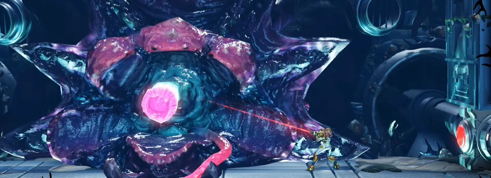

> This will not be a Feel Good story about Metroid: Dread finally correcting course. I am here today *to be a hater*. 

Not a hater out of spite, or to be a contrarian, or even to shame people for liking *the popular thing*. Metroid: Dread is [tool tip="Even John Cena's"]*many* people's[/tool] favorite Metroid game. The game is a critical *and* commercial darling. I'm not here to try and make you feel stupid for liking a game I don't enjoy. My values are likely *very different* from yours and *that's fine*. A lot of folks I respect *deeply* enjoy this game. I've lived through enough forum arguments like [tool tip="It isn't 😒"]"Is Metroid Fusion a good game?"[/tool] to care about winning the Video Game Opinion War.

I'm writing this because my feelings come from the heart. Because 2D Constructed Worlds _**get into my fucking soul**_. I can't help but to feel *very strongly* about them. If I just think a game is bad, I [tool tip="Bad is kinda a weasel word here. Bad for me usually means 'Boring' and I love some bad, awful TRASH games"]simply stop playing it[/tool]. I walk away. Hate happens _**when I care**_ and I find Metroid is especially good at getting me to care *a lot*. 

I don't want you to hate Metroid: Dread, I wan't you to understand _**why someone would**_. 

# An Over Designed Game with an Under Designed World

To claim the Map of Metroid: Dread is, in any sense "Under Designed" is a tall order. [Game Maker's Toolkit](https://www.youtube.com/watch?v=5pop-cc9kmY) has an excellent video on all the tricks and design techniques Dread utilizes to keep you progressing through the game. Regardless of my overall opinion of this game, It's a genuinely impressive technical feat to balance so many moving parts... To keep Dread's guiding hand invisible and frictionless.

But sadly, the invisible hand of Dread is not invisible to everyone and I found myself fighting its constricting bounds frequently.

The ever changing early hours of Dread are a hot stove, punishing you for caring. Every time you think there's a point where you should go back and check, a waist high hole turns things into a one way trip. Water flowed out of a hole, making jumping impossible, or a stupid flaming plant appeared to arbitrarily say "Nope, not today". This type of control over the available play space is a common and useful tool in Metroidvanias, but Dread keeps the leash obscenely short.

If you try to engage with the world presented to you, the world shrugs and tells you to keep moving forward. Even when you finish what feels like a heroic little loop around the starting area of the game, you are forced immediately on a new railroad track. Areas bleed into each other, winding mazes of tunnels with no grounding structure. Why even *try* and look for structure? The right way is forward and what you assume about the world now might not be the same 3 rooms for now. I'm not sure if you get to explore an optional area *once* in the first hour of the game.

... Then you get Morph Ball and the game massively opens up. Suddenly you are given freedom and that freedom is *suffocating*. Nothing in the world has *been established*. No familiarity has been built up. It's like you've been dropped off in a town you've seen your friends drive through, but haven't driven through yourself. You recognize some things, but you are fundamentally lost.

Dread's *progression* is tightly designed, but its world is not... Or at least the *structure* of the world. That *Game Maker's Toolkit* to me is interesting because it talks about all the tricks Dread uses, but doesn't talk about all the tricks it forgoes. What *fundamentals* it forgoes.

Metroid Dread's map lacks bones and connective tissue. *Prime cut* moving, platforming, and gunning. A clean cut of meat might be great when making a steak, but this is game design. We need *functional muscle* that *does work*.

## Intimacy through Repetition

[splitbox side="left"]

++++

**Super Metroid** is a game anchored by vertical space. [tool tip="And I'll include the 'fat' hubs of Pink Brinstar and Bubble Norfair"]Long, towering screens[/tool] act as important points of exploration and progression, presenting players with a series of doors. These areas operate as hubs and waymarkers the players can use to navigate around. Need a save point? It's probably off a hub tower. Need to progress? The next place you have to go is probably directly off a hub tower(if not, it's usually connected to another set piece). These towers give room to explore. Many doors will be a dead end that will provide the player with a power up. Usually, there is only one way forward, often at the top or bottom of a tower. 

Depending on how you count, there are almost a dozen of these important guidance structures in the game. Much of the more tangly, interconnected, complicated rooms take place between these "fence posts". *Exploring* is a horizontal activity, and *Navigating* is often a vertical one. The repetition of this pattern is *key* in helping players intuit their way around. You know when you see certain types vertical spaces *there will be a save point somewhere*. We slowly understand the logic of world. We begin having discourse with the designers. You don't need magical Golden Pathway butterflies when the world itself is guiding you.

But then there is Maridia. *Why is Maridia so confusing? *

Because it's one of the few areas in the game that *lack this structure*. It *has* structure, big hub rooms that funnel down into an almost "drainage ditch" horizontal hallway. But since the design language is different, the area feels claustrophobic, oppressive, and confusing. Whether it's *too* [tool tip="Even a lot of Super Metroid fans don't exactly love Maridia"]confusing is debatable[/tool], but it is both clearly intentional and a wonderful example of how powerful these tools are. It also shows that things don't have to be *one way*.
[/splitbox]

 

[splitbox side="right"]

++++

Hardware nerds will look at the design pattern and think *of course*, because the NES Metroid *had* to be this way. Vertical rooms were the only way to have more than two doors. Super Metroid is only echoing a convenient limitation. It's doing it because *that's how Metroid is supposed to feel*.

**Metroid II** was as much of an influence on Super Metroid as the original, but it takes a very different approach. [tool tip="Until Mercury Steam ruined it"]Metroid II[/tool] forwent the use of elevators and most doors, focusing more on sprawling, winding tunnels. The focal point navigation elements besides besides the ever shrinking arterial acid chasms would be the "Big Room" Chozo ruins. Big open areas serve as Metroid II's hubs. Until an area is clear, the hub is where you start exploring from and where you return to when you are done. The large hubs on such a small screen benefit both exploration *and* navigation. You can always orient yourself off them. there are never two ruins in the same area. Like moss growing on the north facing side of a tree, when you emerge from a tunnel seeing Chozo wall tiles to your left, you know you're on the right side of the big room. The repetition inspires trust in the explorer.

This is practically the structure of the original Dark Souls, which still stands as the best interconnected 3d Map ever made. Large points of action and exploration connected through linear roadways, almost like a [flowchart diagram](flowchart.jpg).
[/splitbox]

**Castlevania** games employ all these elements. the *Outer Wall* of Symphony of the Night is the ultimate "Hub Tower", being a complete area in it's own right. Hub rooms like the one in *Orlox's Lair* look the part, almost appearing as a great foyer. The *Marble Gallery*, which serves as one of the main horizontal movement highways in the game, styles itself as a *literal hallway*. Aria of Sorrow's *Castle Corridor* invokes this design while connecting to 6 different areas and a teleporter.

One may fairly criticize the IGAvania's overused of flat hallways but many do get used to serve critical purposes. They do the work needed to keep the chaotic mess that is Dracula's castle organized. Tools like these are used in virtually all Metroidvanias. Even Fusion, a game I loathe, will use Hub Towers. Even Hollow Knight, a game designed to *literally get you lost* has visible structure [when you stare at the map](https://scripterswar.com/hollowknight/map). How does Dread structure itself?

## The Tangled Guts of Metroid Dread

Winding, piled up, and folded in on itself. Rooms laid out like intestines. Linear, yet looped up into convoluted knots. Things that seem close are miles away. The things that seem far and impossible to reach to *are inevitable*. They are inevitable because of the structure, which *exists* but is kept secret from the player. What *does* look like structure are more likely a Shinespark puzzle than a means of navigation. The carefully laid out and ever changing locks and keys of Dread keep you moving forward, even as you feel like you are passing by everything. You are never given time to build intimacy with the world, because you don't get to *truly interact* with it. Sure, you're bombing walls, and shooting "secrets", but [is Metroid supposed to be about Breaking Blocks?](../the-mechanics-of-a-metroidvania-are-tools-not-the-destination/).

You are interacting with the world not as a carpenter building a table, but like how one would assemble IKEA furniture. There are patterns and repetition, but they aren't spatial. Dread's repetition is a matter of *timing*. You can't look at a map midway through Dread and predict where save points will be. Because save points aren't a factor of location, they are a *factor of time*. If its been a long time between saves, one is coming up. They deliver the plot, so you can't miss them, they are littered reliably *along* the golden path. This isn't inherently a bad thing, maybe save points are things you don't want players to miss, but there is exceedingly little in the game to reward curiosity. You don't *discover* missiles and E-Tanks. You *see* them, along the path, and then decipher the puzzle you need to solve to get them. So many of Mercury Steam's design decisions seem to try and push things toward *puzzle solving*. Obviously puzzle solving has a solid place in Metroid, but is puzzle solving an appropriate replacement for exploration?

### Eternally Lost, but always On Track

So when you get that morph ball, mentioned all those paragraphs back, you are left with no context. No structure. No goals. Sure there are *Meta* goals. *"Samus, you have to get back to your ship!"*, but you are not given long term goals you can *actively work toward*. In Super Metroid, when you first reach Norfair, you are confronted by hot rooms that you cannot get past. You get the high jump boots and leave for Kraid's Hideout. But you put a mental pin in it. When you get the varia suit of COURSE you're going to go back to Norfair. It's a whole, complete area you get to explore. You have the mental problem to solve "Get something that resists heat so I can explore Norfair".

This works because Norfair is very singular. The player has only encountered hot rooms there. They likely haven't encountered [tool tip="You see, it's not lava on the top of Crateria, it's ACID, and it's ACID because the world has been ruined by acid rain, likely caused by the destruction of Tourian I. This, you see, is why it's raining on the surface and all the biological growth happens in the deeper parts of Brinstar and WHERE ARE YOU GOING--!"]lava or acid[/tool]. You'll be fairly close to it when you get the varia suit. What's more, when you get the ice beam in Norfair, you have a solution for another problem, getting out of the Red Tower in Brinstar. Super Metroid is using One Way Gates like Dread is, but by keeping it's gates simple, memorable, and obvious, it's no longer a confusing sleight on hand. It's not trying to trick you with a waist high hole. You fell in a pit. You remember things like that. Things don't suddenly change behind you for no reason.

Meanwhile, Dread is a blur. When you get a power-up, you cannot trust your memory and say "I remember all these places I could roll through back at the beginning of the game", because the way back *is gone*... Or is it? You can't be sure. Even if you figure that out, how can you even keep track when there are almost a dozen different types of door. You can only refer to the map... but without context, the map is like being reliant on GPS. You get around, but without actually learning about what's around you.

Got the Varia suit? Well hot and cold rooms are practically everywhere, dotted around [tool tip="I could defend some of this and how ZDR is very volcanically active. They use it for power. The places that have lava outside of Cataris are relatively close. I think there is actually a lot of good world building elements that are technically going on with this particular aspect of Dread's design. Sadly, I don't have a good place to say this without going into the weeds and... well, frankly the design of the rest of the game just turns this into a failed idea. Cold rooms on the other hand are 90% just arbitrary and make me think I'm giving them too much credit for their lava."]almost randomly[/tool]. You see the hot and cold emanating off the door. They have, in many ways, simply become a new set of locks and keys. You don't get to explore the dark fiery depths of Norfair, you get pass through the *red room*, which itself probably isn't that important on it's own. Just a stepping stone to somewhere else.

This distinction seems to be splitting hairs, but it's very real. The Varia and Gravity suit in Super Metroid granted a real genuine sense of freedom. You had new possibilities. In Dread, even the Space Jump, the most powerful movement item in Metroid... is primarily used to progress in the water? The progression is so locked down that to make the Space Jump work, they have to force you to use it as if it was you were playing some strange romhack, building puzzles out of odd tertiary physics behaviors. Teleporters [tool tip="How many times did you use one outside of the 'One time you're obviously supposed to use it'? Be honest."]don't serve as convenient fast travel[/tool] through the world, they serve as *fistulas*, connecting areas of the progression that won't fit together neatly otherwise. At worst a crude patch to fix a progression problem they couldn't solve otherwise, and at best a way to add to your disorientation. Because if you're confused and feel lost, then you *must* be exploring, right?

But ultimately, your progression was Ordained. The way forward has been written. Even if you deviate, that too was part of the plan. Stop worrying, and keep moving forward.

## The Impossible Task of E.M.M.I

Another feature that dominates each area are the E.M.M.I zones, which contain the indestructible research robots that are supposed to stalk you like a horror movie monster. The E.M.M.I are, I think, the one thing that even fans of the game will willingly critique. They are, to be fair, the exact type of flawed mechanic I would forgive in a game I enjoyed. They even have a few neat ideas... But unless you're willing to hold up your arms and scream as if it were a rollercoaster... They're not scary. They're not tense, and as for annoying as they are, they're not a challenge.

Yet a quarter of the map is dedicated to them. Dedicated zones, right in the middle of every area, bifurcating an already disconnected maps. Yet this isn't *wasted space*. E.M.M.I's allow the illusion that you are running frantically through so much space you *could* explore if you were brave enough. But you can't. Not because the E.M.M.I's are too hard to avoid, but because there only one way to go. There may be multiple doors, but those doors only serve as makeshift checkpoints. Because with the E.M.M.Is, there are no stakes. Past all the pantomimed horror, and "scary" grabbing animations, all you have is a goofy robot that sends you back to the last door you came in from. So, if you wise up to the illusion, you realize that all you have to do, 90% of the time, is to just take a brisk jog through. Sure, you'll be caught now and then, but it doesn't matter. Back to the door to try again. There is a randomized QTE, a true second chance, that is conceptually neat but given the stakes, doesn't add much. Sometimes it can allow you to brute force the few challenging(and honestly, stupid) segments. Neat, but clearly doesn't hit the [tool tip="Well... There is an exception to this, but we'll get there"]vibe they were hoping for[/tool]. 

I think I ultimately like the E.M.M.Is more than SA-X... but I am a SA-X hater. Still, they both have strengths and weaknesses. [tool tip="Okay I realize some of you played Fusion as children and it was scary then, but it ain't scary if you're an adult"]Neither are scary[/tool], and E.M.M.I's interactive nature is more interesting to me. Though in my opinion, it's insta-kill nature makes it paradoxically *less* scary when compared to the inevitable attrition of SA-X finding you. The SA-X *is also* more thematically horrifying, where the E.M.M.I's make absolutely no sense. Ah yes research robots that the most powerful bounty hunter in the universe can't stop, with a weird Mother Brain AI that got there... somehow??? and that control the E.M.M.Is even when destroyed, and why are they limited to certain areas and... it's just stupid and unexplained. It's there because [tool tip="A man who hasn't had a good idea about Metroid in the past 30 years."]Sakamoto[/tool] wanted a Horror element and they did their best. For a lot of people in games, you can't scare them unless they buy a game wanting to be scared. Most people aren't buying Metroid for "horror".

Surprisingly, one of the few bits of "sinew" that exists in Dread comes from defeating an E.M.M.I. All their little tunnels suddenly become usable morphball paths. Suddenly the whole area becomes more open and explorable, with disconnected sections of the map suddenly become connected. Now... This comes with all the same "jumble of door and confusing rooms" as the rest of the game, but it's still good. 

Unfortunately, destroying an E.M.M.I makes for a clumsy set piece. The Central Unit boss fights are fine. Simple, but with a little bit of fun dodging. Also a fun way to measure your ever increasing power level (you eventually just one-shot one with a screw attack). Once the Central Unit is destroyed you unlock the OMEGA CANNON, the *epic gun* you need to use to kill these things. You run, find a place that's long and flat, stumble with the goofy omega cannon controls you barely use, die, reload, do it again.... Blow off the mask with the omega machine gun fire, okay charge and SHOOT THE CHARGE BEAM wait shit no I let go of the charge beam button because I thought it was like every other game where you charge and *release* to shoot a charged shot, but whatever. Okay third time is the charm! 

It's an... okay set piece, whose tension is often lost because failure is usually an awkward fumble and not some tense horror movie showdown. If you die, you just try again.

It's not the end of the world. Heck, ultimately this is just a *Skill Issue*... Yet it's so common for Mercury Steam to get in the way of their own set pieces by over complicating them. On the last E.M.M.I, they add a bit with a slow elevator, only to then shove you into a super cramped space. It's like they regretted the lack of stakes and wanted to add some at the end, even if the stakes were small. Other times they're crutching on cutscenes, QTEs, and obtuse boss gimmicks. Always trying to be clever, in constant fear of being too straight forward.

# Mercury Steam, their Terrible Combat, and their Flimsy Bosses and their Quest for Cinematic Action

I must start with a digression. I played Lords of Shadow around 14 years ago and it was one of the few games I've gotten deep into and still just *dropped*. I know this is *distressingly normal* for some people, [tool tip="Y'all gotta stop dropping games just to play a new release. 'But my friends are playing the new thing and I'll get FOMO' yeah great now you have two games you have shallow experiences with and now you can't have meaningful conversations about either of them. Was it really worth it just to be able to say 'Yeah I thought the first boss was hard too' on a discord call? Do you have to be talking about the same games to have meaningful conversations with your friends? Do you want to speed run all the media in your life just so you can say 'me too' rather than letting yourself enjoy something and form deep feelings about it? I feel like this game I hate is more meaningful to me than most of the stuff y'all consume because you don't let yourself slow down and take the time to -actually engage with it-. Finish your god damned plate or put it in the trash. You got food in the fridge so old it's going to give you botulism. 'Oh I'll get back to it', bitch you don't even remember where you were or what the buttons are! Don't act like it's 2 or 3 games you're working a rotation through, you use a whole website to track how bad you are at finishing shit! Play less games, but play them with your WHOLE HEART!"]but if I get 5 or 10 hours into a game, I tend to finish it.[/tool] Just because I dislike a game doesn't mean I don't value the experience of playing it. I want to finish something so I can formulate complete opinions and understand why I felt how I felt.

Lords of Shadow was, at the time, artistically compelling, narratively bizarre(in good and bad ways), and also a Greatest Hits Collections of all the AAA trends at the time. Bad climbing, bad swinging, bad QTEs... The game constantly felt like they wanted to have *Cool Set Pieces* but worried about them being "too easy". You'd be left trying to figure out [tool tip="It's amazing how they turned their epic SoTC ice golem titan boss into some frustrating and boring trial and error nonsense"]which way or how hard the game wanted you to spin the analog stick to hurl a boulder[/tool] in a one-off Boss battle. These awkward fumbles, like many of the elements involving E.M.M.I, would deflate the moment. 

It's not that set pieces need to be easy, but challenging set pieces usually leverage your game's established mechanics. But when you're shallowly touring a bunch of AAA gimmicks, cool moments become more about guessing what the developer's intention was, much like trying to answer a 5 Year Old's sketchy riddle.

[splitbox side="right"]

Yeah man, I know
++++

The worst offender of this was The Evil Butcher, a minor Boss about 10 hours into the game. At this point, the mechanics of the game are well established and a key one is... You grab things with a button. It's been 14 years, I forget which , But We're going to say **L1**. The titan is throwing big flashing stones at you? Press **L1**. Giant head boss is stunned? Press **L1** to bang it's head into the ground. Or take an enemies weapon away, or whatever. 

So when the Evil Butcher, a man sized chump, puts a pot on his head to make him invincible, well how do you take it off him? You hit **L1** right? No...? Okay maybe I gotta wail on him to stun him and THEN hit **L1**? No??? He's just pointing at the pot on his head as a pity hint?? No, I KNOW about the pot!! How do I get the pot *off*?? Maybe I need to hit him with like, really vertical attacks and come DOWN on the pot? No. Do I need to drop things on him? No...

[/splitbox]

I probably spent an hour wailing on this jerk, only to look up the answer. You have to *jump*. Never mind the boss is relatively small and your whip hits *everywhere* Never mind the fact that... Well... attacking the thing that makes him invulnerable makes no sense. Never mind everything else. "You have to be airborne" is not something the game established in the last 10 hours. 10 hours is how long it took me to get through *Dread*, an *entire other video game*. And now, because they [tool tip="Insert a picture Roman Reigns Kneeling next to Cody Rhodes at Wrestlemania, saying 'That move don't beat nobody'"]whored out their "Grab Stuff" button[/tool] and regret it, I gotta just mash buttons like an idiot until something works. 

Mercury Steam seems to constantly fear that if something is too easy or straight forward, people won't be engaged. They constantly try to have their cake and eat it too, trying to impress with shallow *flash*, while adding needless complexity to try and make that flash seem substantial.

While they have gotten better at this whole *video game* thing, the same design quirks keep coming up. If our combat doesn't have *"mechanics"* it'll be boring... okay add a parry system... but if we make the parries too easy that'll be boring too, so gotta add some attack variety or even randomness... but if we do that, they might not actually engage with the parry system, so we have to make the parry sequences do WAY more damage than everything else. But if we do *that* our bosses will be short so we need ot make the bosses *extra* tanky and make the counters do the majority of the damage! They're so fixated on trying to make sure they have [tool tip="Big finger quotes on this one."]"Deep combat"[/tool] that they loose sight of the fact that Samus has a giant cannon for an arm.

The [tool tip="Imagine making this enemy and being like 'yeah this is so good you should fight it 10 times'"]Robot Chozo Soldier[/tool]s make for a good example what I think they feel like they're fighting against. The soldiers have a pretty boring ranged attack and two dash attacks. One is an overhead elbow thing and the other is a big fiery red blade attack. They want you to counter -- they *always* want you to counter -- but they don't want to make it easy. Or worse, *simple*. So they overtuned the big red dash attack, making it too fast and giving it too much range. It's hard(though not impossible) to stand at a range and react [tool tip="Homie, I gotta save those reaction speeds for reacting to Drive Impacts, I'm not wasting that shit on your wack mid-boss"]fast enough to react to both[/tool]. This makes the most reasonable option, at least for me, to just... grind them out, as tedious as it is. The fear of you doing this -- just walking away and doing the safe thing -- is why bosses seem completely undefeatable without performing counters. 

They want simple systems, all while being insecure about possibly having "shallow gameplay". It feels like a lack of confidence, that they don't trust their content to be engaging without that *extra kick*. Extra Kick can be good -- I love me some rough, hard games -- but unconfident design is defensive design. You're no longer trying to enrich the player, you're trying maintain them by dangling shiny keys.

There is a fear of simplicity that permeates Mercury Steam's work. Nothing is allowed to breathe. Everything must be a little puzzle, be interactive. We can't let you retread the same area a few times, to let you build familiarity, because you might start complaining about [tool tip="I have played few games with too much backtracking, but have met plenty of gamers who are too weak"]"backtracking"[/tool]. Who could tolerate a simple hallway? Sauce, there has to be sauce everywhere. If we don't slather your food with sauce, how will you know it tastes good?

Like a strong sauce, it can be used to mask the weakness of your core ingredients. Mercury Steam will rob you of the simple joy of picking up an item to play a cutscene of you picking it up instead. It will give the boss kill to the Action Star Samus Aran that animates on your screen and not to the one you control with your hands. I'd say they know they didn't build on a solid foundation, but I'm not sure if Mercury Steam knows what a solid foundation is. For a studio who came up trying to make flashy AAA 3d games, they continue to bring their lack of substance down to 2D, covering for their faults by simply *being a lot*. The sauce is good, *but the meat is lacking*.

## You all Gaslit me about the Bosses in this Game

One thing that people kept telling me about Dread was "at least the bosses are good. A big improvement from the older games!"

I reject this notion. The simple bosses of Super Metroid are memorable, with clear gimmicks, and present reasonable platforming and shooting challenges. They're more than set pieces but they're *not* huge skill tests. They are designed to be engaging moments. There is a common trend, even among games I like, that bosses have to be these challenging multiple form slogs. More complicated, challenging, rewarding bosses are cool, but sometimes a boss can be a capstone. A single concept to explore. You shoot Crocomire in the mouth a bunch and he walks back into the lava. You have a cool moment, and you move on. The difficulty and pacing of the bosses are in sync with the exploration. These aren't huge, imposing content walls, they are added texture to your journey. You find Kraid. You fight his head. You get the surprise of him standing up and becoming huge. You then get a fun platforming and resource management segment, relying on the skills you have been using to get through the game.

We look at Kraid in Dread, and... the first phase is pretty good! It rewards positioning, and aiming and managing projectiles. I was pretty jazzed! But then you get to phase two and you're... standing there, staring at his belly button, watching beach balls bounce around, trying to figure out Mercury Steam's riddles. How to precisely jump up his weird stomach platforms, why sometimes he shoots out a fake 'attack' set, oh I fell because I didn't know I needed to grab something on top, oh I fell because I didn't know he was going to do a swipe... OH I need to counter the swipe...

Is this *really* better than Super Metroid? Is figuring out the boss fight's awkward bread crumbs more engaging than a more active platforming and shooting challenge, where Kraid is stomping around the level while you're juggling on screen projectiles with having chances to deal damage? A very analog experience has been reduced to call and response puzzle sequence. Even dealing with his weird tummy attacks are more about knowing the solution than engaging with a *real* enemy design. It's Call and Response gameplay in a game that isn't otherwise about that. It might be easy to go "Well isn't Crocomire a puzzle?", but figuring out "You shoot him to make him retreat" is a small puzzle, where then the majority of the boss fight is about surviving and scoring the necessary hits. The difficulty of the boss fight is proportional to the gimmick. It doesn't overstay its welcome.

Dread lacks the more sensible progression between "Exploration" and "Boss" that Super Metroid had. In Dread, bosses represent a huge shift in not only difficulty, but the *kind* of gameplay you're experiencing. The last part is the important one. Dark Souls is a game with huge challenging bosses... but the rest of the game is challenging too. The bosses interact with you like a big enemy. The skills you used to fight them are similar to the skills you use to explore and survive in the world. Shifts in gameplay can be fun, an action game suddenly becoming a shmup can be fun... but is the shift good when you're shifting to play [tool tip="I bet a cool indie game could make a funny boss segment where you literally play Simon Says"]Simon Says?[/tool]

Kraid is, among Dread's bosses, [tool tip="Raven Beak > Z-57 >> Kraid > Everything else is Eh or Trash Tier >>>> Drogyga. So two good bosses, an okay boss, some eh bosses, and one of the worst modern bosses."]one of the better ones[/tool]. Drogyga, the water boss, must be one of *the worst bosses I have played in a modern game*. A boss excessively about waiting, dropping slow, floating orbs down at you, over and over again, before doing a big, telegraphed tentacle swipe. Eventually you stun him (after he's done his two attacks half a dozen times), grab the overhead magnet thing and... have it slowly move down the track until you hit the boss, damaging you. 

Maybe you notice the green orb light up on the wall the first time, maybe you're like me and it takes 2 or 3 reps of this but you realize if you shoot THAT after he's stunned, the water drains. You do it again and... okay wait one of these is on the other side and I gotta do BOTH in one go and... okay not this time, maybe next time and...

Okay you got that, you hit him a bunch and ooooh you didn't parry the tongue attack back to square one. Back to waiting. Oh wait now he's doing new tentacle attacks? Congrats, you died. Time to go back to square one. Time to *wait*.

Not a single thing this boss does is challenging or hard to deal with. The challenge is simply a matter of *knowing*. Not even in a Dark Souls "Know what telegraphed moves to dodge or counter attack on", but like, simple problem/solution answers for tentacle attacks that you have little hope of avoiding the first few times but are completely trivial afterward. It is all Call and Response and figuring out Mercury Steam's stupid little "puzzle" with no substance. Just a lot of down time, waiting, and trial and error.

Raven Beak is... a good boss fight. Sure, it's tiring how [tool tip="Slave Knight Gael is at best a Mid Fromsoft boss and you're all just marks for epic music and flashy effects. Dude isn't even cool, he looks like a rejected MOBA character."]a red cape[/tool] and a cool background is all you need to be called "epic", but he has more going on than most. He has attacks that *compliment* each other, attacks that *overlap*, causing problems that have creative solutions. He requires that you utilize your movement skills, You have to balance defensive play vs offense(such as attacking his black or gold orbs) and he's... generally pretty cool? Last Bosses (or other special key boss fights) often get more latitude in deviating from the main game, but Raven Beak doesn't need that. He is *more in sync* with the base game. I'm not nearly as in awe as other people about him, but whatever.

The problem comes from the parries. It's *always* the parries. The fact that phase 1 needs 3 parries under [tool tip="Though doing it in 2 with a setup is reasonable, and 1 if you're a sicko. This game DOES have cool speedrun tech."]normal conditions[/tool] makes learning phase 2 and 3 *tedious*. Eventually it isn't hard, *but it's boring*, and a little frustrating because it's like "Oh wait THIS is the parry where I gotta wait to do a SECOND parry and this one is the one where I mash shoot on shit I didn't mash shoot, guess I wasted that chance". Again, we are left trying to psychically infer what Mercury Steam wants.

The lack of required parries in phase 2 and most of 3 actually create a boss fight that actually rewards more traditional platforming action skills. It's like as if Raven Beak's reception is because the whole rest of the game has you shadowboxing much more vapid bosses. Now you have a boss that asks you to actually engage with the what he's doing in a meaningful way. Now, because he's contrasting with the shallow bosses who came before him, Good seems like Excellence.

Despite these problems, Raven Beak is the [tool tip="Like a B+??"]one truly good boss[/tool] in Metroid Dread. For a hater to have any credibility, they have to be able to give credit where credit is due. Just ignore the part where Samus turns into an [tool tip="She looks like Gut's Berserk Armor fucked a Watermelon"]angry watermelon[/tool].

## Parry is the Albatross hanging around the Neck of Metroid Dread

Ultimately after all this, we have to ask... why the parry? Why is gun lady swinging her cannon around like it's a main gauche? What are the *benefits* of this?

The main benefit is obvious. *Parrying is cool*. Parrying is so cool it makes people blind to the dumb shit they're forced to put up with. Waiting for bosses to expose their weak spot is something that people have been complaining about for three decades now, but if you turn it into a *parry* people eat it up. Waiting is boring, but parrying is skill, *man*.

Even [tool tip="Unless it's in 3rd Strike. That game is ass."]I love a good parry[/tool]. I love superfluous abilities. I love that Bunny in *Bunny Must Die* has a Street Fighter-esque parry. I love that she can parry spikes and FIRE. I love that you NEVER have to use it and that nothing tells you it exists. It feels almost like Super Metroid's Wall Jump, a weird game breaking extra for the weirdos who want to master it. You can do whole Souls builds based on parries, or never engage with the system at all.

Sekiro is a whole game [tool tip="Okay but IS it? Are they parries? or is Sekiro a RHYTHM GAME, and the parry in the game is the Mikiri Counter??? Are you playing Sword DDR while parrying up arrows????"]based on parries[/tool]. The problem is that Dread wants parries to be a *core game mechanic* in a game about shooting and exploring. We have to ask what that adds to the game? What does it take away? What supports it as a major mechanic? Would the game be worse if the parry was just some fun extra you could do to REALLY murder an enemy?

I don't think there is a good case to be made for Dread's parry, even as a "fun extra". Through most of the game it's mostly a way to quickly cheese large enemies without dealing them with the other options available in the game, flattening the designs of some of your more detailed enemies. For smaller enemies it's largely pointless. For Bosses, it's more Simon Says than Dark Souls. But that desire for parries, that Ex-AAA lust for [tool tip="3rd Strike fans will say 'Parries are Deep' while they invalidate half the moves in the game"]"Rich Combat"[/tool] causes Mercury Steam to actually flatten the game, making it more tedious, and make much shallower.

I don't hate the Parry button. I hate the repercussions it's existence has on the rest of the game.

# What did Dread do Right(by the standards of a weirdo who hates a wildly successful game)

There were a few good bits in this game I genuinely enjoyed. I love that every major boss is hinted at or often even seen in the background(or in Kraid's case, in audio). I liked the lava doors. That might sound funny, but genuinely, when I hit the lever for my first lava door I was like "Okay and WHERE would the door be?" before realizing I had to follow a winding lava pipe that had continuity over multiple screens. I enjoy when level design elements span across multiple screens. It makes the world feel more collected. 

I think the general moving and shooting feel pretty good. [tool tip="I feel like if people ask for ledge grabbing in your game the real answer is to just make the character jump higher. You use ledge grabs when you WANT to slow down transversal and add weight to movement"]I generally hate ledge grabbing[/tool]. It's one of those features that sound nice but lead to games where you're pulling yourself up more than you are jumping on things. It breaks the flow. These... these were fast enough that it didn't bother me much? It helped that *height* was rarely an issue in the game. They didn't have to [tool tip="Honestly this is also a sign that the map sucked, but I'm trying to be positive"]design the game around the limits of your Max Jump Height[/tool] as hard as other games. I liked that you got the morphball late. I don't necessary love the concessions made for that to happen, but it's cool and reminds me of the Metroid romhack Metroid X.

I liked the cutscene where your metroid-sucky-hand grabs the last E.M.M.I's attack. I like that by invoking the Last Chance QTE animation, 90% of players probably were SLAMMING the button to try and stop it. I like that this time it *wasn't* a QTE, even an easy one, because you *got* this. Simply letting it play out automatically had great tension and release. It felt triumphant to finally finally be finished with them.

Seeing an *Actual* fleshy chozo? Having it speak to Samus? *Hearing Samus talk back*? That's something I didn't know I needed. It felt nice.

I kinda generally like Samus's design? I don't like how much neck she has... or more accurately, how her shoulders and chest have been so slimmed down so that it now looks like her head is floating. But you don't see that in ugly angles a lot. She seems "feminine" but in a sporty, strong way. It's not the design choices I would make, but despite what you might think I think after reading this, things aren't always about what I'd want.

I also think, as messed up as I think Mercury Steam's design value system is... It ain't easy to design a game that railroads you like this. This might sound like a backhanded complement, and it halfway is, but *I couldn't do that*. I wouldn't want to, but I couldn't *even if I had to*. Juggling so many moving parts is *insane*. They did that, made a game that's fun to move in, and made combat that could at least trick people into thinking it was good. This is video games, the illusion is always more important than the reality.

People love this game and I gotta hold that.

# Metroid didn't have to be Like this

The part about this that hurts me the most is that things didn't need to turn out like this. As much as I hate Dread, I don't hold the game responsible for the state of Metroid. Because as much as I hate to say it...

**Metroid is about Breaking Blocks.**

Metroid is about shooting color coded Doors. It's about *Biomes*. It's about game specific Special Suits. It *is* about Puzzle Solving, and weird Shine Spark Puzzles.

Metroid hasn't been about anything I've cared about for 30 years. Did it start with my most hated Metroid, [tool tip="I thought Dread would beat it out but I've softened a little while writing this."]Fusion?[/tool] Or was it Prime, [tool tip="If I want a weird slow exploratory game that plays like a 3rd person game just in a first person perspective, I'll play King's Field"]a great game that's not for me[/tool]? Retro Studios deeply cared about Metroid and I respect their work, but they may have solidified the vision of Metroid in fans minds.

I don't love Dread's art style, but not due to incompetence(Mercury Steam, if anything, are artists first) but because the prevailing style of Metroid has gone from dark, weird, and textured, to shiny and pristine. By being slavish to the iconography of Metroid, they solidified these elements as permanent.

*... Nah, I'd rather blame Fusion.*

I think a lot about biomes. Metroid didn't really have biomes. It had *areas*, and one of them was *hot*, but it didn't have *biomes*. Metroid II had biomes, but they were gentle. Limitations or no, Metroid II was a *cave system*. It had *local Biomes*. You didn't go from Hot Land to Cold Land, you went from gravel to loamy sand, with Chozo ruins peppered in for a bit more contrast.

Super Metroid was the first game to *really* have biomes, and it still handled them gently, blending between them, setting them up, making them make sense as you transitioned between the world. Crateria is ruined by acid rain, covered with craters. Underground you find a Brinstar full of life. Head closer to Norfair and it starts trying out, only to moisten a bit when it intersects with Maridia.

Prime and Fusion are about biomes. Sakamoto thought they were so essential tht he made *two* games with the 'every biome on a research station' concept. Retro did good work, but didn't have the drive or maybe technology to have the biomes of the world effect each other. They were just like "Maybe we can have a snow place this time too". This is Metroid's fate forever now.

Samus Returns is filled with biomes, coded doors, and elevators. They butchered Metroid II, as if it had nothing to contribute to the series. A game that had atmosphere, a game that had different goals. A game that was *rough*. Maybe you *could* remake the game, but they chose not to engage with what the original had to say. Even the much more forgivable and good [tool tip="Credit to AM2R for not adding too many doors though. This will make sense a few lines down."]AM2R[/tool] still looks at Metroid II as a *mistake* to be *rectified*. Because Metroid is Fusion and Zero Mission now. We cannot engage the with Metroid II as intentional art.

[splitbox side="right"]

++++

I think a lot about *doors*. Dread has like a dozen types of doors? How many types doors did Metroid II have? *How many doors did it have... at all?* Not many. Only missile doors, protecting Chozo artifacts, in Chozo ruins. The door is a *cultural artifact*. You're in a long forgotten cave, occupied only by the occasional ruins of a forgotten civilization. *Why would there be any other doors*?

Metroid II even told stories through its omission of doors. [tool tip="Mercury Steam doesn't even invoke this room in Metroid II. They don't even invoke the big weird empty room that leads to it. They fill it with stuff because... they... they don't know what they're doing??"]An unguarded room. A destroyed statue.[/tool] A metroid attacking what it thought was an ancestral enemy. The ice beam, it's weakness, scattered on the floor, as if even merely touching the item orb brought it pain. *These doors protect chozo artifacts*. They have a *purpose*.
[/splitbox]

In Ceres Station, how do you open doors? Well, you walk into them. This is a human ship. It's not designed around Samus. *Normal people walk through doors*. Of course we get to Fusion, and that attention to detail is already thrown away. *Metroid is about opening doors*. It's *branding*.

Do I think Dread would be better without doors? No, ZDR is a developed Chozo planet. Of course it would have shootable doors! But you can tell what they think by how they made Samus Returns and how many door types they had in Dread. To be metroid is *to have colored doors*. The Universe conforms to Samus Aran. Everything is gun and ball shaped. They have doors, but they don't *think* about doors. They don't think about *the world*.

Despite the myth building, despite all the cutscenes, the world of Metroid gets smaller and smaller with each release. It's like a star collapsing under it's own gravity. We can't escape Metroids, we can't escape biomes, we can't escape *colored doors*. Metroid has calcified. It's about playing the Greatest Hits. It's about Shinespark puzzles(Speedbooster was a mistake), and fighting the same bosses, and canned pre-designed sequence breaks. Because you see, ages ago we lost the plot. 

Metroid isn't about "Exploration", it's about *"Sequence Breaking"*. 

We confused the pleasures of a game like Super Metroid with being able to mockball to get early super missiles and not the genuine act of exploration. Sequence Breaking is *awesome*, but it came as a side effect of the freedom we were given in those earlier games. Now Sequence Breaking is just another box on the Metroid Checklist. So now, when you complain about the linear of nature of a game, a Nintendo fanboy can materialize out of the firmament to whisper... 

*"There are Sequence Breaks, actually."*

I'm not sad that Metroid has changed. I'm not pining nostalgically for crunchy pixels. In fact, "staying the same" is what killed it. Inbred, like a dog without a nose, each generation getting more and more exaggerated until it's features border on parody. I've, for the most part, moved on. Thinking about all of this makes me sad, but I have no need for a *True Metroid*. That isn't something real, and that ship has sailed. Other games have picked up the mantle. I loved Hollow Knight, but maybe I'll hate Silk Song. Does it matter? Someone else will be there after with a new take on the genre.

Sometimes when I read opinions on Fromsoft games, I find myself thinking... *"Do we like the same game? Are you even engaging with the game at all? What do you actually like about this?"* I've made fun of dodge roll combat for being basic, saying it's not the *point* of Fromsoft games. That their combat is *merely a means to an end*. Yet sometimes it feels like all people want is some epic fantasy and a good roll. Not engaging with the world, the lore, the *sense of place*, the *environment*. Playing with complete incuriosity, rolling around on the floor to dodge a giant boss because it's *hardcore*. 

Reading peoples opinions on Metroid II or even Super Metroid make me feel the same way. Not that people need to like these games(not liking Metroid II is *very easy*), but it's more when you talk to people who claim that they do. I find myself asking... What do you *actually* like about Metroid?

In a sense, this isn't about Metroid. I want to understand why people like things. Why *I* like things. I don't want to convince you Dread is bad, or that Metroid as a franchise is hopeless, even if that's how I feel. I want to understand *why* I feel that, when everyone else seems so satisfied. All I can hope for is that, after all this, you at least understand where I'm coming from, even if you disagree.

Go enjoy Metroid: Dread. 

(*Also, thank you to Mirai for helping me proof read almost 8000 words and keeping me coherent*)