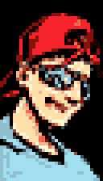

 #### MY HISTORY WITH FIGHTING GAMES, THE FGC, AND HOW MY FIRST LOVE, GUILTY GEAR, HELPED ME GET THROUGH THE PANDEMIC
 
 For the last few years I’ve been doing a year in summery of every game I’ve played. That’s a bit difficult to do now, since I’ve been writing up about games as I play them. It also is a problem that I haven’t been playing many game. In fact, I’ve been playing mostly just one.

I wanted to review Guilty Gear Xrd Rev 2 earlier in the year but, like is the case with any good fighting game, I have no intention to _stop_ playing it. So as the most important game in my life this year, I figured it would serve as both a great capstone for the year and an excuse to write about my history of fighting games.

This is needlessly long and needlessly detailed. I don’t know why anyone else would read it, but like many of my end of year lists, I’m writing it for me.

## A Boy with an SNES
[floatbox]

[/floatbox]
Mortal Kombat was released when I was 9 years old. I was a Cub Scout at the time and at my local mall for the Pinewood Derby. There was time before my car_(or, more accurately with the secret traditions of the Pinewood Derby, my father’s car)_ would be racing, so I asked to go to the arcade. I was told I had about 10 minutes.  
  
Some people remember everything. They can tell you all their friends in middle school, the names of every teacher they ever had, all the drama that happened throughout their youth. I can’t. I don’t reflect back often enough on these things to keep those memories fresh. But what I do remember I often remember vividly.

I remember that arcade. I remember where the Mortal Kombat machine was. I remember me, a socially awkward 9 year old, trying to peer around pubescent teenage boys who felt like towering giants to see a glimpse of the gory carnage that goes going on. Just the way the screen faded dark when a fatality happen made my stomach sink. Even the sounds of the game shook me. I wanted to play this game more than anything, but the line was too long so I watched and watched and watched.

I missed my race, but if I hadn’t, I doubt I would have remembered it as clearly as I remember those moments staring at a Mortal Kombat machine.

Mortal Kombat was the game I always wanted to play. My friends would also play Street Fighter and I’d tolerate it, but it never made sense to me. “Why would people play Street Fighter?” I’d ask. “There isn’t even any blood!” Young me had no appreciation for how gnarly it was [for characters to puke in SF2](https://twitter.com/KayinNasaki/status/1324111987731767297). MK motions also agreed with me more. It was the game I could actually, to some _vague_ extent, play. All fighting games back then made me feel clumsy. I was supremely uncoordinated as a boy, but MK made me feel _the least clumsy_, while appealing to me on a visceral level. I dabbled in other games sometimes — technically Teenage Mutant Ninja Turtles: Tournament Fighter was my first tournament game during the 1994 Block Buster World Videogame Championship — but I’d always go back to MK.

## XBand and the Original Online Warriors
[floatbox]

My old Xband Icon
[/floatbox]
Before people could argue about Wifi vs Ethernet, I was playing Mortal Kombat 2 over copper telephone cables. We were one of the test locations for the 1994 launch of the Xband modem for the SNES and Genesis. It must have been horrible, would I would n’t know any better. I was so excited to play other people. I was “Coolkid1” if I remember right and had an appropriate cool kid avatar to boot. This was my first experience being online, chatting with people, sending email (Xband had real email!). This was also my prototype for interacting with the FGC. Since matches were mostly local (to avoid horrible long distance prices) you could… meet people. We’d exchange phone numbers and chat. Eventually we’d meet up and play laser tag. I was the young dorky kid among a bunch of teenagers and gosh did I suck at Mortal Kombat but it was fun.  
  
Eventually I’d lose interest. A new Mortal Kombat would come out and I’d do all the fatalities (or get my friend with better execution to do them), play a bit and forget it. Occasionally I’d try xband, maybe win one game being super lame, get salty online and quit. It made me feel bad. I realized I didn’t like fighting games. I was a cool boy who liked jRPGs and playing games for the stories, dammit!

## MAME, MUGEN, Soul Calibur, and Finally Clicking With Street Fighter

It wasn’t until late into High School that Fighting Games started to enter my interest again. The exact order of these things were muddy but I remember playing Alpha 3 on MAME in highschool. This sounds insane to me to think a MAME had CPS2 decrypted and implemented before Alpha 3 was even out, but that was the pace of emulation back then. A friend in school showed me Alpha 3 on one of the school computers and the game seemed so much more dynamic and interesting than Mortal Kombat. While also having a fresher “anime” aesthetic, fitting my love at the time.

I never seriously played Alpha 3 but it was when I started thinking “Maybe I COULD learn to play fighting games”. I’d go to gamefaqs, find combos, try to do to them and fail over and over again. Eventually this spiraled into me finding MUGEN, exposing me to all sorts of incredible Neo Geo characters (the Last Blade cast sticking out to me quite a bit at the time) and allowing me to play all kinds of ridiculously unfair Dragon Ball characters. It was pressing buttons in a controlled order but I still wasn’t playing people. At the very least, though, I stopped feeling clumsy.

Then my friend Jordan got a Dreamcast with Soul Calibur, which started a multi-year feud. We’d spend hours fighting him and other friends in his basement. Mitsurugi was my first true ‘main’ in a fighting game, battling hi Ivy and Cervantes. I didn’t _really_ understand fighting games but I, in a group of people who knew nothing, was winning and I was winning by… thinking. By recognizing patterns, parrying stuff and doing that… really silly version of okizeme new players do where simply doing a meatie is enough to kill most players. I had a taste of what it felt like to be scary at a game. Not even a large fish in a small pond, but a small fish in a puddle. It was something, though!  
  
We also dabbled in other stuff. It was my first exposer to 3rd Strike, having seen for sale on Dreamcast. Both me and my friend bought had the same thought “Wait, they made a Street Fighter 3?”  
  
3s has never been my game and wasn’t then, but it was my first taste playing a Street Fighter game against another person while having a vague understanding about fighting games. My hands worked. I could PLAY STREET FIGHTER! Then we decided we didn’t like it and went back to Soul Calibur.

## Guilty Gear X2

Years pass. Friend groups changed. I’m in college and in contact with almost no one I knew in high school. I’m hanging out with my new college friends and we’re playing Alpha on someone’s old Sega Saturn. My friend John walks in. “THEY MADE A SEQUEL!” he shouts. He’s holding a copy of Guilty Gear X2. My other friend is also excited… Paul. Most people here would know Paul as the voice of The Kid in I Wanna be the Guy. While the kid is cute, Paul is a natural villain. The type of guy who gets voted out in Among Us even when he didn’t do anything. The type of person who revels in this fear. Another one of our friends turns to me and says…

### “Paul is really good at Guilty Gear. Nobody has ever beaten his Zato.”

This fucking shook me. _EVER BEATEN_? Paul wasn’t some bad ass tournament player or anything. We were just going pretty even in Alpha. NO ONE HAS EVER BEATEN HIM WHEN HE PLAYS HIS MAIN? I could get huge win streaks in Soul Calibur but someone would ALWAYS put me down eventually. How could one EVER beat him?  
  
I hated this. I hated this so much. I was good at fighting games now, dammit! I’d pick someone cool and get a win on him! I couldn’t let this stand! All men are mortal!  
  
_I got Sawbladed into the fucking dirt._

I went to gamefaqs and did research. I settled on Anji, who at the time seemed to fit me aesthetically and seemed neat enough but I never felt like I was doing enough damage. “Mike, you gotta combo into super”. I look up my super…Half Circle Back, Forward.  
  
Excuse me? I’ve done QCF+Multiple buttons. Double QCF+A Single button. Maybe even Half Circles. But HCB+F… and I have to time this to cancel an attack in a combo? When I know I actually hit? I felt stumped, but I wanted to beat Paul. I couldn’t stand this.  
  
I got desperate. I didn’t have a PS2 so I got a rom of Guilty Gear X Advanced just so I had some way to practice! I got better, I could do things but I was still the weakest. John would fuck me up too. Charge Stun Edge on wakeup followed by Stun Dipper might as well have been unblockable at my skill level.  
  
I kinda gave up for awhile before I started hanging out with another friend, Roger, who also enjoyed the game. He was super casual about playing it and that gave me time to breath. Despite that he was knowledgeable, suggesting characters for me to try and things to do. This is also the introduction of Patito. At the time Patito was too shy to talk, but we’d play Guilty Gear together at Roger’s. He had more fighting game experience than anyone else I’d been playing with but Patito, to this day, has a natural ability to mold to his opponent. Playing against Patito would always feel close no matter what your skill level was. So I learned. I picked up Ky and started beating people. Not Paul, but I could at least _play the game._ I still felt unsatisfied.

### The Turning Point: Guilty Gear X2 #Reload

This went on for a whole year. I’d go back and forth being interested in Guilty Gear. Paul’s Zato was still largely undefeated (someone HAD to have gotten him in that time but he was still fucking people up). I was getting better, but barely.

I don’t know who told me about #Reload or that a PC version was available, but that’s when my life changed. Being able to go into training mode and practice things ON MY COMPUTER felt incredible. I joined Dustloop (actually before that I joined… gosh, what was it, Romancancel dot something??) and started looking up actual combos. At this time I was eyeballing Johnny and Baiken. Ky was a pragmatic choice but Baiken was a character that really appealed to me. Johnny too, but even at a low level I could tell he was too technical for me (Patito kept pushing me to play him anyways). I started engaging with the actual game systems. What was the point of a Roman Cancel? That thing that made me lose all my meter as I mashed buttons? Why would you spend all that meter when you could do a super? What, spending 50% meter to cancel a move animation was more important than doing a super??? Some moves can be “FRC”ed for only 25%???  
  
… Well I started trying to learn two things. Baiken’s j.D frc while learning her corner dustloop. 2d Tatami j.sd air dash j.sd land f.s j.d FRC air dash j.sd  
  
I spent months doing that over and over again. My first _“Bread and Butter”_ combo. I started feeling hungrier. Looked for Dustloop locals. I remember cramming into a New York Zappa player’s basement to play. I probably never won a game playing at Phrekwenci’s place. There are also probably tons of player names I’d recognize if they were told to me now who played over there. But I remember specifically meeting and watching Marlinpie. At that time he wasn’t even 18 and was playing on the official PS2 Guilty Gear stick. He was at a level fair above everyone else in that cramped apartment and we all just tried to absorb whatever it was that he had.. I’d head there, sometimes with my friend Ben (tangentially related to the old Soul Calibur circle) who had also started working up his Slayer. We were hungry. Encouraged by one of the people at Phrek”s gathering, I started trying to play Johnny. His Bread and Butter was a bigger challenge than Baiken’s…

_5k 5h mistfiner level 2 mid dash 5k6 5h DBT FRC j.ks j.ksd Ensenga_

So many parts of this combo haunted me. Simply landing the kick after the mist finer was hard. My timing for the dash in and kick felt like it had to be frame perfect. It was nowhere close, but it felt that way. My sense of timing was still really coarse. The Divine Blade FRC was fast and it wouldn’t do a normal RC if I mistimed it like Baiken’s. I had to be perfect… and the jump install. the “6” the up motion during the kick… that took forever to actually do but I was hungry for I kept trying.

When Paul fell, Paul fell fast. Not for any lack of natural skill. To this day, Paul is a motherfucker who can find the cheapest shit in any game he plays… but because we were hungrier. The tides turned from Paul’s Zato can’t be beat to Paul’s Zato can’t win. The level of play of the whole group was elevating rapidly. I started switching characters to go easier on people, slowly learning the whole cast to some degree. I remember playing Dizzy against him for the first time and him getting ready to hurl a controller. “She’s already your best character!” She wasn’t, but it felt like that.

Eventually he quit. This made me sad… but at the same time I took perverse joy in it. I had gotten good at Guilty Gear out of spite and now it was with me for life. _We were hungry._

### Guilty Gear X2 Slash, Sticks, and my true entry into the FGC
[floatbox]

[/floatbox]
Slash coming out represented a problem for me. The game didn’t have a PC version. But we all figured out swap magic and sometimes someone would lend me a PS2 to practice.  
  
Back in the day, you couldn’t just pick up a ready to go arcade stick. Custom sticks were the cheap option back then compared to having to import a HRAP and then replace all its buttons. Ben and I got to wood working and soldering and managed to get two lovely sticks. Ben still uses his to this day.

Sometime into Slash I got a message on Dustloop from some guy named “LI Joe”. Slash had come out and he wanted to learn it. Came over with this giant tub of a stick. It was the official one that came with the Anniversary Collection of SF2. Joe, for not knowing Guilty Gear was pretty good! And he was friendly and nice and cool and everyone enjoyed being around him. Afterward he asked “You play anything else?” “Yeah, we’ve been messing with 3rd Strike”.  
  
Long Island Joe’s Urien gave me a beating I have yet to experience again in any other game. I was laughing as he demolished me, throwing out Aegis Reflector combos like it was a combo video. Meeting Joe was super exciting and lead to me, months later, showing up at our locals at “Castle Golf”. I ended up running the Guilty Gear brackets and helping the event host “SweetJohnnyCage” (who eventually went on to host East Coast Throwdown) set up every month. At this point, I was… in the FGC. The little stories and friends I made at this point would be innumerable. I rarely traveled — to this day I’ve never been a major — but I’d still pop up in NY locals or Chinatown Fair all the time. Enough for footage of me to [show up as “Melty Blood Aris” on one of Jiyuna’s recent videos](https://www.twitch.tv/animeilluminati/clip/SquareHelplessSwanPanicBasket?filter=clips&range=7d&sort=time) (_Disclaimer: I was there to play Akatsuki Blitzkampf_).

### #Reload Online

Early Guilty Gear was a game of massive skill and knowledge disparity. While there were good US players, most of us were limited to playing only a hand full of friends and knowing only a few matchups. The #Reload netplay hack was a game changer for me and I was so happy it existed that I ended up modding the irc channel for quite some time. While the game was one (and soon, two) versions old, the experience of being able to play a wide variety of people online and play matches I never got to experience was huge and gave me an edge in local events. This wasn’t much use to the actual good players. They traveled and got quality experience in at majors — but for me, a local monster? It was a god send. Before Hotashi became a terrifying Elphelt in XRD, he was getting bullied for being a scrub on the #ReloadOnline IRC channel.  
  
I started to feel good about how I played. I had a shot against most people I played. I wasn’t consistent enough to win highly contested tournaments, but I could be a threat against most people. At the same time, playing someone like Marlinpie still made me feel like I knew absolutely nothing. And this is the level I kinda stayed at for quite awhile_(Heck, this might still be where I’m at now)_.

### Accent Core, Blazblue SF4 and the Dark Period

Slash came and went and Accent Core took the spotlight. I kinda hated it at first (I loved Slash Johnny so much) but it felt like it was going to be the Super Turbo of Guilty Gear so I stuck with it. My friend group (Including the before mentioned Ben and Patito) would play pretty much every week for a few years. We’d jump to stuff — Meltyblood, Blitzkampf, KOF, Hokuto no Ken, Super Turbo, even Arcana Hearts for awhile — but Guilty Gear was always what we went back to. Eventually Blazblue came out and we were universally disappointed in it (It might be fine now but CT kiiiinda blew), but SF4, despite feeling like such a compromised game, struck a balance with everyone. I was never super serious in SF4. At this point I rarely went to locals anymore but I kept current with my friends. I couldn’t keep up the same energy, but as long as my friends could play, I was golden.

… Then, sometime around Ultra, Patito left. Patito, who could play with everyone and be a challenge for anyone, kept the groups interest in fighting games alive. Without Patito to bridge the gap between players, only Ben and I were left and well… the old men got tired. There was a few years there where we barely played anything at all.

### +R, Xrd, IWBTG and the Second Dark Age

+R came out and I had no one to play with. Finally Accent Core was back and Johnny was extra cool and I was hungry again. I started going to locals again. LI Joe welcomed me back as if I was never gone. I bullied his Eddie. A good time was had by all. I road this for a year, playing and improving, going to locals again, doing all right for myself. I was pumped for Xrd, but when it came out and I played it, it… didn’t do it for me. It felt like +R but less. What’s worse, I had no main. No Johnny, no Baiken! I tried Sin, and he didn’t agree with me. Millia and I-no almost worked but at a certain point I decided the game wasn’t for me and +R was already dead. The second dark age was on me, but at least it wasn’t completely detached from the FGC.

IWBTG hit big on twitch around that time. Floe’s playthrough and me taunting him during it was magic. The [IWBTGG run](https://www.youtube.com/watch?v=Ixgagswag8M) at EVO is honestly one of the highlights of my life. It felt nice to be attached to the FGC even when I wasn’t playing

## Finding Sanity During Lockdown: How Rev2 Filled the Social Hole in my Life

A long time passed without a lot of fighting game fun to be had. Ben and I would play Super Turbo sometimes… sometimes we’d hop on GGPO to play some weird stuff. Basically 5 years of not really seriously playing. I generally hated netplay. I could tolerate it barely during #Reload but as time went on I just hated it. SF4 was miserable online and Guilty Gear seemed like it would be even worse.

But then during lockdown, Patito and a buddy picked up Xrd Rev 2 on sale and were playing it. I already decided I didn’t like Xrd but thinking about it… why not? I don’t know what the game feels like offline anymore. If I got it, I could maybe play and not hate everything. So around May I started going in hard, learning Johnny again. I never played Revelator but didn’t like what I read about how Johnny was handled. I would be excited to play a high tier, but he seemed too straight forward, getting re-coins and knockdowns off of every combo. I put a few months into him. I was having fun and playing online more, but it didn’t feel right.

I don’t have super crisp execution. I can do hard shit, but I’m sketchy. X2 Era Johnny was perfect for me. People would drop his stuff all the time, especially his ‘one hit ensengas’, which were like a trickshot knockdown. Perfect execution with X2 Johnny was aspirational. You went for stuff and if you fucked up, it was okay. Xrd Johnny felt like you had to be perfect. He was good BECAUSE he got everything EVERY TIME. I felt like I was failing the character. I was doing okay but it felt like a bad fit… so who to play?

I always dabbled with Sol. I loved doing dustloops. He was just a fun character to mess with… but I always said I didn’t ACTUALLY know how to play him. I could fool around, but I didn’t understand yet how to actually open people up with Sol… but I was watching DEB vs Marlinpie and the way DEB used Sol and set up frame traps and got huge pay off spoke to me on a deep level. So I started screwing around with him, and the character I skipped playing seriously in Xrd slowly morphed into my main. I’m a glutton who loves when big chunks of the life bar disappear, I can’t help it.

I started streaming again. Random lobbies are cold and kinda miserable. I wanted community. Just having a stream with people in chat saying ‘hey come play’ seemed like a super friendly way to meet new players. We started amassing regulars. Acquaintances started to show up to play who quickly became friends (Hi, Shay!). Then… new players start showing up. Hey, the IWBTG guy is probably nice to play with, right? So I start putting it out there that we have a good place for new players to learn. MORE people show up. Oh shit, we can run a beginner tournament… Oh god we have 100 people in our discord??? It’s amazing to play with close friends again. Patito fills the same role he did years ago. Ben is right back at it, pilebunkering the younger generation.

So somehow I stumbled into making a community. Somehow I stumbled into running online tournaments for new players. Somehow I’ve managed to tolerate delay based netcode because it lets me play people in a game they feel comfortable with. Having weekly streams has helped so much during COVID and creating a space that seems welcoming for not just new players, but queer and marginalized players has felt incredible. Not only am I playing to try and improve, I am playing to entertain and to help out others and am super proud of the little friendly spot I’ve built.

So after all this, how do I feel about Rev2? How do I feel about it, now that I can run off to +R with glorious Rollback Netcode? Well, two revisions did a lot for the game. While not as wild as +R, it feels wild in its own right. More importantly though, despite its annoyances, the RC system and generous buffer lets new players play the game without getting blocked out by FRCs. The game is fun like any other Guilty Gear, looks absolutely gorgeous and contains the players I want to play with. Everything else matters less, because at the heart of it, it’s still Guilty Gear.

Also I tend to play games for a character. +R gives me Johnny, while +R Sol doesn’t appeal to me as much. I get what I want in both games!

SO now it’s January 1st. I’ve run 3 beginner tournaments, a team fight, multiple show match cards and have one of the nicest, most fun Guilty Gear discords in existence. I’ll probably be trying to stick to Rev2 through Strive too. First release ASW games haven’t been kind to me, but at the same year once Strive has some time under it’s belt, maybe I’ll feel about it the same way I feel about Rev2 now.

_Thank you everyone who has found themselves part of this community. I could write a whole article just on all of you but all I’ll say here is I’m happy to know all of you._

Happy 2021 everyone, lets get past COVID and play some Guilty Gear. This old man is washed up but isn’t willing to stop yet. Guilty Gear wasn’t my first fighting game, but it was my first love, and I didn’t realize how much I missed it now.