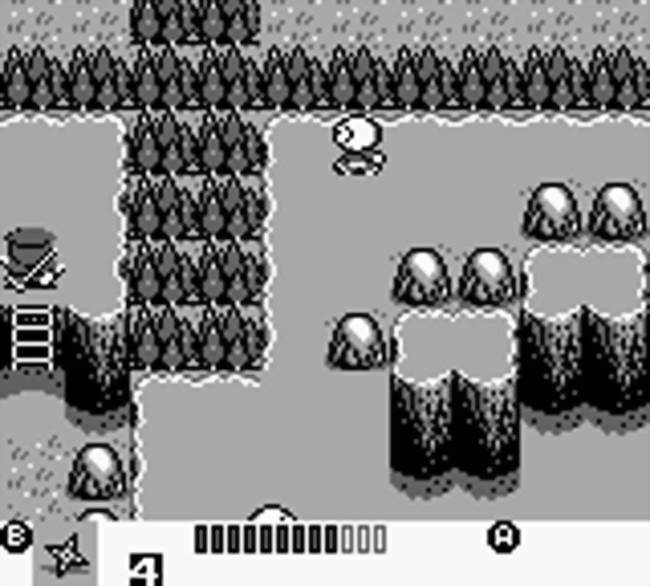
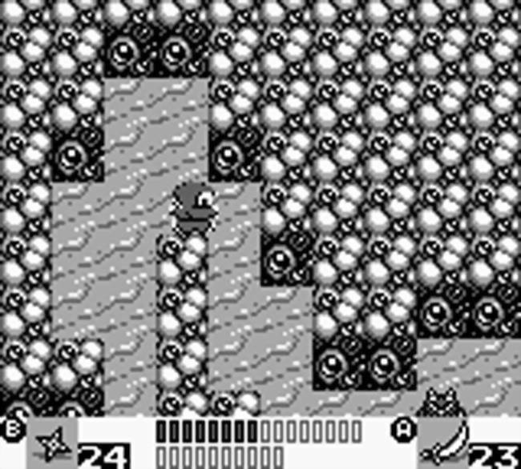
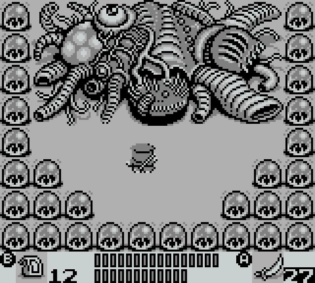

[floatbox]

[/floatbox]
Ninja Taro (or it’s proper name, _**Sengoku Ninja-kun**_) is the exact type of game I hope to find when randoming in through old roms. I can’t expect to find some beautiful classic I never heard of (unless it’s on some obscure system I never knew about), but I can sometimes stumbled into flawed, quirky games with a good bit of ambition.

Ninja Taro isn’t a particularly good game. Just going by controls, it’s a bad game. But it fits a genre of game I always am interested in when I bump into them. I love finding an old ass Zelda clone. For all its popularity, bold faced Zelda clones are surprisingly rare. Zelda 1 clones are the most rare (Golden Axe Warrior being the only one that quickly comes ot mind) but most fit this weird in between zone between Zelda 1 and a LTTP.

Ninja Taro is right in this zone, though perhaps leaning more toward Zelda 1. The game is fairly linear but doesn’t restrict you. You can, and sometimes must backtrack. The game wants you to go one place, but the level design tries to keep up the illusion of a larger world. The overall structure of Ninja Taro is excellent, perfect for a Gameboy game. A more guided version of Zelda that never completely veers into restricted linearity.

Ninja Taro’s biggest issue sadly is it simply doesn’t feel good to play. 4 way awkward grid movement makes combat more about standing in the right spot and waiting for enemies to do all the work rather than active combat. Attacking on the move just isn’t a reliable thing, and you have to wait for Taro stop move to the next sub-grid piece before taking an action.

Most of the items you get are utterly useless. The game gives you ninja camo, fire, bombs and probably some other stuff, but no situation merits using anything but unlimited use swords and protectiles. Even bosses fall fast enough to rapid attacks that using any of these items is simply a waste of time

[floatbox]

[/floatbox]

The game contains other gadgets. Ladders, bridges, sacred offerings… but having to go into the menu to equip them, use them, and then back to reequip your favorite sub weapon is needlessly tedious. Almost a punishment for misplaced ambition.

The game still gives a lot to find. You regularly find powerups for your basic weapons. We’re not talking about like a “+8 sword” like I found at least 30 of them for one of my swords and all that damage adds up. With pickups for two swords and 3 different throwing weapons, plus health, there is a lot of rewards for looking around. The weapon variety isn’t great though. You quickly find a sword that hits in all 8 spaces around you and thee is little reason not to use it. I theorize there might be more +1s for the default sword, ultimately leading to it doing more damage, but given how fast bosses die, this would be a weak sacrifice. Short ranged ninja stars seem to have more damage than throwing knives, but there range is so short they seem pointless to use over a sword. I enjoy the variety in the game, but the bloat does take a toll in terms of usability

While bosses are underwhelming, basic enemy design is neat? While your movement sucks, they seem to be designed with that in mind, being varied but predictable, allowing you to plan. Some are just dumb simple tanks, some always turn 90 degrees. some grow in ever growing circles, but regardless they’re all easy to understand.

The game is mostly linear but there seems to be things you can do in different orders and other things like optional bosses. It’s extremely fleshed out in a way you wouldn’t assume from the game in the first 10 minutes. It manages to set up simple stories and reoccurring characters that are extremely basic yet perfect for an early Gameboy game.

[floatbox]

[/floatbox]

The game is simple looking but at moments the art drifts into the grotesque. Walls with eyes, giant fleshy demons. All great stuff mixed in with this otherwise cute game.

Sadly the game drags at the end. The difficulty ramps up exponentially. The game has no lives and forgiving continues. You keep all items and other progress when you die, but simply get sent back to the nearest town you saved at. Sadly by the last areas of the game are large and the travel time to retry grows and grows. The game also gets way into illusionary walls near the end, which adds to the crazed level of trial and error. I could forgive a lot about the game but this dragged it down a lot for me. Fortunately some online maps makes things a little bit more reasonable.

Is Ninja Taro worth playing? Probably not. But if you like weird old quirky games not a lot of people have played, it’s kinda cool? Definitely glad I finished it.