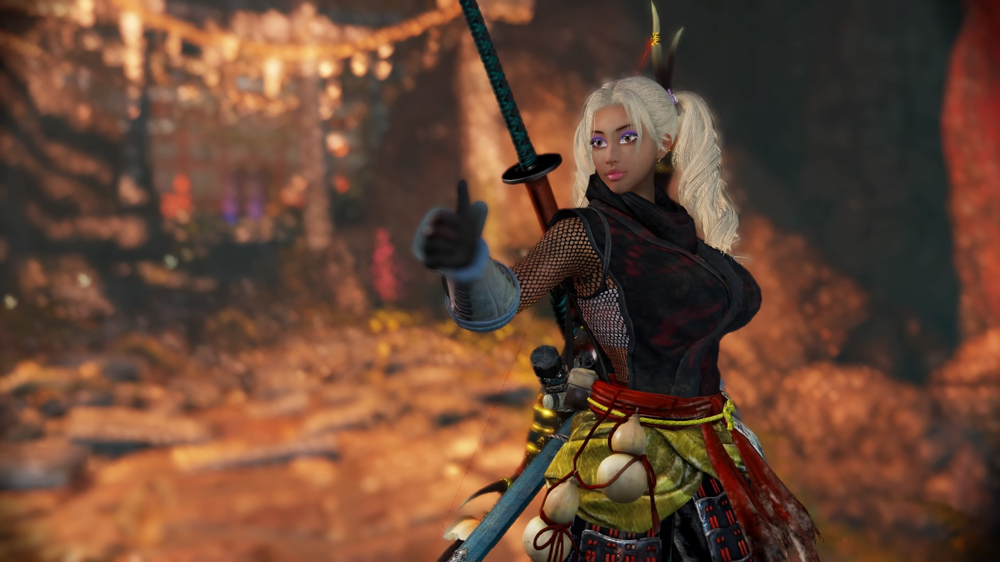

I’m reluctant to say Nioh and Nioh 2 are bad games. A lot of people enjoy the games and when a lot of people enjoy a game — especially a niche game with no brand recognition — it means the game is succeeding at something. These are also games I would never buy for myself. The pitch of “It’s Dark Souls but with Diablo Loot” sounds like such a downgrade for my particular tastes that I’d never bother. “Soulsborne-like” is already a genre I avoid. Fromsoft makes games I enjoy because of their tastes and sensibilities more than anything else. The idea of those games as a “genre” has little appeal to me. Loot and skill trees? Something that tends to actively make me miserable. In short, It’s just not at all a game that would cross into my interest radar.

Unfortunately, A friend bought me both. Fortunately, I think said friend finds having a negative opinion as interesting as me having a positive opinion.

## Nioh

I tried to write this with an opening summary but I could not. I constantly got caught up thinking about the differences in Nioh and Nioh 2 so it’s easier to talk about my experience.

My first impression of the game was pretty cool. Starting out this feudal Japan game in the tower of London was a strong start. The combat felt snappy and hits felt good? It felt like Dark Souls, but with more loot… but… quickly changed. Even in the first Nioh, the mechanical systems are much more interesting than Dark Souls. A lot of it is unnecessary complexity, but the basic battle of manipulating your and your opponent’s ki (stamina, basically) lead to much more interesting engagements. Yokai had the same feel as those Godhand demon enemies and were interesting to try and take down.  
  
… But something felt off. Especially when fighting game’s bosses. The mechanics and gauges and timings never quite felt like they lined up right. A lot of enemy behavior felt off. It felt… squishy. There was no flow to combat for me. Enemies felt like they would just… do stuff. Combat with small enemies was fast and lethal in a fun way but the more serious an enemy was the more it felt like the game wanted me to play as boringly as possible. With everyone telling me Nioh 2 was much much better and that I could make my own character, after the first region, I decided to move on. I can’t say anything definitive about a game I only scratched the surface of, but for what I played, Nioh 1 felt like a poor game with some strong redeeming qualities for some players. I was not one of those players.  
  
I had other feelings on the game as well but most of them carried on to Nioh 2 so….

## Nioh 2

I made a big muscly gyaru yokai girl and immediately felt happier.

Immediately the game felt better. Stuff like ki bursts and how they timed with enemy actions and the windows and everything felt -right-. Enemies attacked with a little bit more sense and timing and things just felt tuned better. I could finally engage with the game how it wanted me to engage it with. The flow of combat, switching weapons and stances on the fly and everything felt great. Yokai felt way more approachable while being just as much or even more deadly. I had a blast beating down ki with tonfas to switch on a ki burst to an odachi to finish off my opponent. At it’s best, the combat of Nioh 2 flowed together great. Even the average boss of the game felt pretty good.

But what about the other mechanics? The skill trees? The loot? All of that?  
  
It’s fucking trash. Complete, bloated trash. The loot is miserable busy work that you still want to pick up for parts to use with a blacksmith you probably won’t actually use to NG+. Never once did I get an item like “Oh my god that’s so good!!!”, just a steady upgrade slowly over time that quickly because tedious work to clear out. The skill trees, while containing useful, fun abilities are filled with “4% to human enemies” style crap and -whats worse- is that the fun stuff is front loaded. You don’t have exciting, incredible skills to work toward, you got SPREAD SHEETS. Every weapon seemed to have one skill that’s a game changer, is located weirdly in the middle of the tree, and won’t be unlockable until NG+ for… reasons??

In fact, the amount of things that give you little micro bonuses is obscene. You have your equipment, each piece giving you anywhere between 2 to 6 line items of little bonuses or modifications. You got your skills, which can give you more little points. You got your guardian spirit. You got the yokai abilities you equip to your guardian spirit. Actually now you have three guardian spirits each with 3 yokai abilities and the yokai abilities can be leveled up by fusing them and ALSO you get TITLE points for doing… achievement like… things…?? that give you things like “+0.5% Elemental Resistance”. You have the clan you join. YOU HAVE YOUR TEACUP COLLECTION. Oh yeah and your stats but that’s like the bingo free square.

It’s a -mess- and if you don’t properly engage with these systems at the right point, you can be putting yourself far behind and not know it. You’ll be given multiple options of how to deal with excess soul cores and equipment, but you won’t know what is the right one. You will accrue money and have no idea what to spend it on because of the churn of equipment. It’s convoluted garbage that possibly appears to some spreadsheet lovers out there, but I’m certain even by spreadsheet standards, these numbers and systems could be much better. In fact, I’m not sure if I can trust anyone who loves spreadsheets and character action games. That seems pretty sus to me. I got my eye on y’all.  
  
So for awhile I was digging the game. I was enjoying the gameplay even while I hated the homework. Fast and deadly combat on both sides was just nice and exciting and the environment and Japanese horror/mythology aesthetics were dope. This game just had a ton of cool haunted shit. Occasionally I’d hit a stumbling block, but I’d be enjoying the stages enough that I’d want to push through

Enenra was my first stumbling point and gave me the sensation I hate the most in a hard game. Enenra’s beefy health guage made him a battle of endurance, and many of his attacks seemed rather unfairly sudden (a huge issue in the game in general). A favorite was a him having two “Burst counterable” moves, one of which was rare but seemed unreactable by most people _(turns out one of your 3 ‘burst counters’ can’t reasonably burst counter a bunch of moves in the game and the game makes no indication to you that “hey maybe a different guardian spirits burst counter will help!”)_ and would hit you for a lot. So I ended up in a situation where I felt like I had the boss figured out — I could execute my plan and I KNEW it would eventually work, but I just had to wait for that attack to come up less than in other runs. When I beat Enenra, I felt nothing. I had already stopped growing like 15 attempts ago. It was like your friend finally showing up late — a weird twinge of relief and annoyance.

After that I pressed on. Pretty deep into the game from what people told me. Occasionally a boss would be stupid or have some dumb attacks that were poorly telegraphed but I could muscle through for the things I liked. But then I hit the turning point. The game felt like it was no longer changing. Levels were just fighting the same yokai over and over again. Human enemies were chumps — fun to fight, but nothing new and exciting was going on there…. and the yokai… Most of them didn’t really need to be approached very differently. Most of the skills I could upgrade were boring bonuses and none of my equipment or yokai abilities were game changing. I just did… more of the same. The enemies stayed the same. The environments stayed the same. The bosses were a crap shoot between ‘pretty good’ and ‘bad’ but oh boy did I hit into  
Shibata Katsuie.  
  
Shibata is a pretty infamous boss with Nioh 2 which was apparently already nerfed several times before I even got to him. Like Enenra, he’s a huge tank with sudden damaging attacks who just seems to -do stuff-. He’d be far from the hardest challenge I’d overcome in a game but I got hit by a feeling that was nagging at me for awhile. I felt like I was giving a lot to this game and getting nothing back. The game asks a lot of skill from me, but doesn’t reward me emotionally. I don’t get to see a cool new area, I don’t get to find cool new weapons, I don’t get to unlock cool new abilities or fight cool new enemies. Maybe I’ll get one new enemy. Maybe. The poor balance of the game didn’t even let me feel the thrill of victory. Victory, when it came on hard bosses always felt like they were overdue. I took a week off from the game, came back, did like 5 attempts, did much better but… just didn’t feel anything. I was waiting for my friend to show up again. I’d have no sense of accomplishment when he was dead and nothing exciting would happen in the next mission. I’d get more of the kinda incomprehensible story that I lacked the historic context to properly appreciate (which I’m sure is awesome for people who know more about japanese history), but… without the context it doesn’t mean much to me.

So at that point, I decided I was done with the game and would write this to seal it. I knew I’d enjoy doing literally anything else. There is, at least for me, a comfort in having done a lot of hard things in games. I never have to doubt myself like “Maybe I just have to get good” because I -know- I can get good. Or go at grind for levels or loot or look up a cheese build and use a book of reincarnation or ANYTHING. The question instead for me is: Does this game make me want to get good?  
  
No, it absolutely did not. Through all it’s improvements from Nioh 1, it could not engage me on that level and that makes me sad. I would not call Nioh 2 “A weak game with redeeming qualities”. It’s a good game with some strong flaws. If the good parts align with your interests and the bad stuff is stuff you tend not to notice, it’s great and I can say that because I know plenty of people who say its great. For me, at lot of things it did that people like if stuff I don’t enjoy (build tweaking and grinding) and the stuff it fucks up is stuff that hits all the wrong nerves. I like the game enough that if it were easier I’d push through it, enjoying a moderate challenge and some good vibes… but none of that is worth overcoming the harder parts of the game for me.

## Maybe it’ll get Better

During all this I was constantly cursing Team Ninja. “You guys have been making character action games for like 15 years, how can you fuck up boss design and get shown up by the company that made Kings Field??????”… but that’s not fair. I actually went through the credits and saw what a Ship of Theseus Team Ninja is. Barely anyone in design rolls worked on much else. This is a company trying to rebuild institutional knowledge. Judging from patches, they hear complaints, see where they fucked up, and try and make improvements. If I treat them like a relatively new company making their first IP, the growth from Nioh to Nioh 2 would be inspiring. Even with its flaws, Nioh 2 is a game I almost really liked, which is why all of this is so frustrating to me. So maybe with that in mind, Nioh 3 will be a game I like.  
  
Sorry Trynant, I tried my best.