**This is an old semi-commisioned piece someone paid for. The website it was on is now long defunct but no reason not to save it.**

[splitbox side="right"]

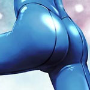 
Samus Aran

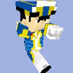 
Adam Malkovich

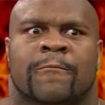 
~~Anthony Higgs~~ 
Bob 'The Beast' Sapp

 
Madeline Bergman or a Little Girl

 
Red Shirts  Cheap and Disposable!
++++

I hesistate to refer to what I’m going to do as a review. In fact, if you care about spoilers, **DO NOT** read anything outside of this paragraph. Instead I wish to pick the game apart and explain how it ticks. I will say right here that it is absolutely playable, and, depending on your tolerance for bullshit, quite good. Despite being highly critical of games, I’m, in a way, rather forgiving and thus had a mostly positive experience overall. I’d perhaps even play this again — well before Fusion or Prime II! Despite that, I would say its flaws are more egregious than any made in either of those titles. I’ll get into where its strength lies, but first I want to get through the worst of it.  

**\*MASSIVE SPOILERS INCOMING\***

Now, unlike most people, I am not immediately and deathly afraid of a Metroid game having a plot. Just because it was terrible in Fusion did no mean the idea had to be terrible forever and I support games trying to innovate. Sadly the plot in Other M is a Trifecta of failure.

*   All the text in the game are horrendously localized. In fact, I dare say no localization occured what so ever. It was a translation in the strictest sense. It’s like Sakamoto got an intern with a basic grasp on english to translate it. The dialogue is stiff as hell and in no way resembles conversations with real people.
*   The voice acting is awful. Why Retro hired Jennifer Hale to grunt, but Nintendo hired some random nobody is beyond me. I’m not going to say any of the voice actors were _bad_, but none seemed experienced enough to salvage the crap they were given. Instead, they stumbled on it and made it even worse.
*   Oh right, Sakamoto can’t write and there are no editors in Nintendo apparently.

The Story
---------

I could expand 3 into subsections spanning the entire alphabet, but I’ll just finish up here. But first and foremost, no one who worked on this game could write worth a damn. I think, conceptually, the ideas presented in the game are salvagable, but no one was capable of _actually salvaging it_.
[/splitbox]

**Is Other M Sexist?**

This is the question that was going around since the the game came out and cutscenes were available on youtube. Well I have an answer for you! _No, it isn’t_. In much the same way that Author C Clark said…

> “Any sufficiently advanced technology is indistinguishable from magic.”

I propose that…

> “Bad writing is often indistinguishable from sexism.”

Samus was not written to be a weak female, they simply did not have any clue how to characterize her outside of your typical female stereotypes. If you look at the rest of the cast, we can also deduce that bad writing is also indistinguishable from stereotyping.

So what actually goes on in Other M? Samus wakes up at Federation Facility after her mission on Zebes (Super Metroid) and basically goes through some quick medical treatment before being released. She laments about the death of the Baby Metroid that thought of her as its mother and from that point on can’t stop obsessing over this whole baby thing. This is actually a fair bit of characterization. Maternal issues with female characters is a fine way to express feminine qualities. Whether it should have been applied to the young, adventurous and independant Samus Aran is debatable, but what is not debatable is the fact that this bit of characterization is handled with all the grace and tact of a **nail bat**.

Samus, now rollin’ through the cosmos in a ship that is (and has traditionally been) a giant version of her head recieves a distress call. A _“Baby’s Cry”_ from a _“Bottle Ship”_. Perhaps this is where Iwata-san should have taken his belt off and beaten Sakamoto. Perhaps Gunpei Yokoi should have risen from his grave to stop these atrocities. Perhaps Sakamoto’s nail bat or his team of Ninjas protected him. Unfortunately, the plot presses on.

Once on the Bottle ship (and this is a good time to remind you what a horrible name for a game M:OM is), Samus, after some pixel hunting, discovers a federation unit on board the ship. The squad composes of Adam Malkovich, her former CO from her Federation days, token black dude and Samus’s old friend from her old unit, Anthony Higgs Bob “The Beast” Sapp, as well as an ensemble of various poorly characterized red shirts.

Adam agrees to allow Samus to help as long as she follows his orders. These orders involve not using any equipment that he has not authorized, meaning Samus has to disable her entire arsenal outisde of bombs and missiles. He does makes a point to explain how incredibly dangerous super bombs are to justify this, but this “Clever justification” quickly becomes a problem for both the plot and gameplay (which I’ll get into later). You see, Adam is characterized as a military genuis. So much so that an AI of his personality was made in Fusion. The problem is, Nintendo does a lot of telling, but no showing. Adam doesn’t make a single good decision throughout the entire game. Now let me just say, I was ready to like Adam as a character. He dresses sharp and isn’t a japanese style pretty boy or anything. He looks serious and determined and actually carries himself with the necessary dignity for the role. I hoped perhaps I could like Fusion’s plot a little bit more by understanding why this Adam guy was so great. Between both games only one decision he ever makes carries any heft. It’s eventually revealed in a flashback that Adam sacrificed his own brother to save the lives of hundreds of people. Sadly this scene was mostly about how much of a brat Samus used to be, because all she could do is berate him on how bad an idea it was. Anyways.

The first order of business is to separate everyone into solo missions despite communication systems being fucked. Apparently Commander Malovich isn’t aware of the concept of fire teams or anything either. So it turns out the ship, which contains every climate on earth (and an **ACTIVE VOLCANO**) is a site for Federation bioweapon research (which is illegal fyi guyz). Well, that’s certainly not good news. Neither is some random red shirt dying off screen. Everyone proceeds to emotionlessly gawk at how fucked up the corpse is and Samus is sent into Active Volcano Zone.

And, like Norfair before it, **AVZ** is so hot you lose health just by being in it. You see, Adam hasn’t _authorized_ the use of your Varia suit yet! You’d think Samus would complain, but she acts like a good girl until she encounters the area’s boss. After letting Samus cook for god knows how many screens, Adam finally calls in to authorizes the use of the Varia suit. A piece of equipment that posed no threat to anyone. Adam Malkovich, Military Genuis, decided it was okay for Samus to toast a little bit before letting her activate a harmless piece of equipment. Lets look at what else Samus couldn’t use that wouldn’t hurt anyone…

*   Gravity Suit
*   Space Jump
*   Grappling Beam
*   Speed Booster (arguable)
*   Ice Beam (sheerly because all the Fed troops were explicitly authorized to use them previosly)

[splitbox side="right"]

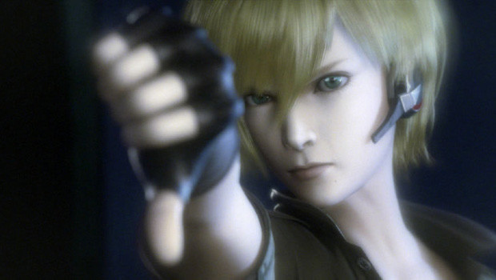 
Not even Samus is a big fan of Other M's plot

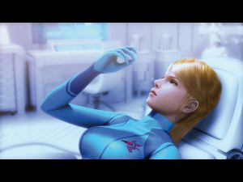 
Samus wonders where her cool armor went!

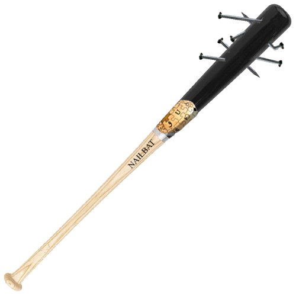 
Sakamoto's Nailbat. +5 vs Plot
++++

So in short, _Adam sucks_.

Eventually you get ordered into the tundra. You find another dead Redshirt and Madeline Bergman, lead scientist on the ship and seemingly the only survivor. She freaks out, assuming you’re going to kill her. Why? Because she saw one fed soldier shoot another (the dude you found, to be exact). Well, that is certainly a good reason to be nervous. Then the assassin shows up in a giant murder forklift. The game goes out of its way to show he’s in federation power armor, but doesn’t show you his head.

Not that it matters since power armor has _helmets_.

So you beat his forklift up and him and Madeline disappear for no reason. Samus then wonders who could be the killer. Could it be Adam? Bob “The Beast” Sapp? Some nameless red shirt? I will actually say flat out, that you never find out. You can make an educated guess that it’s the last one you find dead, but this entire plot point is basically aborted by the end of the game. Anyways, before we get to the worst scene in the whole game, lets go over some things that pass for characterizaton thus far that I didn’t go into.

*   Adam refers to Samus as “Lady”. A big deal is made out of this as if it was some deep thing.
*   Bob “The Beast” Sapp refers to Samus as “Princess”. Not much of a deal is made of this at all.
*   Samus, while undering command of Adam, when his unit was supposed to give the thumbs up to express approval of his orders, Samus would give the thumbs down. **OH SNAP**.
*   Samus also has inner monologue where she can’t shut up about “The Baby”. [I’ll just link an example](https://www.youtube.com/watch?v=sR2FWwYCWkE). It’s basically the same thing every time Samus opens her mouth.

So eventually Samus meets up with Bob “The Beast” Sapp and they run into Ridley, which apparently evolved like a pokemon from this little cute furry bird thing that was following you around. Sweet, we’ve waxed Ridley a ton in the past, right? Well, as you probably know as someone who is on the internet, Samus totally freezes in terror, has flash backs and gets wrecked by Ridley so much that her clothes fall off. Finally Bob “The Beast” Sapp intervenes and gets flung into lava, snapping Samus out of it. Some people like to justify this scene saying something horrible like Ridley would never **not** be horrifying to Samus. Others say this is why Other M is sexist. Again, no, Sakamoto just has no idea what he’s doing with the plot.
[/splitbox]

It is a fair thing to want to characterize Samus with fear. Samus’s parents were killed by Ridley (though I’m not sure the game actually explicitly states this, even though it explicitly states every other obvious piece of information at least five times). The problem is you can’t forgo the precedent established in your previous games. Samus has killed Ridley twice, not counting the Prime series. You can’t make her scared this time just becasue you couldn’t make her scared in the previous 2d games (and they could have in Zero Mission anyways). But they did it anyways and they did it in an act of ham fisted characterization. It’s not because Samus is a weak girl who needs to be saved by a big black dudes, it’s because Sakamoto wanted to show how traumatizing Ridley is and how he hurt Samus. He wants ot show that Samus hates Ridley. Sadly he can’t write, so we get some schmaltzy garbage people try and pass off as PTSD or something. Samus is a heroic character type and such responses are inappropriate. The PTSD angle could maybe work in theory (since it is realistically plausible), but considering Sakamoto’s subtle **nail bat** style of writing, that would be giving the scene too much credit..

Anyways, to speed along, Samus loses contact with Adam, finds out that Adam wrote the report for using Metroid’s as bio weapons and that there are in fact **METROIDS** in a **RECREATION OF TOURIAN** with its very own **MOTHER BRAIN** all made out of **BABY FLAKES**…. **RIGHT OVER THERE**. So you head over, all excited. You get to the elevator. You see a baby metroid that Samus as some mommy issues with before deciding it must die. She aims, goes to fire and… is shot in the back. By Adam. With a gun that makes her clothes go off. He then ices the metroid. He then explains to her while she recovers that she can’t go in there because the new metroids are immuned to ice to be the perfect weapon. Samus asks how the fuck he froze that Metroid just now. Adam shrugs.

He also explains that his report was on how using metroids for war would be righteously retarded and how he’s going to go in there and blow stuff up so the tourian section activates its self destruct and he’ll die all gloriously. He tells Samus to go kill Ridley after she’s finished being naked. Samus than begs and pleads and gives him the thumbs down as he marches off to die. Adam saves the day. Well, I guess that was a pretty good decision — besides shooting Samus in the back and all that. So to finish up, a Metroid Queen eats Ridley, Samus kils it, finds the real Madeline Bergman who explains the one she found (who was also much younger looking) was actually an AI of Motherbrain in a little girl body and goes into a whole Metal Gear Solid style explanation for everything. Then Motherbrain shows up, then more Feds show up, then Motherbrain freaks out and summons monsters and you go to shoot her but oh wait Madeline shoots her instead and hey, Bob “The Beast” Sapp is still alive. After some goofy exposition, the game than ends. There is a post game where you go back to get Adam’s helmet thats meant to be the part of the game where you get to explore the ship, but that doesn’t have any plot relevance. You fight Phantoom **_(?!)_** and recover Adam’s helmet and then the space station blows up. Apparently it was a weight bearing helmet. Then you escape in classic fashion. While naked. Whatever.

Well, thats Other M’s story. This isn’t entirely spot on and some details have been compressed, but it’s as bad and awkward as described. It really does feel like Sakamoto played too much Metal Gear Solid when it came ot the plot. At least the cut scenes weren’t as long. That said, we’re not done yet.

* * *

The Actual Game
---------------

[splitbox side="right"]
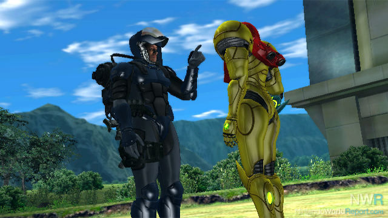 
Well excuse me, Princess!

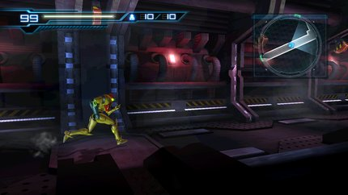 
I like hallways
++++

While the plot is a failure on almost every level, the game as a whole is close to being a flawed gem. I really like the core engine the game is founded on. Analog controls? I think they’re a highly overrated feature. I’m not saying analog controls are bad or that a lot of games aren’t better with them, but I could think of a ton of games where I practically never want to move in any speed other than “as fast as humanly possible”. Samus hauls ass in Other M in near Super Metroid fashion. The decision to fixate the game mostly into a 2d spaces was also great. You move primarily in straight lines, often in the typical 2d orientation. Some rooms recede into the background in proper 3d fashion, in the style of Crash Bandicoot, but somehow that isn’t nearly as bad as it sounds. There are other touches. Some rooms are just open. Other areas automatically make you run in a circle in a very fluid and enjoyable way. There are some hiccups occasionally, but in the whole it feels great. Analog controls were entirely not needed. You generally are either moving left and right or up and down and the times you do both don’t really stress gradual motions. The digital controls are snappy and responsive and makes the game truly feel like a 3d metroid without going all out, prime style, or hanging back on concepts such as “2.5D”
[/splitbox]
Combat is highly revised. You automatically aim at enemies now, which is required since up and down and used for 3d motion. This is fine, but would remove some amount of depth from combat to mindless button mashing. Metroid’s combat has never been deep, but giving the player something to do in combat is important. The designers got this and filled the void with the “Sense Move”. Tap a direction any time you’re about to be hit an enemy and you roll out of the way and get a free cannon charge out of it. I had a blast staying painfully close to meaty enemies, rapidly dodging while loading them filled with charge shot. The game also incorporates “kill moves”. Running or jumping on enemies at certain points (usually them being disabled in some way) triggers a stylish kill animation that generally kills the enemy off much faster than you normally could. This sort of gymnastics is the sort of thing we haven’t seen from Samus before, but it works. It’s not much of a stretch to think our Chozo blooded warrior would not have the capacity for fancy CQC kills.

What sucks however is the missile system. When I originally saw the first Other M trailer, I thought the idea was brilliant. Swing out the remote to point at your screen and go into a first person mode! In practice though, this mode sucks and it’s the only way to fire missiles! The transition is goofy. The camera switches to wherever Samus is facing, which is logical, but still extremely disorienting. You also have no bearing on what the wii thinks your remote is doing when you switch views, so you usually spend the first few seconds wobbling around until you center your self. The game slows down during the transition to aid you, but this only treats the symptoms. The system just feels bad. You can lock on with the B button, but that just furthers the need to totally adjust your hand while switching modes. To make it worse, there is seldom any reason NOT to be holding the B button, as it allows you to truly move around rather then just move the cursor on the screen. Doing this in the middle of boss fights to hit a weak spot just feels gross and imprecise. I’d miss a lot of chances to deal damage by what would seem like luck.

The first person mode is used far too much in the game. In fact a lot of puzzles in the game suffer from their reliance on the first person view. Having to open the door by going first person and then looking all over the place for a button that isn’t obvious (or even at all visible) in third person mode is not fun. The fact that you can’t move in first person mode also means that you often end up constantly switching modes and readjusting your position in 3rd person mode to properly look around. A lot of puzzles are simply based on “find the thing that is hard to see”. Some of this stuff could fly on an HD system, but even then that would be bad design.

Apparently they really dug on the first person mode, because they implemented a “feature” known by fans as “pixel hunts”. At some points in the game you are forced into First Person mode and can’t seem to do anything. The intention here is that you look around, pretending to be Samus until you notice something and go WOW! The scene would then advance and you would feel all happy and immersed. I will say without reservations that someone should be fired over this feature. Not necessarily the guy who first suggested it, but someone, somewhere who had the power to go “You know, this is the least fun thing ever and it doesn’t add anything to the game” but didn’t open up his mouth. These segments are terrible. In the Prime games, everything you could scan was clearly labeled. This functionality would transform these segments from horrible to obnoxious and make it less hair pulling. Instead, you have to pretty much be entirely centered over whatever you are required to look at, with no indication it’s whatever your supposed to be looking at. All these things are little, almost unnoticable on an SD system. What ends up happening is you just spin around in first person mode for 5 minutes, putting your cursor over anything that vaguely looks like anything and then missing what you thought you were supposed to lock on to because your cursor wasn’t EXACTLY right. I just used gamefaqs. To give an idea about the crap that they want you to look at…

*   A tiny emblem on a space ship that looks like a tiny blue blur
*   A tiny patch of shaking leaves in a god damned jungle
*   Brown larva in the background that are crawling around a brown floor
*   A green puddle of goo all the way behind you
*   A white person in a white labcoat in a white building through a window. While it’s snowing.

 
[splitbox side="right"]
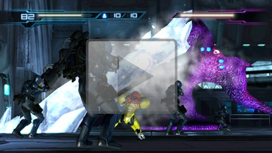 
Most bosses in the game look hella stupid!

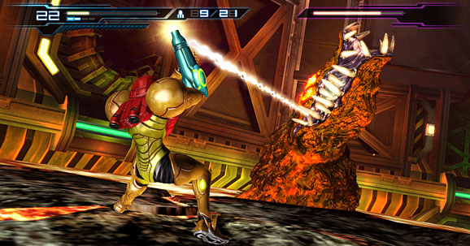 
I this this is the best original boss of the bunch

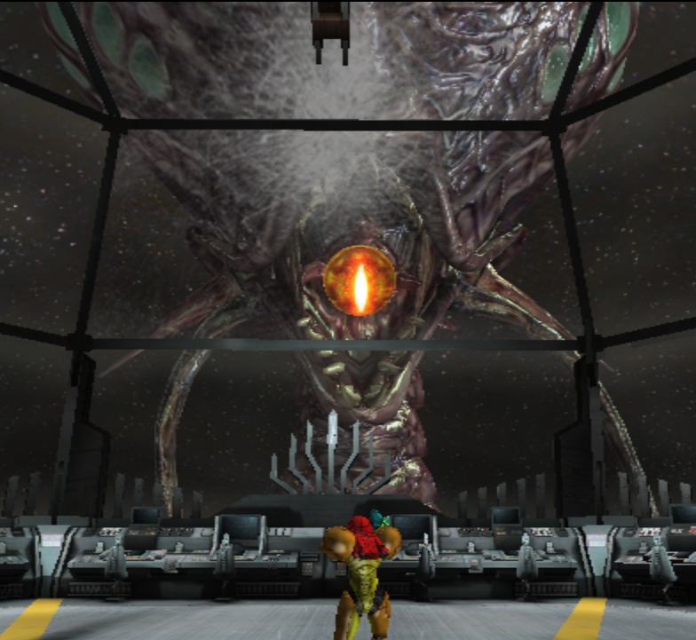 
Old bosses are the best. Also I warned you about spoilers!
++++

These scenes literally do nothing but annoy the player. Some are almost clever. One has you look up and see a ton of enemies that attack when you lock on. Of course when you don’t lock on to them (and somehow despite their size, they still have tiny targets to lock onto) they just…… stare at you for as long as you want. One is a cheap scare where you don’t lock on to anything. You look to the side and a metroid pops out! Thats alright, but all these sequences could be totally removed with nothing put in to replace them and the cutscenes would still all work fine and the game would only be better. How that got through testing is beyond me.

The game is unfortunately very linear. You could argue that not following tradition does not, in a vacuum, make it a worse game, but I will share why I think fusion is a bad game. Fusion is bad because it is a game designed to be a mostly linear action game without rewarding or interesting combat. Combat is not a strong suit for Metroid. Other M has a fun combat mechanics, but in a world of DMC, GoWs and Bayonettas, it is outclassed. Combining relatively fun and simple action with exploration is what would make things truly shine. Instead the map is designed in circuits. You proceed relatively straight through deck levels of the Bottle Ship, eventually looping around. You take very short detours here and there, but mostly it’s a straight shot. I could say the map is at least easy to navigate, but it is easy to navigate at the expense of the series greatest strength. It’s not hard to be easy to navigate when branching paths are so limited. They exist and there is some backtracking, but it’s all horridly forced. Very rarely do you ever get to go “I have super missiles this time around! Now I can open this secret and get the item!”. It happens, obviously, but to a much lesser extent than every other game in the series life. As a quick note, whoever thought the classic item sound should be replaced with a dull thunk should also be fired. Findng items has never been so boring.
[/splitbox]

There are four pickups.
*   **Missiles:** Of which you only get 1 per pickup. Atop the fact that you can recharge your missiles by holding your wii mote up and holding A for a few seconds makes them feel useless. Only in the last few boss battles do you ever risk running out, but theres always a good period to recharge so it doesn’t matter.
*   **Energy Tanks**: These are nice, but you can do the same thing with missiles with life. It takes longer, can only be done when your health is “beeping” and only gives you one energy tank back, but still, your survivability without Energy tanks is still quite high. Very nice, but not as nice as previous metroids.
*   **Restoration Tanks**: Each one of these makes it that when you recharge your health, you restore with one more energy tank worth of life. Awesome but rare.
*   **Energy Tank Pieces**: Because everyone loves heart pieces. These suck and I only completed one set by the end of the game. Garbage.
*   **Charge Accel:** Makes you charge faster. These are cool.

I’d say the Charge Accels and the Restoration tanks were the only thing that ever felt good to get. As such I basically did not bother hunting for most items. It didn’t feel rewarding at all and with the item puzzles being so awkward, I really had no motivation to go after anything but the most obvious pickups. The removal of new abilities from the game world is also disappointing for reasons outside of sheer nostalgia. Finding items is naturally more rewarding than being told you suddenly have something. There is buildup and excitement. In Other M, you just suddenly can open THIS super missile door, seemingly arbitrarily. Or you give up on a room after thrashing around for 10 minutes, walk out and have Adam tell you to go back and use a different powerup. Even Fusion handled this much more gracefully. Fusion pointed you to where to get the necessary upgrade (After being approved by the federation to get it) and you get the excitement and joy of knowing which toy you are going to get. You get to think about how you can use it in old areas as you look for it. Other M hands them out almost at random, thus removing the sense of discovery and reward.

The game makes other fumbles. For example, a select few areas moves your view to a “Resident evil 4” style camera where you walk slowly about. This at first is only used when exploring bath rooms (of which Samus can only explore the female side, despite being on the look out for survivors and items) but some segments involve painfully long, slow walking segments as you explore areas in slow motion or follow people you should be chasing after at full speed. They, like the pixel hunts, are another ham fisted way to try and make the game more immersing. Instead it makes the game more annoying (but not as bad as the pixel hunts). The boss fights at some times are at a high point for the series, but a lot of original bosses just seem awkward and goofy, killing a lot of the excitement. All the best bosses for some reason are classic ones. A lot of the enemies in general just look really dumb and poorly designed. They also seem to act more like little grindy road blocks than fun encounters. The quick kills for some of the toughest enemies are unreliable, making the battles drag out far too long. A lot of these battles also lock the doors, forcing you to finish the encounter before proceeding. This isn’t a new thing to the series, but it uses it more than any others previously did. The game did not play to its strenghts. In fact, its simple use of corridors and a fixed orientation could have been used to create very complex but intuitive environments, using up and down motion as the old fashioned “columns” of previous games. The game played it too safe and left too much on the combat. Fortunately the “post game” has better executed exploration, but it still feels empty.

Graphically the game is a mixed bag. It’s generally inferior to the prime art direction, but does use a nice crisp style. The enemy design on the other hand is almost strictly horrible. Everything looks like a mishmash of random animal parts with little reason and the level of polish is uneven. Some places look quite nice, while others are too hung up in the PS2 era. I also take an issue with the decision to go with a space station with various environments scattered about again. It’s a contrivance to make the game about something Metroid has never been about. Instead of a neatly crafted planet we get random shit. I can’t complain that this is bad on a fundamental level, but considering both it and Fusion rely on the same setup, I can’t help but to be disappointed. The game does do a good job of feeling like a space station though. There are catwalks and enclosed walkways and break rooms scattered about in a way that is believable and subdued enough not to stand out like a sore thumb. This is also good at telling you where you can and cannot go, but sometimes you get hit by invisible walls for practically no reason at all.

In closing, Other M is a very flawed game that is not without it’s merits. It’s fundamental gameplay is fun enough to validate i’s existence, despite its shortcomings. Unlike fusion, which was flawed AND stagnant, Other M tries something new and does so well enough that I actively hope for a sequel. I can rag on Sakamoto all I want, but Nintendo does try and improve their work. Maybe second times a charm? I’d be sad if such a solid engine was discarded after one attempt. I would dare say a classic could arise if Nintendo was savvy enough. Even Other M, story aside, wasn’t far off. It missed the mark for sure, but a few different decisions early on could have changed everything. That said, we also cannot pretend the story exists in a vacuum, as it heavily influenced gameplay. Lack of fun exploration, item discovery and stuff like the slow-mo walk sequences and pixel hunts exist purely because of the plot. Developers need to be careful of this in the future and I hope Nintendo realizes that a plot can be both powerful and dangerous medicine.