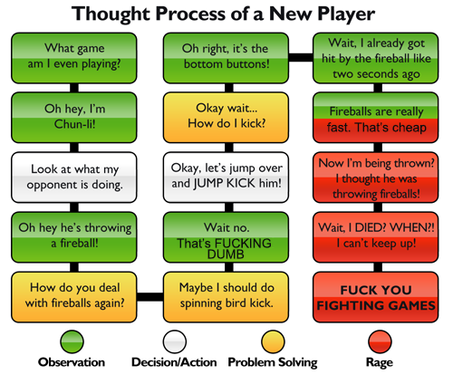
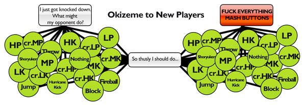
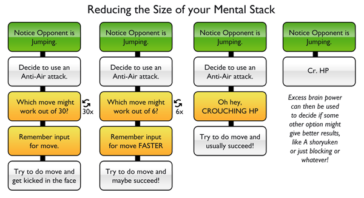

The topic of reaction speeds comes up a lot in my pet-genre of fighting games, especially when talking about casual players. Commonly they will exclaim “I just don’t have the reaction speed to play these games!” which I think is a fundamental misunderstanding of how one’s reactions work. There is a biological component to reaction speed that is hard or perhaps, impossible to improve, but that is not what most people lack. This is much like the concept of APM in RTSs. People commonly exclaim they don’t have the finger speed to play despite easily being able to type over 100 characters a minute. The bottleneck is rarely biological. The bottleneck is in your head.

The mental component, unlike the biological aspects of your reactions and reflexes, is readily and almost easily improvable. It represents the ‘skill’ component of reactions. The biological component of your reaction speed might represent your upper limit (which, by the way, is not perfectly represented by online reaction checkers), the vast majority of your sluggish reaction times in activities come from complex mental processes.

What I’m about to say isn’t strict science, but more so, a personal theory, coming from years of both gaming and watching other people improve at games. It might not perfectly represent the actual mental/physical model of what’s going on, but I think it’s a useful tool for understanding it in a way that will help you improve.

The Stack
---------
[center][/center]

The stack is the mental “post processing” that occurs once stimulus is received. Just like the post processing on many televisions, actions taking in one’s mental stack delay the time it takes to respond to something you see on screen. In the above (and silly) example, the new player is spending so much time trying to parse what’s going on, what he can do and how he’s supposed to do the thing that he wants to do that he not only fails to respond to the stimulus (a fireball), his thought process is totally out of sync with what’s going on in the game. He is getting hit and thrown before he totally can remember where the kick button is. This might sound ridiculous, but for anyone who can remember what it was like even as an experienced player to switch from Pad to Stick, the amount of extra processing that goes on in your head to remember what button you’re supposed to hit is ridiculous and frustrating.

[center][/center]

A player in sensory overload can commonly think their reflexes and reaction speed are terrible simply due to the fact that they are not experienced enough to know what’s going on. Or how can they be expected to make a good decision after being knocked down when not only can they not parse the seemingly infinite pool of possible actions and responses, but is probably too mentally backlogged to be able to generate a meaningful decision until after the knockdown situation has passed? The problem seems overwhelming, but all the player has to do is clean up their “Stack”.

Cleaning Up Your Stack
----------------------

The first part of improving is realizing you WILL get better if you try. Especially your reflexes. Games always seem to get slower as you learn them. You can help speed up the process though by really thinking about what you’re doing. My advice to all new players is to, as soon as possible, have a plan. A bad plan can be changed, modified and adjusted. Making such adjustments without a plan is often messy and unreliable. One of my favorite bits of advice is telling people to use less buttons when they play. This isn’t always applicable, but is especially relevant to Street Fighter. Lets take Ryu…

_Medium Kick (all versions)  
cr.LK (close up poke)  
Cr.HP (easy anti air)  
Hadoken (range attack)  
Shoryuken (anti air)  
Throw_

We’re cutting a move set of 30+ moves down to 6. More so, you can have a gameplan with only like 3 of these moves. The player can use MK for basically anything. It’s a good jump in, cr.MK is Ryu’s best poke and standing MK is okay. All the player needs then is a Hadoken and some Anti Air. This GREATLY reduces the stack. When standing in front of an opponent, one doesn’t have to think about all of Ryu’s moves — if they’re somewhat close, cr.MK. If they’re far, Hadoken. Lets represent these stack processes…

[center][/center]

One important thing to remember: Problem solving can ALWAYS be eliminated. Problem solving in match generally means you’re losing. That’s stuff that you’ll be doing outside the match. You might also experiment in a match to figure out something against a more experienced opponent. Regardless, you want to avoid it when possible. You’ll also probably never get good enough that you’ve eliminated all problem solving from your stack, but in theory you could (thus becoming the best player ever). As you learn and become familiar with situations, these should naturally vanish, even if that situation is “doing a move”. Eventually there is no overhead for inputting a move. Your muscle memory will have that covered for you. Eventually you won’t have to run all the calculations on which move to anti air someone with, you’ll just skip to the important part — getting him out of the air.

“But wait!” you exclaim! Eliminating DECISIONS? By what sorcery do you just ANTI AIR automatically? In fact, anti airing every time someone is in the air seems like it’d be kinda dumb and would fail all the time! You only want to AA someone when the AA attempt will succeed and with that, aren’t there tons of other observations that weren’t included? Wouldn’t they read like…

_“The opponent jumped.” “Is he going to be able to reach me?” “Is he attacking?” “Have I noticed in time to do a Shoryuken?” “Normal?” “Do I just block?”_

Well yes, but we can not only explain that, but greatly simplify what and you need to observe!

Simplifying the World
---------------------

One of the big pieces of speeding up your reaction time is deciding what is worth observing and looking for. If an opponent is right next to you, you do not generally need to look for them to jump (unless they’re a dirty, dirty dive kick character or have a brutal crossup). If they’re totally across the screen, putting priority on the fact they’re jumping isn’t important either. If you’re at midscreen, you generally shouldn’t be setting up your stack to respond to overheads. If you’re knocked down, you can go slowly break down what your opponents options ACTUALLY are with experience, and once the basic high/low/throw/meatie okizeme situation is internalized, you can put all your observation can be put toward tiny details to help you make the right decision. If an opponent doing something in a situation wouldn’t make any sense, or if responding to it wouldn’t give you any benefits, then there is little reason to be looking for it and by looking for less things, we can respond and act faster.

I also want to introduce the concept of Autopilot. Autopilot is the subconscious script your gameplay follows once you get good but aren’t terribly playing attention. You can learn to play the game quite competently without really “thinking”. The advantage here though isn’t that you don’t have to think — it’s that you can use your autopilot to free up mental resources to make more decisions. Combos are something that are often able to be done on autopilot after a while. The great thing there is you can use your mental energy during the combo to either plan on what you want to do after the combo, or look for things going on in the combo that might be concerning. In games like Guilty Gear, realizing that your opponent is a bit out of position in an air combo and finishing the combo differently to compensate can be a big deal. It’s also something that can only be reasonably done when the combo is running on auto pilot. If you’re looking to anti air your opponent because they seem to be in a “jumpy mood” it is super beneficial to be able to play decently while waiting for the jump. If you just stand there and wait for the jump, they will likely never jump (and might even gain an advantage). Having a functioning Autopilot allows you to decide what things you want to put your focus on. Your auto piloted actions will never be as good as they would be if they had your full attention, but by choosing where you full attention goes, you can pull off things that seem, to inexperienced players, super human.

This is also why having a plan is SUPER IMPORTANT. Even if your plan is to do cr.MKs -> Hadoken, just doing that all reflexively gives you the breathing room to think about what you’re doing in more detail. It gives you the focus necessary to decide what should be in your Stack. By managing whats in your stack and using your focus carefully, you can, with average or even bad natural reaction speed, do things that seem stupidly robo-fast.

It’s not about being able to perceive and react to everything, it’s about being able to simplify the problem and removing the clutter from your brain that slows down your actions. It’s experience that holds you back more so than your inherent abilities.