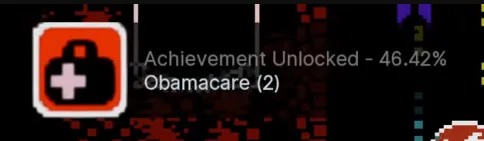
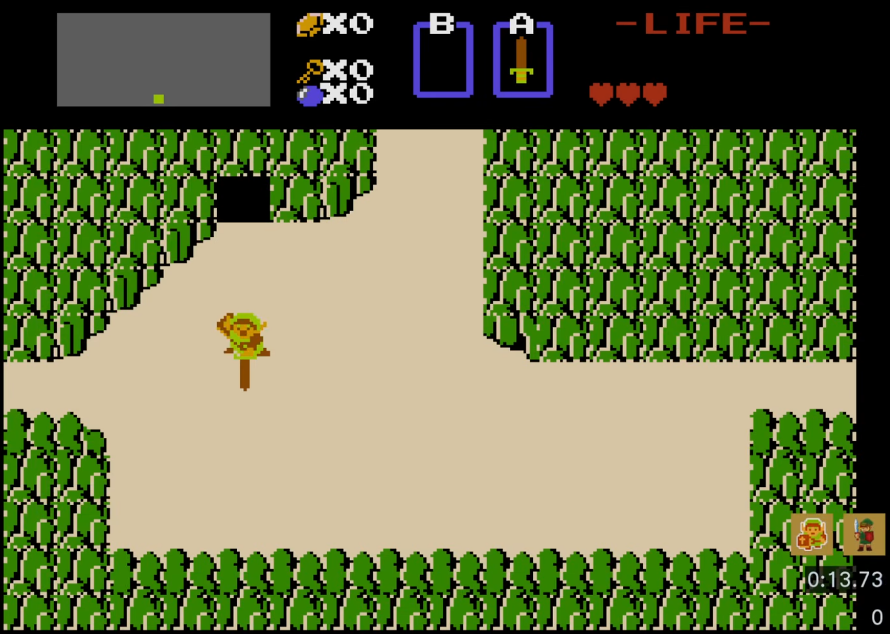

I like having nice, well balanced takes on things, sometimes getting lost in nuance in ways that muddle my point. But anyone who follows me knows that some days I just to give in. I just have to *be a hater*.

Anyone who follows me knows I have a deep seated hatred of Achievements. Not so much the vague concept of little extrinsic goals, which have been in gaming for decades. No, what I hate is the *institution* of Achievements. That these are a *standardized thing* that *must exist*, on the *system layer*, in *all* games, regardless of developers wishes. They are more compulsive and more demanded than even accessibility features like rebindable controls.

As a developer, [I find this hatred to be rational](/cohost/achievements). I cannot ignore them. Players will hound the Steam forums of any game without them, begging for their implementation. Other platforms outright require them. We are forever historically chained to a strange decision Microsoft made in the 2000s, during a time in which we were still trying to figure out what having a console 'be online' even meant. If they weren't made then, there would never be a reason for them to come into existence later. Nintendo continue to hold the line on this, realizing that you don't need a system-wide UI element to make people pointlessly collect Deku Seeds. They're not going to rely on store-bought clicker training when they know how to cook from scratch. 

They don't need them because Achievements solve no inherent game design problem, often instead used for awkward, secondary purposes. A progress tracker, a hint system, sometimes even tutorialization... These are all things Achievements *can* do, but not even well.

Yet while I think my hatred here is rational, I am an isolated soldier, living in the woods, still fighting a war that has been over for 20 years. Long gone are the painful era of having to sit through the slow PS3 *"Loading Trophy Data"* screen, all so I could recieve notifications I didn't want and couldn't turn off. I can mostly avoid them now. I still have to consider how to deal with achievements for my own personal projects, and I can still feel the subtle design pressures Achievements create, but there are a lot of things about modern gaming I don't like but have to accept. Still, if they annoy me then the past is filled with tens of thousands of games I've never played which are free from this nonsense.

[floatbox type="full"]

[/floatbox]
[floatbox type="full"]
<small>*Oh my god I hated these fucking screens so much*</small>
[/floatbox]

## ... But we can fix the Past

RetroAchievements, the free to use community service that adds achievements to old retro games, is an impressive technical accomplishment. Beyond just the infrastructure, the idea that almost every old game has had people pour over unlabeled memory values to cobble together the necessary puzzle pieces to make functional achievements is objectively incredible. A triumph of will and community cooperation.

... And yet I hate them, with all my heart. Nothing makes you use RetroAchievements. They're unofficial. Entirely optional. They don't change old games, they don't change their history. They simply don't have the same baggage modern achievements do. Yet every time I see one pop up on an online video, my blood boils. It fills me with the same type of agitation people feel when they realize Motion Smoothing is enabled on a relative's TV. *"How do you live like this? How do you not notice how bad this is? Are you some kind of dog? How do I turn this off to protect you from yourself?"*

That impulse is self-centered and irrational. I cannot pretend their choice affects me. It is my own petty, impotent tyranny, a desire for domination that I will never have the power to realize. I am not personally aggrieved, I am *offended* on *principle*, the easiest and most worthless way to be offended.

Yet I will shed my dignity and expose my tiny black heart *because I hate them*.

What gets me so often in retro gaming is the desire of some to "repair" the past. That game design is just a series of objective truths that our forebearers were merely ignorant of. These players see old games not as art existing in a different context, but games made in a time where *we just didn't know any better*. Primitive cave men, making games in 4:3, unaware of the coming of God's chosen 16:9, with no conception of dual analog First Person Shooters.

I remember, back in the VHS days of [Pan and Scan](https://en.wikipedia.org/wiki/Pan_and_scan), people of taste ruthlessly bullied those who couldn't handle letterboxed movies. Today we allow those who hate pillar boxes to roam free. Those who will force old art to conform to whatever obscene ultra-wide monstrosity they've purchased. The black vertical box they fear shouldn't be on their monitor, it should be their locker.

I can mostly choke down this bile. Displaying old games in an accurate way is hard. There is no uniformly correct way to do it. It's subjective, with each option having pros and cons. I could, in my arrogance, argue some *more wrong* than others, but ultimately choices have to be made by the player.

RetroAchievements are different. There is an infuriatingly naive hubris to the idea behind them. We'll fix the past by importing one of the mistakes of the present. A task so incredibly high effort, yet wholly unnecessary. To draw on the abilities of rom hackers, backend developers, and emulator developers, tens of thousands of man-hours, all so a Shroom joke can appear when you pick up your first Magic Mushroom in Super Mario Bros. Or worse, a crusty Obamacare joke when when you pick up a health pack in **The Punisher**?

[center][/center]

Do you really want someone who stares at a hex editor all day design achievements and write jokes for a game released 40 years ago? Designers who think The Legend of Zelda requires a special speedrunner overlay, with intrusive UI elements, a timer and enemy kill counter which exposes secret mechanics to new players.

Do you want every game to assume you want to compete on some global leaderboard, with challenges so granular that sometimes you get a monstrous stream of endless pop-ups like this?

[center][/center]

Things like this alter how people see games. They alter how people play. They alters the vibe. An on screen timer adds a silent pressure, whether its intended to or not. It alters how new players will ultimately experience a game. The first person willing to put the effort in now has the ability to curate that game's experience. There are community mechanisms to mitigate the most irresponsible offenders *(That Obamacare joke got removed when I posted about it on bluesky last year)*, but there are tens of thousands of games so far with achievements. When poor taste and bad design can appear in popular games, what hope do we have for more obscure titles?

While this is an opt-in system, people will speak about it as if using it is a given. They are recommended in the same breath as one recommends  emulation. *"Not only can you play old games for free, there are ACHIEVEMENTS!"* 

This enthusiasm behind them have given these unofficial challenges an air of legitimacy. You can find Youtube videos titled "Getting EVERY ACHIEVEMENT in A Link to the Past" despite that game having zero actual achievements. Yet it does, in the same way Ted Turner assured we could watch *It’s a Wonderful Life* in color.

This desire to modernize the past poisons everything There was a cohost post where someone said Saturn emulation wasn't complete *because it hadn't implemented achievements*. This isn't seen as just some fun, extra thing anymore. Like on Steam, while achievements are technically optional, the player base thinks they're *mandatory*.

People should be able to do fun and technically challenging projects like this. They should tear up and play with the media they grew up with. People are doing real, hard work to try and give joy to other people. But living in the generation of exponential progress has fried to brains of many millennials. They cannot look backward. The old things they loved no longer adhere to the *standardization* of the modern day. The self directed play of older games might as well be seen as barbaric. Of course they're treated as much like an accessibility feature as rebindable controls, their lives have been thoroughly gamified that they have forgotten how to play.

I can't *truly* hate RetroAchievement. They have a right to exist and nobody asked me to be the Taste Police. Despite some people being *weird* about them, the majority are *normal*. Like with motion smoothing, most [tool tip="To most people, they seem to be glorified progress trackers"]barely think about it at all.[/tool] We are so inundated by notifications that most people are blind to them.

Yet this still distresses me. The way my generation just gives in, ultimately embracing the noise and bedding itself with the rot. We give in, silently encouraging the worst of us through our quiet acceptence that More is Better. *We weren't given the future we were promised, but we can at least try and create the past we remember.*

I don't hate RetroAchievements, but I hate what they expose. That maybe the old people were right, and that maybe we actually wanted Participation Trophies all along.