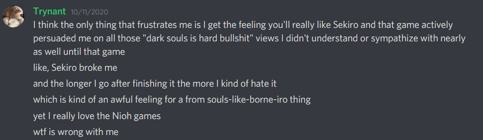
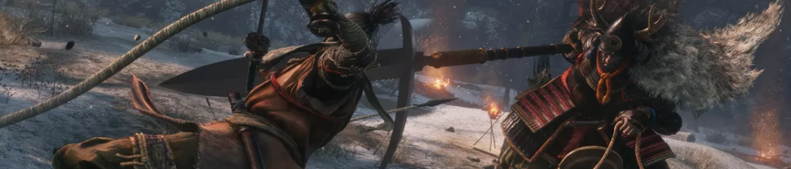
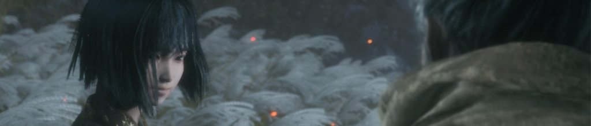
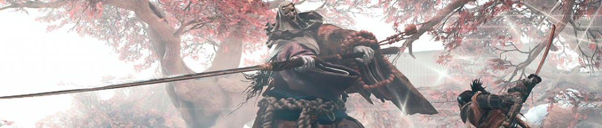
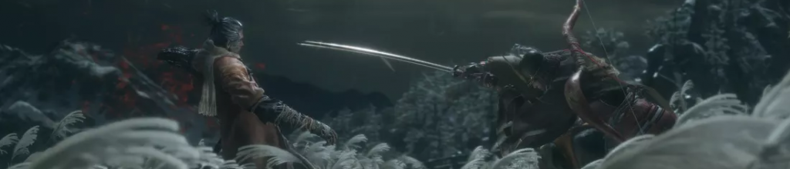

#### (but probably could afford to press them a little less) 
[floatbox type="full"]

[/floatbox]
 _Trynant’s words after I decided I hated Nioh. Trynant had sent me Nioh 1 and 2 for my birthday and, upon saying this, I immediately received a steam alert. He had given me Sekiro. Was this Nioh NTR?_

And so I had Sekiro. I had wanted to play Sekiro for awhile but my computer was slightly too weak when it came out and the idea of buying a game for a PS4 that wasn’t even mine felt bad. But I’m patient so I waited, getting to it finally as I always do: Well after the game has actually come out.

I’m going to say outright that I’m going to be making a lot of comparisons to Nioh. That said, I don’t think comparing these two games is, in most circumstances, at all fair. They are different games with different goals that share only a few things in common (Sengoku era Japan and Souls DNA… which… they only barely do??). But for me, playing these games back to back, it’s hard not to compare and contrast them. So while I am going to bring Nioh up a lot, it’s because Nioh is currently a very convenient lens to look at Sekiro through.

There is something uniquely bothersome to me about people recommending a game by saying “It’s like Dark Souls”. I look at whatever game it is and I get this feeling of “… is THIS what Dark Souls is to you?”

It’d be like someone saying “Hey, try this stealth game, it’s like Metal Gear”. I will be the first to defend Kojima games for their gameplay, but is gameplay what makes a Metal Gear game? Or is it multiple puzzle pieces interlocking together in a perfectly strange way? I feel this way about Dark Souls. Do I _enjoy_ Souls combat? Yes. Do I crave it, in any way, without everything else that comes from a From Software game? Not really. I crave the entire “flavor profile” of their games.

So the irony of the whole Nioh/Sekiro comparison is, in the sense that most people speak, Nioh is MUCH **_MUCH_** more like Dark Souls. You could argue that, on a mechanical level, Nioh is a beautiful and even superior evolution. Sekiro… isn’t a Soulsborne game at all. It is less a Soulsborne game than Death Stranding is a Metal Gear game. Yet people (often jokingly) try and string together weird words like “Soulsborneiro” or ” “Seksoulsborne ” to describe them all. Why? 

_They’re From Software games._
[floatbox type="full"]

[/floatbox]
I had heard a lot about Sekiro before playing it. Weird things about the posture system, how different and unfair the game was, how much the person hated it… but no matter what they said, they always said “You’ll like it, though”. I was always more skeptical of this then they were but mere minutes into the game I felt it. This was not a Souls game yet was everything I was missing in Nioh.

From Software knows how to capture mood. They know how to have a sense of place. Their worlds seem to not care about you, as if they were not built for you. But every merchant you miss, every side path that you forget, every weird, unclear bit of progression is designed like that _because_ they care. They do it not because they hate you, but because they want to remove artifice from their worlds and draw you in.

By their standards, the world of Sekiro is the most “designed” for the player. The tutorial/reservoir area feels like something out of Metal Gear. The world is filled with grapple points and convenient grass but yet, as you sail over walls, bypass encounters and jump from rooftop to rooftop, the world somehow still manages to feel indifferent to your needs. Unlike recent From games, you are a major player in the plot. Wolf is an important character, but few in the world understand his significance. The majority of the world doesn’t care about you and because of that, you aren’t exploring a world crafted for you, you’re exploring Ashina, as it is and as it has been, in its final moments.

… Or so the illusion goes. From has always been incredible at this sleight of hand and it, as was exposed to me by Nioh, is what makes me endure the hardships of their games. It isn’t the reward of victory in itself — though the reward is great — it is also the promise of things to come.

Nioh confirmed something else I had already knew but hadn’t articulated. From Software games are not about their mechanics, they are about their content. Nioh, ignoring the tedious loot system, is almost in all ways mechanically superior to any From Software game. They build a system and build content to match it. From Software on the other hand builds content, and matches the mechanics to it.

I love From Software’s content.

[floatbox type="full"]

[/floatbox]

I was skeptical of Sekiro’s combat. Descriptions of the posture system always made it sound wild and unnecessary. I’d hear stories about people saying it is too harsh and punishing and others saying the basic combat is easy… and in a sense, it is. Sekiro is not a Soulsborne game. You don’t dodge and circle and defend and look for opening. You don’t have an invulnerable roll. Your block **will** eventually fail you. You can jump. You can jump?? Yes you can jump this isn’t a soulsborne game.

You attack. Your enemy reacts to your attack. You respond to their reaction. Your not a passive force, responding to the whims of an enemy. You control them just as much as they control you and with that, rhythms form in the combat. The combat is simple, but the flow is beautiful, quick and deadly.

You can’t easily fight a group, but relying on stealth kills would take forever. Instead you can hit and run, Separate enemies. You control the engagement with incredible mobility. You figure out what enemies go down the easiest, and which are slowest. You divide and conquer. _This is not a soulsborne_ game, you have tools and abilities, some of them downright oppressive. Taking out groups changes it dynamic once you can swoop in, backstab one and use puppeteering to make him fight his friends.

In many ways the combat is more forgiving than souls game. You can’t be one shot, how neat is that? In fact, you can even use that death sometimes to get a drop on an enemy or even to heal. The balance between health damage and posture damage gets interesting once you deal with bigger enemies and bosses. Getting clean hits pays interest in the future as their posture begins to recover slower.

The combat isn’t particularly deep. Again Nioh, on a mechanics standpoint, would have Sekiro beat. But it’s not about the mechanics it’s about the CONTENT. Sekiro’s enemies make the combat feel incredible. The whole ecosystem of the game is tighter. Sekiro’s whole is greater than the sum of its simple parts.

Bosses take this further. You REALLY need to learn them. Their call and response behavior is probably the peak of complexity for modern From Software games. You analyze them and their attacking habits. You bait them. You force their hand. The timing element of defense elevates the ordeal. You were too slow to dodge, but maybe, just maybe, you won’t panic and will get all the deflections you need to not get posture broken. It’s tense.

What’s also odd is, unlike Dark Souls and most games, you don’t recover your posture/stamina/block gauge by not blocking. You block. This seems counter intuitive at first, but you give up mobility and action to recover. Blocking feels bad. You’re defended, but behind a cardboard shield. You’re a shinobi, movement is life. So when you hold your sword defensively in front of your enemy, you feel vulnerable.

It’s wonderful.

[floatbox type="full"]

[/floatbox]

Sekiro is not a Soulsborne game. It has a story. It has characters. Yes those games have those things, but it’s not ABOUT those things. The sullen, bittersweet interactions between all the characters in Sekiro are wonderful. Instead of a game full of offputting, deranged people, we get real performances. I played the game with Japanese voices and am not sure why anyone wouldn’t because the voice work is incredible. The conflict for Kuro’s love and warmth for Sekiro vs the chasm of class between them is so sadly frustrating and sometimes tragic. While we don’t fall into deep monologues and epic stories, the relatively few character interactions drip with texture that implies a deep rich history behind anything. They speak like From Software worlds are built. Simple things like the few spoken lines from Lady Butterfly imply so much about her and Sekiro’s shared history with Owl. The sculptor speaks as tired man, holding on to his humanity. The Divine Child of Rejuvenation speaks as… a little gremlin child who has, through social pressure, been forced to shoulder a lot of responsibility and burden. You bring sake to Isshin Ashina, so you may listen to the drunken stories of an old yet powerful warlord.

And so like the combat, the story is simple, yet somehow, in its brevity, rich.

[floatbox type="full"]

[/floatbox]

Sekiro is not without fault. Dragonrot is perhaps one of the worst mechanics implemented in a Fromsoft game. The mechanic, which sickens NPCs and stops their story progression through repeated deaths is the worst of two worlds. It is a mechanic that makes players afraid to engage with the game while at the same time presenting no real consequence. Dragonrot is trivial, the resources to cure it abundant enough that you can cure everyone when need be without worry, but rare enough that you’ll let your buds cough their lungs out until you need to progress something. Not understanding Dragonrot can be crippling, and understanding it can be immersion breaking at worst and boring at best.

Unseen Aid was a mechanic meant to try and mitigate the more punishing effects of death in From Software games, but ends up just being useless and confusing. 30% of the time you won’t lose anything when you die, but as people get dragonrot, that number goes down drastically… but… who is counting on something happening 30% of the time?  

Some ending things are gated behind some obtuse requirements, like really specific eavesdropping. It’s not the end of the world and some people enjoy looking up spoilers for NG+. Upgrades and Skillpoints also are a bit annoying to manage and plan out. Some stuff borderline feels like a skillpoint trap, like the entire Monk line.

[floatbox type="full"]

[/floatbox]

Also there is a part of me that feels the game is too hard. Not for _me_, so much. Owl (Father) was the only boss to give me significant difficulties and Sword Saint Isshin went down in 5 or 6 quick attempts. But playing it, I felt like.. am I enjoying this because it’s hard or because it feels good? And if it felt good at a lower difficulty, would it be helpful if the game was slightly easier? Some parts of the game ask a LOT from a players, which is especially frustrating when most of the game does not. A little bit more leeway to respond to attacks or in the health of some bosses would help so many more people push through without I think destroying what most people love about the game. Force the players to learn all the things they already need to learn, but just maybe… require them to maintain perfection for less time.

Sekiro is the first From Software game to make me sympathetic to the idea that these games should have an Easy Mode. While my feelings matter much MUCH less than the people who want these things, when people ask for it in Dark Souls games I always have this feeling that… the difficulty is the glue that holds the game together. That without resistance, you see how flimsy parts of those games are. Which doesn’t mean people can’t want it or don’t deserve to have it, but more that _I don’t get it_.

Sekiro though… Sekiro feels like a game that needs this. It lacks the difficulty smoothing features of other Fromsoft titles. No co-op, no overleveling. Just uncompromising gameplay. Which is a shame, because I feel like Sekiro has the most to enjoy outside of challenge. The characters, their interactions, the sheer joy of moving and grappling through the world. Moving or heck, even combat in Soulsborne doesn’t feel stellar. It’s the feeling, mixed with the reward that makes it feel good. But Sekiro? Gosh just -doing- shit in that game, even when it’s easy, feels great. An easy mode would feel no different to me than DMC or Bayonetta having an easy mode. You can Git Gud later, if that’s your thing.

… I say this, and mean it but at the end of the day, my convictions can’t be that strong. This game felt tuned for _me_. I slotted right into place like a jigsaw puzzle. It intoxicated me… though again, I think it still would of it were 10%-20% easier (Whatever that would mean). As maybe the most divisive modern From Software game, I’d gladly like it a little less so others could like it more.

How do I rank this compared to other modern from games? I don’t know. I don’t know if I even _can_. Tied for second with Bloodborne but two different to truly be compared to everything else?

Anyways, with all that said, _Genichiro is little baby._ Get fucked, chump.

[midheader image="footer.png" text="Addendum" /]

Recently Sekiro received a large feature update. Most of this is good or at least harmless additions to New Game+. Costumes, the ability to refight bosses, boss gauntlets… all excellent content for people who wish to find new ways to engage with the game after experiencing it how it was first already intended.

One feature isn’t like that. Remnents are a cross between Dark Souls Messages and Bloodstains, pre-recorded bits of gameplay. It is a complete port of Dark Souls-esque features over to Sekiro.

_**This is not a Soulsborne Game**_

It’s inclusion is crass and thoughtless, bolted on vestigially, like giving someone an artificial appendix. It matches not the tone, the world, the aesthetic, or the gameplay. I can’t know this for sure, but I can only assume it was forced by Activision, who decided the game was not “Soulsy” enough.

Souls games are not truly solidary experience. Despite their primarily single player nature, they strive to make the world feel alive. You can connected, through the hazy stream of time to others. Ghostly figures wander about, miming actions from eons past. People can drift into your reality to help or harm you. Souls games are lonesome. NPCs act so offputtingly that it is often hard to truly see the ones around you as friends… but other humans live around you and the proof of their existence follows your every step.

Dark Souls pays a visual price for this interconnectedness. Online Souls gameplay is visually busy with the marks over other players marring the landscape, like litter in a beautiful park. But Dark Souls gets a lot in return for this. That feeling of connection ties into the games thematically, artistically and mechanically. The game is designed with the assumption that others will help you. They are balanced around this… and even then, they felt like a distraction in Bloodborne, the most beautiful and sophisticated Souls game up to that point. I played Bloodborne mostly offline because the classic Souls elements felt like cruft.

Sekiro, despite it’s great characters, is truly lonesome game. In fact, it is because of these characters that Sekiro is a beautifully lonesome game. Only by having these people who you can truly care about and love, can you feel truly apart from them. You are a shinobi. When you are fighting there is no one else. Even those Wolf may have cared for at some point may become enemies, both sides accepting the fatalism of their occupation. Contrast between the warmth of being around Kuro and Emma or even the sculptor contrasts with the cold, snowy, lonesome trek through Ashina. Sekiro not only doesn’t need interconnectivity, it actively acts against it’s tone. It’s beautiful world gets marred by the most visually noisy messaging symbol in any Souls game… and for what?

Sekiro is an honest game, where Dark Souls lies. Granted, Dark Souls wants to be caught in its lies and so it builds these community mechanics. Dark Souls forces you into uncomfortable encounters. In Sekiro you choose your encounters. Dark Souls attacks you when you’re not paying attention. In Sekiro, you attack when the enemy isn’t paying attention. In Dark Souls, knowledge of what comes next and what traps await you is paramount to survival. Sekiro doesn’t try to trick you in that way. It reflects in it’s death penalties. True death is too costly to spring on the player as a joke. In Dark Souls, bloodstains offer hints on what is to come next so you may prepare yourself, but are still entering the unknown. You see only the player’s actions unfold…. but do to do the same in Sekiro, where the context can be so varied? What can that specter tell a player that is of any value? How can one show a player how to fight a boss and how can you even find the time to view one? What surprises are these supposed to protect new players from? I can only honestly think of one real “Cheap shot” in Sekiro and it is a glorious and precious moment that should not be ruined.

The system offers nothing because it was not designed for this world, or this play style. It is a cynical add on that does nothing but degrade the quality of the work. It’s a price paid without purpose. A thoughtless, ugly inclusion to add to a game over a year from its release. Can you ignore it? Sure. Is it the end of the world? No. Does it ruin the game? Absolutely not… But does it make the game worse for no gain?

_Absolutely_, because _**this is not a Soulsborne Game**_. You need to design these types of mechanics to match the game you ACTUALLY MADE.

So please, if you play Sekiro after reading this, **PLEASE PLAY IN OFFLINE MODE.** You will lose absolutely nothing of value and will play a better version of the game.