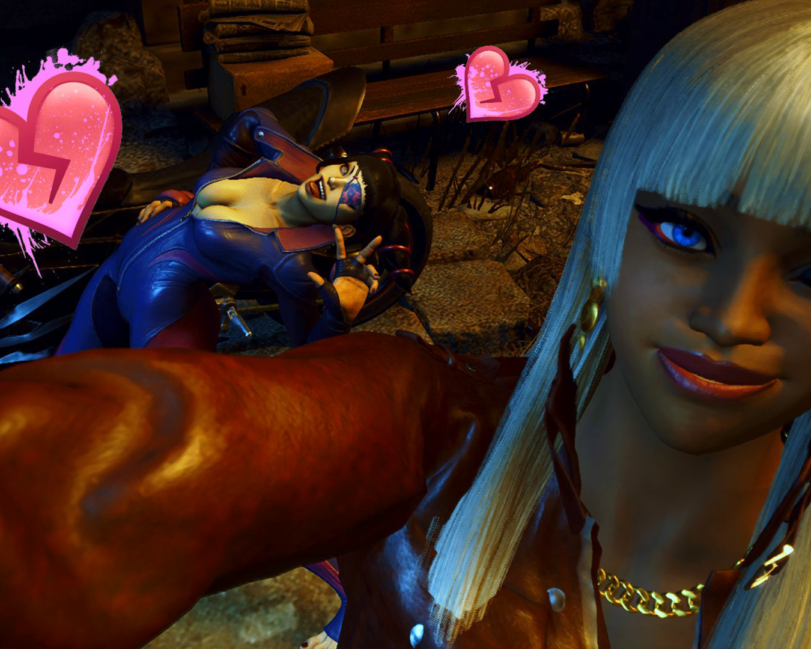

## I Wanna talk about World Tour Mode, but I gotta talk about the Actual Game First
[splitbox side="right"]
 Did you expect my character to look any other way?
++++

I wasn't planning on getting on SF6 right away. My experience with Day 1 fighting game is usually pretty poor. The mad rush is a lot of peoples favorite time in the life of a fighting game but for me, I prefer when things are a little more hashed out. First released ruined Blazblue, Xrd, and Strive for me and I didn't want to repeat that mistake with Street Fighter 6.

... Still, a friend *(Thanks, Dasterin)* got it for me so I was obligated to play a little! While real meat of this is going to be about World Tour mode, I do want to talk about my early impressions on the game and my experiences online. I feel like it's impossible to truly review a multiplayer game on release -- only after months of hindsight can we really say if a game is worth while... but that said, more so than the games I mentioned above... I like what I see?

This is a game for sickos, by sickos. The drive system is unhinged game design. Tons of free meter every round? Practically the ability to Valle CC with some characters? The most cracked out Focus Attack clone and boomer check in existence? ... and all of this bringing you one step closer to burnout or being smashed in the corner? Just absolutely nuts. I worry that the system mechanics might be *too strong* but this is the type of thing that gets adjusted as a game goes on.
[/splitbox]
It's also nice to have avatar lobbies that don't suck. I told everyone it was possible! And sure you got normal menu based player rooms and ranked elsewhere, but it's a nice diversity and leads to a lot of fun expression. This is also the first game I've played with a real, living ranked System. I enjoyed +Rs a bit when it was active, but besides that, well.. Rev2's ranked is dead and Strive's Tower is barely a ranked mode. Playing random people has been good for my composure when playing. Endless practice for me to Not Make Up a Guy while playing strangers. It's nice to play a game with a community so large that I am practically anonymous and where I feel no need to prove myself. I can just fiddle around, play a few games with Dhalsim, and go off to do something else.

That said, before any of this, I spent COUNTLESS hours in world tour mode.

[midheader image="bullying2.png" text="Calling something a Playstation 2 Game as a Compliment"/]

Late PS1 and Early PS2 was a weird time. Weird, experimental, goofy, unhinged game design, sacrificing polish and fidelity to do something weird. These aren't games you get a lot these days. Most games focus obsessively on graphics and gameplay polish and while indie cames can serve fill some of the gap, the weird but also *content rich* type of games from that era are rare. The closest thing that comes to mind is the SEGA made Yakuza which is _also_ tightly bound to its PS2 roots.

[splitbox side="right"]

++++

So when SF6 needs a singleplayer mode that is fun and rich, but not as polished as its online content, drawing from Yakuza seems like an obvious choice to make. Simple but uncommon voices like unvoiced dialog, or those 'stage diorama' locations you meet trainers in serve as a way to make a lot of content *fast* and *cheap* and while this content isn't always that great, quantity is a quality all its own. Even just the way you can horridly amalgamate fighting styles seemed to come from a different time.

Even the ways WT mode is annoying feels PS2 era. Grindy, janky platforming, using weird special moves to pop balloons with power-ups... MINI GAMES??? Even the goofy way metro city is split in the beginning as if it was some engine limitation or something _(it isn't, ultimately)_ just has such delicious, old school vibes. World Tour mode feels like SF6 came with an HD remake of an unreleased early era Playstation 2 game with all the fun and wild surprises that would entail.
[/splitbox]
Mechanically it's weird. You level up AND get a Not Skill Tree tournament bracket to spend points on. I hate Skill Trees, but this isn't -- instead new and old options get shuffled back in each new "tournament". This caused me to reset my stats at one point to respec, only to realize my change changed the later brackets massively. The clothing upgrade and skill system is weird and arcade. "+10 to Unique Attacks"??? I'm pretty sure that's for command normals, but some people say it's fireballs so we're all just confused. But all this confusing stat absurdity again, has that whole janky weird PS2 vibe. Attacking far outside your level range leads to doing so little damage it's painful. You can DO IT but it's miserable, which also sucks when you're hitting one of the weird XP/Opponent gaps in the game. The game has buffs but they... don't seem to do enough to make up the difference? But all that said, it's fun and the enemies are so dumb they basically train you

[floatbox type="full"]

[/floatbox]
### Characterizing the Uncharacterized

One of the big surprises in World Tour mode is how much character it gives everyone. Not that Street Fighter characters have been uncharacterized for 30 years, but that characterization is either painted with broad strokes, or limited to semi canonical sources like the Udon Comics. Simple endings, winquotes, match dialog, that sort of thing.

[splitbox side="right"]

++++

World Tour mode gives you a lot? Characters are chatty, they talk about their hobbies, their past, things they like, their relationships. You get an idea about how someone like Ryu actually lives. Funnily, this is a similar vibe to Strive, which definitely also set out to humanize its characters both aesthetically and in story. We wanna know how these weirdos live and what their relationships are in the smaller details. It's fun to here Ryu talking about Chun-li dressing him so he can get through airports earlier or how he does construction work for money. It's **amazing** to see what an awkward weirdo Cammy is, still cool a cool operator, but... just a little *off*. Or endearing to see what a piece of shit Juri is, moping on her phone, filled with ennui as all her enemies are dead and she doesn't know how to socialize or *be a person anymore*. The text messages are half baked but charming, something that feels like it should have been more developed, but it so good. Cammy's cat-version of herself for her avatar is funny every time I see it. The leveling system for relationships is goofy, the gift system is simple and crude, but again, this is a side mode, it doesn't have to be AAA, it can just be an excuse to gate cute, fun content that helps endear the characters to you. This game even managed to endear PMC warcrimes Gamerbro Luke to me, showing him as just a perfect, well meaning himbo. Maybe one day we can sit around eating doritos and mountain dew as we talk about the horrors of the military industiral complex.
[/splitbox]

The plot was a slow start, going from "I don't care" to this perfect intersection between "Horrifying yet silly" to (and let me be vague to avoid spoilers) being... genuinely being an almost nihilistic downer? And not in a bad way! The whole thing, given the overall tone of the game, resolves very interestingly and bravely (in a creative sense). There are dumb plotholes and things that don't make sense, but with a mode like this, the game has to assume you're along for the ride. No one is here for perfection.

### Was that... the... best Fighting Game Single Player Mode ever?

... Probably??? It wasn't perfect and some Netherrealm fans could probably point to some old (also PS2) MK game as an example. Maybe that one Soul Calibur mode in... 3... 4? I don't remember. But I've STILL have played more World Tour mode than the actual multiplayer game and I've been playing a BUNCH of SF6 online. But as long as I can get new outfits and dress up for the Battlehub, I'll still be dropping into World Tour Mode from time to time.

[floatbox type="full"]

[/floatbox]