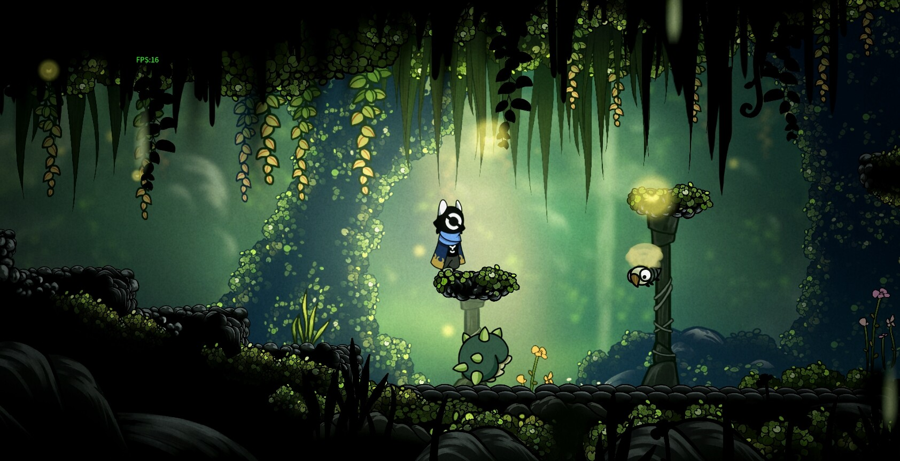

> "We got to the point where Metroidvanias were "Ah yes, I got the GREEN COLORED DASH, which will break GREEN BLOCKS, and I can find all the spots I missed by checking my map. It's an ATTACK and a MOVEMENT OPTION--" and like idk at that point the genre was cooked for like a decade."

As usual, with these posts, I start by [tool tip="Don't worry about this though, I'm just gonna rehash all of it here"][going off on twitter](https://x.com/KayinNasaki/status/1790726647936688596)[/tool], this time about Metroidvania, and as usual it's time to salvage a messy thread from a dying platform. 

[tool tip="It's Sylvie Lime, but for normies."]Animal Well is *apparently good*[/tool] and with that, comes the think pieces and opinions on what the nebulous and poorly named genre of Metroidvanias is and how they *should be*, mechanically.

This is a familiar cycle. Game design in general always has a problem with looking at the last hit and copying the *wrong things*. Copying without understanding, "refining" mechanics to solve self made design problems. In Metroidvanias, a genre where the difference between a "good" and a "great" entry feels like a chasm, this problem is magnified.

In the early 2000s we copied, but in early 2010s, we tried to "refine". What if we took Super Metroid and *sanded it down a little*, reduced the pain points, *streamlined things a little*. In this era, while we thought we were trying to make great games, many of us were simply trying to not make a bad one. How do we *remove* the bad part of games, and replace them with *better* things? Each new feature, each [tool tip="I hate the term QOL changes. Saying something is QOL is like money laundering game mechanics"]"Quality of Life"[/tool] design decision would get copied by the next game. *"We know better, now."*

The green dash breaks the green blocks. You'll know when to use every ability, and we'll put color coded labels on your map so you know where all the green walls you missed are! We'll give you fast travel! *Nobody like's backtracking, right?* Much like the last ten years of Ubisoft's output, we managed to take a genre about discovery exploration, and turn it into a checklist. Even with warps, backtracking feels like *more* of a chore. Rote, mindless, call-and-response design. 

What's the alternative? [tool tip="Yes."]Make the player bomb every square of the map like an animal?[/tool] Bombing every surface is definitely a pain point of early Metroids, so making it easier for players to figure out which blocks break would make a better Metroidvanias, right?

... Sure. But only if you look at Metroid as a game about breaking blocks.

We immerse ourselves so deep in genre that it's easy to assume some things are essential. Bombing up random blocks, [tool tip="Metroid is not about having a dozen Biomes"]going from lava land to ice world[/tool], even *lock and Key* game design. We internalize genre so much that it can be hard to remember that it's just an abstraction. The design of super metroid isn't to serve the secret energy tank hidden in an unmarked block. That E-Tank is a crude tool that helps reach a goal -- delivering a sense of discovery and exploration.

... If bombing random walls to find secrets seems too tedious, you don't need to systemize your way around the problem, you can simply *not do it.* 

Why do you *want* bombable blocks and breakable walls? Hell, why do you want *lock and Key* progression? Because *that's what metroidvanias do*? How about you? What do *you* want? What's *your* goals, for *your* game?

## Dark Souls isn't reaaaaally a Metroidvania but talking about it as one is Important

It's 2011. People are saying shit like "Shadow Complex is a good metroidvania" and you probably haven't heard anyone mention that game in over a decade. The real sickos are talking about Aliens Infestation, a game you might not even know exists. Other M killed Metroid. [tool tip="They'll tell you Lords of Shadow 2 was the bad one, but LoS1 was also trash."]Castlevania might as well be dead[/tool]. We're between the experimental wave of late 2000s doujin and TIGsource metroidvanias and the [tool tip="Just like Dee Jay, the Green Dasher cometh"]commercial indie second wave[/tool]... but that wave is already in development. It can't be changed by what's coming next.

Dark Souls hit everyone pretty hard, but for those of us who had been banging the Super Metroid drum on internet forums, arguing with *more reasonable and easily satisfied people* about nitpicky details, it hit in a *very specific way*.

... Is *this* a Metroidvania? My *brain says no, but the heart says yes.*

The point was to explore by unlocking new abilities, right...? And while Metroidvania's *could* have [tool tip="SOTN's Jewel of Open"]simple keys[/tool], that was considered *The Bad Way* to do things. You need interesting, multipurpose, metaphoric *keys*! Yet somehow, that mysterious key you found carried a shocking amount of weight. Maybe *Lock and Key* wasn't the point? Half of us would freestyle our ways through Super Metroid and SOTN anyways and the original Metroid had a shockingly open structure...

Instead, maybe it was about the world and how you moved through it. [tool tip="Solitudeoftheforest-likes"]The feelings that'd invoke[/tool]. The tradeoffs you'd make regarding backtracking... A return to an era where you weren't playing for "100% items found", where secrets were actually secrets, and you had no way to know what you were missing.

Dark Souls isn't a Metroidvania, not because it can't be [tool tip="The Lens says Dark Souls is one of the best Metroidvanias"]viewed through the -vania lens[/tool], but because it's [tool tip="Some overly evolved pseudo wRPG Legend-of-Zelda-like"]many other things first[/tool]. 

It shares the same goals, though. Encouraging deep exploration by constructing an interconnected world that gives the space you occupy *meaning*. Because it *isn't a metroidvania* it didn't risk falling into the *traps* of metroidvanias. Dark Souls was a moment of clarity to ask... what do we actually want out of these games?

## I Know I Overuse "Cargo Cult", but Seriously, We’re waving Palm Leafs at Airplanes over here

The fate of the Souls-like is so much like the Metroidvania. I'll be honest with you, Souls games *don't have the best combat mechanics*, sitting between Zelda and a bad monster hunter clone. They don't need to, because again, that's not the goal. When it *is*, the goal, they [*do things much differently*](..\sekiro-pressed-all-my-buttons-in-the-right-ways-but-probably-could-afford-to-press-them-a-little-less). Metroid isn't *about* blowing up secret boxes, and Souls games aren't *about* the combat. One merely has to play King's Field to understand *the combat is a means to an end*, creating the struggle you need to reinforce themes and tone of their games.

Part of this is why so many "Soulslikes" fall flat. Dodge-Roll combat *isn't that exciting*. Can you craft a world as compelling as Fromsoft? No? Well, then you better be juicing that combat up. When you look at Nioh and Lies of P, the copying is *very superficial*, invoking aspects of Souls games to try and trick fans into enjoying new experiences that put their combat *much* more in focus. Nioh doesn't have *the vibes*, but [tool tip="Or at least Nioh 2 does"]it knows[/tool] what purpose its systems serve.

Other games will invoke ideas like losing "souls" and strange multiplayer systems. *While these things are cool design spaces to explore*, they are often copied almost blindly, as if they were DS1's *secret good-juice*. But these are mechanics Fromsoft doesn't need, and their games forgoing them regularly. They're tools, used when appropriate.

Blind copying can only get you so far. Rare famously elevated and killed the "Collectathon" in one console generation, copying Mario 64 without getting *why*. Adding more types of pickups, more variety... people LOVED getting 120 stars right? Well they'll love getting 300 Bleepblorgs and 30 skoon tokens and... well, this worked for a game or two. But Mario 64 wasn't *about* collecting stars. Stars were a tool to make you move through fun environments and inspiring play. Their "enhancements" of the formula slowly made the whole genre worse, missing the heart of what made Mario 64 fun and turning it, again, into a checklist.

The Dark Souls of Collectathons is Tony Hawk Pro Skater, a game that understands that *isn't about collecting tapes*, but exploring cool maps while doing neat tricks. The Tool facilitates the Goal.

Hollow Knight coming out was almost a relief. It wears it's Souls influences on it's sleeve, but it had a long time to *understand* it's influences and come up with ways to achieve it's own goals under it's own terms. Even my own [initial response to Hollow Knight](../i-played-some-games-in-2018) came with a lot negativity, due to internalized assumptions about metroidvanias. *Oh I'm not getting lost because the map is bad, I'm getting lost because that's the goal*. It knew how to use it's tools to achieve it's goals. We no longer needed Dark Souls to be a metroidvania. We could point at Hollow Knight and go *"You know, like that"*.

... Of course now people think you make a Metroidvania by making your game look *like this*. Like Dark Souls, Game Design is about ever repeating, inescapable cycles.

[floatbox type="full"][tool tip="This used to be an image of that Palworld Witch game but then someone showed me this game and I threw up in my mouth"][/tool][/floatbox]