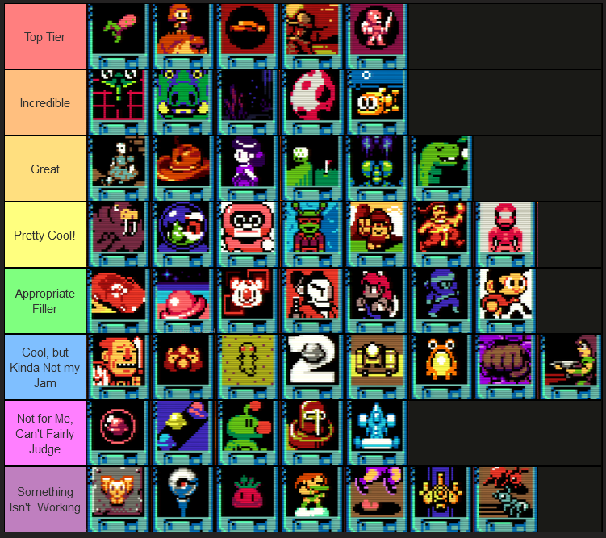

Blogging as I go has definitely left me without games for a year end wrap up. How fortunate for me that my friend Ash put a paid copy of UFO 50 in front of my steam library, destroying my next month and giving me more games to talk about than I've had in years.

Mossmouth's incredible collection of games, framed as a recovered and cracked archival anthology for a fictional computer system(the LX-III), overachieves in every way. UFO 50 could be half as good, with none of the best games I'm going to talk about, and it'd still be worthwhile. Instead, it's something that will likely be legendary.

UFO 50 has a bigger selection of "Must Play" games than [tool tip="I like UFO 50 better than the Megadrive, but what *don't* I like better than the megadrive?"]many older consoles[/tool].

Such comparisons are a bit unfair, though. While UFO 50 tries to lean into it's conceit, it lacks verisimilitude. Although some of the earlier games are simpler and some of the later games are more complex, it isn't 100% committed to the bit. It can't be. This is just the brutal reality for a collection of games, made by a handful of people, over what I believe was the last decade.

While this might mirror the actual life of a console, goals drift. Both over time and from developer to developer. The LX series of personal computers would also be an early innovator in deck builders, roguelites, metroidvanias, and other genres.

This *isn't a criticism* as much as it's about realistic expectations for what is already an absurdly ambitious triumph. The collection would be worse off by trying to be too simulationist about this. 

Instead it creates a more... cartoony, playful alternative history, complete with fake credits and trivia. You learn to know what to expect from certain developers, especially since they seem to be linked to the real life developers of each game. The Spelunky composer, who turns out to be a genius game design sicko, Eirik Suhrke, for example, has his games listed under the character of Thorson Petter, whereas Derek Yu wears many different fictional hats. There is a whole meta story that's fun to dig into, complete with secret content, where you learn about the corporate drama. It's all fun and exaggerated, fitting the exaggerated nature of UFO 50.

There is even an argument to be made that some of the worst games in this collection are intentional parts of the narrative. Now, I don't 100% buy that... I feel like to make a collection of 50 games, sometimes you just gotta let some games ship, even if they're not great. Heck, not being great even adds to the experience. 

A few weak games barely matter anyways when the quality ratio of UFO 50 is **so high**. Way way higher than I ever thought it *could* be. Higher and **longer**. I was expecting... half-games. Or something like demos. Instead, most games in the collection feel about 75% of what people would expect of a full release. Missing an extra stage or two, another map. Some already feel like full length releases, and others would only suffer if that "missing 25%" was there. Like the rare 45-60 minute movie, they're as long as they need to be, but struggle to find context outside of compilations and anthologies. UFO 50 suits them perfectly.

So when I criticize or make fun of a few games, know it is with respect for what was accomplished here. UFO 50 is incredible and even for any game I hate, there is someone who loves it. Every game in this collection has a fan. Even [tool tip="I'm sorry, Star Waspir Person"]Star Waspir.[/tool]

** The Tier List **

This is a 100% biased tierlist, based on my tastes and interests. Ignoring a few placements, I think it's kinda a safe list for a certain type of player? There's probably three of four basic tier list templates you could make based on peoples favorite genres. So this is *in no ways*, **even remotely**, a trustworthy list. There are games that people love that just *do not work for me*. But if you follow me and read my stuff, then you know me, and you know my taste.

Also like any tier list, its fun to look at, but less interesting and informative than the actual explanation. Games are rated without considering any meta-narrative importance, though they are still judged within the context of being in a 50 game collection.

[center]

[/center]

**Top Tier** and **Incredible** are, for me, the Top-10 of this collection. Each of these could be a full, worthwhile stand alone experience with minimal changes. They might not all fit *the market*, but they stand as individual pieces of art.

**Great** are awesome games with awesome concepts. Not as impactful, but if the top 10 were gone, and these were the best games in the collection, it would still be worthwhile.

**Pretty Cool!** are games I liked! Sometimes despite myself!

**Appropriate Filler** are games I feel like have relatively low ambition, but are still fun and cool. They're not the best games, but the collection would feel incomplete without them. In a weird way, it sometimes feels like UFO 50 doesn't have *enough* of these games.

**Cool, but kinda not my Jam** are games I don't really click with, personally, but I was able to play enough to acknowledge they're cool. A lot of genres I'm less of a fan of.

**Not for Me, Can't Fairly Judge** are games I just had no interest in engaging with. They put me off for taste issues. [tool tip="Diskonia"]Some of them might suck[/tool], but I haven't put in the work to feel like I have grounds to say that they suck.

**Something isn't Working** are games where I feel they have substantial flaws the game couldn't recover from. This doesn't make them irredeemable. Some games I like are also flawed, and those flaws might have been too much for someone else. Some games require too much of a hump to *get to the good part*. I also feel like the collection would feel *wrong* without at least one or two kinda dogshit games.

I started this intending to only write about a few games, but... oh god this review needs a Table of Contents.

[TOC]

# Top Tier

## Mooncat

Motherfucking *Mooncat*, man. The great neutralizer. ~~Eirik Suhrke~~Thorson Petter's games are always a mad trip of weird aesthetic, surrealism, and weird mechanical choices. The vibe is always captivating but slightly *off*, and Mooncat embodies this the most. 

Mooncat has a strange, two 'button' (one of the 'buttons' is the dpad) control scheme that makes moving and jumping feel fresh and new. You are back to being a clumsy kid, relearning from scratch. 

I made my friend Ben play this, who was not at all a platformer person and he loved it. He didn't do much worse than the rest of us did, because again, the unique control scheme makes us all beginners again. A game I'd make almost anyone play, given the chance.

## Mini & Max

An incredible late game in the collection. A game where you shrink and interact with a smaller version of the world, filled with giant bugs... before shrinking even smaller, to the microscopic level, battling viruses instead. 

A young girl and her dog are locked into a tiny room by her sister, where she angrily breaks a mirror, spreading capitalism to the tiny world by the way of "shinies". You then freely explore all parts of the room, shrinking and growing, finding whole cities, civilizations and NPC storylines. It's hard to express how in depth the details are. Every story an NPC tells is likely something that gets reflected in the world somewhere else, perhaps at a different scale.

As time moves on, so does the world. Wars start, npcs move around. Everything just seems so alive and thought out. The game starts off feeling like it's simply **Monster in my Pocket** mixed with **Rescue Rangers** before revealing even more layers to itself. Mini & Max reward you for caring and curiosity. It's the type of sicko levels of detailed world building I love. 

Water Bears are a cosmic horrors.

## Mortol

Who amongst us would not lay our lives down for Mortolia? Grim, funny, and straight up tonally weird. The conceit takes the sacrificial nature of some **Lemmings** jobs and turns it into the central mechanic. You have only so many men, who are willing to sacrifice themselves through powerful rituals like *stone*, *arrow*, and *explosion*, to fight back against the evils threatening Mortalia. There is a dark comedy to watching the poor, helpless men of Mortalia throw their lives away, often literally to be stepping stones. You collect new recruits as you go, hopefully bringing enough bodies to throw at the evil that threatens the city.

Just a brilliant game, in concept and tone.

## Grimstone

One of the most period authentic feeling games in UFO 50. Grimstone is a jRPG that seems to take a lot of aesthetic inspirations from **Gargoyle's Quest** and [The Lone Ranger](../game-journal-diehard-and-loneranger/), with all the mechanical influences of **Final Fantasy**. Also it knows about *timed hits*. 

It is a Western jRPG set in hell, about the machinations of angels and demons. The evil of *Mallus*, vs the holy forces of *Biggan*.

The game's opening sets an incredible tone. A saloon set on fire to silence a heretic. During the inferno, an angel appears, giving you the chance to save four of the people in the building. The rest are condemned to death. Each character represents a different final fantasy style class, and each brings their own story vignettes into different parts of the world. The game seems designed to encourage different party compositions and experimentation through multiple replays, much in the way people look at **Final Fantasy V**.

The presentation is top notch. I often criticize a lot of larger faux-retro game sprites for being way out of style, but Grimstone nails it, down to the dynamic monster poses that still force themselves to contort to the boxy sprite boundaries of a retro console.

It's rough, unforgiving, and grindy... but god it rules and just feels so of the time it's from the time it's trying to capture.

## Mortol II

What if Mortol was a Metroidvania with a class system? This game has been creeping up the list for me. The game just has so many ways to approach it's map. There is no *right* way to save Mortolia. Well, there's *one* right way. Dying for it.

Even once you clear it, a special mode exists which limits your class selection. This requires creative problem solving to route out different ways to destroy the great evil.

It doesn't quite hit as perfectly for me as Mortol 1, but it's so clever and uniquely it's own thing.

# Incredible

## Warptank

Thorson strikes again. A game where you play as a tank that can only shoot up, move in single tile block increments, and *FUCKING WARP*. You warp, sticking to the opposing walls or ceiling, clinging to any surface.

Like all Thorson games, the tone is weird and surreal. The sci-fi aesthetic is paired with weird toys and casino music, all while the plot hints at darker and more uncomfortable things.

I worried Warptank would get too "puzzly" due its mechanics, and while it *does* have plenty of puzzles, it seems framed strongly as an action game with puzzle elements. The balance, for me, feels perfect.

## Valbrace

**Wizardy** meets **Punch-out**, complete with incredible art and animation. A dungeon crawler where you can resist all attrition by *getting good*. This is a game that could be expanded so far if they wanted. It's length is perfect for UFO 50 but this is one of the few games that could have half or, if they wanted, 5 times the content.

I don't know if I'd replay Valbrace, but I would be excited for a sequel.

## Divers

I was fighting with myself as to whether this was before or after Valbrace, but Valbrace plays so smoothly. In fact, I'm already kinda regretting it. Let's call it a draw.

A dungeon crawler RPG, where the dungeon is a sprawling underwater cave system, filled with ancient ruins. You explore the world with three lizard men, fighting and digging up treasure before returing to the surface to rest and get supplies. Like all Thorson games, the vibes are immaculate. It's impossible to describe why it's compelling. Even the similar looking lizard men have so much personality, especially once you start noticing their subtle differences.

 *"Slow grindy dungeon crawler with a lot of time spent just swimming back up to where you started"* sounds tedious and *it is*, but everything feels so beautiful, weird and hostile... Well, everything except for [tool tip="There's one area in this game that makes me think of the manga Blame!"]*one area.*[/tool]

## Barbuta

Barbuta used to be all the way up in the top three but I had to be real with myself. What Barbuta *is* though is a *perfect* intro to UFO 50. A perfect, obtuse, early PC platformer thing. Starting with Barbuta is one of the great joys of UFO 50, but while many games eclipse it, Thorson's first game sets the bar. Perhaps one of the most [Sylvie-Coded](https://sylvie.itch.io/) games in the set. 

## Porgy

I love Porgy. Its the cutesy, but still brutal sister to Divers. More actiony, yet still tedious... but again, [exploring the sea](../backtracking/) is tedious, slow, careful work. A cool feature of Porgy is roaming superbosses, that can freak you out and force you to avoid them and not get noticed. This helps break up the monotony of multiple trips... you never know when a giant shark is going to interrupt your well laid plans.

# Great

Let's move from paragraphs to sentences. 
<h2 class="hiddenh">Night Manor</h2>
**Night Manor** is a point and click adventure that actually managed to freak me out with its chase mechanic that makes it hard to control the cursor. Also relatively reasonable puzzles, requiring few to no hints for most players.
<h2 class="hiddenh">Rail Heist</h2>
**Rail Heist** is a cool, unique action/turn-based heist game that is chaotic, frustrating, and... just cool. It's hard to explain how the mechanics work and I'm not even sure I used all of them by the end of the game.

One thing I love is that it solves a problem with non-lethal play methods. Stages reward you for winning fast, winning with no kills, and winning with 100% kills. To 100% the game you need to do all of these, forcing you to engage with the full range of game mechanics. So unlike some Metal Gear games, where you feel like you can't use most of the tools given to you.
<h2 class="hiddenh">Magic Garden</h2>
**Magic Garden** is a puzzle/score game for sickos. a variation on snake, where you cash out chains of "Oppies", dropping them in a "rescue zone" and receiving potions that you can use to defeat *grumpy* Oppies and build score multipliers. The game goes off the rails as you realize the scoring mechanics mean the best way to score is to 'fail' your Oppies, radicalizing them before devouring them, **Pac-man Championship Edition** style. Awesome game.
<h2 class="hiddenh">Golfaria</h2>
**Golfaria** is **The Legend of Zelda** of golf. Limited resources help draw out the length of exploration games in UFO 50 and in this case, the resource is STROKES. The game seems *indomitable* at first. How can I get anywhere with so few strokes? What do you MEAN I gotta spend a stroke to talk to an NPC??? Eventually it mellows out though and just becomes a cool and unorthodox action adventure game.
<h2 class="hiddenh">Vainger</h2>
**Vainger** is **Metal Storm** as a metroidvania. Unfortunately I don't think it's a very good metroidvania. I do think it's a pretty good Metal Storm though so it's still pretty great! Its one great contribution to Metroidvanias is only letting you see the map at save stations. This is annoying, but in a great way that forces exploration and learning the environment.

Sadly, once you know where to go and how to get there, the map just becomes tedious to navigate. Thankfully, the action is fun enough to make sure this isn't the biggest issue in the world.
<h2 class="hiddenh">Avianos</h2>
**Avianos** is **Nobunaga's Ambition** but with dinosaurs, and kinda mixed with simplified boardgame rules. The abstractions away from simulationism on the strategic layer of the game makes it very digestible, and the real time kinda squishy weird AI based combat makes for really tricky, unreliable, and fun tactics.

# Pretty Cool!
<h2 class="hiddenh">Waldorf's Journey</h2>
**Waldorf's Journey** feels like a concept you'd see in an old flash game, just mixed with some great surrealism. You fling a giant walrus around, who is trying to fly through the air in his dreams.
<h2 class="hiddenh">Elfazar's Hat</h2>
**Elfazar's Hat** has some **Pocky and Rocky** DNA in it and is just a fun, breezy playthrough with a fun, if sometimes frustrating power-up mechanic. It's a nice in-between of the two extreme ends UFO 50 games seem to fall in between. "Save-based games with Level Select" and "Arcade 1CCs". Elfazar's hat instead is your oldschool "infinite continues, no save" fair and it feels like a nice, perfect, punchy mid tier SNES game.
<h2 class="hiddenh">Pilot Quest</h2>
**Pilot Quest** is a *fucking clicker game*, with a [tool tip="Real Time Clock"]RTC[/tool] element, only its game fuckign 43 so you don't realize it unless you luck into it early on and **fuck them** for doing that, but also **lol lmamo**. It's pretty mid for a clicker game, and it has an attached, quasi randomized zelda side game attached to it... that is also *mid*, but somehow it is more than the sum of its parts.
<h2 class="hiddenh">House Party</h2>
**House Party** was enjoyable, despite me not really liking deck building game. This is a Top 5 game for a lot of the less action oriented players and was good enough at it to somehow roping me into getting a clear on it. Rightfully should be a tier lower for me, yet *somehow*...
<h2 class="hiddenh">Rock On! Island</h2>
**Rock On! Island** is a dinosaur based tower defense game that is very much fine. I got to the last level, saw it was hard and long and said "nah". Still enjoyed the rest of my time with it.
<h2 class="hiddenh">Rakshasa</h2>
**Rakshasa** is styled like **Karnov** but plays more like **Ghosts n' Goblins**. The death mechanic is cool. You can resurrect infinitely, but each time, the minigame to do so gets harder. It's in that "1cc" camp though and I didn't quite like it enough to want to beat it.
<h2 class="hiddenh">Planet Zoldath</h2>
**Planet Zoldath** is a weird, obtuse adventure game that gives you the feeling of playing an old computer game where you lost the manual. it's not complicated. It's pretty easy, even... but the fun is in learning the system. Doesn't have much after that but it works well, especially as an early UFO 50 game. It's a "single playthrough" kind of game, even if it's procedurally generated each time.

# Appropriate Filler

I don't have much to say about most of these games, but I'll try my best. 
<h2 class="hiddenh">Seaside Drive</h2>
<h2 class="hiddenh">Campanella 3</h2>
**Seaside Drive** is probably the best of them by a good bit, and probably the best "arcade" game in the set. **Campanella 3** is a fun pseudo-3d shmup which apparently has 50 hidden micro-games in it, so that bit is at least interesting.
<h2 class="hiddenh">Block Koala</h2>
<h2 class="hiddenh">Bushido Ball</h2>
<h2 class="hiddenh">Hyper Contender</h2>
**Block Koala** is sinful, sokoban hell. A curse upon completionists. This game has painfully more content then you wished it did. **Bushido Ball** and **Hyper Contender** probably don't actually belong here, but I have very little interest playing either in an actual head to head environment.
<h2 class="hiddenh">Nin-Pek</h2>
<h2 class="hiddenh">Kick Club</h2>
**Nin-Pek** and **Kick Club** feel like the type of NES and SNES filler you'd rent and be a little disappointed with, even if you kept playing it anyways. They're fine!

# Cool, but not my Jam
<h2 class="hiddenh">Attactus</h2>
<h2 class="hiddenh">Bug Catcher</h2>
<h2 class="hiddenh">Camouflage</h2>
**Attactus** is probably one of the coolest games I couldn't enjoy. Definitely a "top 5"er for someone else. So is **Bug Catcher**, but this deck builder worked less well for me than House Party. *Camouflage** is a perfectly fine puzzle game with a good gimmick and a super cute intro story that is held back only by the fact I don't love puzzle games. 
<h2 class="hiddenh">Campanella 2</h2>
<h2 class="hiddenh">Onion Driver</h2>
**Campanella 2** is a full on roguelite, but definitely seems like it lives in the shadow of *real* rogue-lites. Most of the best games on this list hold up outside the context of UFO 50, but C2 has me thinking I'd rather be playing something else, even if its an ambitious and cool part of the collection. **Onion Driver** is some fun 2d **Crazy Taxi** clone, but I found the navigation too frustrating to be very fun, personally.
<h2 class="hiddenh">Devilition</h2>
<h2 class="hiddenh">Fist Hell</h2>
**Devilition** was just a stress factory for me, but I know people love it and I even managed to get a [tool tip="I cheated with by John Madden'ing it"]clear[/tool]. I felt bad about **Fist Hell**. I don't really like oldschool beat'em ups and I lack the genre awareness to even tell when one is good. It's also a zombie apocalypse game, which, for me, is an immediate turn-off. The amount of effort put into it alone though makes it worth checking out.
<h2 class="hiddenh">Overbold</h2>
**Overbold** is okay, it just encourages the most boring gameplay, failing at early missions to be... overly bold until you get lucky, get rich, and make the rest of the play through easier. It succeeds at it's premise, but I don't know how much I like that premise.

# Not for Me
<h2 class="hiddenh">Campanella</h2>
<h2 class="hiddenh">The Big Bell Race</h2>
Apparently I fucking hate **Solar Jet Man**, so **Campanella** and **The Big Bell Race** me fill with a bit of bile. 
<h2 class="hiddenh">Quibble Race</h2>
I'm just not the right type of freak for **Quibble Race**, but I love that it was based on some old newgrounds flash game.
<h2 class="hiddenh">Knights of Diskonia</h2>
**Knights of Diskonia** is a piece of shit. An evil, slow piece of shit. I can't fairly judge it, but I can unfairly judge it. *Fuck you, you slow, slow, tedious, boring, stupid game!!!!*

I think the fact that I can see the appeal is what makes it frustrate me so much. Apparently it plays much better against another person.
<h2 class="hiddenh">Paint Chase</h2>
**Paint Chase** is a concept that's just a bit too boring for me. The whole splatoon like percentage tension mechanic is less fun when other real world players aren't involved. It's probably fine but it shuts my brain off.

# Something isn't Working

Again, to re-iterate, some of these games are some people's favorite. There is only one game on this list that is inarguably bad, but even that bad game can be *fun*.
<h2 class="hiddenh">Cyber Owls</h2>
**Cyber Owls** is the game most likely to be bad on purpose. A throw back to the over-extending, ambitious games of the late NES, mixed with **Cheetah-men**. The presentation is top notch. It even throws in the purple **Vice: Project Doom** parallax clouds. The game covers multiple genres, and they all fall short. One bit is **Metal Gear** mixed with **Goof Troop**, where the stealth mechanics do not function in any cohesive way and you're punished for interacting with any part of the system. Another bit is **Cabal**, but everything is tanky and tedious to kill. The **Shatterhand**-esque action segment just feels ever so off, and the vehicle based level which... seems based on nothing, is just boring. The game even has meta-plot reasons for its failure. It sucks, but it sucks in a way that's cool and is worth checking out.
<h2 class="hiddenh">Pingolf</h2>
**Pingolf** is the most controversial game I've hated on. The question is really... how much are you intrigued by Pingolf to get over the initial hump? Because when you start, the game is brutal and unfair. Golf games are a punishing genre, and this is the most punishing one by far, often losing progress from what seemed like an innocent, well considered shot. There are no *safe* or *conservative* shots in Pingolf.

Now if you're a *sicko* and try to optimize everything, even despite the game making it hard to practice and do so, well... Then it probably becomes pretty sick. An extreme "love it or hate it" game. I had a 50/50 split of people on bluesky saying "Fuck Pingolf" and "How could you hate Pingolf?"
<h2 class="hiddenh">Caramel Caramel</h2>
<h2 class="hiddenh">Star Waspir</h2>
**Caramel Caramel** and **Star Waspir** are the two classic shmups and like a lot of shmups made by non-shmup people, they kinda both suffer from being outsider art. **Caramel Caramel** just has awful balance. You start with 0 lives, and the first stage is *very hard*(and in boring ways), but then the game immediately gets easier. It is competent at its **Gradius** inspired level design though. 

Star Waspir on the other hand has big time *euroshmup* energy. A vertical shmup on a 16:9 screen with tanky enemies and fast projectiles. It just *feels bad*, and there is just too much horizontal screen real-estate for the kinda unfocused, under-designed patterns the game throws at you. The game feels like a bad version of **Judgement Silversword**, which manages to pull off this style of tanky feeder enemy and make it feel good. Star Waspir, to some, is maybe saved only by a decent, parsable shmup scoring system. Enemies from the letters **E G G** in order, every time. By collecting some patterns you get power-ups, and by collecting **EGG** over and over, you get multipliers.

... I'd rather just play [Judgement Silversword](https://starry-mirai.neocities.org/posts/judgement-silversword/). Or I don't know, maybe **Dangun Feveron** or something.
<h2 class="hiddenh">Valgress</h2>
**Valgress** is weird. If you describe the game out loud, it sounds like a banger. In practice, something feels missing. Hell, a lot of things feel missing. 

Randomness in Rogue-lites often have it such that each new generated level presents you with a new map filled with risks and rewards. In Valgress, the only reward is survival and coins to spend in the sparse shop. Then atop that, the game seems to obfuscate blame. So many mistakes that can get you killed can end with you surviving, making the times you die feel random. 

You still fucked up and got hit, but since getting killed by those hits feels like a coin flip, the actual dying part lacks the same sense of personal blame. Valgress seems like a *WIP* for something that *could* be a great game. But for [tool tip="I see you, J"]some people[/tool], it's already good enough.
<h2 class="hiddenh">Hot Foot</h2>
**Hot Foot** has awful, awful controls that make no sense. When played with another human, maybe that becomes a feature. Maybe it becomes 2-Player Mooncat. I will never know.
<h2 class="hiddenh">Combantants</h2>
**Combantants** just sucks. A slow, tedious war game with cheesy strategy, unreliable AI, and actively misleading instructions. I feel like with this game, someone made a demo that sucked and realizing they couldn't salvage it, they just leaned into it. This weirdly feels like the most authentic bad game you could have, where even the devs don't realize how the systems interact. It's awful, but people have fun *within* that awfulness. I had several people say they enjoyed figuring out how to cheese Combantants.

I respect that. You fucking sickos.

# Closing Thoughts

There is almost a dozen games in this collection I feel like I'll be thinking about for a long time. I'm left wondering how this package will be viewed in the years following its release. So many games in this set are worth the asking price, but will those individual games escape the package they're in? I don't mean as independant releases, but just as art. How will we talk about games like Max & Mini or Grimstone? Will any of these games have life outside this collection? How will they be presented?

If UFO 50 forever gets viewed as a singular thing, well... there is something sad and beautiful about that. This wonderful, *wasteful* thing. Or is it? Would these games have escaped the drudgery of Steam on their own, even if they clearly deserve it?
