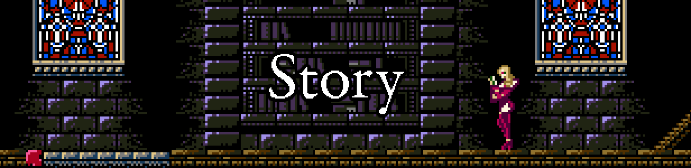
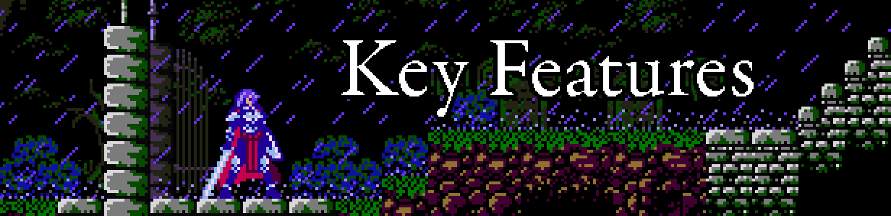
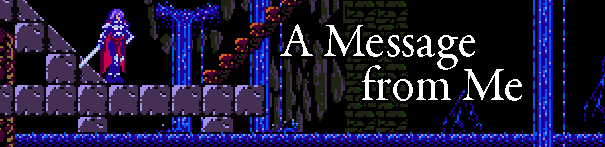

    
[floatbox type="full"]

[/floatbox]

[plugin:youtube](https://www.youtube.com/watch?v=vACqdaSnvp0)
**Release Date: TBA - [Follow Brave Earth on Steam](https://store.steampowered.com/app/706680/Brave_Earth_Prologue/)**

Brave Earth: Prologue is a challenging and engaging action platformer, made in the 8-bit style of the NES. While heavily inspired by classic games such as Castlevania and Ninja Gaiden, Brave Earth: Prologue strikes its own balance between methodical, high risk gameplay and aggressive, fast-paced action. Brave Earth: Prologue's beautiful, handcrafted levels are filled with meticulously placed challenges, aiming to engage players more than frustrate them.

[center][/center]

Play through a story that spans three characters with their own unique paths and playstyles.

Naomi vos Cruz, the young, inexperienced knight who is sent on a simple courier mission that spirals out of control. She finds herself battling monsters and mercenaries in a struggle to stop a cult's powerful, demonic ritual. While not particularly mobile, Naomi has several special attacks to help her deal with various situations.

Sinlen Rothschild, a powerful and mobile mage and Naomi's best friend. Ambushed during the investigation of ancient ruins, Sinlen defends herself with a wide assortment of long range magic.

Trevor vos Cruz, Naomi's older brother and Master Hunter for The Church. While Trevor is slow in attacking with his giant sword, Verbanner, he excels at quick, evasive maneuvers.

[center][/center]

* Three playable characters with diverse abilities
* Unique paths for each character, including original stages and unique paths through intersecting stages
* Over a dozen richly detailed and lovingly crafted levels
* Intense, memorable boss fights
* Beautiful cutscene art by Neolucky
* A wonderfully composed VRC6 soundtrack by Necrophageon and with additional tracks by SK Ultra
* Tons of optional lore that does not distract from the core storyline or gameplay

[center][/center]

It feels like years since I first announced Brave Earth: Prologue. Mostly because it actually has been. The side project that was supposed to take a few months instead sprawled into a retail game that has taken far too to complete.

Brave Earth wears its influences a bit... shamelessly on its sleeve. The game was originally conceived to be a freeware "study" game for me -- learning through emulation. But the product I'm releasing is more than just emulation of classic NES games. I've tried my best to both understand and then build upon one of my favorite eras of platformers to almost arrive at a unique but still in the same spirit. A more modern sensibility without playing like a modern take on a retro game.

As George Lucas's Star Wars built upon and paid tribute Flash Gordon while establishing its own voice, I'm hoping Brave Earth can do the same.