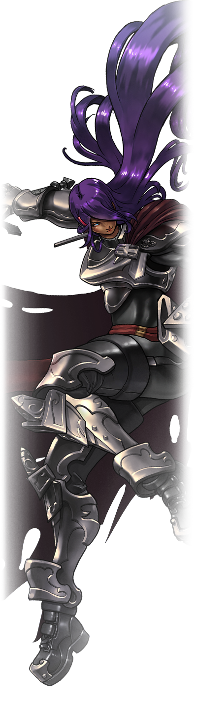

<h1 style="margin-bottom:10px; font-size:60px;">Kayin</h1>
<h3 style="margin:-22px 0px -16px 0px;">Michael “Kayin” O’Reilly</h3>
*(He/Her/They)*

Creator of **I Wanna be the Guy** and **I Wanna be the Guy: Gaiden.**
Currently developing **Brave Earth: Prologue.**

Hi, I’m Kayin! I’m a game developer with particular interest in old games, platformers and difficulty. My favorite part of game development is level design so I’m a big sucker for Metroidvanias and Masocore games. I sometimes write about game design, but I mostly write about the games I’ve played these days.

I have my pronouns set to _**He/She/They**_. If that’s confusing to you, _you totally don’t have to worry about it_. _**He**_ and_ **Him**_ are _always fine_, but sometimes people might use She! Feel free to refer to me as you like! You’re never going to be wrong or upset me I promise! No matter what, I’m still just me!

_(If you want to know more you can click [This Link](more-gender-feels) )_

I’ve also been using the name **Kay** as an exclusively feminine nickname. You’re free to use it as you like! Kayin to me is more gender neutral than masculine so you can use Kayin without any gender implications. It’s a name I chose and is very important to me. I won’t ever be sad hearing it. But if you want to be explicit in _girling_ me... or just like the name better, feel free to use it!

My favorite old games are **Super Metroid**, **Castlevania 3**, and **Bionic Commando**, but I love weird titles like **Shadow Tower: Abyss** or **E.V.O.: The Theory of Evolution**

Some of my favorite modern games include games like **Dark Souls**, and **Bayonetta** as well as indie games like **Celeste**,** Shenzhen I/O**, and** Undertale**.

I also like a lot of weird games like flight sims and skateboarding games. I’ve spent a lot of time flying around in **IL 2-Sturmovik** and skating around in games like **Session**. I’m also a big fan of fighting games like **Guilty Gear** and **Street Fighter** and can definitely play Gear at a pretty competitive level!

I write a lot about game design a lot on bluesky twitter! You can follow me there, but be warned, I tweet about a lot of other things too. I wish I could say Pro Wrestling and Fighting Games was the worst of it, but it’s the easiest way to get in touch! Just beware all the other trashy stuff! 

* [bluesky: @kayin.moe](https://bsky.app/profile/kayin.moe)
* [twitter: @kayinnasaki](https://twitter.com/kayinnasaki)

Speaking of Fighting Games, I stream on twitch fairly regularly! As of the time of this writing it’s mostly **Guilty Gear Xrd: Rev 2** but check my [twitch page](https://www.twitch.tv/kayinnasaki) for the current schedule!

You can also email me at **KayinWorks@gmail.com**, but if it’s business, make your pitch good, because I throw most of that junk right in the trash!

