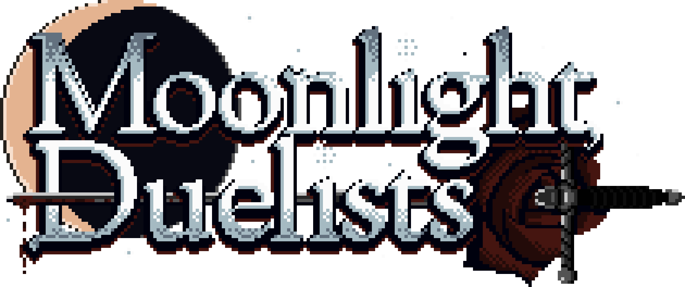

   
[floatbox type="full"]

[/floatbox]

<blockquote markdown=1 class="bheader">Warning: The following visual novel contains graphics and themes that are not intended for all audiences.

<small>This includes **sexualized nudity**, **toxic eroticism**, and **graphic depictions of violence** and **gore**.</small>

<small>If you are, for any reason, legally or emotionally unable to view this content, **please do not download it.**</small>

<small class="bhextra">If you are in need of a more detailed content warning, you can find it [here](content-warning)</small>
</blockquote>

[splitbox side="right"]

++++

My entry into the [**Ryona Yuri VN Jam 2026**](https://itch.io/jam/ryona-jam-2026) and my first *Adult/NSFW* release.

Bao Huynh, Second Year Student, fights for sake of fighting, tempted by a love of violence and a toxic obsession with the University's top Duelist, Janis Nightingale. Experience the unstable mind of Bao while she explores the strange school, fails at social situations, and enters a dreaming realm where she thinks she'll be free of consequences.

Made vaguely in the style of PC-98 VNs, but at a reduced resolution of 320x200. Music provided by [Doric Dream](https://doricdream.itch.io/).

### Download

<iframe class="itchbox" frameborder="0" src="https://itch.io/embed/4298202?border_width=2&amp;bg_color=2d2d3a&amp;fg_color=eeeeee&amp;link_color=e8b42f&amp;border_color=444444" width="554" height="169"><a href="https://kayinad.itch.io/moonlight-duelists">Moonlight Duelists by Kayin (After Dark)</a></iframe>

Available for **Windows, Linux, and Mac**

### Design Book

<iframe class="itchbox" frameborder="0" src="https://itch.io/embed/4322804?border_width=2&amp;bg_color=2d2d3a&amp;fg_color=eeeeee&amp;link_color=e8b42f&amp;border_color=444444" width="554" height="169"><a href="https://kayin.itch.io/md-design-boo">>MD Design Book by Kayin</a></iframe>

A 40+ page design doc/post-mortem. It's *Pay What You Want*, so don't be shy about grabbing it for free.

### Web Version

There is also a **[web version](/files/md-web)**, with some custom enhancements released primarily for phones, but will also work on desktop if you need it. Check the hamburger menu for scanline and intscaling options.

*<small>I've had intermittent extreme performance issues on firefox. If the game is running incredibly slow for you, try to duplicate the tab. Leave both tabs open until the new one loads. If it's smooth, you can close the other one. I don't know why this works, but it is incredibly stupid.</small>*

[/splitbox]