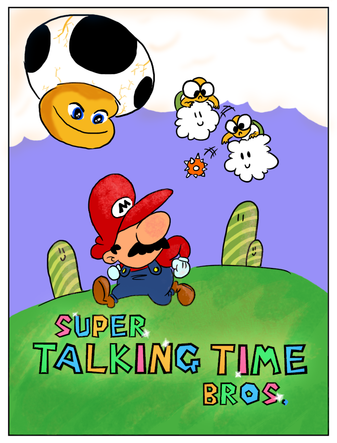
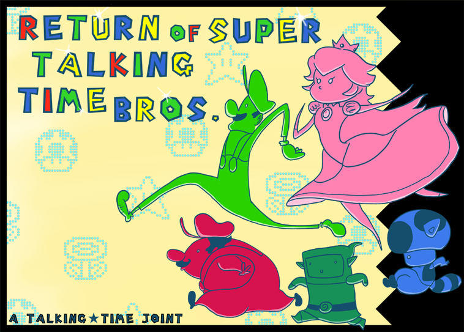

[center][/center]

Super Talking Time Bros is a joint effort that took place on Jeremy Parish’s personal forums, Talking Time. This project took a handful of typical gamers and showed how they could outperform the vast majority of the indie game scene in terms of level design simply through a simple peer review process. I can say without hesistation that I enjoyed playing this project far more than either of the New Super Mario Bros games. The project was made in the now abandoned SMBX engine, with the whole community being allowed and encouraged to submit level files. A lot of levels had to be revised quite a bit and I believe a few levels were salvaged by other members of the community. The pack is not perfect — it’s slightly disconnected at times in style for obvious reasons, but it avoids virtually all he pitfalls of ‘rom-hack’ style level design. These levels were designed with the premise of SMB3 in mind — fun, short, simple levels. The pack goes crazier than that for sure, but that goal kept things from getting out of hand.

[floatbox type="full"]

[/floatbox]

I submitted two levels of my own (being impressed by the quality of the initial pack) to the expansion pack. The expansion pack is a little bit more wacky and akin to those hidden Starworld levels in Super Mario World. One of my submissions is a neat, but straight forward level and another is hidden… perhaps due to it’s IWBTGish nature? Anyways, I’m hosting the whole shabang right now so please, download it and give it a go. It comes with SMBX so it should be all ready to play. I think many people will be impressed with the powers of peer review and revision.

**[Download Super Talking Time Bros + Return of Talking Time Here](/files/STTB.zip)**