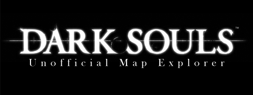

[center]

**_Note: This is old and mostly unnecessary. Besides the ability to overlay Oolacile, the features of this viewer are well eclipsed by [noclip.website](https://noclip.website/#dksiv/dks1). I don’t plan to support this project at this point and it is only left here for archival purposes. Feel free to use it still if you really want to, but at this point it is provided very much ‘as is’._**[/center]

I’d like to introduce the Dark Souls Map Explorer. The Dark Souls Map Explorer is a simple tool made by me, in Unity, using Vlad001’s data files. The Dark Souls Map Explorer does not replace the Dark Souls Map Viewer, but instead, focuses on an aspect Dark Souls Map Viewer was poor at: In close camera control.

DSME allows you to explore the Dark Souls collision data Map both in first person FPS style controls. Made in Unity, It also allows you to switch to a no-clipping free flight camera. This allows for a closer and more personal interaction with the map data. It is not as good as the DKSMV or the .obj data when it comes to more precise analysis, like taking technical pictures of the world, as I’ve done with my analysis of [Oolacile and Darkroot Garden](ovsdrg.png). Unity’s FPS style POV and other factors would probably produce far more distortion, with far less clarity. DKSMV is also amazingly lightweight.

DSME’s data is also slightly flawed in some places. Unity, to allow such big data pieces to even be loaded, had to cut up some of the stages in ways that occasionally leave unsightly and inaccurate seams in parts of the world.

[floatbox type="full"]

[/floatbox]
  
**Controls**  
_WASD+Mouse:_ Move and look around  
_Space:_ Jump  
_Shift:_ Quick Move (only in Free Flight mode)  
_Q and E:_ Move up and down (only in Free Flight Mode)  
_R:_ Cycle between FPS and Free Flight Mode  
_F:_ Toggle Oolacile and Darkroot Garden

As a note, ‘detached’ words have been adjusted from their in game position. Oolacile is placed exactly over Darkroot Garden for the purposes of comparison and is invisible by default. The Kiln was moved slightly to not clip with parts of Oolacile. The Painted World and Undead Asylum have also been moved slightly, to make them easier to find. Besides this and the necessary ‘slices’ in the map to work around object size limits, no intentional changes to the world geometry have been made. If you find any, please report them.

If the unity logo fades and you’re stuck on a black screen… just keep waiting. On some computers it can sometimes take minutes to properly launch (another point toward DKSMV).

[Download PC Version](/files/dsme.rar)  
[Download Mac Version](/files/dsme.tgz) (Might only work in Mountain Lion? Anyone with Lion or lower, please test this out and comment)

I have also decided to release the source code. You can do whatever you want with this, but I encourage you to get in contact with me if you make any significant improvements to the program. A lot of simple features could probably be added relatively quickly by people with more experience than me. If that happens, i’d like to host whatever the best version is.

[Download Unity 4 Source Code](/files/dsme-src.rar)

**edit: Due to crazy amounts of spam for this link and the lack of any real discussion at this point, comments have been disabled. Feel free to email me with any questions instead**