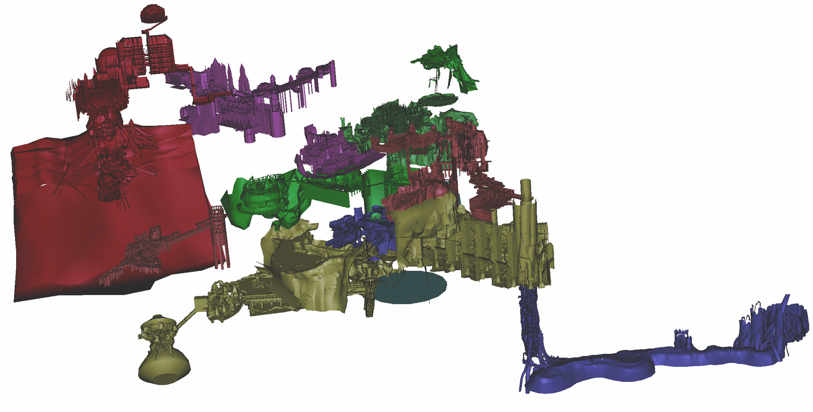

[floatbox type="full"]

[/floatbox]

The **Dark Souls Map Viewer** is one of those wonderful things that most people in the Dark Souls community don’t know about. Part of this is because there is no obvious public place talking about it, and because the update made by a 3rd party which added the DLC content was on a website that was infested with spyware.

Dark Souls Map Viewer is a program made by [vlad001 on the xentax forums](http://forum.xentax.com/viewtopic.php?f=16&t=7876&start=60), who released the program open sourced. Ispohr on the Dark Souls Reddit re-released the map viewer, with the DLC content and a online map analytics too, but for whatever reason his website is now down (likely got hacked). Because of this, the Oolacile data file was kinda ‘lost’. A nice person over on Reddit posted it and I decided to package it up and host it. Now it’ll have a place to exist other than random rapidshare links. This is Vlad001’s with the map files from Ispohr’s release. Vlad001 has also been kind enough to endorse this mirror.

If you wanna get some idea what the Dark Souls Map Viewer is like, [check out this video](https://www.youtube.com/watch?v=tyTB5vhKGSI).

**To Download the Dark Souls Map Viewer, [Click Here](/files/darksoulsmapviewer.zip)**

Thansk to Vlad, I was able to convert the DKSMV files into .obj files. The maps themselves are not the -actual- maps of Dark Souls but instead the collision maps. The game’s collision maps are surprisingly complete, even when it comes to objects you should never be able to reach, but keep this in mind if something seems missing.

I plan to use these to make a more ‘first person’ map viewer (Likely to be called Dark Souls Map Explorer). It likely won’t replace the viewer, as it is very effecient at what it does, but the Map Explorer will hopefully excel where DKSMV fails: In close and in doors. But feel free to use these in your own projects, but keep in mind that we’re technically playing with other peoples property.

**To Download Dark Souls Collision Map Data, [Click Here](/files/darksoulscollisionmap.zip)**

_Keep in mind that the data here is technically the property of Namco-Bandai and FROM. I think we can claim fair use on this tiny subset of data. Sharing it only benefits the community and, by extension Namco and FROM and the value of their products. but be respectful and know these resources many have to be removed at any time. I doubt that will happen (IWBTG still exists, after all), but it can._