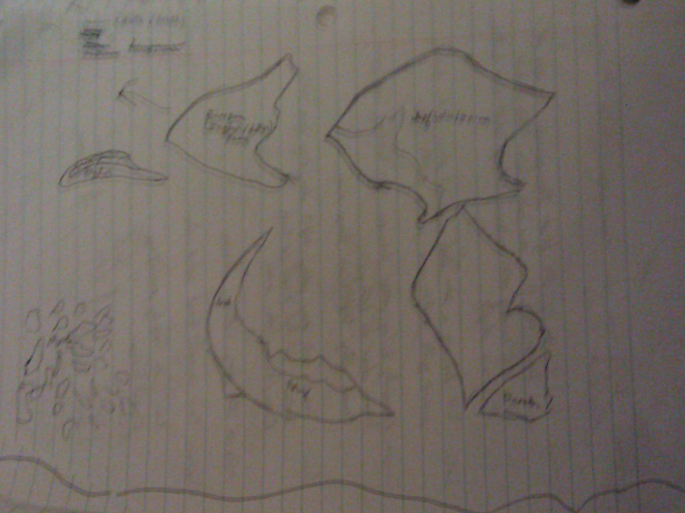
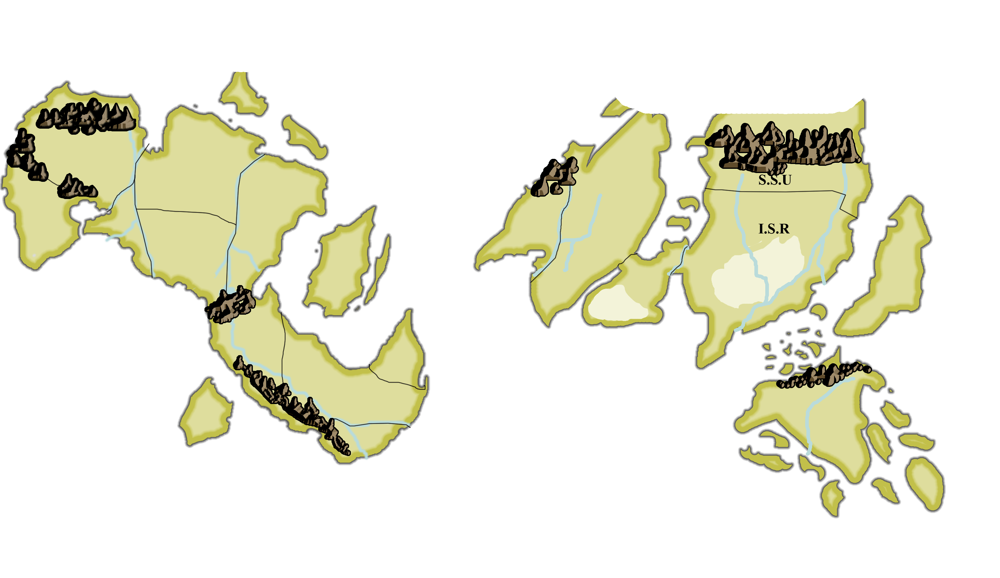
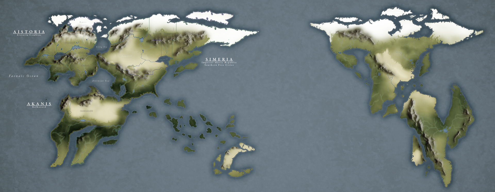
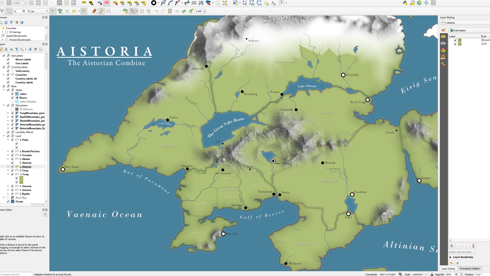
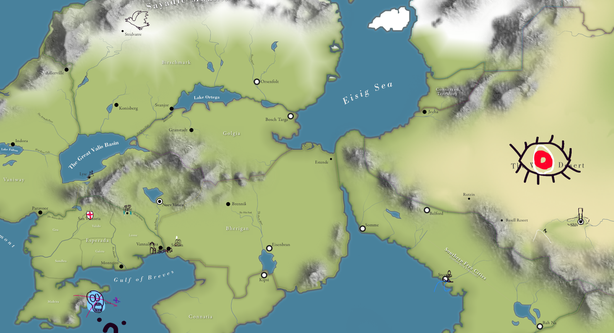

I've been a nerd for a long time. And like any nerd, I've been world building for some time. Some people come up with tons of settings with tons of new ideas, moving on when things get to *cringy*. Not me. I keep on trucking. But not inflexibly. Instead, for me, since my teenage years, this has been the... Ship of Theseus. Or the forest burning down to bring new life. Instead of starting over, I mercilessly cut and burn things down so I can focus on new ideas that better represent me as I get older, each cycle leaving a patina. World concepts change, self inserts become obscure side characters, and new maps are drawn up.

This was probably some some time in the late 90s, land masses laid out as if they were islands in Wind Waker. No idea what, I wanted, but I wanted *something...

So it's 2005. I don't know how rivers work and barely understand mountains. I only have one place to put on the map really. Still, it's familiar. I remember what I was thinking, I remember things that happened, be it RP or writing on various continents. I rememer being SO EXCITED that I could automatically outline things in gimp! This sits for awhile. Mostly cause my own stuff gets put on the backburner. I have fun world building with my friend and making maps for different settings. But 2011 comes around and it's time to go again.

Hey that's pretty alright! Only some of the rivers are fucked up. You can see a lot of the similarity to the old map  but as a lot of the old needs of the map are fading. I start thinking about BEP around now. The left most continent? What will eventually become Aistoria? I hadn't thought about that piece of map ever, but it was a nice shape and unused.

I start embracing that the world is a World of Ruin for the real world. I'm not trying to hide what continents used to be what anymore, though I start preferring a 'pacific ocean' style map framing to hide it a little.

.jpg)

Motivated by BEP and RP, I make a map of Aistoria and the surrounding area. I... kinda fell in love with this map? It has problems but start doing more research and keep trying to fix problems I find. I try and be more diverse with names to better capture the conceit of the setting. I do... okay at best, and even now don't do great. I start trying to figure out methodologies to try and make maps like this at higher resolution, so I can try and do more details. I try to look into map projections, or generate erosion maps to help me design rivers.

Eventually I get a webmap up. It can go into about the detail of the previous map but most of it is underdeveloped, it's painful to edit, it's juggled between photoshop and illustrator and there are still fundamental things like map projections I have no solution for.

The important thing here though, and why I wanted to write about this is... Who is this map for? Even if I release a game with this setting, it will represent only a small fraction of what I'm drawing. Even my RP covers a small slice of all of this Why be obsessed with details? A Song of Ice and Fire has a map that looks like an MMO map that got an expansion. Even if people end up caring, no one will care as much as I care. The maps, while I can share them and us them, are maps for me. To solidify my ideas, to force me to think about the world, to force m to learn, to remind of me dumb decisions I made. It's the patina, the seasoning on a cast iron pan that keeps my mind from sticking. So I can look and see a big island, that was an important place in an awful, giant novel I wrote in highschool, shrink and shrink through the years as I grow farther from those ideas. Aistoria is everything the Warring Isle never lived up to being. I can look at another island, which was going to be the location of a metroidvania I was making in **MZX** of all things in the late 90s. Is it still Nevencler? Probably not. There are so many different people who survived the end of the world who need to represented instead of 'white people feudalism on a tropical island'. But I'll remember it, along with the dumb floating continent nation that existed cause I thought Zule was pretty cool. I won't even *show* that map.

So downloading GIS software -- the type of shit they use to make maps with real geographic info? That'd just be real pointless sicko shit right? Just REAL indulgent? 

Yeah, welll...

I wanna write about my frustrating but fun experience using QGIS but that'll be sometime later. I love how this system lets me update things so easily though, or revise styles, or even just make super specific smaller maps. The header was a quick little thing I tried out using the data I generated for the main map. It's not as stylized as the previous map, but that's okay. It serves as a more... reasonable notepad for my thoughts and world design now.

But more importantly, I as working with my friend Karami to decide like, what areas should have what kind of cultural names or whatever and while we were doing this on a whiteboard, Karami started doing little doodles...

Like a little journal of the things that happened in the world and in RP, making memories tangible.

I've put far too much effort into something no one will ever care about as much as me... but like a journal, it's *not for* other people, it's for me.