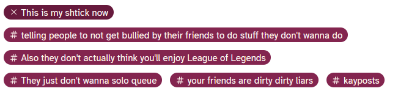

We've all seen it. Some says they're gonna watch something, play something, read something, whatever and someone stops them and goes ohnono before you do this, you gotta do this and this and watch this to have context for this. No no no, you don't play these 3 20 year old games first, you won't get these dozen references!

Or maybe it's more like.... You GOTTA see this movie in the theater. Okay you gotta watch THIS movie, but you can't know ANY SPOILERS don't even look at the poster!! No you can't play the DeS Remaster even though it confused 'high fidelity' with 'Art Direction' and hack artist directions who take influence from World of fucking Warcraft though they could 'fix' 'shoddy design' so you gotta find a working PS3 and set the DNS to a special server used to reactivate the online so you have the OPTIMAL Demon's Souls experience!!!

The person talking about DeS Remaster ~~(Me)~~ isn't wrong. The person who says you need to see 4 different wrestling matches before you can optimally enjoy this other match isnt WRONG. The person who says the movie is better in imax isn't *wrong*. But the importance of that rightness is way less than any of us want it to be.

Often we're not concerned with sharing a piece of media with someone.. no we're trying to share *our* experience. Played through a Souls game blind? Oh your friend has to too, that's the ONLY WAY. Friend wants to get into wrestling? Well they should start **oddly specifically** around when you did. We have a habit of viewing our positive media experiences as the "right way".

But if we were all tim rogers, going back recursively through history for ALL the context, well... we'd very rarely ever get to the things we want to get to. No viewing experience is perfect. They're all flawed and biased. We all latch onto different things. A new person latching onto different things isn't enjoying media wrong -- in fact, the piece of media was probably DESIGNED for this multi level approach. Yeah you can be OPTIMAL, but is OPTIMAL that important? And was our experiences, our taste -- were they really that optimal, or where they just OURS?

So if you're trying to get into something, but everyone is giving you homework, saying all the stuff you NEED to play or do first like... if it sounds fun, yeah do it, but if you just wanna *enjoy something?* Or trying to get into something new? The best time is now and the best place to start for you is probably with whatever just came out. You can always go back and while that might not be the same as a first time experience, it's *your* experience so who cares?

*Also if you **are** gonna be a huge nerd about it, the answer is ALWAYS release order*

