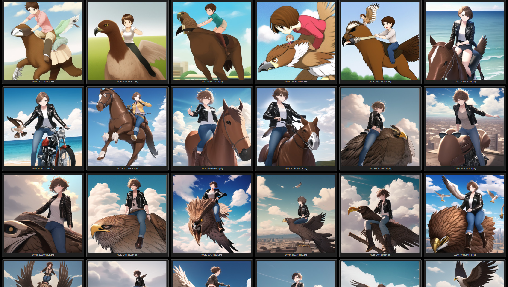
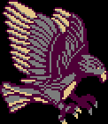

I feel like I gotta set the stage here so everyone knows where I'm coming from. *If you follow my private twitter and mostly know how I feel about this stuff, feel free to skip down to the pictures.*

I hate all this AI shit. It opens up so many pandoras boxes, so many legal issues, so many ethical issues, all so we can do less of the things that make us human. On the other hand, this stuff isn't going away. Maybe the Chat-GPT model isn't sustainable as we crash into the exponential curve of processing power we need to produce accurate truth, but we're stuck with machine learning. Especially AI art gen. Text takes special made hardware to do at the level needed for good results but ART? You can do it on your gpu right now. Even in the best case scenario where this shit gets legislated to hell and back, people, casually, are gonna be running AI art models forever.

For further context, I'm an artist. A (former? dodgy?) illustrator, a type setter, pixel artist, 3d modeler and animator. I mess with everything and, despite kinda HATING IT, I've been, for the last month, been messing with using stable diffusion. Mostly keeping stuff to myself/private cause lol it's all like RP porn trash anyways and like, the ethical issues *(it's fucked up to gen something and recognize the underlying artist)*. I don't want anyone to ever get confused about what these images are. But I'll post one -- ad more, the process of one -- as a chance to just... talk about how this stuff works, how it makes me feel, and just.. the general shortcomings.

### The Process is invisible

I'll see people say a lot that "AI Art isn't Art" and that isn't wrong necessarily, but reductive. The image the AI gives you is not, in and of itself, 'art'. But the processes, your goals, your expression, your compositing and all that, all that  is what makes all these artificial lines art. We're used to the lines being the art -- being able to see the process, see the work. AI art almost like an AMV. You didn't make the animation -- but by moving around elements you can make some new, chuuni as hell meaning. The art is the *cut*, not the *content*.

For AI though, the work is invisible. The 'cut' hides itself, and the content masquerades as original. An effortful piece to get things exactly as the artist intended is hard to distinguish from a satisfied user who was just prompt fishing. It's hard to tell how much you're demanding of the machine, and how much you're ceding to it. Harvesting a Pretty Picture from the Pretty Picture Mines is much different from expressing your will and desire. In fact, trying hard with AI art tends to produce weird muddy artifacts and stuff so honestly you're PUNISHED for caring. The incentives are perverse.

... But it DEFINITELY can still be art.

### The Part that's Art

The first thing I tried to do with SD is generate my friend's character, Ari. Ari is cool fuckgirl who delivers packages by riding a giant Rok Falcon. This seemed perfect. You can do birds, right? Girl on top of bird, the perfect AI job and..

 Okay yikes

So I shelf that idea and do a bunch of other stuff for the next month and decide hey, I know more about this stuff, I got a whole inpainting/compositing workflow down, I got more models and have a better idea what they do, so lets try again. This time we'll generate Ari on a PEGASUS, then I can inpaint the shape of a bird, but we'll have the wing positions and--

 ... Okay wait... shit.

 Hey I got a decent one lemme just do a rough doodle over it and 

 ... Motherfucker. OK new NEW plan. We'll generate the BIRD and THEN add the girl! The models seem good at generating decent Aris *(even though they lean toward one very particular, average version of that character because AIs are unoriginal)*, so lets start with BIRDS.

### Okay you know what, AI can't do birds.

This is kinda abridged. There were lots of attempts for all of these, and a lot of me messing with different models to find me one that could do a bird. But this is kinda part one of the problem. A girl riding a giant bird is NOT an original concept *at all*. But there still isn't a ton of art of exactly that so it struggles. You could train a model on bird drawings??? But at what point do you just *draw the fucking bird*? AI is both enabling and very creatively restrictive if you care about the results.

Well, I'm doing this to learn to work with AI generation and also could never draw a good non pixel art bird, so back to GENERATING.

 HEY! HEY OKAY!! GREAT! Close enough! I could keep going but that's another bad thing about AI. It turns you into a fucking gambler. Maybe the NEXT seed will be better. But fuck that, this is a fun 'doodle'. I try and keep myself reasonable because AI art is frankly less fun than other mediums if you just sit there kicking your GPU in the dick over and over.

Okay so we can hide the legs, crop in, draw in the girl...

... Okay that's NOT Ari but this is kinda working! Lets keep regenning until...

Okay lets re extend, change the pants color, flip the head...

... Fool around, give her a hair cut, shrink those boobs, add some bird fluff and....

So now we're gonna UPSCALE this using a TILE UPSCALLER which is a good way to upscale things when you dont' have infinite vram and...

 okay I forgot to take the prompt out so it applied it to every tile. ALSO A HORSE AGAIN WHY WON'T IT GIVE UP ON HORSES. Anyways, we can use some of this, and...

Okay cool! This is like a picture. At this point I liked it and showed my friend, who also liked it. But it feels weird still... the AI energy that feels off. Ari doesn't feel composited in well. Her style clashes. The FOV feels wrong for this sort of shot. A general problem is, when you get an AI picture, you get a picture that no one would ever draw *like that*. The *motivation* ends up feeling wrong. So often you gotta go in and correct for that... which is a challenge because you gotta figure out what's even "off" to begin with.

 Like okay lets add some haze and mush up the line art a little to sorta make her less sharp and wait no her jacket isn't reflecting right cause the AI wouldn't know about that, so lets make it kinda blue-ish...

 The final bit was using a lens effect to kinda reverse fisheye things to get Nutmeg (the birb) and Ari better in frame and get a bit more of a sweeping feel. It's got issues, Nutmeg looks derpy but lol The only good bird I ever did was pixel art

It still feels AI-ish but... that's... fine? Honestly, with most of my AI Art stuff I don't *want* it to pass. I want it to be honest about what it is. I've been doing a lot of fake 'real people/photo' stuff because it is so DEFINITELY AI because it doesn't resemble anything real. The intrinsic lean toward mimicry is one of the big challenges of treating AI art with any sort of seriousness.

The other problem is like... Okay, this is art. I made an art. But the art I made has artistic tells far beyond what I did. I called this a 'doodle' but the end result is something mimicking a piece someone could easily spend 10-40 hours on, depending on their skill. Again, used to the art being the lines. It's complicated for me, who likes this picture, to share it, outside of a context like this, because the dissonance between my effort and the end result is huge. *I made art*, but I didn't make a dozens of hours painterly anime piece and as an artist in like a dozen different mediums *THIS IS REALLY FRUSTRATING!!!!* I HATE IT SO MUCH!! I don't want to deceive, I don't want the stolen valor. If I downloaded some 3d models from turbo squid and made a scene people kinda realize 3d artists do stuff like that all the time, but AI art is a *natural liar* which makes genuinely interacting with it SUPER HARD.

Still again, I like this picture, I thought it was fun to make. I felt like I learned things *from omission by the AI*, which was interesting. I still feel grossly weird. Some arts I've never met have bits of their lines in their, ground up and glued together like particle board or a fast food chicken sandwich. Part of the reason why if I ever used this for anything public, I would NOT use any kind of illustrative model. It's just too messy

I also feel like people who think they can become an artist without art skills with AI are deluded. This shit is SO annoying. This was a simple composite for me, compared to shit with like, multi layers of color corrections, actual drawn in assets, making clean plates or w/e and just really having fun in photoshop. That shit is SO fun, I love doing it, but.... the results I gotta keep private, because I can't JUST take credit for the 140 layer photoshop file I made. And the fact I can't share this stuff isn't an injustice by people who *just don't understand*, it is a problem inherent to the tools. It sucks. It sucks so bad. It's fun?? but I hate it. We are cursed by the opening of pandoras box and everything is just gonna keep getting worse but fuck it, I'm gonna enjoy the challenge of getting a machine to put a girl on a bird.