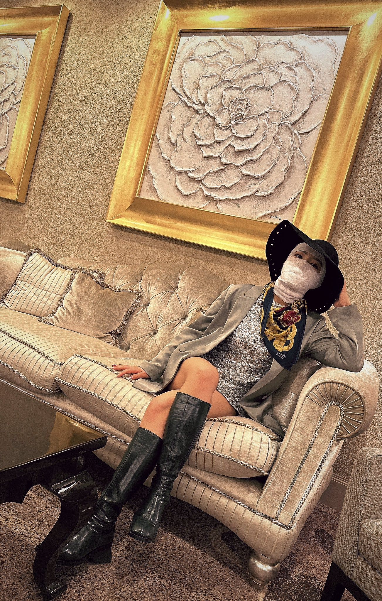

<https://twitter.com/Himanshu_Doi/status/1588221439529734144>
**Post Match Interview with Mina Shirakawa, after her teeth and jaw got injured during a Stardom show. Content Warning for Blood and Dental stuff**

Wrestling is dangerous. Recently two of my favorite wrestlers had a match in with Saya Kamitani messed up her finisher, the Phoenix Splash, and kneed Mina Shirakawa right in the face. This is not the first time something like this has happened, and won't be the last. Supremely talented wrestlers mess up moves, especially "blind" aerial moves from time to time and those who seem perfect are only perfect due to all the experience they've had screwing up in the past. Saya, as gifted as she is, has only 3 years of experience and WILL make mistakes. Many of these girls are learning on the fly to lead an ever growing company that isn't dominated by a lot of center stage legacy talent.

Mina is, to me, a supremely underrated wrestler. Her star is starting to shine more as people realize how good she is, but she suffers from... *Hot Girl Sydrome*. Mina is hot. Mina has big boobs. Mina was a gravure model. She dances to the ring. Being hot is part of her character. But many, due to social stereotypes, don't look at wrestlers like this the benefit of the doubt, or assume they''re tough. Mina is talented, she is coordinated and a strong wrestler who is excellent with drama, emotions, and story telling. I love Mina.

So here she is, the hot girl ex model, sitting there post interview. Teeth are in shambles, her jaw might be broken, she's bleeding everywhere. She's in pain and crying... and it feeds into her loss, her inability to get the belt and blends with the reality of the hurdles she legitimately goes through and the hurdle she is going through right now, just letting her heart out. In a situation where people would rush themselves to the hospital and be unable to talk, Mina continues her story, in tears, because she's actually hard as nails. She later was said to be spotted in the hospital in her ring gear. Pro Wrestlers are just built different.

*"If I can't show fans that I'm going to crawl out of this hell, then I'm not a pro wrestler!"*

She just showed up traveling like this god what a queen