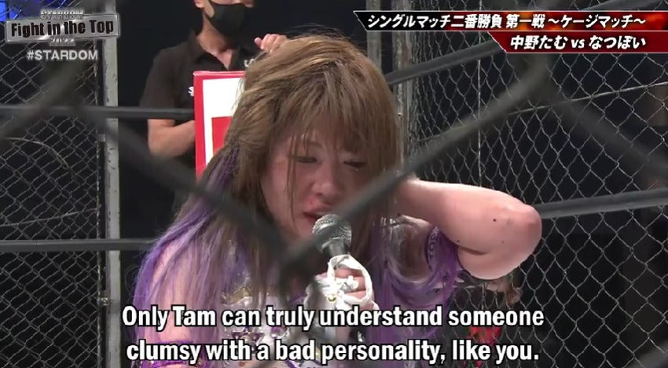

**Anonymous Coward** *asked:*

hey who are these stardom cuties?? tell me about that?

lol which one?? All of them?? There are so many! But I can talk about some of the ones I posted.

But first, an important detail. In general, it's *really weird* to talk about real people, their possible orientation real life ships or w/e... But wrestling is WEIRD and is a strange blend of reality and character by design. Like Turbo Reality TV. Atop that, Joshi wrestling is, by many accounts, a kinda hiding place for queer identities. Atop that, at least from what I've seen in Stardom, there is some *Takarazuka Revue*  gender play energy *(down to a princely girl who comes to the ring with a rose which she gives to a girl in the crowd)* and atop that, wrestlers, regardless of their actual orientation, play around the edges of same sex romance and love. This shit is loaded and messy, but also intentional.

So when i talk about this, I am talking from as much "character" as I can, even though there is a nebulous but non-zero amount of overlap between "character" and "real life". Speculating about real life stuff in public is not something I'd do lightly, and not here. But I WIIIILL talk like this is a tumblr post babbling incoherently about my favorite new HBO Prestige Drama--

## TAM NAKAKO

- Top Kawaii of the Cosmos
- Wants to pretend she's not 30+
- Fights with her heart. Also by kicking your chest in.
- Secretly the best wrestler in the world
- Ex Idol, which means she's mean and hits hard
- STEINAAAAH SCREWDRIIIIVAAAAH

Tam is the most unlikeliest of "Maybe one of the best Wrestlers alive right now". She's not the most athletic... okay she's not even athletic. She's not really graceful. She's more like a mean sailor who dresses in frills. But when Tam wrestles, feelings pour out of her and out of her opponent. She is practically everyone's best opponent, sans some specific rivalries. Tam fights for Stardom's White Belt primarily, the cursed Belt of the Heart, and for which tears must be shed as sacrifice. Tam could be a whole huge post on her own. Every step Tam has taken from Oedo Tai's cute (injured) Mascot has been paved with tears, hardship and lost friends. Yet Tam endures, because only in the ring can a woman truly understand another woman.

## Natsupoi

- High Speed Fairy
- Brat
- Gymnast
- Clumsy, and with a bad Personality
- Brat
- Does cool moves
- Looks like a Hamster when Mad
- Really bad at pretending everything is okay
- Brat

Former member of Donna Del Mondo, with roots tracing back to knowing Tam in the promotion Actwres girl’Z. Natsupoi *(then Natsumi Maki)* mentored the newbie girl, Tam, until she left and surpassed her. Natsupoi was very jealous despite having two *very cool* and *very strong* girlfriends. The only way to solve this is a Cage Match. 

Tam kicks her ass, so the only logical thing to do is betray her boss, break up with ALL her girlfriends, and dive into Tam's arms.

now they come to the ring together like this

<iframe width="560" height="315" src="https://www.youtube.com/embed/5uET6JYCRGg" title="" frameBorder="0"   allow="accelerometer; autoplay; clipboard-write; encrypted-media; gyroscope; picture-in-picture; web-share"  allowFullScreen> Powered by <a href="https://youtubeembedcode.com">embed youtube video</a> and <a href="https://xn--helgln-mua.com/">helglån.com</a></iframe>

YEAH I TOLD YOU IT GETS PRETTY GAY OKAY

## Saya Kamitani

- White Belt Champion
- Useless Lesbian
- Only wrestling for like 3 years??
- Gracelessly Graceful
- A noodle made for War *(and Anxiety)*
- Bottom
- Still Striving to reach the Top
- The Top isn't actually interested in her
- NTR Victim
- Does a cool flip
- Tries to act like she's cool even though everyone knows better.
- Accidentally shares Brit Baker's gimmick
- Dork

Of all the women in Stardom, Saya Kamitani has the most will power, because she wants nothing more than to be bullied by hot, cool women, yet can still muster up the strength to fight and win. To me, Saya is a deeply relatable wrestler. A talented bottom who is also a ball of anxiety, uncertainty, who gets real nervous whenever hot girls are near by. Saya and her Sometimes Tag Partner who Will Never Love Her, Utami Hayashishita (we'll go over her later, she's the rose girl), are both two talented rookies who had a lot of pressure put on them during the pandemic. Both rose to the occasion in different ways. Saya seems naturally gifted in the ring. While sometimes she's glangly and flaily, her sense of timing and drama are great and she's developing into a real emotional story teller who can back it up with cool, high flying moves. She's also extremely bulliable.

That's okay, she likes it

**(Maika then proceeded to try and kiss her)**
*(I TOLD YOU IT WAS PRETTY GAY OKAY)*

Anyways ty this was a very fast, silly and exaggerated quick intro to 3 wrestlers I really like!