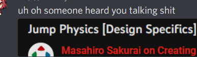

Y'all are gonna want me to go back to posting about wrestling

[*some time passes*]

Alright, real game-dev talk.

lol my friend (ty Miko) sent this to me as a gag so I could have a jump scare but we were talking about Sakurai and why he's kinda a real one. Sakurai doesn't talk about Coyote time. He doesn't tell you how you should design jumps. He tells you how jumps usually are, and then why you might change parts of that to get different effects. He's not teaching you how to design a jump, he is inspiring you with a world of possibilities so you can think creatively about your decisions. He's not trying to tell you how to design, he's trying to *show you* how to think like a designer. Very little of Sakurai's output is prescriptivist

I hate prescriptivism in art. In my opinion, once someone starts going "You HAVE to incude this" or "You have to paint like this" or "Your story system HAS to work like this", they're trying to sell you something. Probably a book, maybe their services, maybe a youtube channel, or maybe they're just trying to display their 'expertise' to establish clout. Regardless, helping you is now secondary. It might still be helpful, but the intensity of the message is at odds with the reality of the message.

As people who have engaged me on this gag have probably seen, my actual opinion on Coyote time is pretty tame. People overuse it and abuse it cause every game designer tells you that YOU GOTTA have it! Rookie mistake to not have Coyote time!! So of course I have to jokingly be a snarky contrarian, but it's also truth, while maybe Spelunky goes too far, all those games in that meme... need it? And they all need it for the same reason. They are high speed, slippery platformers. Flexibility in one are allows them to have intentionally less controllability in other areas to target the game feel they want.

Something like La Mulana on the other hand doesn't. You could say "Because inspired by old games" and that's kinda true, but it is also a slow platformer, with a wide protagonists, with jumps that are rarely about distance. So not only does that thematically work with the faux-msx nature of the game, coyote time wouldn't be solving a problem that the game has. IWBTG is similar. While some of the collision boxes are suss and maybe could have been a tad wider, the idea is the same. This is a game with perfect movement (in the sense you have full and immediate control of your movement, not that the system is, in any way, *perfect*). It's a position platformer. It has a double jump that makes a different sound so you know if you fucked up (it never actually helps). It is up to the player to execute challenges with pixel accuracy. That's the game.

Now of course, this can still be a problem to fix and if I wanted too I'd have more options than Coyote time. A slightly wider collision box would be one -- not appropriate for updating IWBTG but something considerable for a sequel. I could make the sound difference more intense. I could add a particle effect to the double jump, or make the kid do a flip. All things to communicate 'This isn't a bug, you just didn't do what you intended to do'.

I had to do this in Gaiden *(which, relatedly, added a grappling hook to make a new 'slippery' skill element to break up the monotony of tightly packed pixel based skill challenges)*, actually. Not for the jumps, but for the grappling arm. The first release provided no feedback as to why a grab failed and this frustrated people. Once I added the red x and the messages like "TOO CLOSE!!!" people realized why they were failing and took less issue with it. Stuff like this is much more nuanced than a lot of pop-game design lit that's like "Oh have you tried adding the Good Design Sauce™️??"

*(Brave Earth for the record has 1 or 2 frames of Coyote time I don't remember, but I did it cause fucking rdein bullied (ilu rdein) me into it!!! It didn't need it you walk SO SLOW and the platforming isn't hard, which is why it's set so low)*

Also Sakurai's approach is nice cause while a lot of the stuff he talks about is below my area of knowledge (he's speaking more, I feel, to potential game design students as his primary target), I can still benefit from his videos cause even if he's talking about concepts and examples I already know, seeing how he thinks about things as a designer is inspiring. Cause it's not about having 'the right design answer', it's about being able to think like a designer and putting more tools in your tool drawer. It's not even about how to use the tools right! Coyote time is a *tool* and it's important you know what it is, but don't let anyone make you think you have to implement any gameplay feature. It's all about *your* goals.
