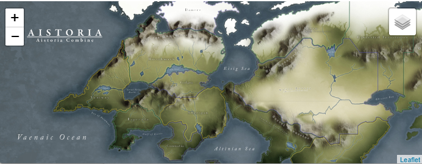
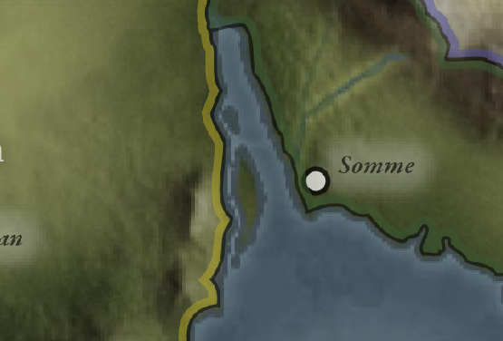
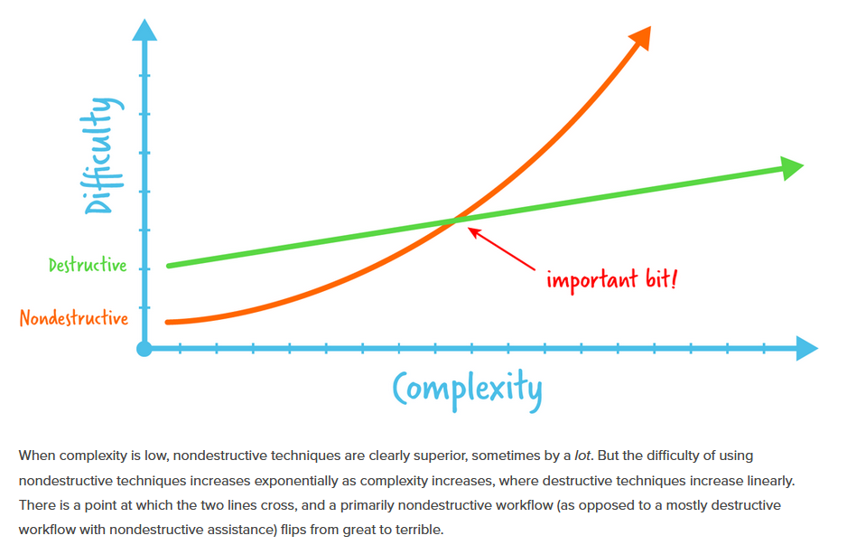
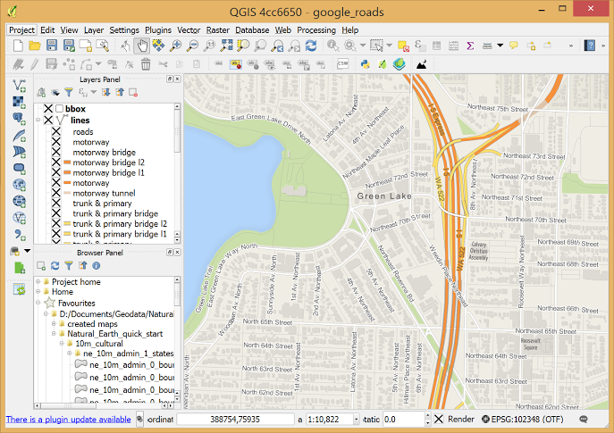
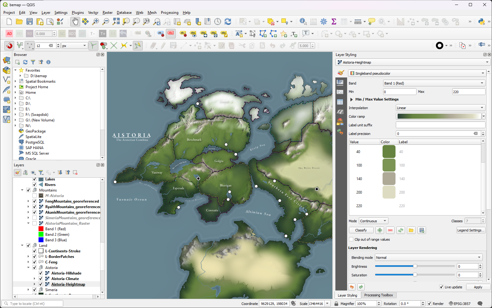
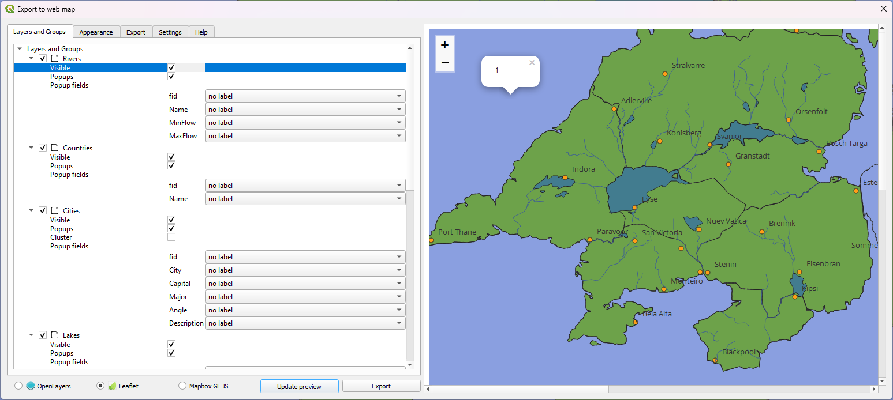
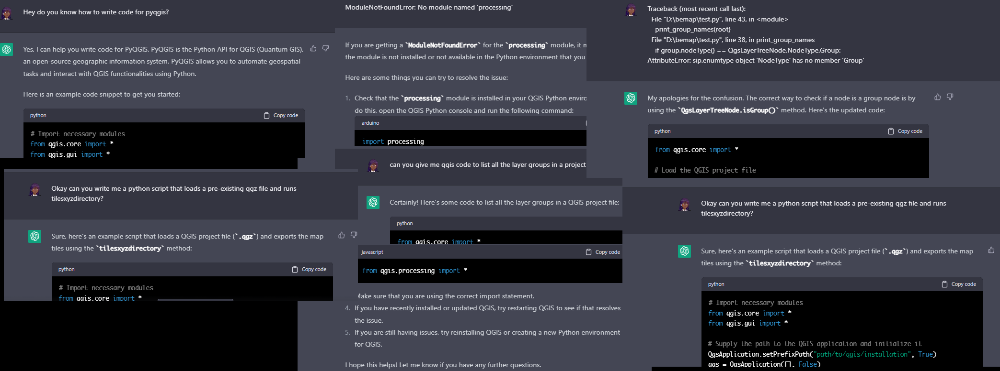
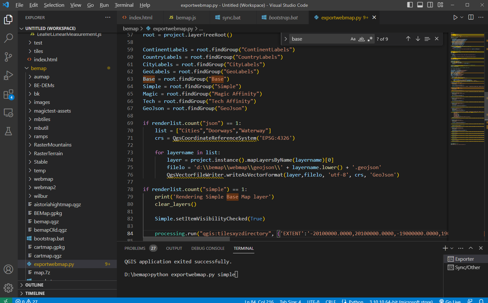
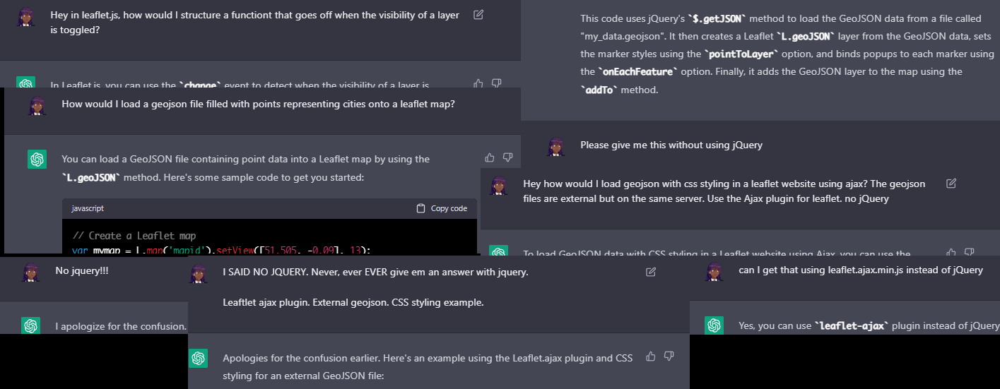

## Part 1: QGIS and how I learned to love The Devil

A part of fantasy cartography for me isn't just the *map itself* but the technical process of mapmaking. What the technical process of enables. How much fidelity can it give me? How flexible is it?

 
I made this way too many years ago. Even made a little leaflet applet with it. A series of several PSD and Illustrator files, cobbled together with blend layers to try and give me a flexible, performant map making solution.

... It came up short. Nothing in photoshop is ever performant -- even now on a computer many many times stronger than I used to make the original files, photoshop struggles and lags.

Secondly, the resolution grainy and getting up close and if I want a higher resolution for zooming, the size of everything, file/memory wise goes up MASSIVELY. And even stuff like political borders felt like pulling teeth, each manually traced by hand in illustrator.

Photoshop and Illustrator can APPROXIMATELY handle this, but they're not MADE to handle this. So what were my goals after this?

I favor non-destructive map making methods. Maps, to me, as I said before, are an ongoing process. Almost a journal. If I draw out a map and then leave until I draw a new one years later, that's... not really helping me world build. So non-destructive, performant, works at high resolutions and is... sensible enough that I can go back a few years from now and not be lost  trying to remember my work flow...

A friend sent this to me recently. I hate this image. I hate it because *it's right*.

And mapping complexity comes in two forms, both the *geographic problems* and the *cartographic problems* which both come with their own sets of software. We'll get into the dumb land erosion stuff some other time.

### QGIS

QGIS, a... QT powered GIS mapping program, is a piece of software that traumatized me over the first, I don't know, week of me using it. GIS, or... 
*Geographic Information System* is represented by a whole system of data and tools for converting real world data taken from hundreds or thousands of entities and allowing them to be processed into maps, diagrams, whatever. Any fancy map infographic using lots of datapoints was quite possibly processed to a QIS program like QGIS or arcGIS or whatever.

QGIS is *not* fantasy cartography software. It's not even cartography software as we'd think of it. "Cartography", in the GIS sense, is taking data that exists, and styling it. It is cartography through inclusion and exclusion, not building.

... But just because it's NOT for that, doesn't mean you can't use it for that. It HAS editing tools. They're clumsier than you'd want, but they're more geared for map related tasks than AI. You can import and export data out of it in a myriad of ways. It allows you to change [map projections](https://en.wikipedia.org/wiki/Map_projection) *on the fly*. That's... so non-destructive it's actively constructive! It also has the capacity to process together large tiles of images used as height maps called **DEM**s *(Digital Elevation Models)* which seem like a COOL THING for me to become a psycho about.

At the same time, everything at first was a brutal learning exercise. Little mistakes in AI are ignored, while geometric mistakes in QGIS are huge errors that have to be resolved. Before you understand how map projections work, you can think you lost TONS of work with a simple misclick. The saving system, designed to deal with things piece meal, can ALSO make you accidentally lose work. For awhile I thought this was the buggiest piece of software I ever used (though there are still dozens of frankly baffling technical decisions). So after hours of tweaking, learning styles, learning how to programmatically control labels and styles based on zoom levels and all sorts of other things, you... have a map??
  *(This is the map now and not it at the time where I decided to try exporting it, I was reasonable and tested it early!!*)

So this like, lets me export right to like a leaflet or an mapbox right??? Nice and easy lets-- 

 No that's not -- wait, why??? You can't make a webmap out of QGIS styles?? Did you lie to me, I-- also why does this exporter crash all the time????!

### I guess I'm a python coder now.

So QGIS is loaded up with all this other cool stuff with acronyms I don't understand like "OSGEO4WIN" or "GDAL" or "GRASS" or w/e but one thing that happened is I saw, with the process tab, that I could export my own XYZ tile silences as a raster image. These slices are what you use in a leaflet map.  The challenge then was to export all the different layers I needed separately, managing this dumb UI and copy and pasting and -- no. So it was time for pyqgis! How do I know how to program pyqgis???

... I asked chat-gpt. I'm a programmer, but a bad one. I'm bad at reading documentation. So I used it like a live stack exchange, getting me boiler plate, whatever, Just give me some idea how this shit works. It was a... mixed bag but it genuinely helped, though... I don't know if it's coming for anyone's job any time soon

*(If you look at any of this like 'I'm not sure about this dodgy code the AI wrote...' this is all my code ;_;)*

And then I... got an exporter! All customized to export exactly what I want! And then labels would break because of META TILES and then it turns out the prime meridian runs through land and it cuts off labels cause of that BUT IT RUNS OVER LAND IN REAL LIFE TOO SHOULDN'T YOU BE ABLE TO HANDLE THAT??? But w/e I can in my little script program in little fixes and little area to re-encode and now to just put this into a leaflet.js project and--

Certainly true to it's stackexchange roots, that's for sure. Anyways, never ask me to program anything.

Also lol the fucking AI made whole functions out of things that should have been one liners and went down weird rabbit holes when they didn't work. Definitely gotta stay on your toes. But with that I have...

A program to let me map out things like land masses, political borders, rivers from reusable, very sustainable files, a python script to chop them all up, a leaflet website to stylishly display it all, and even a neat little sync script that zips it all up and sends it to my server.

[plugin:youtube](https://www.youtube.com/watch?v=9z5OvEsg0vg)

And well... there we go. For something I'm not planning to put up publicly, I put a lot of time into it, but it was really fun. The best part is though I can just add a new place or tweak something *pretty quickly*.

As to how I got that sweet hill shading and erosion map stuff? Later I'll go into how I used a mix of hand painting, blender, stable diffusion ((this is probably the only thing I've ever done with SD that hasn't left me feeling gross and weird)*, and motherfucking **Wilbur** to *erode* the *shit* out of the world.