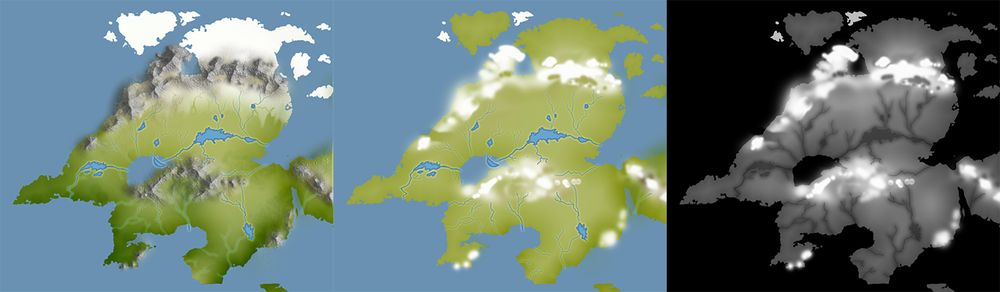
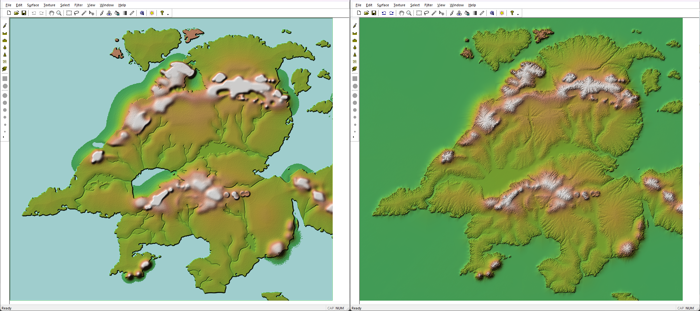
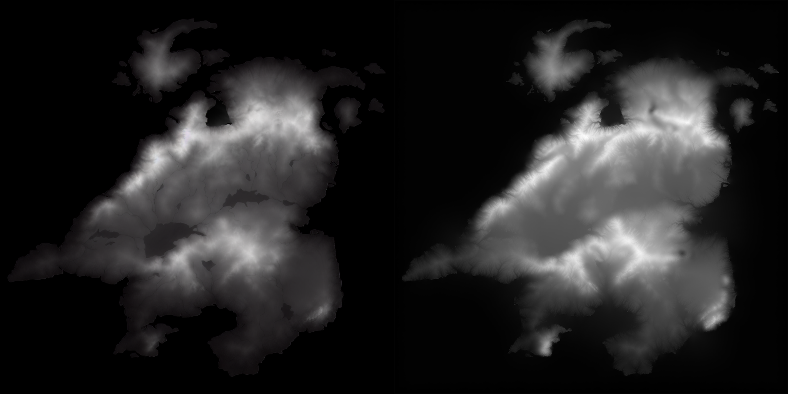
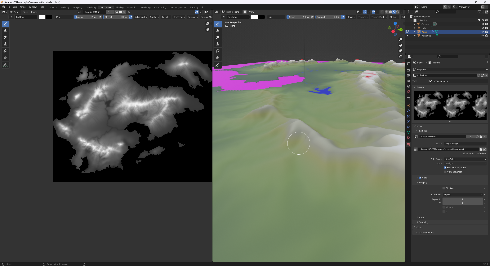
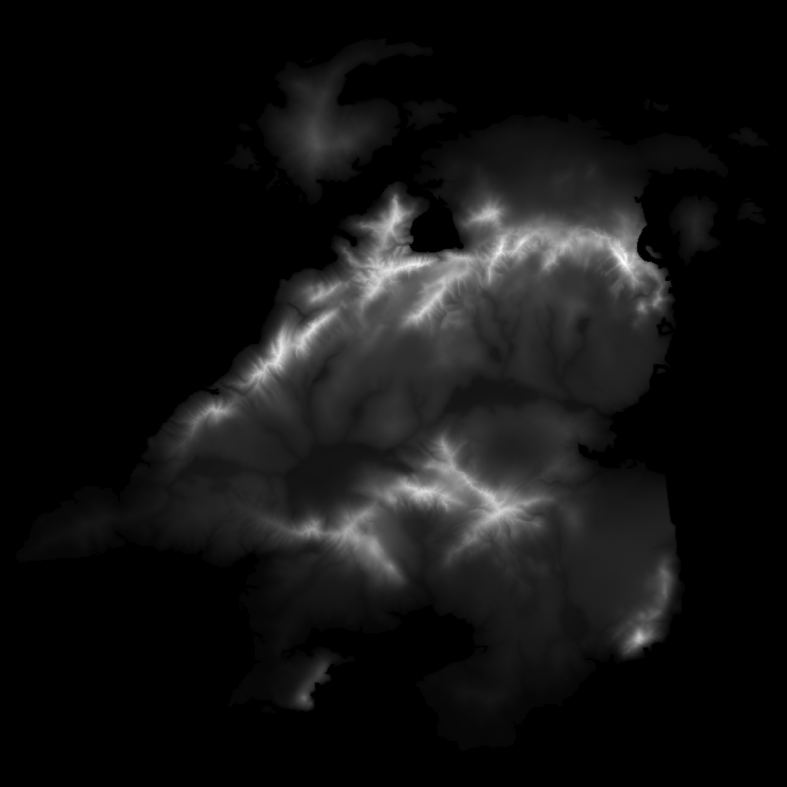
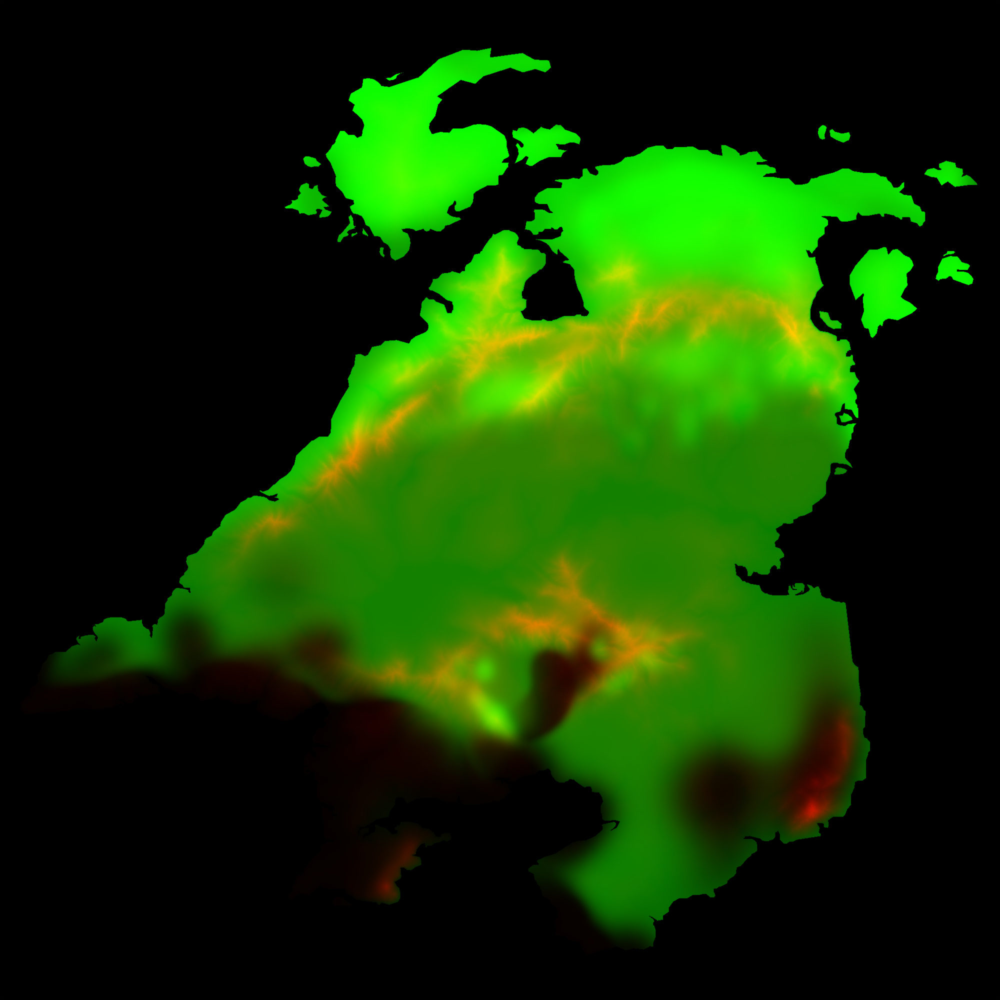
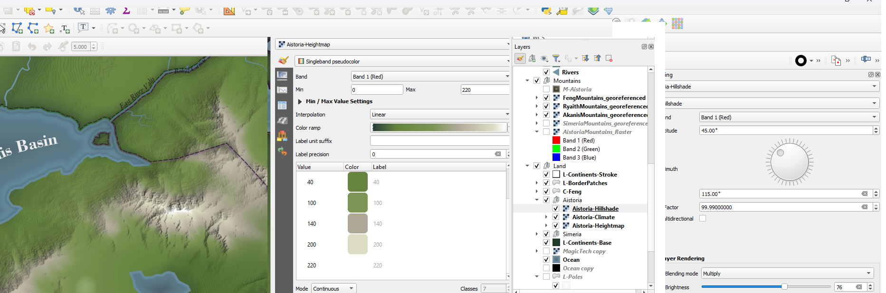

## Part 2: Controlled Erosion, and the Manifesting of Desire

The geologic aspects of mapmaking are a motherfucker. You'll post a map online and 18 different people will slide out of the woodwork to tell you how your mountains are wrong, how your rivers are wrong and how your biomes are wrong. Homie, didn't you work out the prevailing winds?? Where are your PLATE TECTONICS. Excuse me, rivers don't *do that*, [except when they do](https://en.wikipedia.org/wiki/Distributary).

It's pretty much functionally impossible to hand craft an accurate, realistic, fantasy map by hand, which is why the very fussiest people will do things like [use map generator](https://azgaar.github.io/Fantasy-Map-Generator/), or say take real world height data, kit bash it, change water levels and rescale it. 

... But if you look at the type of maps people remember, you realize "accurate and realistic" is not terribly important. I feel like many fantasy map makers, when exposed to all the things that they can do wrong, end up more concerned with avoiding mistakes than making something personal and inspiring to them. Something unassailable, where they won't feel stupid if they post it online.

... And this is why, while I'll do things like browse the cartographer's guild or worldbuilding reddits, I never post. Not out of say, fear from criticism, but it's much like posting a wooden table you made on a reddit for saws. Over fixation on the *quality of your cuts*, rather than the *function and appeal of the table.* I want to build a table, not demonstrate my mastery of a saw.

*(editor's Note: I am cutting a while digression about the old RPG Maker Three Tile Rule, but I need you ot know I wanted to talk about it as an example because I'm a weirdo)*

### Will

The most important part of good art, to me, is the manifestation of desire. To want something and make it real. Leading your tools to get to the result you want rather than being lead by your tools to what they want what they naturally do. You don't have to be stubborn. New things, new directions, happy accidents, these are all part of the process. Accepting and rejecting these things is part of your expression of will, but if you keep just accepting the easy path *because it's easy* (or honestly, doing the hard thing *JUST* because it's hard) you dull the human touch your work has.
 
So all that said, I want what I make to be as close to hand crafted as possible, accepting the weirdness and inaccuracies that arise in a world crafted by human hands. I don't want to be handed my mountain ranges, rivers and lakes. I want to decide them. But I realistically can't decide every ridge line, every pixel of height, every minor tributary. Yet there are painfully few tools for taking a basic map and sorta... back filling in the results. 

So lets start with my original PSD file for Aistoria from like 10 years ago.

*(This is all kinda a rough recreation of I what I did before so it's not exact images)*

The mountains were kind a procedural, using transparent blend mode stuff and textures. Good news is, if I turn that off, I get.... a rather crude heightmap. Darken and blur out the rivers and... we got a plausible stat.

### Wil...bur

There are all sorts of bits of software for erosion. Most are convoluted, expensive, and frustratingly limited. Meanwhile Wilbur is free, crude, sometimes dumb, and... confusing. So I take this, run some rain cycles and a few other things and then...

Y-...no. Granted I actually know how to get better results now (There are a bunch of ways to erode in wilbur but the morphologic one is important for magnifying features), but at the time I was just like... yeah no.

### Pretty much the opposite of Will -- Stable Diffusion????

I make AI art and it makes me feel weird. I make it cause, as an artist, I'm... curious. I want to know what we're dealing with. The biggest issue I have things I make with it is, well. Will. The lack of intentionality. The more intention you try and have, the worse AI art gets. AI art wants you to *settle*. But someone ALSO made a model trained on heightmaps??? Like... this shockingly seems REASONABLE???

Okay so we take the result of that which is kinda nonsense, re-lay over the water sources and THEN put in wilbur and that's... pretty close?? SD didn't give me usable results out of the box, but it gave a more complicated, gnary bit of land to pour water over. But How do I REALLY get my hands dirty?

... Well, load this all into blender, use it as a heightmap and a color map and then paint in what I want? Use mountain brushes or w/e if I need to and just.. paint. This isn't the same landmass (since I don't wanna re-set everything up) but queue MANY MANY passes of me... eroding something, tweaking it in blender, compositing them through photoshop, putting them through wilbur, blurring, passing though SD, etcetcetc until...

Yeah! like that! Or more, ultimately like, 

... because I HAVE to use all he color channels to do things like climate zones and deserts (which would be the blue channel).

Some fucking in QGIS and... hey! We got it! What's cool is, if you look at [the original post's video at the end](/personal/so-you-want-to-make-an-expandable-maintainable-fantasy-map-part1/) you can see the 'simple' map which is generated from this same pixel data. You free yourself up with the pixels are no longer *the image* but instead just data in the process.

 Now I think after doing two continents I can remove SD from this process? Wilbur is a lot of confusing experimentation, but that experimentation is paying off.